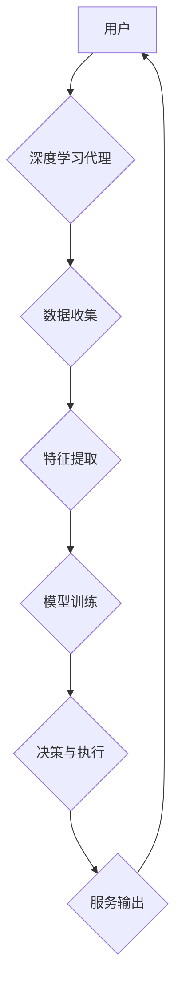

## AI人工智能深度学习算法：智能深度学习代理在电子商务中的应用策略

> 关键词：深度学习、智能代理、电子商务、推荐系统、个性化服务、自然语言处理、机器学习

## 1. 背景介绍

电子商务行业近年来发展迅速，用户需求日益多样化。传统的电子商务模式难以满足用户对个性化、智能化服务的期望。深度学习作为人工智能领域的重要分支，凭借其强大的学习能力和数据处理能力，为电子商务行业带来了新的发展机遇。智能深度学习代理作为一种新型的智能化服务模式，能够根据用户的行为、偏好和上下文信息，提供更加精准、个性化的服务体验。

## 2. 核心概念与联系

### 2.1 深度学习

深度学习是一种基于多层神经网络的机器学习方法。它能够从海量数据中自动学习特征，并进行复杂的模式识别和预测。深度学习算法在图像识别、语音识别、自然语言处理等领域取得了突破性的进展。

### 2.2 智能代理

智能代理是一种能够自主学习、决策和执行任务的软件系统。它通常具有以下特征：

* **自主性:** 智能代理能够独立地感知环境、制定计划并执行任务。
* **学习能力:** 智能代理能够从经验中学习，不断改进其决策和行为。
* **适应性:** 智能代理能够根据环境变化调整其策略，保持其效能。

### 2.3 深度学习代理

深度学习代理将深度学习算法与智能代理技术相结合，构建了一种更加智能、高效的代理系统。深度学习代理能够利用深度学习算法学习用户的行为模式、偏好和需求，并根据这些信息提供更加个性化、精准的服务。

**Mermaid 流程图**



## 3. 核心算法原理 & 具体操作步骤

### 3.1 算法原理概述

智能深度学习代理的核心算法通常基于深度神经网络，例如卷积神经网络（CNN）、循环神经网络（RNN）和强化学习算法。

* **卷积神经网络（CNN）:** CNN擅长处理图像、视频等多维数据，能够自动学习图像特征，用于商品推荐、视觉搜索等应用。
* **循环神经网络（RNN）:** RNN能够处理序列数据，例如用户浏览历史、评论文本等，用于个性化推荐、用户行为预测等应用。
* **强化学习算法:** 强化学习算法通过奖励机制训练代理，使其能够在交互环境中学习最优策略，用于个性化服务、智能客服等应用。

### 3.2 算法步骤详解

1. **数据收集:** 收集用户行为数据、商品信息、市场趋势等相关数据。
2. **数据预处理:** 对收集到的数据进行清洗、转换、特征工程等处理，使其适合深度学习算法训练。
3. **模型选择:** 根据具体应用场景选择合适的深度学习模型，例如CNN、RNN或强化学习算法。
4. **模型训练:** 使用训练数据训练深度学习模型，调整模型参数，使其能够准确预测用户需求和行为。
5. **模型评估:** 使用测试数据评估模型性能，例如准确率、召回率、F1-score等指标。
6. **模型部署:** 将训练好的模型部署到生产环境中，用于提供个性化服务。
7. **模型监控与优化:** 持续监控模型性能，根据用户反馈和数据变化进行模型优化和更新。

### 3.3 算法优缺点

**优点:**

* **高准确率:** 深度学习算法能够从海量数据中学习复杂模式，实现高准确率的预测和分类。
* **个性化服务:** 深度学习代理能够根据用户的行为和偏好提供个性化服务，提升用户体验。
* **自动化决策:** 深度学习代理能够自动学习决策规则，减少人工干预，提高效率。

**缺点:**

* **数据依赖:** 深度学习算法需要大量数据进行训练，数据质量直接影响模型性能。
* **计算资源消耗:** 深度学习模型训练需要大量的计算资源，成本较高。
* **可解释性差:** 深度学习模型的决策过程较为复杂，难以解释其决策依据。

### 3.4 算法应用领域

深度学习代理在电子商务领域具有广泛的应用场景，例如：

* **商品推荐:** 根据用户的浏览历史、购买记录、兴趣偏好等信息，推荐个性化的商品。
* **个性化营销:** 根据用户的行为特征和购买习惯，制定个性化的营销策略，提高转化率。
* **智能客服:** 利用自然语言处理技术，构建智能客服系统，自动解答用户问题，提高服务效率。
* **价格优化:** 根据市场需求、竞争对手价格等因素，动态调整商品价格，最大化利润。

## 4. 数学模型和公式 & 详细讲解 & 举例说明

### 4.1 数学模型构建

深度学习代理的数学模型通常基于神经网络结构，例如多层感知机（MLP）、卷积神经网络（CNN）和循环神经网络（RNN）。

**多层感知机（MLP）:**

MLP由多个全连接层组成，每个层的神经元接收上一层的输出作为输入，并进行线性变换和非线性激活函数处理。

**公式:**

```latex
y = f(W^L x^L + b^L)
```

其中：

* $y$ 是输出向量
* $x^L$ 是第 $L$ 层的输入向量
* $W^L$ 是第 $L$ 层的权重矩阵
* $b^L$ 是第 $L$ 层的偏置向量
* $f$ 是激活函数

**卷积神经网络（CNN）:**

CNN利用卷积核对输入数据进行卷积操作，提取特征。

**公式:**

```latex
y = f(conv(x, W) + b)
```

其中：

* $y$ 是卷积层的输出
* $x$ 是输入数据
* $W$ 是卷积核
* $b$ 是偏置向量
* $f$ 是激活函数

**循环神经网络（RNN）:**

RNN能够处理序列数据，其隐藏层神经元具有记忆功能，能够保留前序信息。

**公式:**

```latex
h_t = f(W_{xh} x_t + W_{hh} h_{t-1} + b_h)
```

其中：

* $h_t$ 是第 $t$ 时刻的隐藏状态
* $x_t$ 是第 $t$ 时刻的输入
* $W_{xh}$ 和 $W_{hh}$ 是权重矩阵
* $b_h$ 是偏置向量
* $f$ 是激活函数

### 4.2 公式推导过程

深度学习模型的训练过程通常基于梯度下降算法，通过调整模型参数，最小化损失函数。

**损失函数:**

```latex
L = \frac{1}{N} \sum_{i=1}^{N} (y_i - \hat{y}_i)^2
```

其中：

* $L$ 是损失函数
* $N$ 是样本数量
* $y_i$ 是真实值
* $\hat{y}_i$ 是预测值

**梯度下降算法:**

```latex
\theta = \theta - \alpha \nabla L(\theta)
```

其中：

* $\theta$ 是模型参数
* $\alpha$ 是学习率
* $\nabla L(\theta)$ 是损失函数对参数的梯度

### 4.3 案例分析与讲解

**商品推荐案例:**

假设我们有一个电子商务平台，想要根据用户的浏览历史推荐商品。我们可以使用CNN模型提取商品图像特征，RNN模型处理用户的浏览历史序列，并结合两者进行商品推荐。

* **CNN模型:** 将商品图像输入CNN模型，提取商品的视觉特征，例如颜色、形状、纹理等。
* **RNN模型:** 将用户的浏览历史序列输入RNN模型，学习用户的兴趣偏好和购买习惯。
* **推荐策略:** 将CNN模型提取的商品特征和RNN模型学习的用户偏好进行融合，计算商品的推荐得分，并根据得分排序推荐商品。

## 5. 项目实践：代码实例和详细解释说明

### 5.1 开发环境搭建

* **操作系统:** Ubuntu 18.04
* **编程语言:** Python 3.6
* **深度学习框架:** TensorFlow 2.0
* **其他工具:** Jupyter Notebook、Git

### 5.2 源代码详细实现

```python
import tensorflow as tf

# 定义CNN模型
def build_cnn_model():
    model = tf.keras.models.Sequential([
        tf.keras.layers.Conv2D(32, (3, 3), activation='relu', input_shape=(224, 224, 3)),
        tf.keras.layers.MaxPooling2D((2, 2)),
        tf.keras.layers.Conv2D(64, (3, 3), activation='relu'),
        tf.keras.layers.MaxPooling2D((2, 2)),
        tf.keras.layers.Flatten(),
        tf.keras.layers.Dense(10, activation='softmax')
    ])
    return model

# 定义RNN模型
def build_rnn_model():
    model = tf.keras.models.Sequential([
        tf.keras.layers.Embedding(10000, 128),
        tf.keras.layers.LSTM(64),
        tf.keras.layers.Dense(1, activation='sigmoid')
    ])
    return model

# 训练模型
cnn_model = build_cnn_model()
rnn_model = build_rnn_model()

#... 训练代码...

# 保存模型
cnn_model.save('cnn_model.h5')
rnn_model.save('rnn_model.h5')
```

### 5.3 代码解读与分析

* **模型构建:** 代码中定义了CNN和RNN模型，分别用于提取商品特征和学习用户偏好。
* **模型训练:** 代码中省略了具体的训练代码，但需要使用训练数据训练模型，并调整模型参数。
* **模型保存:** 训练完成后，可以将模型保存为文件，以便后续使用。

### 5.4 运行结果展示

训练完成后，可以使用测试数据评估模型性能，并根据模型预测结果进行商品推荐。

## 6. 实际应用场景

### 6.1 商品推荐系统

深度学习代理可以构建个性化商品推荐系统，根据用户的浏览历史、购买记录、兴趣偏好等信息，推荐用户可能感兴趣的商品。

### 6.2 个性化营销

深度学习代理可以分析用户的行为特征和购买习惯，制定个性化的营销策略，例如发送个性化优惠券、推送相关商品信息等。

### 6.3 智能客服

深度学习代理可以利用自然语言处理技术，构建智能客服系统，自动解答用户问题，提供24小时在线服务。

### 6.4 价格优化

深度学习代理可以分析市场需求、竞争对手价格等因素，动态调整商品价格，最大化利润。

### 6.5 未来应用展望

随着深度学习技术的不断发展，智能深度学习代理在电子商务领域的应用场景将更加广泛，例如：

* **虚拟购物助手:** 智能代理可以模拟人类购物助手，帮助用户完成商品搜索、筛选、购买等操作。
* **个性化物流服务:** 智能代理可以根据用户的地理位置、时间安排等信息，优化物流路线，提供更加高效的配送服务。
* **智能库存管理:** 智能代理可以预测商品需求，优化库存管理，减少库存积压和缺货情况。

## 7. 工具和资源推荐

### 7.1 学习资源推荐

* **书籍:**
    * 深度学习
    * 人工智能：一种现代方法
* **在线课程:**
    * Coursera 深度学习课程
    * Udacity 深度学习工程师 Nanodegree
* **博客和网站:**
    * TensorFlow 官方博客
    