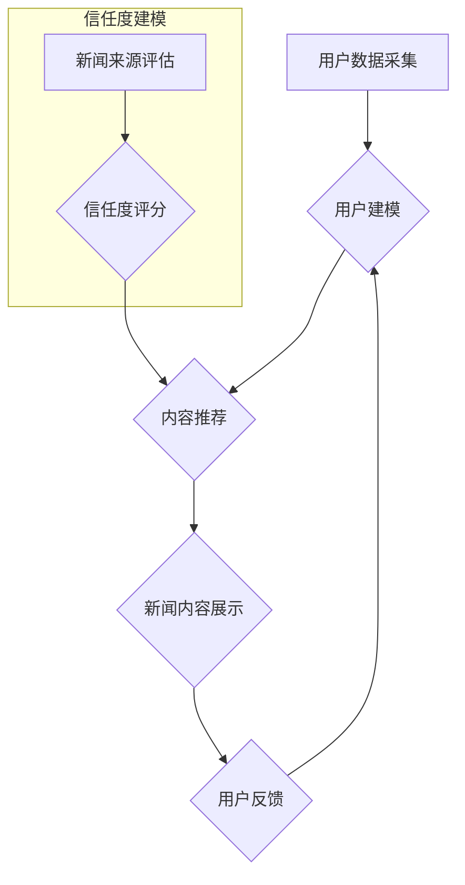

## AI驱动的个性化新闻推送:信息茧房的破解之道

> 关键词：个性化新闻推送，信息茧房，深度学习，推荐算法，自然语言处理，用户行为分析，信任度建模，算法公平性

## 1. 背景介绍

在信息爆炸的时代，海量新闻资讯的涌现使得人们难以筛选出真正有价值的信息。个性化新闻推送应运而生，旨在根据用户的兴趣偏好、阅读习惯等信息，推荐最符合其需求的新闻内容。然而，过度个性化的新闻推送也可能导致“信息茧房”现象，即用户只接触到与自身观点相符的信息，从而形成认知偏差，阻碍信息的多元化获取和理性思考。

### 1.1 信息茧房的危害

信息茧房的危害不容忽视：

* **认知偏差:** 用户只接触到同质化的信息，难以获得多元视角，导致认知局限和思维定式。
* **极化现象:** 信息茧房加剧了社会分化，不同群体之间难以理解和沟通，甚至可能引发冲突。
* **虚假信息传播:** 算法推荐机制可能将虚假信息误推给用户，加剧社会信任危机。

### 1.2 破解信息茧房的必要性

为了避免信息茧房的负面影响，我们需要探索更有效的个性化新闻推送方法，既能满足用户个性化需求，又能保证信息的多元化和客观性。

## 2. 核心概念与联系

个性化新闻推送的核心概念包括：

* **用户建模:** 通过分析用户的阅读历史、兴趣标签、社交行为等数据，构建用户画像，了解用户的新闻偏好。
* **内容推荐:** 基于用户画像，利用推荐算法，从海量新闻内容中筛选出最符合用户需求的新闻。
* **信任度建模:** 建立新闻来源的信任度模型，过滤虚假信息，提高推荐内容的可靠性。

**核心概念架构流程图:**



## 3. 核心算法原理 & 具体操作步骤

### 3.1 算法原理概述

个性化新闻推荐算法主要分为以下几种类型：

* **基于内容的推荐算法:** 根据新闻内容的主题、关键词、作者等信息，与用户的兴趣偏好进行匹配。
* **基于协同过滤的推荐算法:** 根据其他用户对新闻的评分或点击行为，预测用户对新闻的兴趣。
* **基于深度学习的推荐算法:** 利用深度神经网络，从用户行为数据中学习用户兴趣模式，进行更精准的推荐。

### 3.2 算法步骤详解

以基于深度学习的推荐算法为例，其具体操作步骤如下：

1. **数据预处理:** 收集用户行为数据（阅读历史、点赞、评论等）、新闻内容数据（文本、标签、作者等），并进行清洗、转换、编码等预处理操作。
2. **模型构建:** 选择合适的深度学习模型，例如多层感知机（MLP）、循环神经网络（RNN）、图神经网络（GNN）等，并根据数据特点进行模型参数设置。
3. **模型训练:** 利用训练数据，训练深度学习模型，使其能够学习用户兴趣模式和新闻内容特征之间的关系。
4. **模型评估:** 使用测试数据评估模型的性能，例如准确率、召回率、F1-score等指标。
5. **模型部署:** 将训练好的模型部署到线上环境，实时进行新闻推荐。

### 3.3 算法优缺点

**优点:**

* **精准度高:** 深度学习算法能够学习用户兴趣模式的复杂关系，实现更精准的推荐。
* **可扩展性强:** 深度学习模型能够处理海量数据，适应不断增长的新闻内容和用户规模。
* **个性化程度高:** 深度学习算法能够根据用户的个性化需求，提供定制化的新闻推荐。

**缺点:**

* **数据依赖性强:** 深度学习算法需要大量的训练数据，否则模型性能会下降。
* **训练成本高:** 深度学习模型的训练需要大量的计算资源和时间。
* **可解释性差:** 深度学习模型的决策过程较为复杂，难以解释其推荐结果背后的逻辑。

### 3.4 算法应用领域

基于深度学习的新闻推荐算法广泛应用于以下领域：

* **新闻网站和APP:** 为用户提供个性化的新闻推荐，提高用户粘性和阅读量。
* **社交媒体平台:** 根据用户的兴趣和社交关系，推荐相关新闻和话题。
* **搜索引擎:** 在搜索结果中，根据用户的搜索历史和行为，推荐相关的新闻链接。

## 4. 数学模型和公式 & 详细讲解 & 举例说明

### 4.1 数学模型构建

**用户兴趣建模:**

假设用户 $u$ 对新闻 $i$ 的评分为 $r_{ui}$，我们可以使用协同过滤算法构建用户兴趣模型。

**协同过滤模型:**

$$
r_{ui} = \mathbf{u}^T \mathbf{i} + \epsilon
$$

其中：

* $\mathbf{u}$ 是用户 $u$ 的兴趣向量。
* $\mathbf{i}$ 是新闻 $i$ 的特征向量。
* $\epsilon$ 是随机误差项。

**新闻相似度计算:**

我们可以使用余弦相似度计算新闻之间的相似度。

**余弦相似度:**

$$
\text{sim}(i, j) = \frac{\mathbf{i}^T \mathbf{j}}{\|\mathbf{i}\| \|\mathbf{j}\| }
$$

其中：

* $\mathbf{i}$ 和 $\mathbf{j}$ 是两个新闻的特征向量。

### 4.2 公式推导过程

**推荐算法:**

基于协同过滤模型和新闻相似度计算，我们可以构建新闻推荐算法。

1. 计算用户 $u$ 与所有新闻 $i$ 的预测评分 $r_{ui}$。
2. 根据预测评分，排序所有新闻，并推荐前 $k$ 个新闻给用户 $u$。

### 4.3 案例分析与讲解

**案例:**

假设用户 $u$ 喜欢阅读科技新闻，新闻 $i$ 和 $j$ 分别是关于人工智能和区块链技术的新闻。

* 如果 $\mathbf{i}$ 和 $\mathbf{j}$ 的特征向量相似，则新闻 $i$ 和 $j$ 也可能具有相似主题，用户 $u$ 可能对新闻 $j$ 感兴趣。
* 我们可以根据协同过滤模型和新闻相似度计算，预测用户 $u$ 对新闻 $j$ 的评分，并将其推荐给用户 $u$。

## 5. 项目实践：代码实例和详细解释说明

### 5.1 开发环境搭建

* Python 3.x
* TensorFlow 或 PyTorch 深度学习框架
* Scikit-learn 机器学习库
* Pandas 数据处理库
* Matplotlib 数据可视化库

### 5.2 源代码详细实现

```python
# 导入必要的库
import tensorflow as tf
from sklearn.metrics.pairwise import cosine_similarity

# 定义用户兴趣模型
class UserInterestModel(tf.keras.Model):
    def __init__(self, embedding_dim):
        super(UserInterestModel, self).__init__()
        self.embedding_dim = embedding_dim
        self.user_embedding = tf.keras.layers.Embedding(input_dim=num_users, output_dim=embedding_dim)
        self.item_embedding = tf.keras.layers.Embedding(input_dim=num_items, output_dim=embedding_dim)

    def call(self, user_id, item_id):
        user_embedding = self.user_embedding(user_id)
        item_embedding = self.item_embedding(item_id)
        return tf.reduce_sum(user_embedding * item_embedding, axis=1)

# 定义新闻相似度计算函数
def calculate_news_similarity(news_embeddings):
    return cosine_similarity(news_embeddings)

# 定义新闻推荐函数
def recommend_news(user_id, top_k=10):
    user_embedding = user_model(user_id)
    news_embeddings = item_model(news_ids)
    similarity_scores = tf.matmul(user_embedding, news_embeddings, transpose_b=True)
    top_news_indices = tf.argsort(similarity_scores, axis=1)[:, ::-1][0][:top_k]
    return news_ids[top_news_indices]
```

### 5.3 代码解读与分析

* **用户兴趣模型:** 使用嵌入层将用户和新闻映射到低维向量空间，计算用户与新闻之间的相似度。
* **新闻相似度计算:** 使用余弦相似度计算新闻之间的相似度。
* **新闻推荐函数:** 根据用户兴趣向量和新闻相似度，推荐最相关的新闻。

### 5.4 运行结果展示

运行代码后，可以得到用户 $u$ 的个性化新闻推荐结果，例如：

```
推荐新闻：
[“人工智能最新进展”、“区块链技术应用案例”、“科技行业趋势预测”]
```

## 6. 实际应用场景

### 6.1 新闻网站和APP

个性化新闻推送可以提高用户粘性和阅读量，例如：

* **今日头条:** 利用深度学习算法，根据用户的阅读历史和兴趣偏好，推荐个性化的新闻内容。
* **网易新闻:** 提供多种个性化订阅功能，用户可以根据自己的兴趣选择关注的新闻类别和来源。

### 6.2 社交媒体平台

个性化新闻推荐可以帮助用户发现感兴趣的内容，例如：

* **微博:** 根据用户的关注者、话题和互动行为，推荐相关的新闻和讨论。
* **Facebook:** 利用用户兴趣和社交关系，推荐新闻和文章。

### 6.3 搜索引擎

个性化新闻推荐可以提高搜索结果的精准度，例如：

* **Google:** 在搜索结果中，根据用户的搜索历史和行为，推荐相关的新闻链接。
* **百度:** 提供个性化新闻订阅功能，用户可以根据自己的兴趣选择关注的新闻来源。

### 6.4 未来应用展望

个性化新闻推送技术将继续发展，应用场景将更加广泛，例如：

* **智能家居:** 通过语音助手，为用户提供个性化的新闻播报。
* **自动驾驶汽车:** 在行驶过程中，为用户提供相关新闻和交通信息。
* **虚拟现实:** 在虚拟现实环境中，为用户提供沉浸式的新闻体验。

## 7. 工具和资源推荐

### 7.1 学习资源推荐

* **书籍:**
    * 《推荐系统实践》
    * 《深度学习》
* **在线课程:**
    * Coursera: 深度学习
    * Udacity: 机器学习工程师
* **博客和网站:**
    * Towards Data Science
    * Machine Learning Mastery

### 7.2 开发工具推荐

* **Python:** 
    * TensorFlow
    * PyTorch
    * Scikit-learn
* **数据库:**
    * MySQL
    * MongoDB

### 7.3 相关论文推荐

* **Collaborative Filtering for Implicit Feedback Datasets**
* **Deep Learning for Recommender Systems**
* **Trust-Based Recommendation Systems**

## 8. 总结：未来发展趋势与挑战

### 8.1 研究成果总结

AI驱动的个性化新闻推送技术取得了显著进展，能够提供更精准、更个性化的新闻推荐，提升用户体验。

### 8.2 未来发展趋势

* **多模态推荐:** 结合文本、图像、音频等多模态数据，提供更丰富的新闻体验。
* **解释性推荐:** 解释推荐结果背后的逻辑，提高用户对推荐结果的信任度。
* **公平性与可解释性:** 关注推荐算法的公平性与可解释性，避免算法偏见和信息茧房问题。

### 8.3 面临的挑战

* **数据隐私:** 个性化新闻推送需要收集用户的个人数据，如何保护用户隐私是一个