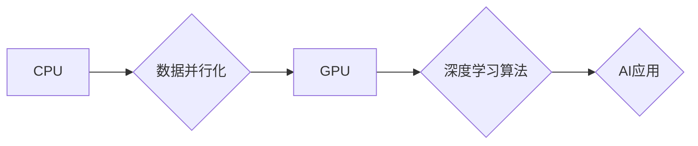

## NVIDIA的GPU技术与AI算力

> 关键词：GPU、CUDA、深度学习、Tensor Core、AI算力、NVIDIA

## 1. 背景介绍

近年来，人工智能（AI）技术蓬勃发展，深度学习算法在图像识别、自然语言处理、语音识别等领域取得了突破性进展。然而，深度学习算法的训练和推理需要海量计算资源，这推动了高性能计算（HPC）和图形处理单元（GPU）技术的快速发展。

NVIDIA作为全球领先的GPU供应商，在AI领域发挥着至关重要的作用。其GPU架构和CUDA平台为深度学习算法的开发和部署提供了强大的支持。本文将深入探讨NVIDIA的GPU技术及其在AI算力领域的应用。

## 2. 核心概念与联系

### 2.1  GPU架构

传统CPU采用串行处理架构，每个核心处理一个指令。而GPU采用并行处理架构，拥有大量并行处理单元（CUDA cores），可以同时处理多个指令。这种并行处理能力使得GPU在处理大量数据并行计算任务方面具有显著优势。

**Mermaid 流程图:**



### 2.2  CUDA平台

CUDA（Compute Unified Device Architecture）是NVIDIA为GPU开发的并行计算平台。它提供了一套编程模型、工具和库，使开发者能够将应用程序移植到GPU上进行加速。

CUDA平台的核心组件包括：

* **CUDA内核:** GPU上的并行计算单元执行的代码。
* **线程:** CUDA内核中的并行执行单元。
* **块:** 多个线程组成的执行单元。
* **网格:** 多个块组成的执行单元。

CUDA平台通过将应用程序分解成多个并行任务，并分配到GPU上的多个线程上执行，从而实现高效的并行计算。

## 3. 核心算法原理 & 具体操作步骤

### 3.1  算法原理概述

深度学习算法的核心是神经网络，它由多个层组成，每层包含多个神经元。神经元之间通过连接权重进行信息传递。通过训练神经网络，可以学习到数据中的模式和关系，从而实现预测、分类等任务。

常见的深度学习算法包括卷积神经网络（CNN）、循环神经网络（RNN）和生成对抗网络（GAN）。

### 3.2  算法步骤详解

深度学习算法的训练过程通常包括以下步骤：

1. **数据预处理:** 将原始数据转换为深度学习算法可以处理的格式。
2. **模型构建:** 根据任务需求设计神经网络的结构和参数。
3. **模型训练:** 使用训练数据训练神经网络，调整神经元之间的连接权重，使模型能够准确地预测或分类数据。
4. **模型评估:** 使用测试数据评估模型的性能，例如准确率、召回率等。
5. **模型部署:** 将训练好的模型部署到实际应用场景中，用于预测或分类新的数据。

### 3.3  算法优缺点

**优点:**

* 能够学习复杂的数据模式和关系。
* 性能优于传统机器学习算法。
* 在图像识别、自然语言处理等领域取得了突破性进展。

**缺点:**

* 训练数据量大，需要大量计算资源。
* 模型训练时间长，容易陷入局部最优解。
* 模型解释性差，难以理解模型的决策过程。

### 3.4  算法应用领域

深度学习算法广泛应用于以下领域：

* **计算机视觉:** 图像识别、物体检测、图像分割、人脸识别等。
* **自然语言处理:** 文本分类、情感分析、机器翻译、语音识别等。
* **推荐系统:** 商品推荐、内容推荐、用户画像等。
* **医疗诊断:** 病理图像分析、疾病预测、药物研发等。
* **自动驾驶:** 路况感知、目标识别、路径规划等。

## 4. 数学模型和公式 & 详细讲解 & 举例说明

### 4.1  数学模型构建

深度学习算法的核心是神经网络，其数学模型可以表示为一个多层感知机（MLP）。

**MLP模型:**

$$
y = f(W_L \cdot a_{L-1} + b_L)
$$

其中：

* $y$ 是输出值。
* $a_{L-1}$ 是上一层的激活值。
* $W_L$ 是当前层的权重矩阵。
* $b_L$ 是当前层的偏置向量。
* $f$ 是激活函数。

### 4.2  公式推导过程

深度学习算法的训练过程是通过反向传播算法来更新神经网络的权重和偏置。反向传播算法的核心是计算损失函数对权重和偏置的梯度，并使用梯度下降法更新权重和偏置。

**损失函数:**

$$
L = \frac{1}{N} \sum_{i=1}^{N} (y_i - \hat{y}_i)^2
$$

其中：

* $L$ 是损失函数。
* $N$ 是样本数量。
* $y_i$ 是真实值。
* $\hat{y}_i$ 是预测值。

**梯度下降法:**

$$
W = W - \alpha \frac{\partial L}{\partial W}
$$

其中：

* $W$ 是权重矩阵。
* $\alpha$ 是学习率。
* $\frac{\partial L}{\partial W}$ 是损失函数对权重的梯度。

### 4.3  案例分析与讲解

以图像分类为例，假设我们使用CNN模型进行训练，目标是将图像分类为猫或狗。

训练过程中，模型会学习到图像特征，例如猫的耳朵、狗的尾巴等。通过反向传播算法，模型会不断调整权重和偏置，使预测结果与真实值越接近。

最终，训练好的模型能够准确地识别图像中的猫和狗。

## 5. 项目实践：代码实例和详细解释说明

### 5.1  开发环境搭建

* **操作系统:** Ubuntu 18.04 或更高版本
* **CUDA Toolkit:** 10.2 或更高版本
* **cuDNN:** 7.6 或更高版本
* **Python:** 3.6 或更高版本
* **深度学习框架:** TensorFlow 或 PyTorch

### 5.2  源代码详细实现

以下是一个使用TensorFlow实现图像分类的简单代码示例：

```python
import tensorflow as tf

# 定义模型结构
model = tf.keras.models.Sequential([
    tf.keras.layers.Conv2D(32, (3, 3), activation='relu', input_shape=(28, 28, 1)),
    tf.keras.layers.MaxPooling2D((2, 2)),
    tf.keras.layers.Conv2D(64, (3, 3), activation='relu'),
    tf.keras.layers.MaxPooling2D((2, 2)),
    tf.keras.layers.Flatten(),
    tf.keras.layers.Dense(10, activation='softmax')
])

# 编译模型
model.compile(optimizer='adam',
              loss='sparse_categorical_crossentropy',
              metrics=['accuracy'])

# 训练模型
model.fit(x_train, y_train, epochs=10)

# 评估模型
loss, accuracy = model.evaluate(x_test, y_test)
print('Test loss:', loss)
print('Test accuracy:', accuracy)
```

### 5.3  代码解读与分析

* **模型结构:** 代码定义了一个简单的CNN模型，包含两个卷积层、两个最大池化层、一个全连接层和一个输出层。
* **编译模型:** 使用Adam优化器、稀疏类别交叉熵损失函数和准确率作为评估指标编译模型。
* **训练模型:** 使用训练数据训练模型，训练10个epochs。
* **评估模型:** 使用测试数据评估模型的性能，打印测试损失和准确率。

### 5.4  运行结果展示

训练完成后，模型能够对图像进行分类，并输出分类结果的概率分布。

## 6. 实际应用场景

### 6.1  图像识别

* **人脸识别:** 用于身份验证、安全监控等场景。
* **物体检测:** 用于自动驾驶、机器人视觉等场景。
* **图像分类:** 用于医疗诊断、电商商品分类等场景。

### 6.2  自然语言处理

* **机器翻译:** 将一种语言翻译成另一种语言。
* **文本摘要:** 自动生成文本的摘要。
* **情感分析:** 分析文本的情感倾向。

### 6.3  推荐系统

* **商品推荐:** 根据用户的历史购买记录推荐商品。
* **内容推荐:** 根据用户的兴趣推荐内容。
* **用户画像:** 建立用户的兴趣画像，进行精准营销。

### 6.4  未来应用展望

随着AI技术的不断发展，GPU技术在未来将发挥更加重要的作用。

* **边缘计算:** 将AI模型部署到边缘设备上，实现实时推理。
* **增强现实 (AR) 和虚拟现实 (VR):** 提供更逼真的AR和VR体验。
* **科学计算:** 加速科学计算和数据分析。

## 7. 工具和资源推荐

### 7.1  学习资源推荐

* **NVIDIA官网:** https://developer.nvidia.com/
* **CUDA官方文档:** https://docs.nvidia.com/cuda/
* **cuDNN官方文档:** https://docs.nvidia.com/deeplearning/cudnn/index.html
* **TensorFlow官方文档:** https://www.tensorflow.org/
* **PyTorch官方文档:** https://pytorch.org/

### 7.2  开发工具推荐

* **Visual Studio Code:** https://code.visualstudio.com/
* **Anaconda:** https://www.anaconda.com/

### 7.3  相关论文推荐

* **ImageNet Classification with Deep Convolutional Neural Networks:** https://arxiv.org/abs/1202.1409
* **Attention Is All You Need:** https://arxiv.org/abs/1706.03762

## 8. 总结：未来发展趋势与挑战

### 8.1  研究成果总结

NVIDIA的GPU技术和CUDA平台为深度学习算法的开发和部署提供了强大的支持，推动了AI技术的快速发展。

### 8.2  未来发展趋势

* **更高效的GPU架构:** 继续提高GPU的并行处理能力和计算性能。
* **更强大的AI算法:** 开发更先进的AI算法，例如Transformer、Generative Adversarial Networks (GANs)等。
* **边缘计算和云计算的融合:** 将AI模型部署到边缘设备和云端，实现更灵活和高效的AI应用。

### 8.3  面临的挑战

* **数据隐私和安全:** 训练和部署AI模型需要大量数据，如何保护数据隐私和安全是一个重要挑战。
* **算法可解释性:** 深度学习算法的决策过程难以理解，如何提高算法的可解释性是一个重要的研究方向。
* **能源消耗:** 训练大型AI模型需要消耗大量的能源，如何降低能源消耗是一个重要的挑战。

### 8.4  研究展望

未来，AI技术将继续发展，GPU技术也将发挥更加重要的作用。

## 9. 附录：常见问题与解答

**Q1: CUDA是什么？**

A1: CUDA（Compute Unified Device Architecture）是NVIDIA为GPU开发的并行计算平台。

**Q2: 如何使用CUDA开发应用程序？**

A2: 开发人员需要学习CUDA编程模型、工具和库，并使用C/C++等语言编写CUDA内核。

**Q3: NVIDIA的GPU有哪些类型？**

A3: NVIDIA的GPU主要分为GeForce、Quadro和Tesla三大系列。

**Q4: 如何选择合适的GPU？**

A4: 选择GPU需要考虑应用场景、性能需求、预算等因素。

**Q5: 如何学习深度学习？**

A5: 可以学习深度学习相关的书籍、课程和在线教程。

作者：禅与计算机程序设计艺术 / Zen and the Art of