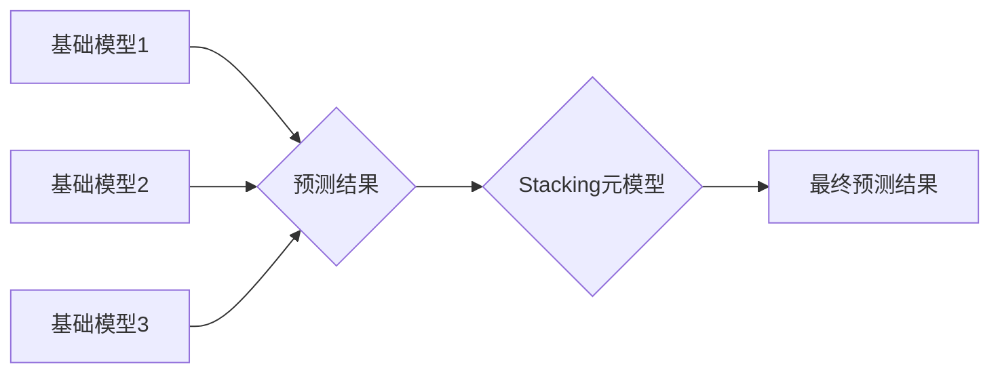

## Python机器学习实战：使用Stacking和Blending集成方法提高模型性能

> 关键词：机器学习、集成学习、Stacking、Blending、模型性能提升、Python

## 1. 背景介绍

在机器学习领域，模型性能提升一直是研究者和开发者的核心目标。单一模型往往存在局限性，难以兼顾所有方面的表现。集成学习作为一种强大的机器学习技术，通过结合多个模型的预测结果，可以有效提升模型的准确性、鲁棒性和泛化能力。

Stacking和Blending是两种常用的集成学习方法，它们通过不同的方式组合多个模型，以获得更优的预测结果。Stacking通过训练一个“元模型”来学习各个基础模型的输出，而Blending则直接对基础模型的输出进行加权平均。

本篇文章将深入探讨Stacking和Blending的原理、算法步骤、数学模型以及实际应用场景，并通过Python代码实例，帮助读者理解并应用这些集成学习方法，提升机器学习模型的性能。

## 2. 核心概念与联系

### 2.1 Stacking

Stacking，又称Stacked Generalization，是一种级联式集成学习方法。它将多个基础模型的输出作为新的训练数据，并训练一个“元模型”来学习这些输出之间的关系，最终生成最终的预测结果。

### 2.2 Blending

Blending，又称Bagging，是一种并行式集成学习方法。它将多个基础模型的预测结果进行加权平均，以获得最终的预测结果。

### 2.3 Stacking和Blending的联系

Stacking和Blending都是集成学习方法，旨在通过组合多个模型的预测结果来提升模型性能。它们的主要区别在于：

* **数据处理方式:** Stacking将基础模型的输出作为新的训练数据，而Blending则直接对基础模型的输出进行加权平均。
* **模型训练方式:** Stacking训练一个元模型来学习基础模型的输出关系，而Blending则不需要训练额外的模型。

**Mermaid 流程图:**



## 3. 核心算法原理 & 具体操作步骤

### 3.1  算法原理概述

Stacking和Blending的算法原理都基于以下核心思想：

* **多样性:** 使用不同的基础模型，可以捕捉到不同方面的特征和模式。
* **组合:** 通过组合多个模型的预测结果，可以弥补每个模型的不足，获得更准确的预测结果。

### 3.2  算法步骤详解

#### 3.2.1 Stacking

1. **训练基础模型:** 使用不同的算法和参数训练多个基础模型。
2. **生成训练数据:** 使用基础模型对训练数据进行预测，并将预测结果作为新的训练数据。
3. **训练元模型:** 使用新的训练数据训练一个元模型，例如逻辑回归、支持向量机或神经网络。
4. **预测:** 使用训练好的基础模型和元模型对新的数据进行预测。

#### 3.2.2 Blending

1. **训练基础模型:** 使用不同的算法和参数训练多个基础模型。
2. **生成预测结果:** 使用基础模型对训练数据和测试数据进行预测。
3. **加权平均:** 根据基础模型的性能，对预测结果进行加权平均，获得最终的预测结果。

### 3.3  算法优缺点

#### 3.3.1 Stacking

* **优点:** 
    * 可以有效提升模型性能。
    * 可以利用不同模型的优势。
    * 能够学习基础模型之间的关系。
* **缺点:** 
    * 训练时间较长。
    * 需要更多的计算资源。
    * 元模型的选择对最终性能有重要影响。

#### 3.3.2 Blending

* **优点:** 
    * 训练时间较短。
    * 计算资源需求较低。
    * 实现简单。
* **缺点:** 
    * 性能提升幅度可能不如Stacking。
    * 无法学习基础模型之间的关系。

### 3.4  算法应用领域

Stacking和Blending在各种机器学习领域都有广泛的应用，例如：

* **分类:** 识别图像、文本、语音等数据类别。
* **回归:** 预测连续数值，例如房价、股票价格等。
* **异常检测:** 识别异常数据点。
* **推荐系统:** 推荐用户感兴趣的内容。

## 4. 数学模型和公式 & 详细讲解 & 举例说明

### 4.1  数学模型构建

#### 4.1.1 Stacking

Stacking的数学模型可以表示为一个多层神经网络，其中：

* **输入层:** 基础模型的输出。
* **隐藏层:** 用于学习基础模型输出之间的关系。
* **输出层:** 预测结果。

#### 4.1.2 Blending

Blending的数学模型可以表示为一个加权平均公式：

$$
y = \sum_{i=1}^{n} w_i * f_i(x)
$$

其中：

* $y$ 是最终预测结果。
* $n$ 是基础模型的数量。
* $w_i$ 是第 $i$ 个基础模型的权重。
* $f_i(x)$ 是第 $i$ 个基础模型对输入 $x$ 的预测结果。

### 4.2  公式推导过程

#### 4.2.1 Stacking

Stacking的公式推导过程较为复杂，涉及到神经网络的训练和优化算法。

#### 4.2.2 Blending

Blending的公式推导过程相对简单，主要基于加权平均的原理。

### 4.3  案例分析与讲解

#### 4.3.1 Stacking

假设我们使用Stacking方法训练一个图像分类模型，基础模型包括CNN、SVM和决策树。

* 首先，我们使用不同的参数训练这三个基础模型，并对训练数据进行预测。
* 然后，我们将这三个基础模型的输出作为新的训练数据，并训练一个逻辑回归模型作为元模型。
* 最后，我们使用训练好的基础模型和元模型对新的图像进行预测。

#### 4.3.2 Blending

假设我们使用Blending方法训练一个房价预测模型，基础模型包括线性回归、决策树和随机森林。

* 首先，我们使用不同的参数训练这三个基础模型，并对训练数据进行预测。
* 然后，我们将这三个基础模型的预测结果进行加权平均，获得最终的房价预测结果。

## 5. 项目实践：代码实例和详细解释说明

### 5.1  开发环境搭建

* Python 3.6+
* scikit-learn
* pandas
* numpy
* matplotlib

### 5.2  源代码详细实现

```python
from sklearn.ensemble import RandomForestClassifier
from sklearn.svm import SVC
from sklearn.linear_model import LogisticRegression
from sklearn.model_selection import train_test_split
from sklearn.metrics import accuracy_score

# 加载数据
data = pd.read_csv('data.csv')
X = data.drop('target', axis=1)
y = data['target']

# 数据分割
X_train, X_test, y_train, y_test = train_test_split(X, y, test_size=0.2, random_state=42)

# 训练基础模型
rf_model = RandomForestClassifier(random_state=42)
svm_model = SVC(random_state=42)
lr_model = LogisticRegression(random_state=42)

rf_model.fit(X_train, y_train)
svm_model.fit(X_train, y_train)
lr_model.fit(X_train, y_train)

# 生成训练数据
rf_predictions = rf_model.predict(X_train)
svm_predictions = svm_model.predict(X_train)
lr_predictions = lr_model.predict(X_train)

# 训练元模型
meta_model = LogisticRegression(random_state=42)
meta_model.fit(
    np.column_stack((rf_predictions, svm_predictions, lr_predictions)), y_train
)

# 预测
rf_predictions_test = rf_model.predict(X_test)
svm_predictions_test = svm_model.predict(X_test)
lr_predictions_test = lr_model.predict(X_test)

meta_predictions = meta_model.predict(
    np.column_stack((rf_predictions_test, svm_predictions_test, lr_predictions_test))
)

# 评估模型性能
accuracy = accuracy_score(y_test, meta_predictions)
print(f'Stacking模型准确率: {accuracy}')
```

### 5.3  代码解读与分析

* 代码首先加载数据并进行数据分割。
* 然后，训练三个基础模型：随机森林、支持向量机和逻辑回归。
* 接着，使用基础模型的预测结果作为新的训练数据，训练一个元模型，即逻辑回归。
* 最后，使用训练好的基础模型和元模型对测试数据进行预测，并评估模型性能。

### 5.4  运行结果展示

运行代码后，会输出Stacking模型的准确率。

## 6. 实际应用场景

Stacking和Blending在实际应用场景中广泛应用于：

* **金融领域:** 预测股票价格、信用风险、欺诈行为等。
* **医疗领域:** 诊断疾病、预测患者预后、辅助药物研发等。
* **电商领域:** 商品推荐、用户画像、精准营销等。

### 6.4  未来应用展望

随着机器学习技术的不断发展，Stacking和Blending将有更广泛的应用场景，例如：

* **自动驾驶:** 融合不同传感器数据，提高车辆的感知和决策能力。
* **自然语言处理:** 提升文本分类、机器翻译、情感分析等任务的性能。
* **图像识别:** 识别更复杂和多样化的图像，例如医学图像、卫星图像等。

## 7. 工具和资源推荐

### 7.1  学习资源推荐

* **书籍:**
    * 《Python机器学习实战》
    * 《Hands-On Machine Learning with Scikit-Learn, Keras & TensorFlow》
* **在线课程:**
    * Coursera: Machine Learning
    * edX: Introduction to Artificial Intelligence

### 7.2  开发工具推荐

* **Scikit-learn:** Python机器学习库，提供各种算法和工具。
* **TensorFlow:** 深度学习框架，支持GPU加速。
* **Keras:** 深度学习框架，易于使用，可与TensorFlow、Theano等框架集成。

### 7.3  相关论文推荐

* Stacking the Experts
* Bagging and Boosting

## 8. 总结：未来发展趋势与挑战

### 8.1  研究成果总结

Stacking和Blending是两种有效的集成学习方法，可以有效提升机器学习模型的性能。

### 8.2  未来发展趋势

* **自动化模型选择:** 自动选择最佳的基模型和元模型组合。
* **迁移学习:** 利用预训练模型，提高模型的泛化能力。
* **分布式训练:** 利用分布式计算资源，加速模型训练。

### 8.3  面临的挑战

* **计算资源需求:** 训练复杂的集成模型需要大量的计算资源。
* **模型解释性:** 集成模型的决策过程往往难以解释。
* **数据质量:** 集成模型的性能依赖于训练数据的质量。

### 8.4  研究展望

未来研究将继续探索新的集成学习方法，提高模型性能、解释性和鲁棒性。

## 9. 附录：常见问题与解答

### 9.1  常见问题

* **Stack