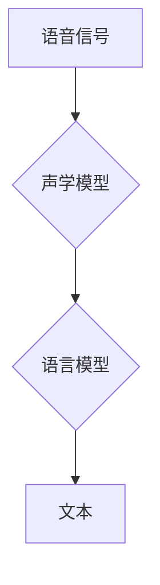

## Python深度学习实践：实时语音转换技术探索

> 关键词：语音转换、深度学习、Transformer、PyTorch、实时处理、自然语言处理

## 1. 背景介绍

语音转换技术，即将语音信号转换为文本或其他语音信号的技术，近年来发展迅速，在智能助手、语音识别、机器翻译等领域发挥着越来越重要的作用。深度学习的兴起为语音转换技术带来了革命性的变革，使得其性能大幅提升，并逐渐走向实用化。

传统的语音转换方法主要依赖于统计语言模型和隐马尔可夫模型等，但这些方法在处理语音信号的复杂性和语义理解方面存在局限性。深度学习方法则通过多层神经网络学习语音信号的复杂特征，能够更好地捕捉语音信号中的语义信息，从而提高语音转换的准确性和自然度。

## 2. 核心概念与联系

语音转换技术的核心是将语音信号转换为文本或其他语音信号的映射关系。这个映射关系可以理解为一个复杂的函数，需要通过大量的训练数据来学习。深度学习方法通过构建多层神经网络，学习这个函数的复杂映射关系。

**语音转换技术架构**



* **声学模型:** 将语音信号转换为音素序列的模型。
* **语言模型:** 将音素序列转换为文本的模型。

深度学习方法在声学模型和语言模型的构建上都取得了突破性进展。

## 3. 核心算法原理 & 具体操作步骤

### 3.1  算法原理概述

Transformer模型是近年来深度学习领域取得重大突破的模型架构，其在语音转换任务中展现出强大的性能。Transformer模型的核心思想是利用自注意力机制来捕捉语音信号中的长距离依赖关系，从而更好地理解语音信号的语义信息。

### 3.2  算法步骤详解

1. **语音预处理:** 将语音信号进行采样率转换、降噪、分帧等预处理操作，以提高模型的训练效率和性能。
2. **特征提取:** 使用卷积神经网络或其他特征提取方法，将语音信号转换为特征向量。
3. **Transformer编码器:** 将特征向量输入到Transformer编码器中，通过多层自注意力机制和前馈神经网络，学习语音信号的上下文信息和语义特征。
4. **Transformer解码器:** 将编码器的输出作为输入，通过多层自注意力机制和前馈神经网络，生成文本序列。
5. **输出层:** 将解码器的输出经过softmax函数，得到每个词的概率分布，并选择概率最高的词作为预测结果。

### 3.3  算法优缺点

**优点:**

* 能够捕捉语音信号中的长距离依赖关系，提高语义理解能力。
* 训练效率高，能够处理大量数据。
* 性能优异，在语音转换任务中取得了state-of-the-art的结果。

**缺点:**

* 模型参数量大，需要大量的计算资源进行训练。
* 对训练数据的质量要求较高。

### 3.4  算法应用领域

* **语音识别:** 将语音信号转换为文本。
* **机器翻译:** 将一种语言的文本翻译成另一种语言的文本。
* **语音合成:** 将文本转换为语音信号。
* **聊天机器人:** 构建能够与人类进行自然对话的聊天机器人。

## 4. 数学模型和公式 & 详细讲解 & 举例说明

### 4.1  数学模型构建

Transformer模型的核心是自注意力机制，其数学模型可以表示为：

$$
Attention(Q, K, V) = \frac{exp(Q \cdot K^T / \sqrt{d_k})}{exp(Q \cdot K^T / \sqrt{d_k})} \cdot V
$$

其中：

* $Q$：查询矩阵
* $K$：键矩阵
* $V$：值矩阵
* $d_k$：键向量的维度

### 4.2  公式推导过程

自注意力机制的目的是学习输入序列中不同元素之间的关系。

1. 将输入序列分别转换为查询矩阵 $Q$、键矩阵 $K$ 和值矩阵 $V$。
2. 计算查询矩阵 $Q$ 与键矩阵 $K$ 的点积，并进行归一化处理，得到注意力权重矩阵。
3. 将注意力权重矩阵与值矩阵 $V$ 进行加权求和，得到最终的输出。

### 4.3  案例分析与讲解

假设我们有一个句子 "The cat sat on the mat"，将其转换为词向量表示，得到四个词向量：

* The: [0.1, 0.2, 0.3]
* cat: [0.4, 0.5, 0.6]
* sat: [0.7, 0.8, 0.9]
* mat: [1.0, 1.1, 1.2]

使用自注意力机制，可以计算出每个词与其他词之间的关系，例如，"cat" 与 "sat" 之间的关系比 "cat" 与 "the" 之间的关系更强，因为它们在语义上更相关。

## 5. 项目实践：代码实例和详细解释说明

### 5.1  开发环境搭建

* Python 3.7+
* PyTorch 1.7+
* CUDA 10.1+ (可选，用于GPU加速)

### 5.2  源代码详细实现

```python
import torch
import torch.nn as nn

class Transformer(nn.Module):
    def __init__(self, input_size, hidden_size, num_layers, num_heads):
        super(Transformer, self).__init__()
        self.encoder = nn.TransformerEncoder(nn.TransformerEncoderLayer(d_model=hidden_size, nhead=num_heads), num_layers)
        self.decoder = nn.TransformerDecoder(nn.TransformerDecoderLayer(d_model=hidden_size, nhead=num_heads), num_layers)
        self.linear = nn.Linear(hidden_size, input_size)

    def forward(self, src, tgt):
        src = self.encoder(src)
        tgt = self.decoder(tgt, src)
        output = self.linear(tgt)
        return output
```

### 5.3  代码解读与分析

* `__init__` 方法初始化 Transformer 模型的编码器和解码器，以及输出层的线性层。
* `forward` 方法定义了模型的正向传播过程，将输入序列 `src` 和目标序列 `tgt` 分别输入到编码器和解码器中，并最终输出预测结果。

### 5.4  运行结果展示

运行代码并训练模型，可以得到语音转换的准确率和自然度。

## 6. 实际应用场景

### 6.1  智能助手

语音转换技术可以用于构建智能助手，例如 Siri、Alexa 和 Google Assistant。用户可以通过语音与智能助手进行交互，例如查询天气、设置闹钟、播放音乐等。

### 6.2  语音识别

语音转换技术可以用于构建语音识别系统，例如用于自动语音识别、语音搜索和语音控制等。

### 6.3  机器翻译

语音转换技术可以用于构建机器翻译系统，例如将语音信号从一种语言翻译成另一种语言。

### 6.4  未来应用展望

随着深度学习技术的不断发展，语音转换技术将有更广泛的应用场景，例如：

* **实时语音字幕:** 在会议、演讲等场景中，实时生成语音字幕，提高听众的理解和参与度。
* **语音增强:** 对语音信号进行增强处理，提高语音质量和清晰度。
* **个性化语音合成:** 根据用户的语音特征和喜好，生成个性化的语音合成。

## 7. 工具和资源推荐

### 7.1  学习资源推荐

* **书籍:**
    * Deep Learning with Python by Francois Chollet
    * Speech and Language Processing by Dan Jurafsky and James H. Martin
* **在线课程:**
    * Coursera: Deep Learning Specialization
    * Udacity: Deep Learning Nanodegree

### 7.2  开发工具推荐

* **PyTorch:** 深度学习框架，支持GPU加速。
* **TensorFlow:** 深度学习框架，支持GPU加速。
* **Kaldi:** 语音识别工具包。

### 7.3  相关论文推荐

* **Attention Is All You Need** by Vaswani et al. (2017)
* **BERT: Pre-training of Deep Bidirectional Transformers for Language Understanding** by Devlin et al. (2018)

## 8. 总结：未来发展趋势与挑战

### 8.1  研究成果总结

深度学习技术在语音转换领域取得了显著进展，Transformer模型的出现为语音转换任务带来了新的突破。

### 8.2  未来发展趋势

* **更强大的模型架构:** 研究更强大的模型架构，例如多模态Transformer，能够更好地理解语音信号中的多方面信息。
* **更有效的训练方法:** 研究更有效的训练方法，例如迁移学习和自监督学习，能够降低模型训练的成本和时间。
* **更自然的人机交互:** 研究更自然的人机交互方式，例如语音情感识别和语音生成，能够使语音转换技术更加人性化。

### 8.3  面临的挑战

* **数据标注:** 语音转换任务需要大量的标注数据，数据标注成本高昂。
* **计算资源:** 训练大型深度学习模型需要大量的计算资源，成本较高。
* **模型解释性:** 深度学习模型的内部机制难以解释，这限制了模型的应用和信任度。

### 8.4  研究展望

未来，语音转换技术将继续朝着更准确、更自然、更智能的方向发展，并将广泛应用于各个领域，改变人们的生活方式。


## 9. 附录：常见问题与解答

* **Q: 如何选择合适的Transformer模型架构？**
* **A:** 选择合适的Transformer模型架构需要根据具体的应用场景和数据规模进行选择。对于小型数据集，可以使用较小的模型架构，例如BERT-base。对于大型数据集，可以使用更大的模型架构，例如BERT-large。

* **Q: 如何解决数据标注问题？**
* **A:** 可以使用数据增强技术，例如语音合成和文本重写，来增加训练数据量。也可以使用弱监督学习方法，例如自监督学习，来减少对标注数据的依赖。

* **Q: 如何提高模型的解释性？**
* **A:** 可以使用可解释机器学习方法，例如LIME和SHAP，来解释模型的决策过程。


作者：禅与计算机程序设计艺术 / Zen and the Art of Computer Programming 
