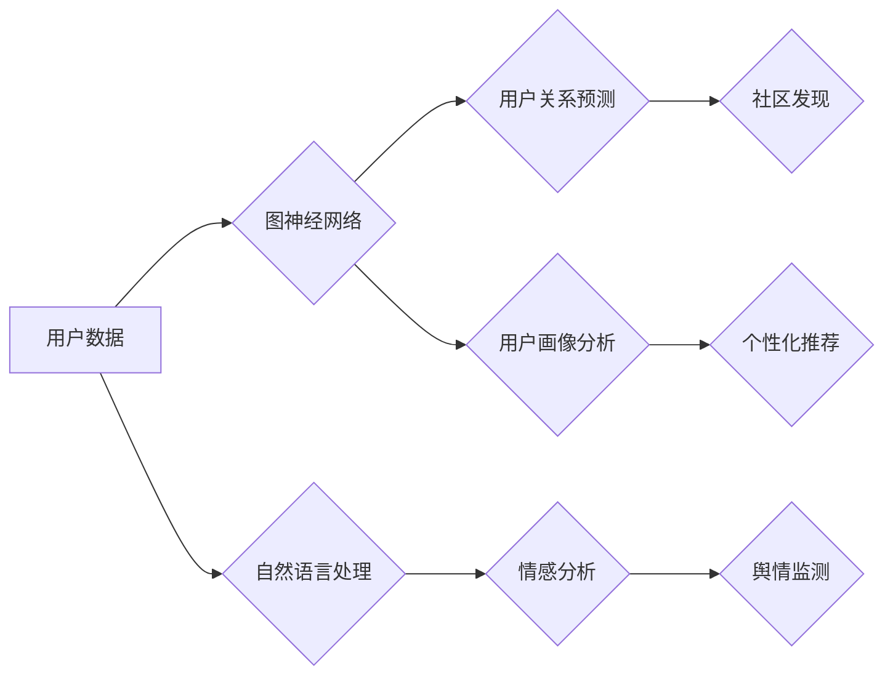

## Python深度学习实践：深度学习在社交网络分析中的应用

> 关键词：深度学习、社交网络分析、自然语言处理、图神经网络、Python、TensorFlow、PyTorch

## 1. 背景介绍

社交网络已经成为现代社会不可或缺的一部分，人们通过社交平台进行信息交流、分享生活、建立人际关系。社交网络数据蕴藏着丰富的社会信息和用户行为模式，对社会科学、市场营销、舆情监测等领域具有重要的研究价值。传统的数据挖掘方法难以有效地处理社交网络的复杂结构和海量数据，深度学习作为一种强大的机器学习方法，为社交网络分析提供了新的思路和工具。

深度学习算法能够自动学习数据中的特征表示，并进行复杂的模式识别和预测。在社交网络分析领域，深度学习已被广泛应用于用户画像、关系预测、情感分析、信息传播预测等任务。

## 2. 核心概念与联系

社交网络分析的核心是理解用户之间的关系和行为模式。深度学习在社交网络分析中的应用主要基于以下核心概念：

* **图神经网络 (Graph Neural Networks, GNNs):** GNNs 是一种专门用于处理图结构数据的深度学习模型。它能够学习节点和边的特征表示，并进行节点分类、边预测、图分类等任务。
* **自然语言处理 (Natural Language Processing, NLP):** NLP 旨在理解和处理自然语言文本。在社交网络分析中，NLP 技术可以用于分析用户发布的文本内容，提取情感、主题、意图等信息。
* **深度学习框架:** TensorFlow 和 PyTorch 是目前最流行的深度学习框架，它们提供了丰富的工具和库，方便开发者构建和训练深度学习模型。

**Mermaid 流程图:**



## 3. 核心算法原理 & 具体操作步骤

### 3.1  算法原理概述

图神经网络 (GNNs) 是一种专门用于处理图结构数据的深度学习模型。它通过在图结构中传播信息，学习节点和边的特征表示，并进行节点分类、边预测、图分类等任务。

GNNs 的核心思想是将图结构信息融入到深度学习模型中。它通过迭代更新节点特征，使得每个节点能够学习到其邻居节点的信息。

### 3.2  算法步骤详解

1. **节点特征初始化:** 为每个节点赋予初始特征向量，这些特征可以是节点本身的属性，也可以是预先提取的特征。
2. **信息传播:** 迭代更新节点特征，每个节点根据其邻居节点的信息更新自己的特征向量。信息传播过程通常使用消息传递机制，每个节点向其邻居节点发送信息，并接收邻居节点的信息。
3. **节点分类/边预测/图分类:** 根据更新后的节点特征，进行节点分类、边预测或图分类任务。

### 3.3  算法优缺点

**优点:**

* 可以有效地学习图结构信息，捕捉节点之间的复杂关系。
* 能够处理非结构化数据，例如文本和图像。
* 在节点分类、边预测、图分类等任务上取得了优异的性能。

**缺点:**

* 训练过程可能比较复杂，需要大量的计算资源。
* 对图结构的规模和复杂度有一定的限制。

### 3.4  算法应用领域

* **社交网络分析:** 用户关系预测、社区发现、用户画像分析、信息传播预测等。
* **推荐系统:** 基于图结构的推荐算法，例如物品协同过滤、内容协同过滤。
* **知识图谱:** 知识图谱的构建和推理。
* **药物研发:** 药物分子结构分析和药物相互作用预测。

## 4. 数学模型和公式 & 详细讲解 & 举例说明

### 4.1  数学模型构建

图神经网络的数学模型通常基于图卷积网络 (Graph Convolutional Network, GCN)。GCN 使用图卷积操作来学习节点特征表示。

**节点特征更新公式:**

$$
h_i^{(l+1)} = \sigma(\sum_{j \in N(i)} \frac{e_{ij}}{ \sqrt{d_i d_j}} W^{(l)} h_j^{(l)})
$$

其中:

* $h_i^{(l)}$ 表示节点 $i$ 在第 $l$ 层的特征向量。
* $N(i)$ 表示节点 $i$ 的邻居节点集合。
* $e_{ij}$ 表示节点 $i$ 和节点 $j$ 之间的边权重。
* $d_i$ 表示节点 $i$ 的度数。
* $W^{(l)}$ 表示第 $l$ 层的权重矩阵。
* $\sigma$ 表示激活函数。

### 4.2  公式推导过程

GCN 的公式推导过程基于图卷积的定义。图卷积操作将节点的特征信息传播到其邻居节点，并更新节点的特征表示。

**图卷积操作:**

$$
h_i^{(l+1)} = \sum_{j \in N(i)} \frac{e_{ij}}{ \sqrt{d_i d_j}} h_j^{(l)}
$$

**权重矩阵:**

GCN 使用权重矩阵 $W^{(l)}$ 来学习节点特征的表示。

### 4.3  案例分析与讲解

假设我们有一个社交网络图，其中每个节点代表一个用户，每个边代表用户之间的关系。我们想要使用 GCN 来预测用户之间的关系类型，例如朋友关系、家人关系、同事关系等。

我们可以将用户的属性信息作为节点特征，例如年龄、性别、职业等。然后使用 GCN 学习用户之间的关系特征，并预测用户之间的关系类型。

## 5. 项目实践：代码实例和详细解释说明

### 5.1  开发环境搭建

* Python 3.6+
* TensorFlow 或 PyTorch
* 其他必要的库，例如 NetworkX、Scikit-learn

### 5.2  源代码详细实现

```python
import tensorflow as tf

# 定义图神经网络模型
class GCN(tf.keras.Model):
    def __init__(self, num_features, num_classes):
        super(GCN, self).__init__()
        self.conv1 = tf.keras.layers.GraphConv(units=16, activation='relu')
        self.conv2 = tf.keras.layers.GraphConv(units=num_classes, activation='softmax')

    def call(self, inputs):
        x = self.conv1(inputs)
        x = self.conv2(x)
        return x

# 加载社交网络数据
#...

# 创建图神经网络模型
model = GCN(num_features=..., num_classes=...)

# 编译模型
model.compile(optimizer='adam', loss='sparse_categorical_crossentropy', metrics=['accuracy'])

# 训练模型
model.fit(x_train, y_train, epochs=10)

# 评估模型
loss, accuracy = model.evaluate(x_test, y_test)
print('Loss:', loss)
print('Accuracy:', accuracy)
```

### 5.3  代码解读与分析

* **定义图神经网络模型:** 使用 TensorFlow 的 `GraphConv` 层构建图卷积网络模型。
* **加载社交网络数据:** 加载社交网络数据，并将其转换为 TensorFlow 可以处理的格式。
* **创建图神经网络模型:** 实例化图神经网络模型。
* **编译模型:** 使用 Adam 优化器、交叉熵损失函数和准确率指标编译模型。
* **训练模型:** 使用训练数据训练模型。
* **评估模型:** 使用测试数据评估模型的性能。

### 5.4  运行结果展示

训练完成后，可以查看模型的训练损失和准确率曲线，以及测试集上的准确率。

## 6. 实际应用场景

### 6.1  用户画像分析

利用深度学习模型分析用户在社交网络上的行为模式，构建用户画像，例如年龄、性别、兴趣爱好、消费习惯等。

### 6.2  关系预测

预测用户之间的关系类型，例如朋友关系、家人关系、同事关系等。

### 6.3  社区发现

发现社交网络中的社区结构，例如兴趣相投的用户群体、专业领域的用户群体等。

### 6.4  信息传播预测

预测信息在社交网络中的传播路径和速度，帮助企业进行营销推广和舆情监测。

## 7. 工具和资源推荐

### 7.1  学习资源推荐

* **书籍:**
    * Deep Learning with Python by Francois Chollet
    * Graph Neural Networks by William L. Hamilton
* **在线课程:**
    * Deep Learning Specialization by Andrew Ng
    * Graph Neural Networks Specialization by Stanford University

### 7.2  开发工具推荐

* **TensorFlow:** https://www.tensorflow.org/
* **PyTorch:** https://pytorch.org/
* **NetworkX:** https://networkx.org/

### 7.3  相关论文推荐

* **Semi-Supervised Classification with Graph Convolutional Networks** by Thomas N. Kipf and Max Welling
* **Graph Attention Networks** by  Petar Veličković et al.

## 8. 总结：未来发展趋势与挑战

### 8.1  研究成果总结

深度学习在社交网络分析领域取得了显著的成果，例如用户画像分析、关系预测、社区发现、信息传播预测等任务取得了优异的性能。

### 8.2  未来发展趋势

* **图神经网络的改进:** 研究更有效的图神经网络模型，例如能够处理更大规模图结构的模型、能够学习更复杂关系的模型。
* **多模态社交网络分析:** 将文本、图像、视频等多模态数据融合到社交网络分析中，构建更全面的用户画像。
* **隐私保护:** 研究如何保护用户隐私，在保证数据安全的前提下进行社交网络分析。

### 8.3  面临的挑战

* **数据规模和复杂度:** 社交网络数据规模庞大，结构复杂，对模型的训练和推理提出了挑战。
* **模型 interpretability:** 深度学习模型的决策过程难以解释，这限制了模型在实际应用中的可信度。
* **伦理问题:** 深度学习在社交网络分析中的应用可能引发伦理问题，例如信息操控、用户隐私泄露等。

### 8.4  研究展望

未来，深度学习在社交网络分析领域将继续发挥重要作用，为社会科学、市场营销、舆情监测等领域提供更精准、更有效的分析工具。


## 9. 附录：常见问题与解答

* **Q: 如何选择合适的图神经网络模型？**
* **A:** 选择合适的图神经网络模型需要根据具体任务和数据特点进行选择。例如，对于节点分类任务，GCN 和 GAT 都是不错的选择；对于关系预测任务，RGCN 和 GraphSAGE 都是有效的模型。

* **Q: 如何处理社交网络数据中的缺失值？**
* **A:** 可以使用多种方法处理社交网络数据中的缺失值，例如平均值填充、众数填充、KNN 填充等。

* **Q: 如何评估图神经网络模型的性能？**
* **A:** 可以使用多种指标评估图神经网络模型的性能，例如准确率、召回率、F1 值等。

作者：禅与计算机程序设计艺术 / Zen and the Art of Computer Programming 


