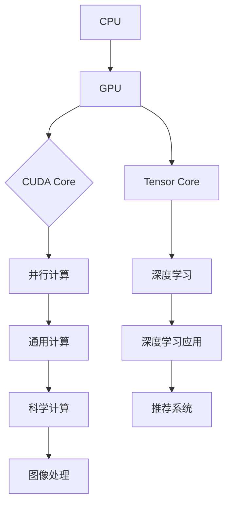

# CUDA Core vs Tensor Core

> 关键词：CUDA核心，Tensor核心，NVIDIA，GPU，深度学习，计算性能，并行计算

## 1. 背景介绍

随着深度学习技术的飞速发展，图形处理单元（GPU）已经成为了推动这一领域进步的关键因素。在众多GPU供应商中，NVIDIA以其强大的CUDA生态系统和Tensor Core架构而闻名。本文将深入探讨CUDA Core和Tensor Core的核心概念、架构差异以及在实际应用中的表现，帮助读者更好地理解这两大架构，并分析其在未来深度学习领域的地位。

## 2. 核心概念与联系

### 2.1 CUDA Core

CUDA（Compute Unified Device Architecture）是由NVIDIA推出的并行计算平台和编程模型。它允许开发者利用GPU的并行处理能力进行通用计算。CUDA Core是GPU上的计算单元，每个CUDA Core都具备执行计算任务的能力。

### 2.2 Tensor Core

Tensor Core是NVIDIA在2020年推出的GPU架构，是CUDA 8.0的后续版本。Tensor Core架构专为深度学习优化，引入了更高效的Tensor处理单元，以提升深度学习任务的处理速度。

### 2.3 Mermaid 流程图

以下是CUDA Core和Tensor Core架构的Mermaid流程图：



在上述流程图中，CPU负责通用计算任务，而GPU则负责并行计算和深度学习任务。CUDA Core和Tensor Core是GPU的核心计算单元，分别对应通用计算和深度学习任务。

## 3. 核心算法原理 & 具体操作步骤

### 3.1 算法原理概述

CUDA Core和Tensor Core都基于SIMD（单指令多数据）并行计算原理，通过将大量数据并行处理，加速计算任务。

### 3.2 算法步骤详解

#### 3.2.1 CUDA Core

1. 开发者使用CUDA编程接口编写计算任务。
2. 编译器将CUDA代码编译成GPU可执行的指令。
3. GPU执行编译后的指令，并行处理大量数据。

#### 3.2.2 Tensor Core

1. 开发者使用Tensor Core支持的深度学习框架（如TensorFlow、PyTorch）编写深度学习模型。
2. 框架自动将模型转换为Tensor Core可执行的指令。
3. GPU执行编译后的指令，并行处理深度学习任务。

### 3.3 算法优缺点

#### 3.3.1 CUDA Core

**优点**：

- 兼容性强，适用于各种通用计算任务。
- 支持开源CUDA工具链，开发门槛较低。

**缺点**：

- 对深度学习任务支持不足，性能提升有限。
- 编程复杂，需要熟悉CUDA编程模型。

#### 3.3.2 Tensor Core

**优点**：

- 专为深度学习优化，性能提升显著。
- 支持主流深度学习框架，开发便捷。

**缺点**：

- 对通用计算任务支持不足。
- 编程模型与CUDA Core存在差异，需要一定学习成本。

### 3.4 算法应用领域

#### 3.4.1 CUDA Core

- 科学计算
- 图像处理
- 机器学习

#### 3.4.2 Tensor Core

- 深度学习
- 计算机视觉
- 自然语言处理

## 4. 数学模型和公式 & 详细讲解 & 举例说明

### 4.1 数学模型构建

深度学习中的卷积神经网络（CNN）是一个典型的数学模型。以下是CNN的公式表示：

$$
y = f(W_1 \cdot x + b_1) 
$$

其中，$y$ 是输出，$W_1$ 是权重矩阵，$x$ 是输入，$b_1$ 是偏置项，$f$ 是激活函数。

### 4.2 公式推导过程

CNN的推导过程涉及多个步骤，包括卷积层、池化层、全连接层和激活函数。具体推导过程可参考深度学习相关教材。

### 4.3 案例分析与讲解

以下是一个使用Tensor Core进行深度学习模型的简单示例：

```python
import torch
import torch.nn as nn

# 定义CNN模型
class CNN(nn.Module):
    def __init__(self):
        super(CNN, self).__init__()
        self.conv1 = nn.Conv2d(1, 32, kernel_size=3, stride=1, padding=1)
        self.relu = nn.ReLU()
        self.pool = nn.MaxPool2d(kernel_size=2, stride=2)
        self.fc1 = nn.Linear(32 * 14 * 14, 128)
        self.fc2 = nn.Linear(128, 10)

    def forward(self, x):
        x = self.conv1(x)
        x = self.relu(x)
        x = self.pool(x)
        x = x.view(x.size(0), -1)
        x = self.fc1(x)
        x = self.relu(x)
        x = self.fc2(x)
        return x

# 创建模型、损失函数和优化器
model = CNN()
criterion = nn.CrossEntropyLoss()
optimizer = torch.optim.Adam(model.parameters(), lr=0.001)

# 模拟数据
input_data = torch.randn(1, 1, 28, 28)
label = torch.tensor([0])

# 训练模型
optimizer.zero_grad()
outputs = model(input_data)
loss = criterion(outputs, label)
loss.backward()
optimizer.step()

# 打印输出
print(outputs.argmax(dim=1))
```

上述代码使用PyTorch框架定义了一个简单的CNN模型，并在模拟数据上进行训练。

## 5. 项目实践：代码实例和详细解释说明

### 5.1 开发环境搭建

1. 安装Python环境（推荐Python 3.7以上版本）。
2. 安装PyTorch库：`pip install torch torchvision`
3. 安装CUDA Toolkit：从NVIDIA官网下载并安装相应版本的CUDA Toolkit。

### 5.2 源代码详细实现

本节已在上文中的4.3部分给出了一个简单的CNN模型训练示例。开发者可以根据实际需求修改模型结构、数据集和训练参数。

### 5.3 代码解读与分析

- `CNN`类定义了CNN模型的结构，包括卷积层、ReLU激活函数、最大池化层和全连接层。
- `forward`方法实现了模型的正向传播过程。
- 使用PyTorch框架进行模型训练，包括前向传播、损失计算、反向传播和参数更新。

### 5.4 运行结果展示

运行上述代码，可以得到模型在模拟数据上的预测结果。开发者可以通过调整模型结构、数据集和训练参数来提升模型性能。

## 6. 实际应用场景

### 6.1 深度学习

Tensor Core架构的GPU在深度学习领域具有显著优势，广泛应用于图像识别、自然语言处理、语音识别等领域。例如，在图像识别任务中，使用Tensor Core架构的GPU可以显著提升模型的训练速度和准确率。

### 6.2 科学计算

CUDA Core架构的GPU也广泛应用于科学计算领域，如流体力学模拟、分子动力学模拟等。通过CUDA Core架构的GPU，可以大幅提升计算效率，缩短科学研究的周期。

### 6.3 游戏开发

GPU在游戏开发领域也有广泛应用，如游戏图形渲染、物理模拟等。CUDA Core和Tensor Core架构的GPU都能够提供高效的图形渲染和计算能力，提升游戏体验。

## 7. 工具和资源推荐

### 7.1 学习资源推荐

- 《深度学习》
- 《CUDA编程指南》
- 《PyTorch深度学习》

### 7.2 开发工具推荐

- PyTorch
- TensorFlow
- CUDA Toolkit

### 7.3 相关论文推荐

- NVIDIA CUDA文档
- NVIDIA Tensor Core文档
- 《深度学习：卷积神经网络》

## 8. 总结：未来发展趋势与挑战

### 8.1 研究成果总结

本文介绍了CUDA Core和Tensor Core架构的核心概念、架构差异以及在实际应用中的表现。通过对比分析，我们可以看出Tensor Core架构在深度学习领域的优势，以及CUDA Core在通用计算领域的优势。

### 8.2 未来发展趋势

未来，GPU架构将朝着更高性能、更小功耗、更轻量化的方向发展。同时，随着深度学习技术的不断进步，Tensor Core架构将在深度学习领域发挥越来越重要的作用。

### 8.3 面临的挑战

GPU在通用计算领域的应用仍面临一些挑战，如编程复杂度高、生态系统不完善等。此外，随着深度学习技术的不断发展，如何进一步提升GPU的并行处理能力和能效比，也将是未来研究的重要方向。

### 8.4 研究展望

未来，GPU架构将继续发展，为深度学习、科学计算、游戏开发等领域提供强大的计算能力。同时，随着人工智能技术的不断进步，GPU在更多领域的应用也将得到拓展。

## 9. 附录：常见问题与解答

**Q1：CUDA Core和Tensor Core的区别是什么？**

A：CUDA Core是NVIDIA推出的并行计算平台和编程模型，而Tensor Core是NVIDIA推出的专为深度学习优化的GPU架构。

**Q2：CUDA Core和Tensor Core的适用场景有哪些？**

A：CUDA Core适用于通用计算任务，如科学计算、图像处理、机器学习等；Tensor Core适用于深度学习任务，如图像识别、自然语言处理、语音识别等。

**Q3：如何选择合适的GPU架构？**

A：根据实际应用需求选择合适的GPU架构。对于深度学习任务，建议选择Tensor Core架构的GPU；对于通用计算任务，建议选择CUDA Core架构的GPU。

**Q4：如何学习CUDA Core和Tensor Core？**

A：可以参考NVIDIA的官方文档、相关书籍和在线课程，学习CUDA编程和Tensor Core架构。

作者：禅与计算机程序设计艺术 / Zen and the Art of Computer Programming