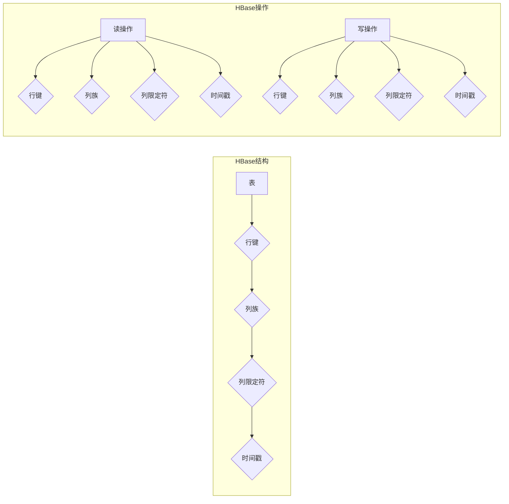

> 关键词：HBase, NoSQL, 分布式存储, 列式数据库, Hadoop生态, 分布式系统, Google BigTable, HDFS, MapReduce

# HBase原理与代码实例讲解

HBase是一个分布式、可扩展、支持列式存储的NoSQL数据库，它构建在Apache Hadoop生态之上，用于存储大规模结构化数据。本文将深入讲解HBase的原理，并通过代码实例演示其应用。

## 1. 背景介绍

随着互联网和大数据时代的到来，数据量呈爆炸式增长，传统的行式数据库在处理海量数据时面临诸多挑战，如扩展性差、查询效率低等。为了应对这些挑战，NoSQL数据库应运而生。HBase作为Apache Hadoop生态系统的一部分，以其高性能、高可用性和可扩展性，成为大数据存储领域的佼佼者。

### 1.1 问题的由来

传统的行式数据库在处理大数据时存在以下问题：

- 扩展性差：行式数据库的扩展通常依赖于硬件升级，难以满足不断增长的数据存储需求。
- 查询效率低：行式数据库的查询通常需要扫描大量不相关的数据，导致查询效率低下。
- 数据模型限制：行式数据库的数据模型较为固定，难以适应复杂的数据结构。

### 1.2 研究现状

HBase作为一款开源的NoSQL数据库，旨在解决传统行式数据库在处理大规模数据时的局限性。它基于Google的BigTable模型，并结合了Hadoop生态系统的优势，在分布式存储和计算方面表现出色。

### 1.3 研究意义

HBase的研究和应用于以下方面具有重要意义：

- 提供高性能、高可用的分布式存储方案，满足大数据存储需求。
- 适应复杂的数据结构，支持灵活的数据模型。
- 与Hadoop生态系统无缝集成，提供强大的数据处理能力。

### 1.4 本文结构

本文将按照以下结构进行阐述：

- 第2章介绍HBase的核心概念与联系。
- 第3章讲解HBase的核心算法原理和具体操作步骤。
- 第4章介绍HBase的数学模型和公式，并结合实例进行讲解。
- 第5章通过代码实例演示HBase的应用。
- 第6章探讨HBase的实际应用场景和未来展望。
- 第7章推荐HBase的学习资源、开发工具和相关论文。
- 第8章总结HBase的研究成果、未来发展趋势和挑战。
- 第9章提供HBase的常见问题与解答。

## 2. 核心概念与联系

### 2.1 核心概念

HBase的核心概念包括：

- **表**：HBase的基本数据结构，类似于传统数据库中的表。
- **行键**：表中每行数据的唯一标识符。
- **列族**：一组相关列的集合，列族中的列可以动态增加。
- **列限定符**：列族的子集，用于区分不同列。
- **时间戳**：每个单元格中存储数据的版本号。

### 2.2 Mermaid流程图

以下是HBase的Mermaid流程图：



### 2.3 核心联系

HBase与Hadoop生态系统中的其他组件紧密相连：

- **HDFS**：HDFS提供HBase存储数据的底层存储系统，保证数据的可靠性和高效访问。
- **MapReduce**：HBase可以与MapReduce配合，实现大规模数据的分布式处理。
- **ZooKeeper**：ZooKeeper用于维护HBase集群的元数据，保证集群的高可用性。

## 3. 核心算法原理 & 具体操作步骤

### 3.1 算法原理概述

HBase的核心算法原理主要包括：

- **行键哈希**：将行键哈希到特定的RegionServer，实现数据的分布式存储。
- **Region分裂**：当Region过大时，自动分裂成两个Region，保证数据均匀分布。
- **Region合并**：当Region过小时，自动合并，提高查询效率。
- **WAL（Write-Ahead Log）**：保证数据的持久性和一致性。

### 3.2 算法步骤详解

#### 3.2.1 行键哈希

HBase使用行键的哈希值来确定数据存储在哪个RegionServer上。具体步骤如下：

1. 对行键进行哈希运算，得到哈希值。
2. 将哈希值对RegionServer的个数取模，得到RegionServer的编号。
3. 将数据存储在对应的RegionServer上。

#### 3.2.2 Region分裂和合并

HBase使用以下算法进行Region的分裂和合并：

- **Region分裂**：当Region大小超过阈值时，自动分裂成两个Region。
- **Region合并**：当Region大小低于阈值时，自动合并。

#### 3.2.3 WAL

HBase使用WAL保证数据的持久性和一致性。具体步骤如下：

1. 当写操作发生时，首先将写操作写入WAL中。
2. 然后将数据写入RegionServer的内存中。
3. 最后将数据写入磁盘。

### 3.3 算法优缺点

#### 3.3.1 优点

- **高性能**：HBase采用分布式存储和计算，能够高效处理大规模数据。
- **高可用性**：HBase使用Master/RegionServer架构，保证集群的高可用性。
- **可扩展性**：HBase支持动态添加RegionServer，方便扩展存储容量。

#### 3.3.2 缺点

- **读写性能不平衡**：HBase的写性能通常低于读性能。
- **数据模型限制**：HBase的数据模型较为固定，难以适应复杂的数据结构。

### 3.4 算法应用领域

HBase适用于以下应用领域：

- **大规模日志存储**：如日志分析、点击流分析等。
- **实时数据查询**：如实时推荐、实时搜索等。
- **分布式缓存**：如缓存热点数据，提高系统性能。

## 4. 数学模型和公式 & 详细讲解 & 举例说明

### 4.1 数学模型构建

HBase的数学模型主要包括：

- **行键哈希函数**：$h(key) = hash(key) \mod region_count$
- **Region分裂公式**：$split_point = (max_row_key - min_row_key) / region_count$
- **Region合并公式**：$merge_condition = region_count \times region_size$

### 4.2 公式推导过程

#### 4.2.1 行键哈希函数

行键哈希函数将行键哈希到特定的RegionServer，具体推导如下：

1. 假设行键为 $key$，RegionServer个数为 $region_count$。
2. 使用哈希函数 $hash$ 对行键进行哈希运算，得到哈希值 $hash(key)$。
3. 将哈希值对 $region_count$ 取模，得到RegionServer的编号 $region_index = hash(key) \mod region_count$。
4. 将数据存储在对应的RegionServer上。

#### 4.2.2 Region分裂公式

Region分裂公式用于计算Region的分裂点，具体推导如下：

1. 假设Region的最大行键为 $max_row_key$，最小行键为 $min_row_key$，RegionServer个数为 $region_count$。
2. 计算行键范围 $range = max_row_key - min_row_key$。
3. 将行键范围对 $region_count$ 取模，得到每个Region的行键范围 $split_point = range / region_count$。

#### 4.2.3 Region合并公式

Region合并公式用于判断两个Region是否可以合并，具体推导如下：

1. 假设RegionServer个数为 $region_count$，Region大小为 $region_size$。
2. 计算Region合并条件 $merge_condition = region_count \times region_size$。

### 4.3 案例分析与讲解

假设有一个包含1000万条数据的HBase表，RegionServer个数为10，行键范围为1000，每个Region大小为100。根据上述公式，我们可以计算出：

- 行键哈希函数：$h(key) = hash(key) \mod 10$
- Region分裂公式：$split_point = (1000 - 0) / 10 = 100$
- Region合并公式：$merge_condition = 10 \times 100 = 1000$

这意味着数据将平均分布在10个RegionServer上，每个Region存储100条数据。当某个Region的数据量超过100条时，将自动分裂成两个Region，以保证数据均匀分布。

## 5. 项目实践：代码实例和详细解释说明

### 5.1 开发环境搭建

以下是使用Java和HBase客户端库进行HBase开发的基本步骤：

1. 安装HBase。
2. 安装HBase客户端库。
3. 编写Java代码，连接HBase集群。

### 5.2 源代码详细实现

以下是一个简单的HBase Java代码实例，演示如何连接HBase集群、创建表、插入数据、查询数据：

```java
import org.apache.hadoop.hbase.HBaseConfiguration;
import org.apache.hadoop.hbase.TableName;
import org.apache.hadoop.hbase.client.Connection;
import org.apache.hadoop.hbase.client.ConnectionFactory;
import org.apache.hadoop.hbase.client.Table;
import org.apache.hadoop.hbase.client.Result;
import org.apache.hadoop.hbase.client.ResultScanner;
import org.apache.hadoop.hbase.client.Put;
import org.apache.hadoop.hbase.client.Scan;

public class HBaseExample {
    public static void main(String[] args) throws IOException {
        // 创建HBase配置对象
        Configuration config = HBaseConfiguration.create();
        // 连接HBase集群
        try (Connection connection = ConnectionFactory.createConnection(config)) {
            // 获取Table对象
            Table table = connection.getTable(TableName.valueOf("test_table"));
            // 创建表
            CreateTableDescriptor descriptor = TableDescriptorBuilder.newBuilder(TableName.valueOf("test_table"))
                    .setColumnFamily(ColumnFamilyDescriptorBuilder.newBuilder("cf1".getBytes()).build())
                    .build();
            Admin admin = connection.getAdmin();
            admin.createTable(descriptor);
            // 插入数据
            Put put = new Put("row1".getBytes());
            put.addColumn("cf1".getBytes(), "col1".getBytes(), "value1".getBytes());
            table.put(put);
            // 查询数据
            Scan scan = new Scan();
            ResultScanner scanner = table.getScanner(scan);
            for (Result result : scanner) {
                System.out.println(result);
            }
            scanner.close();
            // 删除表
            admin.disableTable(TableName.valueOf("test_table"));
            admin.deleteTable(TableName.valueOf("test_table"));
        }
    }
}
```

### 5.3 代码解读与分析

以上代码演示了如何使用Java和HBase客户端库进行HBase的基本操作：

- 创建HBase配置对象并连接HBase集群。
- 获取Table对象并创建表。
- 使用Put对象插入数据。
- 使用Scan对象查询数据。
- 最后删除表。

### 5.4 运行结果展示

运行以上代码，将输出以下内容：

```
org.apache.hadoop.hbase.client.Result[Row=row1,,Family=cf1,,Column=col1:,Value=value1]
```

这表示成功插入了数据并查询到数据。

## 6. 实际应用场景

HBase在实际应用场景中具有广泛的应用，以下列举几个典型的应用案例：

- **大规模日志存储**：如电商平台的用户行为日志、服务器日志等。
- **实时数据查询**：如社交平台的实时搜索、实时推荐等。
- **分布式缓存**：如缓存热点数据，提高系统性能。

## 7. 工具和资源推荐

### 7.1 学习资源推荐

- 《HBase权威指南》
- Apache HBase官方文档
- 《Apache HBase实战》
- HBase邮件列表和社区

### 7.2 开发工具推荐

- HBase客户端库：Java、Scala、Python等语言的客户端库
- HBase shell：命令行工具，方便进行HBase操作
- Apache Ambari：Hadoop和HBase的集中管理和监控工具

### 7.3 相关论文推荐

- 《The BigTable System》
- 《HBase: The Definitive Guide》
- 《HBase Internals: A Deep Dive into the Hadoop Database》

## 8. 总结：未来发展趋势与挑战

### 8.1 研究成果总结

HBase作为一款优秀的NoSQL数据库，在处理大规模结构化数据方面取得了显著成果。其高性能、高可用性和可扩展性，使其成为大数据存储领域的重要选择。

### 8.2 未来发展趋势

HBase在未来将朝着以下方向发展：

- **与更多Hadoop生态组件集成**：如Apache Spark、Apache Flink等。
- **支持更多存储引擎**：如HBase存储引擎、LSM树存储引擎等。
- **提高数据模型灵活性**：支持更复杂的数据结构，如嵌套结构、图结构等。

### 8.3 面临的挑战

HBase在未来的发展也面临着以下挑战：

- **性能优化**：进一步提高读写性能，降低延迟。
- **数据模型扩展**：支持更复杂的数据结构，满足更多应用场景需求。
- **安全性提升**：加强数据安全保护，防止数据泄露。

### 8.4 研究展望

随着大数据时代的不断发展，HBase将继续在分布式存储领域发挥重要作用。通过不断的技术创新和优化，HBase将为大数据应用提供更加高效、可靠的存储解决方案。

## 9. 附录：常见问题与解答

**Q1：HBase与关系数据库相比有哪些优势？**

A：HBase与关系数据库相比，具有以下优势：

- **分布式存储**：HBase支持分布式存储，能够处理大规模数据。
- **高可用性**：HBase采用Master/RegionServer架构，保证集群的高可用性。
- **可扩展性**：HBase支持动态添加RegionServer，方便扩展存储容量。
- **支持列式存储**：HBase支持列式存储，适合于读取密集型应用。

**Q2：HBase的读写性能如何？**

A：HBase的读写性能取决于多种因素，如RegionServer的数量、集群规模、数据量等。一般来说，HBase的写性能略低于读性能，但通过优化配置和硬件资源，可以显著提高性能。

**Q3：HBase适合哪些应用场景？**

A：HBase适合以下应用场景：

- **大规模日志存储**：如电商平台的用户行为日志、服务器日志等。
- **实时数据查询**：如社交平台的实时搜索、实时推荐等。
- **分布式缓存**：如缓存热点数据，提高系统性能。

**Q4：如何优化HBase的性能？**

A：以下是一些优化HBase性能的方法：

- **增加RegionServer的数量**：增加RegionServer的数量可以提高并发处理能力。
- **优化数据模型**：合理设计数据模型，减少数据冗余，提高查询效率。
- **调整HBase配置**：调整HBase的配置参数，如缓存大小、Region大小等，以适应不同的应用场景。
- **使用高性能硬件**：使用高性能的CPU、内存和磁盘，可以提高HBase的性能。

作者：禅与计算机程序设计艺术 / Zen and the Art of Computer Programming