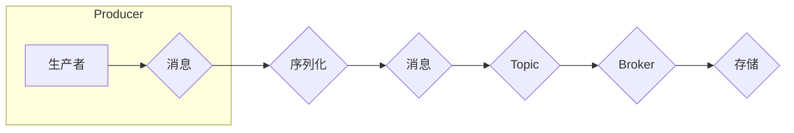

# Kafka Producer原理与代码实例讲解

> 关键词：Kafka, Producer, 分布式消息队列, 消息中间件, 消息发布, 序列化, Topic, 分区, 持久化

## 1. 背景介绍

Apache Kafka是一款开源的分布式流处理平台，广泛用于构建实时数据流应用。Kafka通过其高吞吐量、可扩展性和可持久化特性，成为处理大规模数据流事实上的标准。Kafka的架构由生产者(Producer)、消费者(Consumer)、主题(Topic)、分区(Partition)等核心组件构成。本篇文章将深入探讨Kafka生产者(Producer)的原理，并通过对代码实例的详细讲解，帮助读者全面理解其工作流程和实现机制。

## 2. 核心概念与联系

### 2.1 核心概念

- **Kafka**: 一种分布式流处理平台，用于构建实时数据流应用。
- **Producer**: 负责生产消息并将其发送到Kafka集群的组件。
- **Consumer**: 从Kafka集群中消费消息的组件。
- **Topic**: 消息的分类，类似于数据库中的表。
- **Partition**: 主题中的一个分区，负责存储消息的子集。
- **Message**:Producer生产的数据单元，包含键(Key)和值(Value)。
- **Broker**: Kafka集群中的服务器，负责存储和提供服务。
- **ZooKeeper**: Kafka集群中的协调者，负责维护集群状态。

### 2.2 架构流程图



### 2.3 核心概念联系

Kafka生产者负责将消息序列化后发送到指定的Topic，然后由Broker进行存储和分发。消息通过序列化后转换为字节流，并被发送到指定的Topic。每个Topic可以包含多个Partition，每个Partition可以存储不同类型的消息。Kafka集群中的Broker负责存储和管理这些Partition，同时负责将消息发送给Consumer。

## 3. 核心算法原理 & 具体操作步骤

### 3.1 算法原理概述

Kafka生产者主要涉及以下算法原理：

- **序列化**：将Java对象转换为字节流的过程。
- **消息发送**：将序列化后的字节流发送到指定的Topic和Partition。
- **确认机制**：确保消息成功发送到Broker的机制。
- **负载均衡**：在多个Partition之间分配消息的机制。

### 3.2 算法步骤详解

1. **初始化生产者**：创建一个Kafka生产者实例，指定Bootstrap Servers和Serializer。
2. **序列化消息**：将Java对象序列化为字节流。
3. **选择Partition**：根据消息的Key和Topic的Partition分配策略，选择一个Partition。
4. **发送消息**：将消息发送到选择的Partition。
5. **确认发送**：等待Broker确认消息已成功发送。

### 3.3 算法优缺点

#### 优点

- **高吞吐量**：通过批处理和压缩消息，提高消息发送效率。
- **可扩展性**：支持水平扩展，通过增加Broker来提高集群的吞吐量。
- **持久化**：支持消息的持久化存储，确保消息不丢失。

#### 缺点

- **分区依赖**：消息的顺序性和分区策略可能会影响消息的传递顺序。
- **性能开销**：序列化和反序列化过程会增加一定的性能开销。

### 3.4 算法应用领域

Kafka生产者广泛应用于以下领域：

- **日志收集**：收集系统日志、应用日志等，进行日志分析和监控。
- **实时计算**：处理实时数据流，进行实时计算和分析。
- **事件驱动架构**：构建事件驱动应用，实现事件的生产和消费。

## 4. 数学模型和公式 & 详细讲解 & 举例说明

### 4.1 数学模型构建

Kafka生产者涉及以下数学模型：

- **消息大小**：$M = L + K + V$，其中$L$为Key长度，$K$为Value长度。
- **消息传输时间**：$T = \frac{M}{B}$，其中$M$为消息大小，$B$为网络带宽。
- **发送延迟**：$D = T + L_{broker}$，其中$L_{broker}$为Broker处理时间。

### 4.2 公式推导过程

- **消息大小**：消息大小由Key长度、Value长度和分隔符组成。
- **消息传输时间**：消息传输时间与消息大小和网络带宽成反比。
- **发送延迟**：发送延迟由消息传输时间和Broker处理时间组成。

### 4.3 案例分析与讲解

假设有一个包含100字节Key和100字节Value的消息，网络带宽为1 Gbps，Broker处理时间为10毫秒。则：

- **消息大小**：$M = 100 + 100 + 1 = 201$字节。
- **消息传输时间**：$T = \frac{201}{1 \times 10^9} = 0.000201$秒。
- **发送延迟**：$D = 0.000201 + 0.00001 = 0.000211$秒。

## 5. 项目实践：代码实例和详细解释说明

### 5.1 开发环境搭建

1. 安装Kafka：从[Kafka官网](https://kafka.apache.org/downloads)下载并安装Kafka。
2. 启动Kafka服务：启动ZooKeeper和Kafka服务。
3. 创建Topic：创建一个Topic，例如`test-topic`。
4. 编写Java代码：使用Kafka Java客户端库编写生产者代码。

### 5.2 源代码详细实现

```java
import org.apache.kafka.clients.producer.KafkaProducer;
import org.apache.kafka.clients.producer.ProducerRecord;
import org.apache.kafka.clients.producer.RecordMetadata;

import java.util.Properties;

public class KafkaProducerExample {
    public static void main(String[] args) {
        // Kafka配置
        Properties props = new Properties();
        props.put("bootstrap.servers", "localhost:9092");
        props.put("key.serializer", "org.apache.kafka.common.serialization.StringSerializer");
        props.put("value.serializer", "org.apache.kafka.common.serialization.StringSerializer");

        // 创建生产者实例
        KafkaProducer<String, String> producer = new KafkaProducer<>(props);

        // 发送消息
        for (int i = 0; i < 10; i++) {
            String key = "key-" + i;
            String value = "value-" + i;
            ProducerRecord<String, String> record = new ProducerRecord<>("test-topic", key, value);
            RecordMetadata metadata = producer.send(record).get();
            System.out.println("Sent message: (" + key + ", " + value + ") to partition " + metadata.partition() + " with offset " + metadata.offset());
        }

        // 关闭生产者实例
        producer.close();
    }
}
```

### 5.3 代码解读与分析

- **配置生产者**：设置Bootstrap Servers、Key和Value的序列化器。
- **创建生产者实例**：创建Kafka生产者实例。
- **发送消息**：创建ProducerRecord，并使用send方法发送消息。
- **获取元数据**：获取消息发送的元数据，包括Partition和Offset。

### 5.4 运行结果展示

运行上述代码后，会在控制台打印出每条消息发送的Partition和Offset信息。

## 6. 实际应用场景

### 6.1 日志收集

Kafka生产者可以用于收集系统日志、应用日志等，并将其发送到Kafka集群。然后，可以通过Kafka消费者将日志数据发送到日志分析系统，进行日志分析和监控。

### 6.2 实时计算

Kafka生产者可以用于将实时数据发送到Kafka集群。然后，可以通过Kafka消费者对数据进行实时计算和分析，例如实时监控系统性能、分析用户行为等。

### 6.3 事件驱动架构

Kafka生产者可以用于构建事件驱动架构，实现事件的生产和消费。例如，可以将订单数据作为事件发送到Kafka集群，然后由订单处理系统消费这些事件，进行订单处理。

## 7. 工具和资源推荐

### 7.1 学习资源推荐

- [Apache Kafka官方文档](https://kafka.apache.org/documentation/)
- [Kafka官方客户端库](https://kafka.apache.org/clients/)
- [Kafka 介绍](https://www.jianshu.com/p/8f00c6a9c393)

### 7.2 开发工具推荐

- [IntelliJ IDEA](https://www.jetbrains.com/idea/)
- [Eclipse](https://www.eclipse.org/downloads/)
- [Visual Studio Code](https://code.visualstudio.com/)

### 7.3 相关论文推荐

- [The Design of the Apache Kafka System](https://www.usenix.org/legacy/events/osdi10/tech/full_papers/murillo.pdf)
- [Kafka: A Distributed Streaming Platform](https://www.usenix.org/system/files/conference/nsdi10/nsdi10-papers/murillo.pdf)

## 8. 总结：未来发展趋势与挑战

### 8.1 研究成果总结

本文深入讲解了Kafka生产者的原理，包括核心概念、算法原理、代码实例等。通过分析实际应用场景，展示了Kafka生产者在日志收集、实时计算、事件驱动架构等领域的应用价值。

### 8.2 未来发展趋势

- **更高效的序列化机制**：提高序列化效率，减少序列化过程中的性能开销。
- **更灵活的分区策略**：根据实际需求，设计更灵活的分区策略，提高消息的传输效率和可用性。
- **更强大的监控能力**：提供更全面的监控指标，帮助用户更好地管理Kafka集群。

### 8.3 面临的挑战

- **数据一致性问题**：在分布式系统中，如何保证数据的一致性是一个挑战。
- **高可用性**：如何保证Kafka集群的高可用性，是一个需要持续优化的问题。
- **安全性**：如何保证Kafka集群的安全性，是一个需要关注的问题。

### 8.4 研究展望

未来，Kafka生产者将继续优化其性能和功能，以满足更广泛的应用需求。同时，随着云计算、大数据等技术的发展，Kafka生产者将在实时数据处理、流式计算等领域发挥更大的作用。

## 9. 附录：常见问题与解答

### 9.1 常见问题

- **Q1：Kafka生产者如何选择Partition？**
  **A1：Kafka生产者可以根据Key的哈希值和Topic的分区数，选择一个Partition。**
  
- **Q2：Kafka生产者如何保证消息的顺序性？**
  **A2：Kafka生产者可以通过设置分区策略和Key，保证消息的顺序性。**

- **Q3：Kafka生产者如何处理网络延迟？**
  **A3：Kafka生产者可以通过设置超时时间和重试策略，处理网络延迟问题。**

### 9.2 解答

- **Q1解答**：Kafka生产者默认使用轮询算法选择Partition，也可以通过自定义分区策略选择Partition。
- **Q2解答**：如果需要保证消息的顺序性，可以选择同一个Partition发送消息，或者使用有序的Key。
- **Q3解答**：如果网络延迟导致消息发送失败，Kafka生产者会自动重试发送消息，直到成功或达到最大重试次数。

作者：禅与计算机程序设计艺术 / Zen and the Art of Computer Programming