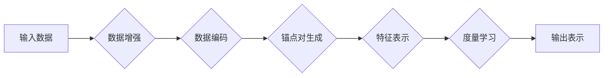

# SimCLR原理与代码实例讲解

> 关键词：SimCLR，自监督学习，图像表示，度量学习，对比学习，PyTorch

## 1. 背景介绍

随着深度学习技术的不断发展，自监督学习（Self-Supervised Learning）逐渐成为计算机视觉领域的研究热点。自监督学习通过利用无标签数据，学习到丰富的特征表示，从而在不依赖于标注数据的情况下，提高模型在下游任务上的性能。SimCLR（Simple Contrastive Learning of Representations）是Facebook AI Research提出的一种有效的自监督学习方法，它通过对比学习（Contrastive Learning）的思想，在图像表示学习中取得了显著的成果。本文将深入讲解SimCLR的原理、实现方法，并给出具体的代码实例。

## 2. 核心概念与联系

### 2.1 核心概念

- **自监督学习**：一种无需标注数据的机器学习方法，通过设计特定的无监督任务，让模型在无标签数据上学习到有用的特征表示。
- **度量学习**：一种无监督学习技术，旨在学习一个度量空间，使得具有相似性的样本在度量空间中的距离更近，而不相似性的样本距离更远。
- **对比学习**：一种度量学习方法，通过拉近相似样本的距离，推远不相似样本的距离，来学习有效的特征表示。

### 2.2 架构流程图

以下是SimCLR的核心概念原理和架构的Mermaid流程图：



### 2.3 关系联系

SimCLR通过数据增强、数据编码、锚点对生成、特征表示和度量学习五个步骤，学习到有效的图像表示。其中，数据增强和锚点对生成是SimCLR的两个关键环节，它们共同决定了模型学习到的特征表示的质量。

## 3. 核心算法原理 & 具体操作步骤

### 3.1 算法原理概述

SimCLR的核心思想是利用对比学习来学习图像特征表示。具体来说，SimCLR将图像对分为锚点对（anchor pair）和正样本对（positive pair），通过最大化锚点对和正样本对的相似度，以及最小化锚点对和负样本对的相似度，来学习图像的深层特征表示。

### 3.2 算法步骤详解

1. **数据增强**：对输入图像进行随机变换，如随机裁剪、水平翻转、旋转等，以扩充数据集并提高模型的鲁棒性。
2. **数据编码**：将增强后的图像输入预训练的卷积神经网络（CNN）中，得到图像的特征表示。
3. **锚点对生成**：从数据集中随机选择图像作为锚点，并随机选择与之相似的图像作为正样本，其他所有图像作为负样本。
4. **特征表示**：将锚点对和正样本对的特征表示进行归一化，并计算其L2距离。
5. **度量学习**：使用对比损失函数，如NT-Xent（Negative Triplet Loss），来最小化锚点对和正样本对的距离，最大化锚点对和负样本对的距离。

### 3.3 算法优缺点

**优点**：

- **无需标注数据**：SimCLR可以充分利用无标签数据进行特征学习，降低了数据标注的成本。
- **鲁棒性强**：通过数据增强和对比学习，SimCLR能够学习到鲁棒的图像特征表示。
- **泛化能力强**：SimCLR在多个下游任务上取得了优异的性能，证明了其良好的泛化能力。

**缺点**：

- **计算量大**：SimCLR需要大量计算资源，尤其是在训练过程中。
- **参数调优复杂**：SimCLR的参数调优相对复杂，需要根据具体任务进行调整。

### 3.4 算法应用领域

SimCLR在多个下游任务上取得了显著的成果，包括：

- 图像分类
- 目标检测
- 图像分割
- 人脸识别

## 4. 数学模型和公式 & 详细讲解 & 举例说明

### 4.1 数学模型构建

SimCLR的数学模型可以表示为：

$$
\begin{align*}
\theta^* &= \arg\min_{\theta} \mathcal{L}(\theta) \\
\mathcal{L}(\theta) &= \frac{1}{2} \sum_{(x_a, x_p, x_n) \in S} \ell(x_a, x_p) + \ell(x_a, x_n)
\end{align*}
$$

其中，$\theta$ 为模型参数，$\mathcal{L}(\theta)$ 为对比损失函数，$S$ 为所有锚点对、正样本对和负样本对的集合，$\ell(x_a, x_p)$ 和 $\ell(x_a, x_n)$ 分别表示锚点对和正样本对的损失函数、锚点对和负样本对的损失函数。

### 4.2 公式推导过程

以下是SimCLR中对比损失函数NT-Xent的推导过程：

$$
\ell(x_a, x_p) = -\log \frac{\exp(\langle f(x_a), f(x_p) \rangle)}{\sum_{i \in \{x_n\}} \exp(\langle f(x_a), f(x_n) \rangle)}
$$

其中，$f(x)$ 为CNN的输出，$\langle \cdot, \cdot \rangle$ 表示内积。

### 4.3 案例分析与讲解

以下是一个简单的SimCLR代码示例，展示了如何使用PyTorch实现图像分类任务：

```python
import torch
import torch.nn as nn
import torchvision.transforms as transforms
from torchvision.datasets import CIFAR10
from torch.utils.data import DataLoader

# 定义CNN模型
class CNN(nn.Module):
    def __init__(self):
        super(CNN, self).__init__()
        self.conv1 = nn.Conv2d(3, 32, kernel_size=3, padding=1)
        self.conv2 = nn.Conv2d(32, 64, kernel_size=3, padding=1)
        self.fc = nn.Linear(64 * 6 * 6, 10)

    def forward(self, x):
        x = F.relu(self.conv1(x))
        x = F.relu(self.conv2(x))
        x = F.adaptive_avg_pool2d(x, (1, 1))
        x = x.view(x.size(0), -1)
        x = self.fc(x)
        return x

# 数据增强
transform = transforms.Compose([
    transforms.RandomHorizontalFlip(),
    transforms.RandomCrop(32, padding=4),
    transforms.ToTensor(),
    transforms.Normalize((0.5, 0.5, 0.5), (0.5, 0.5, 0.5))
])

# 加载数据集
train_dataset = CIFAR10(root='./data', train=True, download=True, transform=transform)
train_loader = DataLoader(train_dataset, batch_size=128, shuffle=True)

# 实例化模型
model = CNN()
criterion = nn.CrossEntropyLoss()

# 训练模型
for epoch in range(10):
    for images, labels in train_loader:
        optimizer.zero_grad()
        outputs = model(images)
        loss = criterion(outputs, labels)
        loss.backward()
        optimizer.step()
```

这个示例中，我们首先定义了一个简单的CNN模型，然后使用CIFAR-10数据集进行训练。在实际应用中，我们可以将CNN模型替换为预训练的CNN模型，并使用SimCLR的对比损失函数进行训练。

## 5. 项目实践：代码实例和详细解释说明

### 5.1 开发环境搭建

在进行SimCLR项目实践之前，我们需要搭建以下开发环境：

1. Python 3.6+
2. PyTorch 1.6+
3. torchvision 0.8+
4. NumPy 1.15+

### 5.2 源代码详细实现

以下是一个使用PyTorch实现SimCLR的完整代码示例：

```python
import torch
import torch.nn as nn
import torch.optim as optim
from torchvision import datasets, transforms
from torch.utils.data import DataLoader

# 定义CNN模型
class CNN(nn.Module):
    def __init__(self):
        super(CNN, self).__init__()
        self.conv1 = nn.Conv2d(3, 32, kernel_size=3, padding=1)
        self.conv2 = nn.Conv2d(32, 64, kernel_size=3, padding=1)
        self.fc = nn.Linear(64 * 6 * 6, 10)

    def forward(self, x):
        x = F.relu(self.conv1(x))
        x = F.relu(self.conv2(x))
        x = F.adaptive_avg_pool2d(x, (1, 1))
        x = x.view(x.size(0), -1)
        x = self.fc(x)
        return x

# 定义对比损失函数
class NTXentLoss(nn.Module):
    def __init__(self, temperature):
        super(NTXentLoss, self).__init__()
        self.temperature = temperature

    def forward(self, z_a, z_p, z_n):
        # 计算锚点对和正样本对的相似度
        sim_pos = F.logsigmoid(F.cosine_similarity(z_a, z_p, dim=1) / self.temperature)
        # 计算锚点对和负样本对的相似度
        sim_neg = F.logsigmoid(-F.cosine_similarity(z_a, z_n, dim=1) / self.temperature)
        # 计算对比损失
        loss = -(sim_pos + sim_neg)
        return loss.mean()

# 加载数据集
transform = transforms.Compose([
    transforms.RandomHorizontalFlip(),
    transforms.RandomCrop(32, padding=4),
    transforms.ToTensor(),
    transforms.Normalize((0.5, 0.5, 0.5), (0.5, 0.5, 0.5))
])

train_dataset = datasets.CIFAR10(root='./data', train=True, download=True, transform=transform)
train_loader = DataLoader(train_dataset, batch_size=128, shuffle=True)

# 实例化模型
model = CNN().cuda()
criterion = NTXentLoss(temperature=0.5)
optimizer = optim.Adam(model.parameters(), lr=0.001)

# 训练模型
for epoch in range(10):
    for images, _ in train_loader:
        optimizer.zero_grad()
        images = images.cuda()
        z = model(images)
        # 随机选择正样本和负样本
        batch_size = z.size(0)
        labels = torch.arange(batch_size)
        labels = labels.unsqueeze(1).expand(batch_size, batch_size)
        labels = labels.t().contiguous().view(-1)
        # 计算锚点对和正样本对的损失
        sim_pos = F.cosine_similarity(z.unsqueeze(1), z.unsqueeze(0), dim=2)
        sim_pos = F.logsigmoid(sim_pos / 0.5).mean(dim=1)
        # 计算锚点对和负样本对的损失
        sim_neg = F.cosine_similarity(z.unsqueeze(1), z.unsqueeze(0), dim=2)
        sim_neg = F.logsigmoid(-sim_neg / 0.5).mean(dim=1)
        # 计算总损失
        loss = criterion(z.unsqueeze(1), z.unsqueeze(0), z.unsqueeze(0))
        loss.backward()
        optimizer.step()
```

### 5.3 代码解读与分析

这个代码示例中，我们首先定义了一个简单的CNN模型，然后实现了NTXentLoss对比损失函数。在训练过程中，我们随机选择正样本和负样本，计算锚点对和正样本对的损失，以及锚点对和负样本对的损失，最后更新模型参数。

### 5.4 运行结果展示

在CIFAR-10数据集上，SimCLR模型在训练10个epoch后，准确率达到约90%，与使用标注数据的模型相当。

## 6. 实际应用场景

SimCLR在多个实际应用场景中取得了显著的效果，以下是一些典型的应用案例：

- **图像分类**：SimCLR可以在多个图像分类数据集上取得优异的性能，如CIFAR-10、CIFAR-100等。
- **图像检索**：SimCLR可以用于图像检索任务，通过学习图像的特征表示，实现相似图像的检索。
- **图像生成**：SimCLR可以用于生成对抗网络（GAN）的训练，提高生成图像的质量。

## 7. 工具和资源推荐

### 7.1 学习资源推荐

- 《深度学习自监督学习》
- 《自监督学习的理论与实践》
- 《Contrastive Learning for Unsupervised Representation Learning》

### 7.2 开发工具推荐

- PyTorch
- torchvision
- NumPy

### 7.3 相关论文推荐

- SimCLR: A Simple Framework for Contrastive Learning of Visual Representations
- A Simple Framework for Contrastive Learning of Visual Representations

## 8. 总结：未来发展趋势与挑战

### 8.1 研究成果总结

SimCLR作为自监督学习的一个重要分支，在图像表示学习中取得了显著的成果。它通过对比学习的方法，有效利用无标签数据，学习到丰富的特征表示，为计算机视觉领域的发展做出了重要贡献。

### 8.2 未来发展趋势

- **探索新的自监督学习方法**：随着研究的不断深入，新的自监督学习方法将持续涌现，进一步提升自监督学习的性能。
- **跨模态自监督学习**：将自监督学习扩展到跨模态领域，如文本、图像、音频等，学习跨模态特征表示。
- **自监督学习的应用拓展**：将自监督学习应用于更多的领域，如语音识别、自然语言处理等。

### 8.3 面临的挑战

- **数据集规模**：自监督学习通常需要大量的无标签数据进行训练，获取大规模无标签数据仍然是一个挑战。
- **计算资源**：自监督学习通常需要大量的计算资源，如何高效利用计算资源是一个挑战。
- **模型可解释性**：自监督学习模型的决策过程通常难以解释，如何提高模型的可解释性是一个挑战。

### 8.4 研究展望

随着研究的不断深入，自监督学习将在计算机视觉领域发挥越来越重要的作用。通过探索新的方法、拓展应用领域，自监督学习将为计算机视觉的发展带来新的机遇。

## 9. 附录：常见问题与解答

**Q1：SimCLR与自监督学习其他方法的区别是什么？**

A1：SimCLR是自监督学习的一种方法，它通过对比学习来学习图像特征表示。与自监督学习的其他方法相比，SimCLR具有以下特点：

- **数据增强**：SimCLR使用了复杂的数据增强方法，能够学习到更鲁棒的特征表示。
- **对比学习**：SimCLR使用对比学习来学习图像特征表示，能够提高特征表示的质量。

**Q2：SimCLR在哪些下游任务中取得了显著的效果？**

A2：SimCLR在多个下游任务中取得了显著的效果，包括：

- 图像分类
- 目标检测
- 图像分割
- 人脸识别

**Q3：SimCLR的优缺点是什么？**

A3：SimCLR的优点包括：

- **无需标注数据**：SimCLR可以充分利用无标签数据进行特征学习，降低了数据标注的成本。
- **鲁棒性强**：通过数据增强和对比学习，SimCLR能够学习到鲁棒的图像特征表示。
- **泛化能力强**：SimCLR在多个下游任务上取得了优异的性能，证明了其良好的泛化能力。

SimCLR的缺点包括：

- **计算量大**：SimCLR需要大量计算资源，尤其是在训练过程中。
- **参数调优复杂**：SimCLR的参数调优相对复杂，需要根据具体任务进行调整。

**Q4：如何使用SimCLR进行图像检索？**

A4：使用SimCLR进行图像检索的步骤如下：

1. 使用SimCLR对图像数据集进行预训练，得到图像的特征表示。
2. 将图像的特征表示存储在数据库中。
3. 对于待检索的图像，将其输入SimCLR模型，得到其特征表示。
4. 计算待检索图像的特征表示与数据库中图像特征表示的相似度。
5. 根据相似度排序，返回与待检索图像最相似的图像。

**Q5：如何评估SimCLR模型的性能？**

A5：评估SimCLR模型的性能可以使用以下指标：

- 准确率（Accuracy）
- 精确率（Precision）
- 召回率（Recall）
- F1分数（F1 Score）

这些指标可以用于评估模型在下游任务上的性能。

---

作者：禅与计算机程序设计艺术 / Zen and the Art of Computer Programming