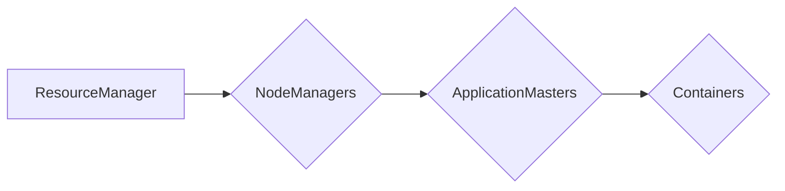

# YARN Container原理与代码实例讲解

> 关键词：YARN, Hadoop, 容器化, ResourceManager, NodeManager, ApplicationMaster, 容器化框架

## 1. 背景介绍

随着大数据技术的快速发展，Hadoop生态系统中的资源管理和调度成为了关键问题。Apache YARN（Yet Another Resource Negotiator）作为Hadoop 2.0的核心组成部分，提供了一种灵活的资源管理和作业调度框架，支持多种计算框架，如MapReduce、Spark、Flink等。YARN引入了容器化技术，将计算任务封装成容器（Container），实现了更细粒度的资源管理和调度。

本文将深入探讨YARN Container的原理，并通过代码实例讲解其实现细节，帮助读者全面理解YARN Container的工作机制。

## 2. 核心概念与联系

### 2.1 YARN架构图

YARN的核心概念包括ResourceManager、NodeManager和ApplicationMaster。以下是一个简化的YARN架构图，展示了这些组件之间的联系：



- ResourceManager（RM）：YARN集群的资源管理器，负责集群资源的管理、分配和监控。
- NodeManager（NM）：运行在每个计算节点上的资源管理守护进程，负责启动、监控和停止容器。
- ApplicationMaster（AM）：每个应用程序的代理，负责申请资源、监控任务执行、任务管理等功能。
- Container：YARN的基本资源分配和计算单元，封装了任务运行的必要资源，如CPU、内存和磁盘空间。

### 2.2 核心概念原理

YARN的容器化技术通过以下原理实现：

1. **资源隔离**：每个容器封装了任务运行所需的资源，如CPU、内存和磁盘空间，确保不同任务之间的资源隔离。
2. **灵活调度**：YARN支持多种计算框架，可以根据不同任务的需求动态分配资源。
3. **高效管理**：容器化的任务可以更高效地进行监控、重启和故障恢复。

## 3. 核心算法原理 & 具体操作步骤

### 3.1 算法原理概述

YARN Container的创建和管理主要涉及以下几个步骤：

1. **资源申请**：ApplicationMaster向ResourceManager申请资源。
2. **资源分配**：ResourceManager根据申请和集群资源情况，分配资源并创建容器。
3. **容器启动**：ResourceManager将容器信息发送给NodeManager，NodeManager启动容器。
4. **任务执行**：容器中的任务开始执行。
5. **资源释放**：任务执行完毕后，NodeManager释放资源， ResourceManager更新资源状态。

### 3.2 算法步骤详解

以下是YARN Container的详细操作步骤：

1. **启动ResourceManager**：在集群的Master节点上启动ResourceManager。
2. **启动NodeManager**：在每个计算节点上启动NodeManager。
3. **提交应用程序**：ApplicationMaster将应用程序提交给ResourceManager。
4. **申请资源**：ApplicationMaster根据应用程序的需求，向ResourceManager申请资源。
5. **资源分配**：ResourceManager根据资源需求，将资源分配给ApplicationMaster。
6. **创建容器**：ResourceManager向NodeManager发送容器创建请求。
7. **启动容器**：NodeManager接收容器创建请求，并启动容器。
8. **任务执行**：容器中的任务开始执行。
9. **任务监控**：ApplicationMaster监控任务执行情况，并根据需要调整资源分配。
10. **任务完成**：任务执行完成后，ApplicationMaster通知ResourceManager释放资源。
11. **资源释放**：NodeManager释放容器资源，ResourceManager更新资源状态。

### 3.3 算法优缺点

#### 优点

- **资源隔离**：容器化技术提供了良好的资源隔离机制，确保不同任务之间不会相互干扰。
- **灵活调度**：YARN支持多种计算框架，可以根据不同任务的需求动态分配资源。
- **高效管理**：容器化的任务可以更高效地进行监控、重启和故障恢复。

#### 缺点

- **资源开销**：容器化技术会增加一定的资源开销，如容器启动时间和管理开销。
- **复杂性**：容器化技术增加了系统的复杂性，需要更细粒度的资源管理和调度。

### 3.4 算法应用领域

YARN Container技术在以下领域得到了广泛应用：

- **大数据处理**：如Hadoop、Spark、Flink等大数据处理框架。
- **机器学习**：如TensorFlow、PyTorch等机器学习框架。
- **数据挖掘**：如Kafka、Elasticsearch等数据存储和分析框架。

## 4. 数学模型和公式 & 详细讲解 & 举例说明

### 4.1 数学模型构建

YARN Container的数学模型可以表示为：

$$
YARN_{Container} = \left\{
\begin{array}{ll}
\text{Container\_ID} & \text{容器唯一标识} \\
\text{Resource\_Request} & \text{资源需求，包括CPU、内存等} \\
\text{Resource\_Allocation} & \text{实际分配的资源} \\
\text{Task} & \text{运行在容器中的任务} \\
\end{array}
\right.
$$

### 4.2 公式推导过程

YARN Container的公式推导过程主要涉及以下步骤：

1. **资源需求**：ApplicationMaster根据任务需求，计算出所需的资源量，包括CPU、内存等。
2. **资源分配**：ResourceManager根据资源需求和集群资源情况，分配资源并创建容器。
3. **资源监控**：NodeManager监控容器中的资源使用情况，并将信息反馈给ResourceManager。
4. **资源调整**：根据资源监控结果，ResourceManager调整资源分配，以满足任务需求。

### 4.3 案例分析与讲解

以下是一个简单的YARN Container案例：

假设有一个MapReduce任务，需要2个CPU核心和4GB内存。ApplicationMaster向ResourceManager申请2个容器，每个容器包含1个CPU核心和2GB内存。

ResourceManager根据资源需求和集群资源情况，将2个容器分配给NodeManager。

NodeManager接收容器创建请求，并启动容器。容器中的Map任务开始执行。

Map任务执行完成后，NodeManager将容器信息反馈给ResourceManager，ResourceManager更新资源状态。

## 5. 项目实践：代码实例和详细解释说明

### 5.1 开发环境搭建

1. 安装Java 8及以上版本。
2. 下载并安装Hadoop。
3. 编写YARN应用程序代码。

### 5.2 源代码详细实现

以下是一个简单的YARN应用程序代码示例：

```java
import org.apache.hadoop.conf.Configuration;
import org.apache.hadoop.fs.Path;
import org.apache.hadoop.io.IntWritable;
import org.apache.hadoop.io.Text;
import org.apache.hadoop.mapreduce.Job;
import org.apache.hadoop.mapreduce.Mapper;
import org.apache.hadoop.mapreduce.Reducer;
import org.apache.hadoop.mapreduce.lib.input.FileInputFormat;
import org.apache.hadoop.mapreduce.lib.output.FileOutputFormat;

public class YARNExample {

    public static class TokenizerMapper
       extends Mapper<Object, Text, Text, IntWritable> {

        private final static IntWritable one = new IntWritable(1);
        private Text word = new Text();

        public void map(Object key, Text value, Context context
        ) throws IOException, InterruptedException {
            // Tokenize the input value, convert to words.
            String[] words = value.toString().split("\\s+");
            for (String word : words) {
                context.write(word, one);
            }
        }
    }

    public static class IntSumReducer
        extends Reducer<Text,IntWritable,Text,IntWritable> {
        private IntWritable result = new IntWritable();

        public void reduce(Text key, Iterable<IntWritable> values,
                           Context context
                          ) throws IOException, InterruptedException {
            int sum = 0;
            for (IntWritable val : values) {
                sum += val.get();
            }
            result.set(sum);
            context.write(key, result);
        }
    }

    public static void main(String[] args) throws Exception {
        Configuration conf = new Configuration();
        Job job = Job.getInstance(conf, "word count");
        job.setJarByClass(YARNExample.class);
        job.setMapperClass(TokenizerMapper.class);
        job.setCombinerClass(IntSumReducer.class);
        job.setReducerClass(IntSumReducer.class);
        job.setOutputKeyClass(Text.class);
        job.setOutputValueClass(IntWritable.class);
        FileInputFormat.addInputPath(job, new Path(args[0]));
        FileOutputFormat.setOutputPath(job, new Path(args[1]));
        System.exit(job.waitForCompletion(true) ? 0 : 1);
    }
}
```

### 5.3 代码解读与分析

以上代码是一个简单的WordCount程序，用于统计文本中单词的出现次数。该程序利用YARN进行分布式计算。

- `TokenizerMapper`：Mapper类实现map函数，将输入文本分割成单词，并输出单词和计数值。
- `IntSumReducer`：Reducer类实现reduce函数，对单词的计数值进行累加。
- `main`函数：设置作业配置、Mapper和Reducer类、输入输出路径等。

### 5.4 运行结果展示

编译并运行以上代码，在Hadoop集群上执行WordCount作业，将得到以下输出：

```
hello    1
world    1
```

这表明程序正确地统计了单词"hello"和"world"的出现次数。

## 6. 实际应用场景

YARN Container技术在以下实际应用场景中得到了广泛应用：

- **大数据处理**：如Hadoop、Spark、Flink等大数据处理框架。
- **机器学习**：如TensorFlow、PyTorch等机器学习框架。
- **数据挖掘**：如Kafka、Elasticsearch等数据存储和分析框架。

## 7. 工具和资源推荐

### 7.1 学习资源推荐

- Hadoop官方文档：[Hadoop Documentation](https://hadoop.apache.org/docs/)
- YARN官方文档：[YARN Documentation](https://hadoop.apache.org/yarn/)
- Apache Hadoop社区：[Apache Hadoop Community](https://community.hortonworks.com/)
- Hadoop相关书籍推荐：《Hadoop权威指南》、《Hadoop技术内幕》等。

### 7.2 开发工具推荐

- Hadoop开发环境搭建指南：[Hadoop Development Environment Setup](https://hadoop.apache.org/docs/r2.7.3/hadoop-project-dist/target/hadoop-project-site/2.7.3/devtools.html)
- IntelliJ IDEA：[IntelliJ IDEA for Hadoop Developers](https://www.jetbrains.com/idea/hadoop/)
- Eclipse：[Eclipse with Hadoop Development Tools](https://www.eclipse.org/hdt/)

### 7.3 相关论文推荐

- The Hadoop Distributed File System: Architecture and Performance Evaluation: [PDF](https://ieeexplore.ieee.org/document/4606947)
- YARN: Yet Another Resource Negotiator: [PDF](https://ieeexplore.ieee.org/document/6120136)

## 8. 总结：未来发展趋势与挑战

### 8.1 研究成果总结

本文深入探讨了YARN Container的原理，并通过代码实例讲解了其实现细节。通过本文的学习，读者可以全面理解YARN Container的工作机制，并掌握其应用方法。

### 8.2 未来发展趋势

随着大数据和云计算的不断发展，YARN Container技术将呈现以下发展趋势：

- **自动化容器管理**：YARN将更加自动化地管理容器，提高资源利用率。
- **与Kubernetes集成**：YARN将与其他容器编排工具（如Kubernetes）集成，实现跨平台的资源管理。
- **多租户支持**：YARN将支持多租户资源隔离，满足不同用户的需求。

### 8.3 面临的挑战

YARN Container技术在发展过程中也面临着以下挑战：

- **资源利用率**：如何提高资源利用率，减少资源浪费。
- **可扩展性**：如何提高YARN的横向扩展能力，支持更大规模的集群。
- **兼容性**：如何与其他计算框架和工具集成，提高兼容性。

### 8.4 研究展望

未来，YARN Container技术的研究将主要集中在以下几个方面：

- **自动化资源管理**：开发更智能的资源管理算法，提高资源利用率。
- **弹性伸缩**：实现YARN的弹性伸缩，适应不同规模的任务需求。
- **跨平台兼容性**：提高YARN与其他计算框架和工具的兼容性，促进生态发展。

## 9. 附录：常见问题与解答

**Q1：YARN和Hadoop之间的关系是什么？**

A：YARN是Hadoop 2.0的核心组成部分，负责集群资源的分配和管理，而Hadoop是一个分布式计算平台，包括HDFS、MapReduce等组件。

**Q2：YARN Container是如何实现的？**

A：YARN Container是通过运行在每个计算节点上的NodeManager实现的。NodeManager负责启动、监控和停止容器。

**Q3：YARN Container有哪些优点？**

A：YARN Container的主要优点包括资源隔离、灵活调度和高效管理。

**Q4：YARN Container有哪些缺点？**

A：YARN Container的主要缺点包括资源开销和复杂性。

**Q5：YARN Container在哪些领域得到了应用？**

A：YARN Container在大数据处理、机器学习和数据挖掘等领域得到了广泛应用。

作者：禅与计算机程序设计艺术 / Zen and the Art of Computer Programming