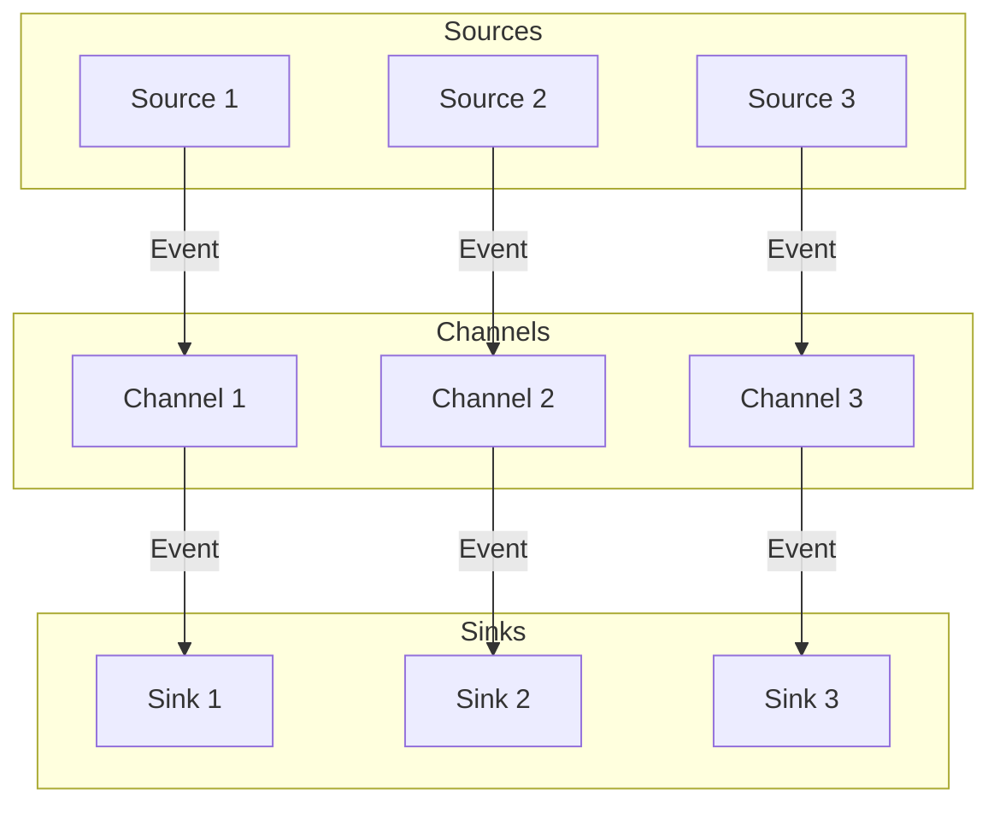

# Flume Channel原理与代码实例讲解

作者：禅与计算机程序设计艺术 / Zen and the Art of Computer Programming

## 1. 背景介绍
### 1.1 问题的由来

随着大数据时代的到来，日志、事件、监控数据等非结构化数据的产生速度呈指数级增长。如何高效、可靠地收集、存储和传输这些数据，成为了大数据处理领域的重要课题。Apache Flume是一款开源分布式系统，用于实时收集、聚合、移动和存储大量日志数据。本文将深入探讨Flume Channel的原理及其代码实现，帮助读者更好地理解其工作流程和应用场景。

### 1.2 研究现状

Flume在日志采集和存储领域已经取得了广泛的应用，其核心组件Channel负责数据的存储和传输。目前，Flume支持多种Channel类型，如MemoryChannel、FileChannel、KafkaChannel等，每种Channel都有其特点和适用场景。

### 1.3 研究意义

了解Flume Channel的原理及其代码实现，有助于我们更好地选择合适的Channel类型，优化数据采集和存储性能，提高大数据处理系统的稳定性和可靠性。

### 1.4 本文结构

本文将按照以下结构展开：

- 第2章介绍Flume Channel的核心概念和联系。
- 第3章详细阐述Flume Channel的工作原理和具体操作步骤。
- 第4章分析Flume Channel的数学模型和公式，并结合实例进行讲解。
- 第5章以代码实例和详细解释说明Flume Channel的实践应用。
- 第6章探讨Flume Channel在实际应用场景中的应用，以及未来发展趋势。
- 第7章推荐相关学习资源和开发工具。
- 第8章总结全文，展望未来发展趋势与挑战。
- 第9章附录提供常见问题与解答。

## 2. 核心概念与联系

Flume Channel是Flume架构中的核心组件之一，负责数据的存储和缓冲。以下是一些与Flume Channel密切相关的重要概念：

- Event：Flume中的数据单元，包含数据内容和其他元信息，如来源、时间戳等。
- Source：数据来源，负责从外部系统采集事件。
- Sink：数据目的端，负责将事件存储到目标系统或写入文件。
- Agent：Flume的运行实例，由Source、Channel和Sink等组件组成。
- Channel：负责存储和缓冲事件的组件，通常介于Source和Sink之间。

这些概念之间的逻辑关系如下：



可以看出，Flume Agent由多个Source、Channel和Sink组成，事件在Agent内部按照Source、Channel、Sink的顺序流动。

## 3. 核心算法原理 & 具体操作步骤
### 3.1 算法原理概述

Flume Channel的工作原理可以概括为以下步骤：

1. Source从外部系统采集事件，并将事件存储到Channel中。
2. Sink从Channel中取出事件，并将事件写入目标系统或存储到文件中。
3. Channel负责存储和缓冲事件，确保事件在Source和Sink之间可靠传输。

### 3.2 算法步骤详解

Flume Channel的主要操作步骤如下：

1. 创建Flume Agent配置文件：定义Agent的名称、Channel类型、Source、Sink等组件及其配置。
2. 启动Flume Agent：加载配置文件，初始化Agent、Channel、Source、Sink等组件。
3. Source从外部系统采集事件，并将事件存储到Channel中。
4. Sink从Channel中取出事件，并将事件写入目标系统或存储到文件中。
5. 重复步骤3和4，直到Agent停止。

### 3.3 算法优缺点

Flume Channel具有以下优点：

- 支持多种Channel类型，满足不同场景的需求。
- 支持多Channel，可实现事件在不同Sink之间的分发。
- 支持高吞吐量和低延迟，保证数据传输的可靠性。
- 支持事务机制，保证数据一致性。

Flume Channel的主要缺点如下：

- 内存Channel在高并发场景下性能较差。
- FileChannel在数据量大时占用磁盘空间较大。

### 3.4 算法应用领域

Flume Channel广泛应用于以下场景：

- 日志采集：采集各种系统和服务的日志，如Web服务器、应用服务器、数据库等。
- 监控数据采集：采集网络、系统、应用等监控数据，如CPU、内存、磁盘、网络流量等。
- 事件流处理：将实时事件流传输到其他系统，如Hadoop、Spark等大数据平台。

## 4. 数学模型和公式 & 详细讲解 & 举例说明
### 4.1 数学模型构建

Flume Channel的数学模型可以概括为以下公式：

$$
\text{Channel Size} = \text{Event Count} \times \text{Average Event Size}
$$

其中，Channel Size为Channel的总容量，Event Count为Channel中存储事件的个数，Average Event Size为事件平均大小。

### 4.2 公式推导过程

假设Channel的容量为C，事件平均大小为S，则：

- 当Channel中存储事件的个数为1时，Channel占用空间为S。
- 当Channel中存储事件的个数为2时，Channel占用空间为2S。
- ...
- 当Channel中存储事件的个数为n时，Channel占用空间为nS。

因此，Channel的总容量可以表示为：

$$
\text{Channel Size} = S \times (1 + 2 + \ldots + n) = \text{Event Count} \times \text{Average Event Size}
$$

### 4.3 案例分析与讲解

以下以MemoryChannel为例，分析Flume Channel的数学模型。

假设MemoryChannel的总容量为1024MB，平均事件大小为100KB，则：

$$
\text{Event Count} = \frac{\text{Channel Size}}{\text{Average Event Size}} = \frac{1024 \times 1024 \times 1024 \times 8}{100 \times 1024} = 8192
$$

即MemoryChannel最多可以存储8192个事件。

### 4.4 常见问题解答

**Q1：Flume Channel的容量是多少？**

A：Flume Channel的容量取决于Channel类型和配置。例如，MemoryChannel的容量由内存大小决定，FileChannel的容量由文件大小决定。

**Q2：如何计算事件大小？**

A：事件大小是指事件内容的字节数，可以通过事件内容编码后的长度计算得到。

**Q3：Flume Channel如何保证数据一致性？**

A：Flume Channel支持事务机制，确保事件在Source和Sink之间可靠传输。当Source将事件存储到Channel时，Channel会开启一个事务；当Sink从Channel取出事件并写入目标系统时，Channel会提交事务。如果在传输过程中出现异常，Channel会回滚事务，保证数据一致性。

## 5. 项目实践：代码实例和详细解释说明
### 5.1 开发环境搭建

在进行Flume Channel实践前，我们需要准备以下开发环境：

1. 安装Java开发环境：下载并安装Java开发环境，如JDK 1.8以上版本。
2. 安装Apache Flume：从Apache官网下载Flume安装包，解压并配置环境变量。
3. 安装IDE：推荐使用IntelliJ IDEA或Eclipse等IDE进行开发。

### 5.2 源代码详细实现

以下是一个简单的Flume Channel示例，演示如何使用MemoryChannel进行数据采集和存储。

**Flume Agent配置文件：**

```xml
# 定义Agent名称
agent.sources = source1
agent.sinks = sink1
agent.channels = memoryChannel

# 定义Source
agent.sources.source1.type = exec
agent.sources.source1.command = tail -F /path/to/logfile.log

# 定义Channel
agent.channels.memoryChannel.type = memory
agent.channels.memoryChannel.capacity = 1000

# 定义Sink
agent.sinks.sink1.type = logger

# 绑定Source、Channel和Sink
agent.sources.source1.channels = memoryChannel
agent.sinks.sink1.channel = memoryChannel
```

**启动Flume Agent：**

```bash
flume-ng agent -c /path/to/config -n agentName -f /path/to/config
```

**运行结果：**

启动Flume Agent后，会实时采集指定日志文件中的日志，并将采集到的日志信息输出到控制台。

### 5.3 代码解读与分析

上述示例中，我们定义了一个名为`source1`的Source，用于实时采集指定日志文件中的日志。`source1`的类型为`exec`，表示通过执行外部命令来采集数据。`agent.channels.memoryChannel`定义了一个名为`memoryChannel`的MemoryChannel，用于存储采集到的日志信息。`agent.sinks.sink1`定义了一个名为`sink1`的Sink，用于将采集到的日志信息输出到控制台。

通过这个简单的示例，我们可以看到Flume Channel的基本工作流程。在实际应用中，可以根据需要选择不同的Channel类型、Source和Sink，构建更加复杂的Flume Agent。

### 5.4 运行结果展示

在控制台中，我们可以看到实时采集到的日志信息：

```
[INFO] LogEvent{header=LogEventHeader{source='exec-source1', timestamp=1608704538000, flags=0, body='INFO: This is a log message.'}, body='INFO: This is a log message.'}
[INFO] LogEvent{header=LogEventHeader{source='exec-source1', timestamp=1608704538000, flags=0, body='INFO: This is another log message.'}, body='INFO: This is another log message.'}
...
```

## 6. 实际应用场景
### 6.1 日志采集

Flume Channel广泛应用于各种日志采集场景，如Web服务器日志、应用服务器日志、数据库日志等。通过Flume Channel，可以实时采集日志信息，并进行存储、分析和可视化。

### 6.2 监控数据采集

Flume Channel可以采集各种监控数据，如CPU、内存、磁盘、网络流量等。通过Flume Channel，可以将监控数据传输到其他系统，如Hadoop、Spark等大数据平台，进行实时分析和可视化。

### 6.3 事件流处理

Flume Channel可以将实时事件流传输到其他系统，如Hadoop、Spark等大数据平台，进行实时处理和分析。

## 7. 工具和资源推荐
### 7.1 学习资源推荐

1. Apache Flume官方文档：[https://flume.apache.org/](https://flume.apache.org/)
2. 《Flume权威指南》
3. 《Apache Flume实战》

### 7.2 开发工具推荐

1. IntelliJ IDEA
2. Eclipse

### 7.3 相关论文推荐

1. Apache Flume官方论文：[https://www.usenix.org/conference/usenixsecurity15/technical-sessions/presentation/antirez](https://www.usenix.org/conference/usenixsecurity15/technical-sessions/presentation/antirez)
2. 《Flume: A Distributed Data Collection Service》

### 7.4 其他资源推荐

1. Apache Flume社区：[https://flume.apache.org/community.html](https://flume.apache.org/community.html)
2. Flume邮件列表：[https://lists.apache.org/mailman/listinfo/flume-user](https://lists.apache.org/mailman/listinfo/flume-user)

## 8. 总结：未来发展趋势与挑战
### 8.1 研究成果总结

本文深入探讨了Flume Channel的原理及其代码实现，从核心概念、算法原理、应用场景等方面进行了详细讲解。通过实际代码实例，帮助读者更好地理解Flume Channel的工作流程和优势。

### 8.2 未来发展趋势

随着大数据技术的不断发展，Flume Channel在未来将呈现以下发展趋势：

1. 支持更多Channel类型，如基于云存储的Channel。
2. 支持更多Source和Sink类型，满足更多应用场景。
3. 支持多租户架构，提高资源利用率。
4. 支持与Hadoop、Spark等大数据平台的深度集成。

### 8.3 面临的挑战

Flume Channel在实际应用中仍面临以下挑战：

1. 性能瓶颈：在高并发场景下，Flume Channel的性能可能成为瓶颈。
2. 可扩展性：Flume Agent的规模和性能受限于单机资源。
3. 可用性：Flume Agent的部署和维护相对复杂。

### 8.4 研究展望

为了应对上述挑战，未来可以从以下几个方面进行研究和改进：

1. 优化Channel性能，提高数据传输效率。
2. 支持分布式部署，提高系统可扩展性。
3. 简化Agent部署和维护流程，提高可用性。

总之，Flume Channel作为Flume架构的核心组件，在日志采集和存储领域发挥着重要作用。随着技术的不断发展，Flume Channel将不断优化和完善，为大数据处理领域提供更加高效、可靠、易用的解决方案。

## 9. 附录：常见问题与解答

**Q1：Flume Channel有哪些类型？**

A：Flume Channel主要有以下类型：

- MemoryChannel：基于内存的Channel，适用于小规模数据采集。
- FileChannel：基于文件的Channel，适用于大规模数据存储。
- KafkaChannel：基于Apache Kafka的Channel，适用于高吞吐量、高可靠性的数据传输。
- RedisChannel：基于Redis的Channel，适用于高性能、高并发的数据存储。

**Q2：如何选择合适的Flume Channel类型？**

A：选择合适的Flume Channel类型需要考虑以下因素：

- 数据规模：对于小规模数据采集，可以选择MemoryChannel；对于大规模数据存储，可以选择FileChannel、KafkaChannel或RedisChannel。
- 吞吐量：对于高吞吐量场景，可以选择KafkaChannel或RedisChannel。
- 可靠性：对于高可靠性要求，可以选择KafkaChannel或RedisChannel。

**Q3：Flume Channel如何保证数据一致性？**

A：Flume Channel支持事务机制，确保事件在Source和Sink之间可靠传输。当Source将事件存储到Channel时，Channel会开启一个事务；当Sink从Channel取出事件并写入目标系统时，Channel会提交事务。如果在传输过程中出现异常，Channel会回滚事务，保证数据一致性。

**Q4：Flume Channel如何处理并发访问？**

A：Flume Channel支持并发访问，通过事务机制保证数据一致性。当多个Source或Sink同时访问Channel时，Channel会为每个事务分配唯一的ID，确保事务的执行顺序。

**Q5：Flume Channel如何处理数据丢失？**

A：Flume Channel支持事务机制，确保事件在Source和Sink之间可靠传输。当发生数据丢失时，Channel会回滚事务，重新从Source获取事件进行传输。

通过以上常见问题与解答，相信读者对Flume Channel有了更深入的了解。在实际应用中，可以根据具体需求选择合适的Flume Channel类型，并注意配置和优化，以充分发挥其优势。