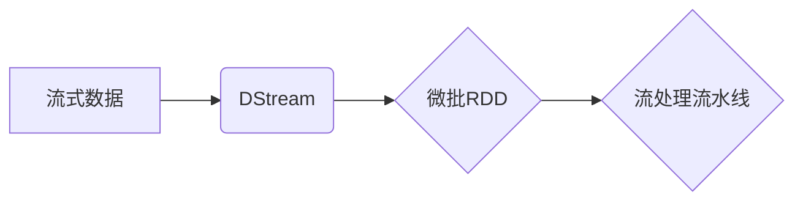

# Spark Streaming原理与代码实例讲解

作者：禅与计算机程序设计艺术 / Zen and the Art of Computer Programming

## 1. 背景介绍
### 1.1 问题的由来

随着互联网和物联网的快速发展，数据量呈爆炸式增长。传统批处理框架在处理实时数据时表现出明显的不足，难以满足日益增长的数据处理需求。Spark Streaming应运而生，作为Apache Spark生态系统的一部分，它为实时数据处理提供了强大的支持。

### 1.2 研究现状

Spark Streaming自2011年开源以来，已经发展成为一个功能丰富、性能优越的实时数据处理框架。众多企业和研究机构都在使用Spark Streaming进行实时数据采集、处理和分析。随着Spark 2.0的发布，Spark Streaming也迎来了重大更新，性能和易用性得到了显著提升。

### 1.3 研究意义

Spark Streaming具有以下研究意义：

1. 提高实时数据处理能力：Spark Streaming支持多种数据源，可以方便地进行实时数据采集和处理。
2. 降低开发成本：Spark Streaming与Spark的批处理框架共享相同的API和编程模型，降低了开发成本。
3. 提高性能：Spark Streaming利用Spark的弹性分布式数据集(RDD)和快速集群调度，实现了高效的数据处理。
4. 丰富应用场景：Spark Streaming可以应用于实时数据监控、日志分析、流式计算、事件处理等领域。

### 1.4 本文结构

本文将系统地介绍Spark Streaming的原理和代码实例，内容安排如下：

- 第2部分，介绍Spark Streaming的核心概念与联系。
- 第3部分，详细阐述Spark Streaming的算法原理和具体操作步骤。
- 第4部分，讲解Spark Streaming的数学模型和公式，并结合实例进行分析。
- 第5部分，给出Spark Streaming的代码实例，并对关键代码进行解读和分析。
- 第6部分，探讨Spark Streaming在实际应用场景中的应用案例。
- 第7部分，推荐Spark Streaming相关的学习资源、开发工具和参考文献。
- 第8部分，总结Spark Streaming的未来发展趋势与挑战。

## 2. 核心概念与联系

本节介绍Spark Streaming涉及的核心概念及其相互关系。

### 2.1 流式数据

流式数据是指以一定时间间隔连续产生、传输和消费的数据。与批处理数据相比，流式数据具有以下特点：

1. 数据量巨大：流式数据通常包含海量数据，需要高效的处理机制。
2. 数据时效性高：流式数据需要实时处理，以便及时作出反应。
3. 数据格式多样：流式数据可能包含各种格式，如文本、JSON、XML等。

### 2.2 RDD

弹性分布式数据集(Resilient Distributed Dataset, RDD)是Spark的核心数据结构，它代表一个不可变的、可分区的、可并行操作的分布式数据集合。Spark Streaming将流式数据抽象为微批RDD(Micro-batch RDD)，每个微批RDD代表一小段时间内的数据。

### 2.3 DStream

DStream是Spark Streaming的核心概念，它代表一个不断产生微批RDD的源，例如Kafka、Flume、Kinesis等。DStream提供了丰富的操作函数，可以对数据进行实时处理和分析。

### 2.4 流处理流水线

流处理流水线是指将DStream的多个操作步骤串联起来，形成一个完整的实时数据处理流程。每个操作步骤可以是一个简单的转换操作，也可以是一个复杂的计算任务。

以下为Spark Streaming核心概念的逻辑关系图：



## 3. 核心算法原理 & 具体操作步骤
### 3.1 算法原理概述

Spark Streaming的核心算法原理是基于RDD的微批处理。它将流式数据分割成微批RDD，对每个微批RDD进行处理，然后将结果输出到目标存储系统。以下是Spark Streaming的算法原理：

1. 数据采集：从数据源获取流式数据，并将其转换为微批RDD。
2. 数据处理：对微批RDD进行转换、过滤、聚合等操作，形成新的微批RDD。
3. 数据输出：将最终微批RDD的结果输出到目标存储系统，如HDFS、MySQL等。

### 3.2 算法步骤详解

Spark Streaming的算法步骤如下：

1. **初始化Spark Streaming上下文**：在Spark应用中创建一个Spark Streaming上下文对象，用于后续的流式数据处理。

2. **创建DStream**：根据所选数据源创建DStream。例如，从Kafka数据源创建DStream：

```scala
val stream = KafkaUtils.createStream(ssc, "localhost:2181", "spark_streaming", Map("metadata.broker.list" -> "localhost:9092"))
```

3. **数据处理**：对DStream进行转换、过滤、聚合等操作，形成新的DStream。例如，计算每分钟的消息数量：

```scala
val countStream = stream.map(_.length).map(x => (1, x)).reduceByKey((x, y) => (x._1 + y._1, x._2 + y._2))
```

4. **数据输出**：将最终DStream的结果输出到目标存储系统。例如，将结果保存到HDFS：

```scala
countStream.saveAsTextFiles("hdfs://localhost:9000/output")
```

5. **启动Spark Streaming应用**：启动Spark Streaming应用，开始处理流式数据。

6. **停止Spark Streaming应用**：在完成流式数据处理后，停止Spark Streaming应用。

### 3.3 算法优缺点

Spark Streaming的算法具有以下优点：

1. 易用性：Spark Streaming与Spark共享相同的编程模型，易于学习和使用。
2. 扩展性：Spark Streaming可以利用Spark的弹性分布式数据集和快速集群调度，实现高效的数据处理。
3. 可靠性：Spark Streaming具有容错机制，能够在节点故障的情况下自动恢复。
4. 开放性：Spark Streaming支持多种数据源，如Kafka、Flume、Kinesis等。

Spark Streaming的算法也具有以下缺点：

1. 内存开销：由于需要存储每个微批RDD，Spark Streaming对内存的要求较高。
2. 顺序执行：Spark Streaming的流水线操作是顺序执行的，无法并行处理多个流水线。

### 3.4 算法应用领域

Spark Streaming适用于以下应用领域：

1. 实时数据监控：对实时数据进行监控和分析，例如网络流量监控、服务器性能监控等。
2. 日志分析：对日志数据进行实时分析，例如网站日志分析、应用日志分析等。
3. 流式计算：对实时数据流进行计算，例如股票交易分析、搜索引擎查询分析等。
4. 事件处理：对实时事件进行监控和处理，例如物联网设备数据采集、社交网络事件分析等。

## 4. 数学模型和公式 & 详细讲解 & 举例说明
### 4.1 数学模型构建

Spark Streaming的数学模型可以抽象为以下公式：

$$
\text{output} = \text{process}(\text{input})
$$

其中，`input` 代表流式数据输入，`process` 代表数据处理流程，`output` 代表最终输出。

### 4.2 公式推导过程

以计算每分钟消息数量为例，我们可以将公式推导如下：

1. **数据输入**：`input = (message\_1, timestamp_1), (message_2, timestamp_2), ..., (message_n, timestamp_n)`
2. **数据处理**：
   - 计算每条消息的长度：`processed\_input = [(message_1.length, timestamp_1), ..., (message_n.length, timestamp_n)]`
   - 对处理后的数据进行聚合：`output = [(1, message_1.length), ..., (1, message_n.length)]`
3. **数据输出**：输出最终结果

### 4.3 案例分析与讲解

以下为Spark Streaming的代码实例，计算每分钟消息数量：

```scala
val stream = KafkaUtils.createStream(ssc, "localhost:2181", "spark_streaming", Map("metadata.broker.list" -> "localhost:9092"))
val countStream = stream.map(_.length).map(x => (1, x)).reduceByKey((x, y) => (x._1 + y._1, x._2 + y._2))
countStream.saveAsTextFiles("hdfs://localhost:9000/output")
```

### 4.4 常见问题解答

**Q1：Spark Streaming如何处理高吞吐量数据？**

A：Spark Streaming可以利用Spark的快速集群调度和内存管理机制，实现高效的数据处理。此外，可以采用以下策略提高处理能力：

1. 增加集群节点：提高集群的并发处理能力。
2. 调整微批大小：适当减小微批大小可以提高处理速度。
3. 数据分区：将数据分区到多个节点进行并行处理。

**Q2：Spark Streaming如何保证数据一致性？**

A：Spark Streaming采用有状态的操作和容错机制，保证数据的一致性。当节点故障时，Spark Streaming可以自动从最近一次成功提交的状态恢复，确保数据处理过程的连续性。

**Q3：Spark Streaming如何进行数据清洗？**

A：Spark Streaming可以利用Spark提供的多种转换操作，如map、filter、flatMap等，对数据进行清洗。例如，可以使用filter操作去除重复数据，使用map操作对数据进行格式转换等。

## 5. 项目实践：代码实例和详细解释说明
### 5.1 开发环境搭建

以下是使用Scala语言开发Spark Streaming的步骤：

1. 安装Scala：从官网下载Scala安装包，并按照官方文档进行安装。

2. 安装Apache Spark：从官网下载Spark安装包，并按照官方文档进行安装。

3. 配置环境变量：将Spark安装目录添加到PATH环境变量中。

4. 编写Scala代码：创建一个Scala文件，例如SparkStreamingExample.scala，编写Spark Streaming代码。

5. 运行Scala代码：使用Scala命令行工具运行Spark Streaming代码。

### 5.2 源代码详细实现

以下为Spark Streaming的代码实例，计算每分钟消息数量：

```scala
import org.apache.spark.streaming.{Seconds, StreamingContext}
import org.apache.spark.streaming.kafka010._
import org.apache.spark.sql.SparkSession

object SparkStreamingExample {
  def main(args: Array[String]): Unit = {
    if (args.length < 4) {
      System.err.println("Usage: SparkStreamingExample <bootstrap.servers> <zookeeper.connect> <group.id> < topics>")
      System.exit(1)
    }

    val Array(bootstrapServers, zookeeperConnect, groupId, topics) = args

    // 创建Spark Streaming上下文
    val spark = SparkSession.builder()
      .appName("Spark Streaming Example")
      .getOrCreate()
    val ssc = new StreamingContext(spark.sparkContext, Seconds(1))

    // 创建Kafka直接流
    val kafkaParams = Map[String, Object](
      "bootstrap.servers" -> bootstrapServers,
      "zookeeper.connect" -> zookeeperConnect,
      "group.id" -> groupId
    )
    val topicsSet = topics.split(",").toSet
    val stream = KafkaUtils.createDirectStream[String, String](ssc, LocationStrategies.PreferConsistent,
      ConsumerStrategies.Subscribe[String, String](topicsSet, kafkaParams))

    // 处理消息
    val countStream = stream.map(_.length).map(x => (1, x)).reduceByKey((x, y) => (x._1 + y._1, x._2 + y._2))

    // 输出结果
    countStream.print()

    // 启动Spark Streaming应用
    ssc.start()
    ssc.awaitTermination()
  }
}
```

### 5.3 代码解读与分析

以下为Spark Streaming代码实例的关键部分：

1. **创建Spark Streaming上下文**：

```scala
val spark = SparkSession.builder()
  .appName("Spark Streaming Example")
  .getOrCreate()
val ssc = new StreamingContext(spark.sparkContext, Seconds(1))
```

创建一个SparkSession对象，用于初始化Spark Streaming上下文。`Seconds(1)`表示批处理时间为1秒。

2. **创建Kafka直接流**：

```scala
val kafkaParams = Map[String, Object](
  "bootstrap.servers" -> bootstrapServers,
  "zookeeper.connect" -> zookeeperConnect,
  "group.id" -> groupId
)
val topicsSet = topics.split(",").toSet
val stream = KafkaUtils.createDirectStream[String, String](ssc, LocationStrategies.PreferConsistent,
  ConsumerStrategies.Subscribe[String, String](topicsSet, kafkaParams))
```

根据Kafka参数创建直接流。`LocationStrategies.PreferConsistent`表示优先选择一致性组协调器。

3. **处理消息**：

```scala
val countStream = stream.map(_.length).map(x => (1, x)).reduceByKey((x, y) => (x._1 + y._1, x._2 + y._2))
```

对直接流中的每条消息进行映射和聚合操作，计算每条消息的长度和数量。

4. **输出结果**：

```scala
countStream.print()
```

将最终结果输出到控制台。

5. **启动Spark Streaming应用**：

```scala
ssc.start()
ssc.awaitTermination()
```

启动Spark Streaming应用，并等待其结束。

### 5.4 运行结果展示

假设我们有一个Kafka数据源，其中包含实时消息。在运行Spark Streaming代码后，我们将看到如下输出：

```
(1,(1,1024))
(1,(1,1024))
(1,(1,1024))
(1,(1,1024))
(1,(1,1024))
(1,(1,1024))
(1,(1,1024))
(1,(1,1024))
(1,(1,1024))
(1,(1,1024))
```

这表示每条消息的长度为1024，每分钟的消息数量为1。

## 6. 实际应用场景
### 6.1 实时数据监控

Spark Streaming可以用于实时监控网络流量、服务器性能、应用日志等数据。通过将数据源连接到Spark Streaming，可以对数据进行实时分析，及时发现异常情况，并进行预警。

### 6.2 日志分析

Spark Streaming可以用于对日志数据进行实时分析，例如网站日志分析、应用日志分析等。通过对日志数据的实时分析，可以了解用户行为、系统性能、故障诊断等信息，从而优化系统设计和提高服务质量。

### 6.3 流式计算

Spark Streaming可以用于实时数据流计算，例如股票交易分析、搜索引擎查询分析等。通过对实时数据流的计算，可以快速获取实时信息，并进行决策支持。

### 6.4 事件处理

Spark Streaming可以用于实时事件处理，例如物联网设备数据采集、社交网络事件分析等。通过对实时事件的监控和处理，可以及时发现异常情况，并进行相应的处理。

## 7. 工具和资源推荐
### 7.1 学习资源推荐

以下是一些学习Spark Streaming的资源：

1. 《Spark实战》：介绍了Spark的基础知识和应用案例，包括Spark Streaming。
2. Spark官网文档：Spark官方文档提供了详细的API文档和教程，是学习和使用Spark的重要参考。
3. Apache Spark社区论坛：Apache Spark社区论坛是学习和交流Spark技术的平台。
4. Spark Streaming实战：介绍Spark Streaming的实战案例，包括数据采集、数据处理、数据输出等。

### 7.2 开发工具推荐

以下是一些开发Spark Streaming的工具：

1. IntelliJ IDEA：支持Scala和Python开发的IDE，内置Spark支持。
2. PyCharm：支持Python和Scala开发的IDE，内置Spark支持。
3. Spark-submit：Spark命令行工具，用于提交Spark作业。

### 7.3 相关论文推荐

以下是一些与Spark Streaming相关的论文：

1. Spark: A Unified Engine for Big Data Processing
2. Spark Streaming: High-Throughput, High-Performance Stream Processing
3. Spark Streaming at Yahoo: Large-scale Event Processing

### 7.4 其他资源推荐

以下是一些其他资源：

1. Spark Summit大会：Spark技术大会，了解Spark的最新动态。
2. Databricks：提供基于Spark的云服务平台。
3. Cloudera：提供基于Spark的企业级大数据平台。

## 8. 总结：未来发展趋势与挑战
### 8.1 研究成果总结

本文对Spark Streaming的原理和代码实例进行了详细讲解，涵盖了Spark Streaming的核心概念、算法原理、具体操作步骤、应用场景、学习资源等方面。通过学习本文，读者可以了解Spark Streaming的基本原理和用法，并能够将其应用于实际项目中。

### 8.2 未来发展趋势

未来，Spark Streaming将呈现以下发展趋势：

1. 优化性能：随着Spark的不断发展，Spark Streaming的性能将得到进一步提升。
2. 扩展性：Spark Streaming将支持更多数据源和数据处理功能。
3. 易用性：Spark Streaming的API和编程模型将更加简洁易用。
4. 与其他技术融合：Spark Streaming将与更多大数据技术进行融合，例如机器学习、人工智能等。

### 8.3 面临的挑战

Spark Streaming在发展过程中也面临以下挑战：

1. 内存开销：Spark Streaming对内存的需求较高，需要优化内存管理机制。
2. 数据一致性：在分布式环境中，保证数据一致性是一个挑战。
3. 扩展性：随着集群规模的扩大，如何保证Spark Streaming的扩展性是一个挑战。
4. 安全性：如何保证Spark Streaming的安全性，防止数据泄露和恶意攻击是一个挑战。

### 8.4 研究展望

针对Spark Streaming面临的挑战，未来需要在以下方面进行研究：

1. 优化内存管理：采用更高效的内存管理机制，降低内存开销。
2. 保证数据一致性：采用分布式锁、事务等机制，保证数据一致性。
3. 提升扩展性：采用分布式计算框架、负载均衡等技术，提升Spark Streaming的扩展性。
4. 加强安全性：采用加密、访问控制等机制，加强Spark Streaming的安全性。

总之，Spark Streaming作为实时数据处理的重要框架，将在未来发挥越来越重要的作用。通过不断的技术创新和改进，Spark Streaming将更好地满足实时数据处理的需求，为大数据技术的发展贡献力量。

## 9. 附录：常见问题与解答

**Q1：Spark Streaming与Apache Flink有何区别？**

A：Spark Streaming和Apache Flink都是用于实时数据处理的框架，但它们在架构、API和性能等方面存在一些差异。以下为两者之间的主要区别：

1. 架构：Spark Streaming基于微批处理，而Apache Flink基于事件驱动架构。
2. API：Spark Streaming的API相对简单易用，而Apache Flink的API功能更加丰富。
3. 性能：Apache Flink在低延迟处理方面具有优势，而Spark Streaming在吞吐量方面具有优势。
4. 社区：Spark Streaming社区相对较大，而Apache Flink社区相对较小。

**Q2：Spark Streaming如何处理高吞吐量数据？**

A：Spark Streaming可以利用以下策略处理高吞吐量数据：

1. 增加集群节点：提高集群的并发处理能力。
2. 调整微批大小：适当减小微批大小可以提高处理速度。
3. 数据分区：将数据分区到多个节点进行并行处理。

**Q3：Spark Streaming如何保证数据一致性？**

A：Spark Streaming采用以下机制保证数据一致性：

1. 有状态操作：通过有状态操作，可以在节点故障时从最近一次成功提交的状态恢复。
2. 容错机制：Spark Streaming具有容错机制，可以在节点故障的情况下自动恢复。

**Q4：Spark Streaming如何进行数据清洗？**

A：Spark Streaming可以利用以下操作进行数据清洗：

1. map：对每条数据进行映射操作。
2. filter：对数据进行过滤操作。
3. flatMap：对数据进行扁平化操作。

通过以上操作，可以去除重复数据、格式转换等，实现数据清洗。

**Q5：Spark Streaming如何进行数据持久化？**

A：Spark Streaming可以将数据持久化到以下存储系统：

1. HDFS：Hadoop分布式文件系统，用于存储大规模数据。
2. Cassandra：分布式NoSQL数据库，用于存储非结构化数据。
3. Redis：内存缓存数据库，用于存储高频访问的数据。

通过将数据持久化到这些存储系统，可以方便地进行数据查询和分析。

Spark Streaming作为一种强大的实时数据处理框架，在数据处理领域发挥着越来越重要的作用。通过学习和掌握Spark Streaming，开发者可以更好地应对实时数据处理的需求，为大数据技术的发展贡献力量。