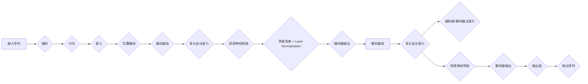

# Transformer架构原理详解：自注意力（Self-Attention）

> 关键词：Transformer, 自注意力, Self-Attention, 编码器，解码器，序列到序列模型，机器翻译，NLP，深度学习

## 1. 背景介绍

自注意力（Self-Attention）是Transformer架构的核心概念，它彻底改变了自然语言处理（NLP）领域，尤其是在序列到序列（Sequence-to-Sequence, S2S）任务，如机器翻译、文本摘要、对话系统等方面取得了显著的成果。本篇文章将深入解析Transformer架构中的自注意力机制，探讨其原理、操作步骤、优缺点及其应用领域。

## 2. 核心概念与联系

### 2.1 自注意力（Self-Attention）原理

自注意力是一种用于处理序列数据的注意力机制，它能够自动学习序列中不同位置之间的依赖关系。在Transformer架构中，自注意力机制允许模型在处理序列时，考虑到序列中每个位置与其他位置的相关性，从而更好地捕捉上下文信息。

### 2.2 自注意力架构的Mermaid流程图



### 2.3 核心概念之间的联系

- **输入序列**：自注意力机制作用于输入序列，如文本、语音等。
- **编码**：输入序列通过编码器进行编码，得到序列的向量表示。
- **分词**：将序列分割成单词、子词或其他基本单元。
- **嵌入**：将分词后的基本单元映射到高维空间。
- **位置编码**：为序列中的每个位置添加位置信息，以保留序列顺序。
- **编码器层**：由多个编码器层堆叠而成，每个层包含多头自注意力、前馈神经网络、残差连接和层归一化。
- **解码器层**：与编码器类似，但增加了一个编码器-解码器注意力层。
- **多头自注意力**：将序列中的每个元素与其他元素进行比较，学习它们之间的关系。
- **编码器-解码器注意力**：解码器在生成下一个词时，不仅关注自身的上下文，还关注编码器的输出。
- **输出层**：将解码器输出的序列映射到最终的输出序列。

## 3. 核心算法原理 & 具体操作步骤

### 3.1 算法原理概述

自注意力机制的核心思想是，在处理序列时，模型能够根据序列中不同元素之间的关系，为每个元素分配不同的权重。这种权重表示了该元素与序列中其他元素的相关程度。

### 3.2 算法步骤详解

1. **输入序列编码**：将输入序列编码成嵌入向量。
2. **多头自注意力**：将嵌入向量分解成多个子向量，并分别计算每个子向量与其他子向量之间的注意力权重。
3. **前馈神经网络**：对多头自注意力后的输出进行线性变换和激活函数处理。
4. **残差连接和层归一化**：将前馈神经网络输出与原始嵌入向量进行残差连接，并进行层归一化。
5. **解码器-编码器注意力**：解码器在生成下一个词时，不仅关注自身的上下文，还关注编码器的输出。
6. **输出层**：将解码器输出的序列映射到最终的输出序列。

### 3.3 算法优缺点

**优点**：

- **捕捉长距离依赖**：自注意力机制能够有效地捕捉序列中长距离的依赖关系，而传统循环神经网络（RNN）和卷积神经网络（CNN）则难以处理长距离依赖问题。
- **并行计算**：自注意力机制可以并行计算，提高了计算效率。
- **端到端学习**：自注意力机制可以端到端地学习序列之间的依赖关系，无需进行复杂的特征工程。

**缺点**：

- **计算复杂度高**：自注意力机制的计算复杂度较高，对于长序列，计算量会显著增加。
- **参数量庞大**：由于自注意力机制需要计算序列中每个元素与其他元素之间的关系，因此参数量较大。

### 3.4 算法应用领域

自注意力机制在以下NLP任务中得到了广泛应用：

- **机器翻译**：将一种语言的文本翻译成另一种语言。
- **文本摘要**：将长文本压缩成简短的摘要。
- **对话系统**：构建能够进行自然对话的机器。
- **语音识别**：将语音信号转换为文本。
- **文本生成**：根据输入文本生成新的文本。

## 4. 数学模型和公式 & 详细讲解 & 举例说明

### 4.1 数学模型构建

自注意力机制的数学模型可以表示为：

$$
Q = W_QK + W_QV + W_QO
$$

$$
K = W_KK + W_KQ + W_KO
$$

$$
V = W_VK + W_VQ + W_VO
$$

其中，$Q$、$K$、$V$ 分别代表查询、键和值，$W_Q$、$W_K$、$W_V$ 分别代表查询、键和值的权重矩阵。

### 4.2 公式推导过程

自注意力机制的推导过程涉及矩阵运算、线性变换和softmax函数等数学工具。以下是对其推导过程的简要说明：

1. **计算查询、键和值的嵌入**：使用权重矩阵 $W_Q$、$W_K$、$W_V$ 对查询、键和值进行线性变换，得到各自的嵌入向量。
2. **计算注意力权重**：使用softmax函数对查询与键之间计算得到的分数进行归一化，得到注意力权重。
3. **计算加权求和**：根据注意力权重对值进行加权求和，得到最终的输出。

### 4.3 案例分析与讲解

以下是一个简单的例子，说明如何使用自注意力机制进行机器翻译：

**输入序列**： "The cat sat on the mat."

**目标序列**： "Le chat est assis sur le tapis."

使用自注意力机制，模型会学习到以下信息：

- "The" 与 "cat" 之间的关联性较高。
- "cat" 与 "sat" 之间的关联性较高。
- "sat" 与 "on" 之间的关联性较高。
- ...

通过学习这些关联性，模型可以生成正确的翻译。

## 5. 项目实践：代码实例和详细解释说明

### 5.1 开发环境搭建

为了实践自注意力机制，我们需要搭建一个深度学习环境。以下是使用PyTorch框架进行实践的环境搭建步骤：

1. 安装Anaconda：从官网下载并安装Anaconda。
2. 创建并激活虚拟环境：
   ```bash
   conda create -n pytorch-env python=3.8
   conda activate pytorch-env
   ```
3. 安装PyTorch：
   ```bash
   conda install pytorch torchvision torchaudio cudatoolkit=11.1 -c pytorch -c conda-forge
   ```
4. 安装Hugging Face的Transformers库：
   ```bash
   pip install transformers
   ```

### 5.2 源代码详细实现

以下是一个使用PyTorch和Transformers库实现自注意力机制的简单例子：

```python
from transformers import AutoModelForSeq2SeqLM
from transformers import Seq2SeqTrainer, Seq2SeqTrainingArguments

# 加载预训练模型
model = AutoModelForSeq2SeqLM.from_pretrained("Helsinki-NLP/opus-mt-en-fr")

# 定义训练参数
training_args = Seq2SeqTrainingArguments(
    output_dir="./results",
    evaluation_strategy="epoch",
    learning_rate=2e-5,
    per_device_train_batch_size=4,
    per_device_eval_batch_size=4,
    weight_decay=0.01,
    save_total_limit=3,
    num_train_epochs=3,
    predict_with_generate=True,
)

# 定义训练器
trainer = Seq2SeqTrainer(
    model=model,
    args=training_args,
    train_dataset=train_dataset,
    eval_dataset=eval_dataset,
)

# 训练模型
trainer.train()
```

### 5.3 代码解读与分析

以上代码展示了如何使用Transformers库加载预训练的机器翻译模型，并使用Seq2SeqTrainer进行训练。首先，我们加载了一个预训练的机器翻译模型，然后定义了训练参数和训练器，最后开始训练模型。

### 5.4 运行结果展示

运行上述代码后，模型将在训练集和验证集上进行训练和评估。训练完成后，模型将保存到指定的输出目录。

## 6. 实际应用场景

自注意力机制在以下NLP任务中得到了广泛应用：

- **机器翻译**：如前所述，自注意力机制在机器翻译任务中取得了显著的成果。
- **文本摘要**：自注意力机制可以用于提取文本的关键信息，生成摘要。
- **对话系统**：自注意力机制可以用于理解用户的意图，并生成相应的回复。
- **语音识别**：自注意力机制可以用于将语音信号转换为文本。
- **文本生成**：自注意力机制可以用于生成新的文本，如诗歌、故事等。

## 7. 工具和资源推荐

### 7.1 学习资源推荐

- 《Attention is All You Need》
- 《Deep Learning for Natural Language Processing》
- Hugging Face官方文档
- PyTorch官方文档

### 7.2 开发工具推荐

- PyTorch
- Transformers库
- Jupyter Notebook
- Colab

### 7.3 相关论文推荐

- Attention is All You Need
- BERT: Pre-training of Deep Bidirectional Transformers for Language Understanding
- Generative Adversarial Text-to-Image Synthesis

## 8. 总结：未来发展趋势与挑战

### 8.1 研究成果总结

自注意力机制是Transformer架构的核心，它彻底改变了NLP领域。自注意力机制在机器翻译、文本摘要、对话系统等任务中取得了显著的成果，推动了NLP技术的发展。

### 8.2 未来发展趋势

- **更高效的注意力机制**：探索更高效的注意力机制，降低计算复杂度和内存占用。
- **更强大的模型结构**：设计更强大的模型结构，提高模型性能和泛化能力。
- **多模态自注意力**：将自注意力机制扩展到多模态数据，如图像、视频等。

### 8.3 面临的挑战

- **计算复杂度高**：自注意力机制的计算复杂度较高，需要高性能的硬件支持。
- **模型可解释性**：自注意力机制的学习过程难以解释，需要进一步研究提高模型的可解释性。

### 8.4 研究展望

自注意力机制将继续在NLP领域发挥重要作用，推动NLP技术的不断发展。未来，自注意力机制将在以下方面取得突破：

- **更有效的注意力机制**：探索更有效的注意力机制，提高模型性能和效率。
- **跨模态自注意力**：将自注意力机制扩展到多模态数据，实现跨模态信息融合。
- **自注意力在更多领域的应用**：将自注意力机制应用于更多领域，如计算机视觉、语音识别等。

## 9. 附录：常见问题与解答

**Q1：自注意力机制与传统的循环神经网络（RNN）相比有哪些优势？**

A1：自注意力机制能够有效地捕捉序列中长距离的依赖关系，而RNN难以处理长距离依赖问题。此外，自注意力机制可以并行计算，提高了计算效率。

**Q2：自注意力机制的参数量是否很大？**

A2：是的，由于自注意力机制需要计算序列中每个元素与其他元素之间的关系，因此参数量较大。

**Q3：自注意力机制在哪些NLP任务中得到了广泛应用？**

A3：自注意力机制在机器翻译、文本摘要、对话系统、语音识别、文本生成等任务中得到了广泛应用。

**Q4：如何提高自注意力机制的性能？**

A4：可以通过以下方法提高自注意力机制的性能：
- 使用更有效的注意力机制。
- 设计更强大的模型结构。
- 优化训练过程。
- 使用更高质量的预训练模型。

**Q5：自注意力机制的未来发展方向是什么？**

A5：自注意力机制的未来发展方向包括：
- 探索更有效的注意力机制。
- 将自注意力机制扩展到多模态数据。
- 将自注意力机制应用于更多领域。

---

作者：禅与计算机程序设计艺术 / Zen and the Art of Computer Programming