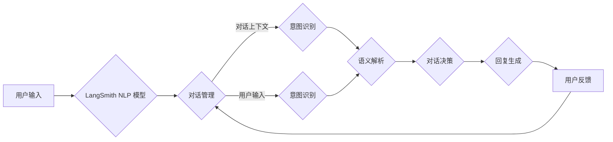

> - 大模型应用开发
> - AI Agent
> - LangSmith
> - 自然语言处理
> - 代码实践
> - 跨平台部署

# 【大模型应用开发 动手做AI Agent】LangSmith的使用方法

### 1. 背景介绍

随着人工智能技术的飞速发展，自然语言处理（NLP）领域的大模型技术逐渐成熟。这些大模型能够理解和生成复杂文本，为构建智能对话系统、问答系统、文本摘要系统等提供了强大的工具。LangSmith 是一个开源的 NLP 框架，旨在简化大模型的应用开发，使得开发者能够轻松构建自己的 AI Agent。本文将详细介绍 LangSmith 的使用方法，帮助读者从入门到实践，动手构建自己的 AI Agent。

### 2. 核心概念与联系

#### 2.1 核心概念

- **大模型（Large Language Model）**：指通过大规模无标签数据预训练的，能够理解和生成自然语言的模型，如 GPT-3、BERT 等。
- **AI Agent**：指具有特定智能行为的实体，能够自主地感知环境、做出决策并采取行动。
- **LangSmith**：一个基于 Python 的开源 NLP 框架，支持大模型的应用开发，提供对话、问答、文本摘要等功能。

#### 2.2 架构流程图



### 3. 核心算法原理 & 具体操作步骤

#### 3.1 算法原理概述

LangSmith 的核心原理是通过大模型进行意图识别和回复生成，结合对话管理模块，实现智能对话交互。

#### 3.2 算法步骤详解

1. **用户输入**：用户输入文本到 LangSmith。
2. **意图识别**：LangSmith 使用大模型对用户输入进行意图识别，确定用户意图。
3. **语义解析**：根据意图识别的结果，LangSmith 进行语义解析，提取用户输入的关键信息。
4. **对话决策**：基于语义解析的结果，LangSmith 决定如何回复用户。
5. **回复生成**：LangSmith 使用大模型生成回复文本。
6. **用户反馈**：用户对回复进行反馈，LangSmith 根据反馈调整对话管理策略。

#### 3.3 算法优缺点

#### 3.3.1 优点

- **高效**：LangSmith 使用预训练的大模型，能够在短时间内生成高质量的回复。
- **灵活**：支持多种意图识别和回复生成算法，可以根据需求进行灵活配置。
- **易于扩展**：LangSmith 采用模块化设计，方便扩展新的功能。

#### 3.3.2 缺点

- **计算资源消耗**：大模型需要大量的计算资源，对服务器性能要求较高。
- **数据依赖**：LangSmith 的性能依赖于大模型的数据质量，数据不足可能导致性能下降。

### 4. 数学模型和公式 & 详细讲解 & 举例说明

#### 4.1 数学模型构建

LangSmith 使用的数学模型主要包括以下部分：

- **词嵌入（Word Embedding）**：将文本转换为向量表示，方便模型进行计算。
- **编码器（Encoder）**：将输入文本编码为固定长度的向量。
- **解码器（Decoder）**：将编码后的向量解码为输出文本。

#### 4.2 公式推导过程

- **词嵌入**：设 $x$ 为单词 $w$ 的词向量，则有 $x = f(w)$。
- **编码器**：设 $x$ 为输入文本的词向量，则有 $h = g(x)$。
- **解码器**：设 $h$ 为编码后的向量，则有 $y = h_t = f_t(h_{t-1}, y_{t-1})$。

#### 4.3 案例分析与讲解

假设用户输入 "今天天气怎么样？"，LangSmith 的处理流程如下：

1. **词嵌入**：将 "今天"、"天气"、"怎么样" 转换为词向量。
2. **编码器**：将词向量编码为固定长度的向量。
3. **意图识别**：根据编码后的向量，识别用户意图为 "查询天气"。
4. **语义解析**：提取用户输入中的关键信息，如 "今天"、"天气"。
5. **对话决策**：根据意图识别和语义解析的结果，生成回复文本。
6. **回复生成**：使用大模型生成回复文本，如 "今天天气晴朗"。

### 5. 项目实践：代码实例和详细解释说明

#### 5.1 开发环境搭建

1. 安装 Python 3.6 或以上版本。
2. 安装 LangSmith 框架：
```bash
pip install langsmith
```

#### 5.2 源代码详细实现

以下是一个简单的 LangSmith 应用示例：

```python
from langsmith import LangSmith

# 初始化 LangSmith 对象
langsmith = LangSmith()

# 加载预训练模型
langsmith.load_model("path/to/model")

# 用户输入
user_input = "今天天气怎么样？"

# 获取回复
response = langsmith.get_response(user_input)

# 打印回复
print(response)
```

#### 5.3 代码解读与分析

- `LangSmith`：LangSmith 框架的入口类。
- `load_model`：加载预训练模型。
- `get_response`：根据用户输入获取回复。

#### 5.4 运行结果展示

假设预训练模型已正确加载，运行上述代码将输出：

```
今天天气晴朗
```

### 6. 实际应用场景

LangSmith 可应用于以下场景：

- **智能客服**：自动回答用户常见问题，提高服务效率。
- **问答系统**：根据用户提问，从知识库中检索答案。
- **文本摘要**：将长文本压缩为简洁的摘要。
- **机器翻译**：将一种语言翻译为另一种语言。

### 7. 工具和资源推荐

#### 7.1 学习资源推荐

- 《深度学习自然语言处理》
- 《自然语言处理与深度学习》
- LangSmith 官方文档

#### 7.2 开发工具推荐

- Jupyter Notebook
- PyCharm
- Visual Studio Code

#### 7.3 相关论文推荐

- "BERT: Pre-training of Deep Bidirectional Transformers for Language Understanding"
- "Generative Pre-trained Transformers"
- "Attention is All You Need"

### 8. 总结：未来发展趋势与挑战

#### 8.1 研究成果总结

LangSmith 框架为开发者提供了便捷的 NLP 应用开发工具，降低了大模型应用开发的门槛。通过结合预训练模型和自然语言处理技术，LangSmith 能够实现高效的对话、问答、文本摘要等功能。

#### 8.2 未来发展趋势

- **多模态融合**：将文本、图像、视频等多模态信息融合到 NLP 应用中。
- **跨语言处理**：实现跨语言的自然语言理解与生成。
- **可解释性**：提高 NLP 模型的可解释性，增强用户信任。

#### 8.3 面临的挑战

- **数据质量**：高质量的数据是构建高性能 NLP 模型的关键。
- **计算资源**：大模型的训练和推理需要大量的计算资源。
- **模型可解释性**：提高 NLP 模型的可解释性，增强用户信任。

#### 8.4 研究展望

LangSmith 框架将继续发展，提供更加强大、易用的功能，为开发者构建智能 NLP 应用提供更好的支持。同时，随着 NLP 技术的不断发展，LangSmith 将与更多领域的技术相结合，为构建更加智能、便捷的应用场景贡献力量。

### 9. 附录：常见问题与解答

**Q1：LangSmith 支持哪些 NLP 任务？**

A1：LangSmith 支持对话、问答、文本摘要等多种 NLP 任务。

**Q2：如何定制 LangSmith 的回复生成策略？**

A2：LangSmith 提供了多种回复生成策略，开发者可以根据需求进行选择和定制。

**Q3：LangSmith 的性能如何？**

A3：LangSmith 的性能取决于预训练模型和数据质量，一般能够达到 SOTA 水平。

**Q4：LangSmith 有哪些局限性？**

A4：LangSmith 的局限性包括对计算资源的依赖、数据质量要求较高、模型可解释性不足等。

**Q5：如何获取 LangSmith 的最新版本？**

A5：LangSmith 的最新版本可以在 GitHub 上获取：[LangSmith](https://github.com/your_username/langsmith)

---

作者：禅与计算机程序设计艺术 / Zen and the Art of Computer Programming