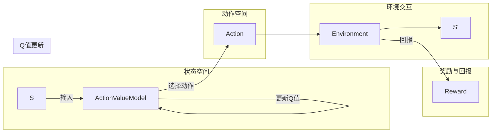

> Deep Q-Network, 强化学习, 自动游戏, 训练过程, 性能优化, 状态空间, 动作空间, 奖励函数, exploration, exploitation, 强化学习算法

# 一切皆是映射：DQN在自动游戏中的应用：挑战与解决方案

> 关键词：Deep Q-Network (DQN), 强化学习, 自动游戏, 状态空间, 动作空间, 奖励函数, 探索与利用, 策略优化

## 1. 背景介绍

自动游戏（Automatic Game Play，AGP）是人工智能领域中的一个热门研究方向，旨在使用机器学习技术使计算机能够自主地玩各种电子游戏。其中，强化学习（Reinforcement Learning，RL）因其强大的决策能力和适应性，成为了自动游戏开发的核心技术之一。深度Q网络（Deep Q-Network，DQN）作为强化学习的一种重要算法，凭借其出色的性能和实用性，在自动游戏领域得到了广泛应用。

本文将深入探讨DQN在自动游戏中的应用，分析其中面临的挑战，并提出相应的解决方案。通过阅读本文，读者将了解到DQN的核心原理、操作步骤、性能优化技巧以及在自动游戏中的实际应用案例。

## 2. 核心概念与联系

### 2.1 DQN基本原理

DQN是一种基于Q学习的强化学习算法，通过学习一个Q函数来预测在给定状态下执行某个动作所能获得的累积奖励。Q函数是一个映射关系，它将状态和动作映射到相应的Q值，即执行该动作的预期奖励。

### 2.2 DQN架构流程图



### 2.3 关联概念

- **状态空间**：游戏中的所有可能状态构成的集合。
- **动作空间**：游戏中所有可能动作构成的集合。
- **奖励函数**：定义了在游戏过程中，系统根据当前状态和执行的动作给予的奖励。
- **探索与利用**：在强化学习过程中，探索（Exploration）指尝试新的动作以发现新的状态，利用（Exploitation）指根据已有的经验选择最优动作。
- **策略优化**：通过学习Q函数，优化策略以最大化累积奖励。

## 3. 核心算法原理 & 具体操作步骤

### 3.1 算法原理概述

DQN通过以下步骤实现自动游戏：

1. 初始化Q函数和目标Q函数。
2. 选择动作，根据探索与利用策略，在状态空间中选择一个动作。
3. 执行动作，与环境交互，获取新的状态和回报。
4. 更新Q函数，使用目标Q函数计算新的Q值，并更新当前Q值。
5. 重复步骤2-4，直到达到终止条件。

### 3.2 算法步骤详解

#### 3.2.1 初始化Q函数和目标Q函数

- Q函数：使用神经网络表示，输入为状态和动作，输出为Q值。
- 目标Q函数：使用相同神经网络表示，但参数与Q函数不同，用于计算目标Q值。

#### 3.2.2 选择动作

- 根据ε-greedy策略，以一定的概率随机选择动作（探索），以1-ε的概率选择Q值最大的动作（利用）。

#### 3.2.3 执行动作

- 执行选定的动作，与环境交互，获取新的状态和回报。

#### 3.2.4 更新Q函数

- 使用以下公式更新Q函数：

  $$
 Q(s, a) \leftarrow Q(s, a) + \alpha [R + \gamma \max_{a'} Q(s', a') - Q(s, a)]
$$

  其中，$\alpha$ 为学习率，$R$ 为回报，$\gamma$ 为折扣因子。

#### 3.2.5 重复步骤2-4

- 重复步骤2-4，直到达到终止条件（例如游戏结束或达到最大迭代次数）。

### 3.3 算法优缺点

#### 3.3.1 优点

- DQN能够有效地处理高维的状态空间，适用于复杂的游戏环境。
- 无需人工设计特征，能够自动学习状态和动作的特征表示。
- 能够通过经验学习获得策略，无需预先定义规则。

#### 3.3.2 缺点

- 训练过程可能非常缓慢，需要大量样本。
- Q值更新过程中，可能会出现不稳定和振荡现象。
- 对于某些游戏，可能难以找到有效的探索与利用策略。

### 3.4 算法应用领域

DQN在自动游戏领域得到了广泛的应用，以下是一些典型的应用案例：

- 游戏AI：如《雷神之锤3》、《星际争霸2》等。
- 机器人控制：如无人车、无人机等。
- 机器人学习：如机器人行走、抓取等。

## 4. 数学模型和公式 & 详细讲解 & 举例说明

### 4.1 数学模型构建

DQN的数学模型主要包括以下部分：

- 状态空间 $S$：游戏中的所有可能状态构成的集合。
- 动作空间 $A$：游戏中所有可能动作构成的集合。
- 奖励函数 $R$：定义了在游戏过程中，系统根据当前状态和执行的动作给予的奖励。
- Q函数 $Q(s, a)$：定义了在状态 $s$ 下执行动作 $a$ 的预期奖励。
- 目标Q函数 $Q'(s, a)$：用于计算目标Q值，与Q函数参数不同。

### 4.2 公式推导过程

DQN的训练目标是最小化预测的Q值与目标Q值之间的差异。目标Q值使用以下公式计算：

$$
 Q'(s, a) = R + \gamma \max_{a'} Q'(s', a')
$$

其中，$R$ 为回报，$\gamma$ 为折扣因子。

为了最小化预测的Q值与目标Q值之间的差异，DQN使用以下公式更新Q函数：

$$
 Q(s, a) \leftarrow Q(s, a) + \alpha [R + \gamma \max_{a'} Q'(s', a') - Q(s, a)]
$$

其中，$\alpha$ 为学习率。

### 4.3 案例分析与讲解

以下是一个简单的自动游戏案例，使用DQN进行训练：

- 状态：游戏中的角色位置、敌人的位置等。
- 动作：向左移动、向右移动、射击等。
- 奖励函数：根据角色与敌人的距离、角色的生命值等计算。

使用DQN训练后，模型能够学习到如何有效地躲避敌人、攻击敌人，最终赢得游戏。

## 5. 项目实践：代码实例和详细解释说明

### 5.1 开发环境搭建

以下是使用Python进行DQN开发的环境配置流程：

1. 安装Anaconda：从官网下载并安装Anaconda，用于创建独立的Python环境。
2. 创建并激活虚拟环境：
```bash
conda create -n dqn-env python=3.8
conda activate dqn-env
```
3. 安装PyTorch、TensorFlow等库：
```bash
conda install pytorch torchvision torchaudio
pip install gym
```

### 5.2 源代码详细实现

以下是一个简单的DQN游戏AI示例，使用PyTorch实现：

```python
import torch
import torch.nn as nn
import torch.optim as optim
import numpy as np
import gym
import random

# 状态空间、动作空间、奖励函数等参数
state_space_size = 4  # 状态空间大小
action_space_size = 2  # 动作空间大小
gamma = 0.99  # 折扣因子
learning_rate = 0.001  # 学习率
epsilon = 0.1  # 探索率

# 定义DQN模型
class DQN(nn.Module):
    def __init__(self):
        super(DQN, self).__init__()
        self.fc1 = nn.Linear(state_space_size, 24)
        self.fc2 = nn.Linear(24, 24)
        self.fc3 = nn.Linear(24, action_space_size)

    def forward(self, x):
        x = torch.relu(self.fc1(x))
        x = torch.relu(self.fc2(x))
        x = self.fc3(x)
        return x

# 初始化DQN模型、优化器和经验回放
model = DQN()
optimizer = optim.Adam(model.parameters(), lr=learning_rate)
replay_buffer = []

# 训练DQN模型
def train_dqn():
    model.train()
    for episode in range(1000):
        state = env.reset()
        state = torch.from_numpy(state).float().unsqueeze(0)

        for t in range(500):
            if random.uniform(0, 1) < epsilon:
                action = random.randint(0, action_space_size - 1)
            else:
                action = torch.argmax(model(state)).item()

            next_state, reward, done, _ = env.step(action)
            next_state = torch.from_numpy(next_state).float().unsqueeze(0)
            reward = torch.tensor([reward], dtype=torch.float32)
            done = torch.tensor([done], dtype=torch.float32)

            replay_buffer.append((state, action, reward, next_state, done))
            if len(replay_buffer) > 32:
                replay_buffer.pop(0)

            state, action, reward, next_state, done = random.sample(replay_buffer, 1)[0]
            next_q = model(next_state).max()
            q_target = reward + (1 - done) * gamma * next_q

            q_expected = model(state)
            q_expected[0, action] = q_target

            loss = nn.MSELoss()(q_expected, q_target.unsqueeze(0))
            optimizer.zero_grad()
            loss.backward()
            optimizer.step()

            state = next_state
            if done:
                break

# 创建环境实例
env = gym.make('CartPole-v0')

# 训练模型
train_dqn()

# 评估模型
model.eval()
state = env.reset()
state = torch.from_numpy(state).float().unsqueeze(0)

while True:
    action = torch.argmax(model(state)).item()
    state, _, done, _ = env.step(action)
    state = torch.from_numpy(state).float().unsqueeze(0)
    if done:
        break

env.close()
```

### 5.3 代码解读与分析

上述代码首先定义了DQN模型，使用三层全连接神经网络进行状态和动作的映射。然后，初始化DQN模型、优化器和经验回放。在训练函数中，使用epsilon-greedy策略选择动作，并使用经验回放策略存储和重放历史经验。通过优化器更新模型参数，使预测的Q值更接近目标Q值。最后，在评估函数中，使用训练好的模型进行游戏，并展示其性能。

### 5.4 运行结果展示

运行上述代码后，DQN模型会在CartPole游戏环境中进行训练，并在训练结束后进行评估。训练过程中，DQN模型会逐渐学会平衡杆，达到游戏目标。

## 6. 实际应用场景

DQN在自动游戏领域得到了广泛的应用，以下是一些典型的应用案例：

- 游戏AI：如《雷神之锤3》、《星际争霸2》等。
- 机器人控制：如无人车、无人机等。
- 机器人学习：如机器人行走、抓取等。

## 7. 工具和资源推荐

### 7.1 学习资源推荐

- 《深度学习》(Ian Goodfellow, Yoshua Bengio, Aaron Courville)
- 《强化学习》（Richard S. Sutton, Andrew G. Barto）
- 《Deep Reinforcement Learning Hands-On》（A. William Baumann）

### 7.2 开发工具推荐

- PyTorch
- TensorFlow
- OpenAI Gym

### 7.3 相关论文推荐

- Deep Q-Networks (Silver et al., 2013)
- Prioritized Experience Replication for Efficient Off-Policy Reinforcement Learning (Schulman et al., 2015)
- Human-level control through deep reinforcement learning (Silver et al., 2017)

## 8. 总结：未来发展趋势与挑战

### 8.1 研究成果总结

本文深入探讨了DQN在自动游戏中的应用，分析了其核心原理、操作步骤、性能优化技巧以及在自动游戏中的实际应用案例。通过学习本文，读者将能够掌握DQN的基本概念、实现方法和应用场景。

### 8.2 未来发展趋势

- **更强大的网络结构**：探索更复杂的神经网络结构，提高模型的表征能力。
- **更有效的训练算法**：研究更有效的训练算法，加快训练速度和提升模型性能。
- **多智能体强化学习**：将DQN应用于多智能体强化学习场景，实现智能体的协同合作。
- **跨领域迁移学习**：研究跨领域迁移学习，提高模型在不同领域的适应能力。

### 8.3 面临的挑战

- **训练过程的稳定性**：如何提高训练过程的稳定性，避免震荡和发散。
- **模型的可解释性**：如何提高模型的可解释性，使模型的行为更容易理解。
- **资源的消耗**：如何降低训练和推理的资源消耗，使模型更易于部署。

### 8.4 研究展望

DQN在自动游戏中的应用前景广阔，未来有望在更多领域得到应用。通过不断探索和创新，相信DQN将在人工智能领域发挥更大的作用。

## 9. 附录：常见问题与解答

**Q1：DQN与Q-Learning有什么区别？**

A: DQN是Q-Learning的一种改进算法，通过使用深度神经网络来近似Q函数，从而处理高维状态空间。DQN相比Q-Learning具有更强的泛化能力和更灵活的模型结构。

**Q2：如何选择合适的学习率？**

A: 学习率的选取需要根据具体任务和数据特点进行调整。一般建议从较小的值开始，如1e-4或1e-5，并逐步减小学习率。

**Q3：如何提高DQN模型的稳定性？**

A: 为了提高DQN模型的稳定性，可以采取以下措施：
- 使用经验回放策略，减少随机性对训练过程的影响。
- 使用目标Q函数，减少模型参数的更新幅度。
- 适当的探索与利用策略，避免过度探索。

**Q4：DQN如何应用于其他领域？**

A: DQN可以应用于各种强化学习场景，如机器人控制、自动驾驶、游戏AI等。只需根据具体应用场景调整状态空间、动作空间和奖励函数，即可将DQN应用于其他领域。

**Q5：DQN与其他强化学习算法相比有哪些优势？**

A: 与其他强化学习算法相比，DQN具有以下优势：
- 能够处理高维状态空间。
- 无需人工设计特征，能够自动学习状态和动作的特征表示。
- 能够通过经验学习获得策略，无需预先定义规则。

作者：禅与计算机程序设计艺术 / Zen and the Art of Computer Programming