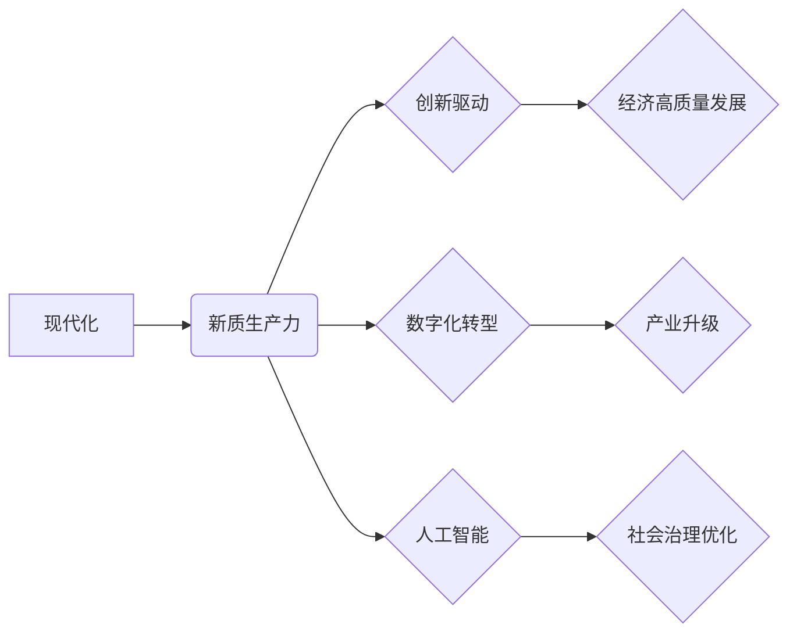

# 中国现代化与新质生产力

> 关键词：中国现代化，新质生产力，创新驱动，数字化转型，人工智能，可持续发展

## 1. 背景介绍

### 1.1 中国现代化的历史进程

自改革开放以来，中国经历了从计划经济向市场经济的转型，经济规模迅速扩张，社会结构发生深刻变化。经过四十多年的发展，中国已经成为世界第二大经济体，并在多个领域取得了显著的成就。然而，随着经济进入新常态，资源环境约束趋紧，传统增长模式难以为继，中国迫切需要实现现代化转型，以新质生产力推动经济社会可持续发展。

### 1.2 新质生产力的内涵

新质生产力是指在知识经济时代，以科技创新为核心驱动力，以信息化、智能化、绿色化、共享化为主要特征的生产力形态。新质生产力强调以人为本，注重资源节约和环境保护，追求高质量发展。

### 1.3 研究意义

深入探讨中国现代化与新质生产力的关系，对于推动中国经济高质量发展、实现中华民族伟大复兴具有重要意义。

## 2. 核心概念与联系

### 2.1 核心概念

- **现代化**：指一个国家或地区在经济、政治、文化、社会等各个方面达到世界先进水平的进程。
- **新质生产力**：以科技创新为核心驱动力，以信息化、智能化、绿色化、共享化为主要特征的生产力形态。
- **创新驱动**：指依靠创新来推动经济发展，提高经济增长质量和效益。
- **数字化转型**：指将数字技术应用于经济和社会各个领域，推动产业升级和经济增长。
- **人工智能**：指由人制造出来的系统能够模拟、延伸和扩展人的智能。

### 2.2 架构的 Mermaid 流程图



### 2.3 核心概念联系

现代化是目标，新质生产力是实现现代化的关键驱动力。创新驱动、数字化转型和人工智能是新质生产力的三大支柱，共同推动经济高质量发展、产业升级和社会治理优化。

## 3. 核心算法原理 & 具体操作步骤

### 3.1 算法原理概述

新质生产力的核心是科技创新，其原理可以概括为以下三个步骤：

1. **技术创新**：通过基础研究、应用研究和开发研究，不断创造新的技术成果。
2. **产业应用**：将技术创新应用于产业生产，推动产业升级和转型。
3. **模式创新**：在技术创新和产业应用的基础上，探索新的商业模式和管理模式。

### 3.2 算法步骤详解

#### 3.2.1 技术创新

技术创新是新质生产力的源泉，主要包括以下步骤：

1. **基础研究**：针对科学前沿问题进行探索性研究，为技术创新提供理论基础。
2. **应用研究**：将基础研究成果应用于解决实际问题，开发新的技术和产品。
3. **开发研究**：对应用研究成果进行工程化开发，形成可批量生产的科技成果。

#### 3.2.2 产业应用

产业应用是将技术创新转化为现实生产力的关键环节，主要包括以下步骤：

1. **技术转移**：将科技成果从研发机构转移到企业，实现产业化。
2. **产业升级**：通过技术创新推动产业结构优化升级，提高产业竞争力。
3. **产业链协同**：加强产业链上下游企业之间的合作，形成产业生态圈。

#### 3.2.3 模式创新

模式创新是在技术创新和产业应用的基础上，探索新的商业模式和管理模式，主要包括以下步骤：

1. **商业模式创新**：探索新的商业模式，提高企业盈利能力和市场竞争力。
2. **管理模式创新**：改进企业管理模式，提高企业运营效率和创新能力。
3. **政策创新**：制定和实施相关政策，为模式创新提供制度保障。

### 3.3 算法优缺点

#### 3.3.1 优点

1. **提升效率**：通过技术创新和产业应用，提高生产效率，降低生产成本。
2. **优化结构**：通过产业升级和模式创新，优化产业结构，提高经济增长质量和效益。
3. **增强竞争力**：通过技术创新和模式创新，增强企业竞争力，提升国家竞争力。

#### 3.3.2 缺点

1. **投资风险**：技术创新和产业应用需要大量资金投入，存在一定风险。
2. **技术瓶颈**：在某些领域，技术创新面临技术瓶颈，难以取得突破。
3. **人才短缺**：创新驱动发展需要大量高素质人才，人才短缺成为制约因素。

### 3.4 算法应用领域

新质生产力在以下领域具有广泛的应用：

1. **制造业**：通过智能制造、工业互联网等技术，提高制造业生产效率和产品质量。
2. **农业**：通过精准农业、智慧农业等技术，提高农业生产效率和可持续发展能力。
3. **服务业**：通过数字化转型、智能化服务等技术，提升服务业水平。
4. **社会治理**：通过大数据、人工智能等技术，提升社会治理能力。

## 4. 数学模型和公式 & 详细讲解 & 举例说明

### 4.1 数学模型构建

新质生产力的数学模型可以概括为以下公式：

$$
 Y = f(X) + \alpha(T)
 $$

其中，$Y$ 代表经济增长，$X$ 代表技术创新，$T$ 代表数字化转型和人工智能，$\alpha$ 代表政策支持和人才储备等因素。

### 4.2 公式推导过程

1. **技术创新对经济增长的贡献**：技术创新可以降低生产成本、提高产品质量、创造新的市场需求，从而推动经济增长。
2. **数字化转型和人工智能对经济增长的贡献**：数字化转型和人工智能可以提高生产效率、优化资源配置、创新商业模式，从而推动经济增长。
3. **政策支持和人才储备对经济增长的贡献**：政策支持和人才储备为技术创新和数字化转型提供保障，从而推动经济增长。

### 4.3 案例分析与讲解

以下以中国智能制造为例，分析新质生产力在制造业中的应用。

#### 4.3.1 案例背景

中国制造业规模庞大，但面临着产能过剩、技术落后、效率低下等问题。为推动制造业转型升级，中国政府提出了“中国制造2025”战略，旨在通过智能制造提升制造业水平。

#### 4.3.2 案例分析

1. **技术创新**：通过引进国外先进技术，研发自主知识产权的智能制造技术，如机器人、自动化生产线等。
2. **产业应用**：将智能制造技术应用于生产环节，提高生产效率、降低生产成本。
3. **模式创新**：探索新的商业模式，如工业互联网平台、共享制造等，推动制造业转型升级。

#### 4.3.3 案例结论

通过智能制造，中国制造业实现了生产效率的提升、产品质量的改进和产业结构的优化，有力推动了制造业转型升级。

## 5. 项目实践：代码实例和详细解释说明

### 5.1 开发环境搭建

由于新质生产力涉及多个领域，无法给出具体的代码实例。以下以Python为例，展示如何使用Python进行数据分析。

#### 5.1.1 安装Python环境

1. 下载Python安装包。
2. 解压安装包，运行安装程序。
3. 配置环境变量。

#### 5.1.2 安装数据分析库

```bash
pip install pandas numpy matplotlib
```

### 5.2 源代码详细实现

以下使用Python进行数据分析的简单示例：

```python
import pandas as pd

# 读取数据
data = pd.read_csv('data.csv')

# 数据预处理
data = data.dropna()
data['value'] = data['value'].astype(float)

# 绘制图表
import matplotlib.pyplot as plt

plt.figure(figsize=(10, 6))
plt.plot(data['date'], data['value'], marker='o')
plt.xlabel('Date')
plt.ylabel('Value')
plt.title('Data Analysis Example')
plt.show()
```

### 5.3 代码解读与分析

1. 导入pandas库：用于数据处理和分析。
2. 读取数据：从CSV文件读取数据。
3. 数据预处理：删除缺失值，将数值列转换为浮点数。
4. 绘制图表：使用matplotlib绘制折线图，展示数据变化趋势。

### 5.4 运行结果展示

运行上述代码，将生成一个折线图，展示数据随时间的变化趋势。

## 6. 实际应用场景

### 6.1 制造业

智能制造、工业互联网、工业4.0等。

### 6.2 农业

精准农业、智慧农业、农业物联网等。

### 6.3 服务业

数字化转型、智能化服务、共享经济等。

### 6.4 社会治理

大数据、人工智能、智慧城市等。

## 7. 工具和资源推荐

### 7.1 学习资源推荐

1. 《人工智能：一种现代的方法》
2. 《Python数据分析》
3. 《深度学习》

### 7.2 开发工具推荐

1. Python
2. Jupyter Notebook
3. PyCharm

### 7.3 相关论文推荐

1. 《深度学习与人工智能》
2. 《人工智能：一种现代的方法》
3. 《Python数据分析》

## 8. 总结：未来发展趋势与挑战

### 8.1 研究成果总结

新质生产力以科技创新为核心驱动力，通过创新驱动、数字化转型和人工智能，推动中国经济高质量发展。本文从理论、实践和案例等方面对新质生产力进行了探讨，为推动中国现代化提供了有益的参考。

### 8.2 未来发展趋势

1. 技术创新将持续推动新质生产力发展。
2. 数字化转型将进一步深化，推动产业升级和经济增长。
3. 人工智能将在更多领域得到应用，成为新质生产力的核心驱动力。

### 8.3 面临的挑战

1. 技术创新面临技术瓶颈，需要加强基础研究。
2. 数字化转型过程中，需要解决数据安全和隐私保护问题。
3. 人工智能发展面临伦理和法律挑战。

### 8.4 研究展望

未来，需要进一步深入研究新质生产力理论，推动技术创新、数字化转型和人工智能发展，以新质生产力推动中国现代化进程。

## 9. 附录：常见问题与解答

**Q1：什么是新质生产力？**

A：新质生产力是以科技创新为核心驱动力，以信息化、智能化、绿色化、共享化为主要特征的生产力形态。

**Q2：新质生产力如何推动中国现代化？**

A：新质生产力通过技术创新、数字化转型和人工智能，推动经济高质量发展、产业升级和社会治理优化，从而实现中国现代化。

**Q3：如何发展新质生产力？**

A：发展新质生产力需要加强基础研究、推动产业应用、探索模式创新，并加强政策支持和人才储备。

**Q4：新质生产力面临哪些挑战？**

A：新质生产力面临技术创新、数字化转型和人工智能等方面的挑战。

**Q5：如何应对新质生产力面临的挑战？**

A：应对新质生产力面临的挑战需要加强基础研究、完善政策法规、加强人才培养等。

作者：禅与计算机程序设计艺术 / Zen and the Art of Computer Programming