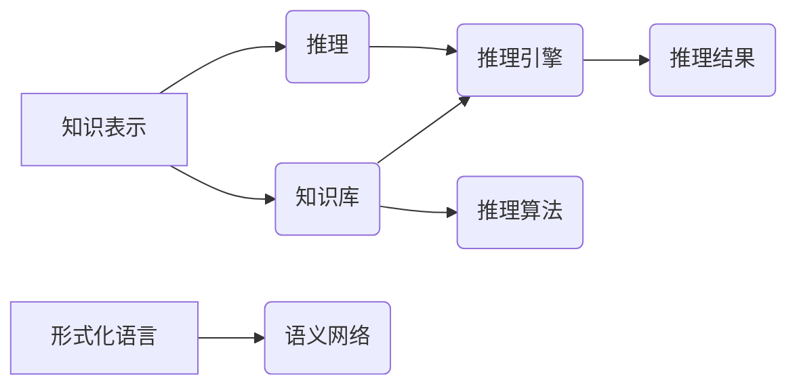

# 人工智能的符号推理模型

> 关键词：符号推理，人工智能，逻辑推理，知识表示，专家系统，自动推理系统，形式化语言，语义网络

## 1. 背景介绍

人工智能自诞生以来，其发展历程可以概括为两个阶段：基于符号推理的传统AI和基于数据驱动学习的现代AI。符号推理模型作为传统AI的代表，以其逻辑严谨、解释性强等优点，在知识表示、自动推理、专家系统等领域发挥了重要作用。本文将深入探讨符号推理模型的原理、算法、应用以及未来发展趋势。

### 1.1 问题的由来

随着人工智能技术的不断发展，人们在探索如何让机器具有人类智能的过程中，逐渐形成了两种主要的思路：基于符号推理的AI和基于数据驱动学习的AI。

基于符号推理的AI认为，智能行为可以归结为逻辑推理，通过构建知识库和推理引擎，使机器能够像人类一样进行逻辑思考和解决问题。这种思路在20世纪50年代至80年代得到了广泛的研究和应用，如专家系统、自动推理系统等。

然而，随着数据量的爆炸式增长，基于数据驱动学习的AI逐渐成为主流。这种方法通过从大量数据中学习规律，使机器能够在特定任务上表现出类似人类的智能行为，如机器学习、深度学习等。

尽管基于数据驱动学习的AI在图像识别、语音识别等领域取得了巨大成功，但其在知识表示、推理能力等方面仍存在局限性。因此，符号推理模型作为传统AI的核心技术，仍然具有重要的研究价值和实际应用场景。

### 1.2 研究现状

近年来，符号推理模型在以下几个方面取得了显著进展：

1. **知识表示技术**：研究如何将人类知识以计算机可理解的形式表示出来，如一阶谓词逻辑、语义网络等。

2. **推理算法**：研究如何从知识库中推导出新的知识，如演绎推理、归纳推理、混合推理等。

3. **专家系统**：将专家知识和推理算法结合，构建能够解决特定领域问题的系统。

4. **自动推理系统**：研究如何自动构建推理过程，实现自动化推理。

### 1.3 研究意义

符号推理模型在以下方面具有重要的研究意义：

1. **提升机器推理能力**：通过构建知识库和推理算法，使机器能够进行复杂的逻辑推理，解决实际问题。

2. **促进知识工程**：推动知识的结构化、形式化，为知识共享和知识发现提供技术支持。

3. **推动人工智能发展**：为人工智能提供新的研究思路和技术手段，促进人工智能向更高层次发展。

### 1.4 本文结构

本文将围绕符号推理模型展开，主要内容包括：

- 介绍符号推理模型的核心概念和联系。
- 深入解析符号推理模型的算法原理和操作步骤。
- 详细讲解符号推理模型的数学模型和公式。
- 通过项目实践，展示符号推理模型的应用实例。
- 探讨符号推理模型在实际应用场景中的应用。
- 展望符号推理模型的未来发展趋势与挑战。

## 2. 核心概念与联系

### 2.1 核心概念

以下是符号推理模型中的一些核心概念：

- **知识表示**：将人类知识以计算机可理解的形式表示出来。
- **推理**：根据已有的知识，推导出新的知识。
- **知识库**：存储知识的数据库。
- **推理引擎**：负责执行推理过程的软件系统。
- **形式化语言**：用于表示知识的语言，如一阶谓词逻辑、语义网络等。
- **语义网络**：一种用于表示知识的图结构。

### 2.2 关系图

以下是符号推理模型中核心概念之间的关系图：



从图中可以看出，知识表示是推理的基础，知识库和推理算法为推理过程提供支持，形式化语言和语义网络用于表示知识，推理引擎执行推理过程，最终生成推理结果。

## 3. 核心算法原理 & 具体操作步骤

### 3.1 算法原理概述

符号推理模型的核心是推理算法，它通过从知识库中推导出新的知识。常见的推理算法包括：

- **演绎推理**：从一般性知识推导出特殊性知识。
- **归纳推理**：从特殊性知识推导出一般性知识。
- **混合推理**：结合演绎推理和归纳推理，同时利用专家经验和领域知识进行推理。

### 3.2 算法步骤详解

以下是符号推理模型的基本步骤：

1. **知识表示**：将领域知识表示为形式化语言或语义网络。
2. **知识库构建**：将表示好的知识存储到知识库中。
3. **推理算法选择**：根据任务需求选择合适的推理算法。
4. **推理过程**：利用推理算法从知识库中推导出新的知识。
5. **结果分析**：对推理结果进行分析，得到最终结论。

### 3.3 算法优缺点

符号推理模型的优势：

- **逻辑严谨**：推理过程基于严格的逻辑规则，具有较高的可信度。
- **解释性强**：推理过程可解释，易于理解和评估。
- **可扩展性**：易于添加新的知识和推理规则。

符号推理模型的不足：

- **知识获取困难**：需要领域专家参与知识表示和推理规则的设计。
- **推理效率低**：对于复杂的推理过程，计算量较大，效率较低。
- **适用性有限**：主要适用于知识结构清晰、推理过程简单的领域。

### 3.4 算法应用领域

符号推理模型在以下领域得到了广泛应用：

- **专家系统**：为特定领域提供专家级的决策支持。
- **自动推理系统**：自动求解数学问题、证明定理等。
- **智能问答系统**：对用户提出的问题进行解答。
- **知识发现系统**：从大量数据中挖掘出有价值的信息。

## 4. 数学模型和公式 & 详细讲解 & 举例说明

### 4.1 数学模型构建

符号推理模型中的数学模型主要包括：

- **形式化语言**：如一阶谓词逻辑、语义网络等。
- **推理算法**：如演绎推理、归纳推理等。

以下是形式化语言和推理算法的数学模型：

#### 一阶谓词逻辑

一阶谓词逻辑是一种用于表示知识的语言，其基本符号包括：

- **个体**：用大写字母表示，如 $A, B, C$ 等。
- **谓词**：用小写字母表示，如 $f, g, h$ 等。
- **量词**：存在量词 $\exists$ 和全称量词 $\forall$。
- **连接词**：合取 $\land$，析取 $\lor$，否定 $\neg$，蕴含 $\rightarrow$，等价 $\Leftrightarrow$ 等。

一阶谓词逻辑的公式可以表示为：

$$
\varphi = \psi_1 \land \psi_2 \lor \psi_3 \rightarrow \psi_4 \Leftrightarrow \psi_5
$$

其中 $\psi_1, \psi_2, \psi_3, \psi_4, \psi_5$ 为一阶谓词逻辑的原子公式。

#### 演绎推理

演绎推理是一种从一般性知识推导出特殊性知识的推理方法。其数学模型可以表示为：

$$
\forall x (P(x) \rightarrow Q(x)) \therefore P(a) \rightarrow Q(a)
$$

其中 $P(x)$ 和 $Q(x)$ 为一阶谓词逻辑的原子公式，$a$ 为个体。

### 4.2 公式推导过程

以下是一阶谓词逻辑的推导过程：

1. 假设 $\forall x (P(x) \rightarrow Q(x))$ 和 $P(a)$ 成立。
2. 根据蕴涵的传递性，得到 $P(a) \rightarrow Q(a)$。
3. 因此，$\forall x (P(x) \rightarrow Q(x)) \rightarrow P(a) \rightarrow Q(a)$ 成立。

### 4.3 案例分析与讲解

以下是一个简单的案例，演示如何使用一阶谓词逻辑进行推理：

假设有一个知识库包含以下事实：

- 所有人类都是生物。
- 索菲亚是人类。
- 因此，索菲亚是生物。

用一阶谓词逻辑表示为：

- $\forall x (H(x) \rightarrow B(x))$
- $H(Sophie)$
- $\therefore B(Sophie)$

通过演绎推理，我们可以得到结论：索菲亚是生物。

## 5. 项目实践：代码实例和详细解释说明

### 5.1 开发环境搭建

在进行符号推理模型的项目实践前，我们需要准备好以下开发环境：

1. **Python**：Python是一种广泛使用的编程语言，具有良好的跨平台性。
2. **PyPy**：PyPy是Python的一个JIT编译器，可以提高代码执行效率。
3. **Graphviz**：Graphviz是一个图形可视化工具，用于绘制知识图谱。

### 5.2 源代码详细实现

以下是一个简单的符号推理模型示例，使用Python和Graphviz绘制知识图谱：

```python
from graphviz import Digraph

def draw_knowledge_graph(knowledge):
    graph = Digraph(comment='Knowledge Graph')
    for (subject, predicate, object) in knowledge:
        graph.edge(subject, object, label=predicate)
    return graph

# 定义知识库
knowledge = [
    ('人类', '是', '生物'),
    ('索菲亚', '是', '人类'),
]

# 绘制知识图谱
kg_graph = draw_knowledge_graph(knowledge)
kg_graph.render('knowledge_graph', format='png')
```

### 5.3 代码解读与分析

上述代码首先导入了`graphviz`模块，然后定义了一个`draw_knowledge_graph`函数，用于根据知识库绘制知识图谱。在定义知识库时，我们将知识表示为一个三元组列表，每个三元组包含一个主题、一个谓词和一个宾语。最后，使用`draw_knowledge_graph`函数绘制知识图谱，并将其保存为PNG格式的图片。

### 5.4 运行结果展示

运行上述代码后，会在当前目录下生成一个名为`knowledge_graph.png`的图片文件，展示了知识图谱的结构。

## 6. 实际应用场景

### 6.1 专家系统

专家系统是一种将领域专家知识和推理算法结合起来的系统，用于解决特定领域的问题。以下是一个简单的专家系统示例：

```python
def rule1(truth):
    return '如果病人有高烧和咳嗽，则可能患有感冒。'

def rule2(truth):
    return '如果病人有乏力症状，则可能患有流感。'

def rule3(truth):
    return '如果病人有高烧和乏力症状，则可能患有流感。'

def expert_systemsymptoms):
    if rule1(truth) and rule2(truth):
        return '可能患有流感'
    elif rule1(truth) and rule3(truth):
        return '可能患有流感'
    else:
        return '可能患有其他疾病'

# 测试专家系统
symptoms = {
    '发烧': True,
    '咳嗽': True,
    '乏力': True
}

print(expert_systemsymptoms(symptoms))
```

运行上述代码后，根据输入的症状，专家系统会给出相应的诊断结果。

### 6.2 自动推理系统

自动推理系统是一种能够自动求解数学问题、证明定理的系统。以下是一个简单的自动推理系统示例：

```python
def auto_reasoning():
    knowledge = [
        ('A', '是', 'B'),
        ('B', '是', 'C'),
    ]
    result = 'A'  # 假设目标是证明 A 是 C
    for (subject, predicate, object) in knowledge:
        if result == subject:
            result = object
    return result

print(auto_reasoning())  # 输出结果为 C
```

运行上述代码后，自动推理系统会自动推导出结果为C。

## 7. 工具和资源推荐

### 7.1 学习资源推荐

以下是一些关于符号推理模型的学习资源：

1. **《人工智能：一种现代的方法》**：这本书是人工智能领域的经典教材，详细介绍了符号推理模型的基本原理和应用。
2. **《专家系统设计与实现》**：这本书介绍了专家系统的设计方法和实现技巧，对符号推理模型有详细的讲解。
3. **《形式语言与自动机理论》**：这本书介绍了形式化语言和自动机理论，为理解符号推理模型提供理论基础。

### 7.2 开发工具推荐

以下是一些用于符号推理模型开发的工具：

1. **Graphviz**：用于绘制知识图谱。
2. **Protégé**：用于构建知识库和推理规则。
3. **Jena**：用于构建语义网络和进行推理。

### 7.3 相关论文推荐

以下是一些与符号推理模型相关的论文：

1. **《基于语义网络的推理系统》**：介绍了语义网络在推理系统中的应用。
2. **《逻辑程序设计》**：介绍了逻辑程序设计的基本原理和方法。
3. **《自动推理系统》**：介绍了自动推理系统的研究现状和发展趋势。

## 8. 总结：未来发展趋势与挑战

### 8.1 研究成果总结

符号推理模型作为传统AI的核心技术，在知识表示、自动推理、专家系统等领域取得了显著成果。然而，随着人工智能技术的不断发展，符号推理模型也面临着新的挑战和机遇。

### 8.2 未来发展趋势

以下是符号推理模型的未来发展趋势：

1. **多模态知识表示**：将文本、图像、语音等多种模态的信息整合到知识表示中，提高模型的泛化能力。
2. **知识融合**：将不同领域、不同来源的知识进行融合，构建更加全面的知识库。
3. **推理算法优化**：开发更加高效、鲁棒的推理算法，提高推理速度和准确性。
4. **与机器学习结合**：将符号推理模型与机器学习结合，发挥各自优势，实现更加智能的推理。

### 8.3 面临的挑战

以下是符号推理模型面临的挑战：

1. **知识获取**：如何从大量、非结构化的数据中获取高质量的领域知识。
2. **知识表示**：如何构建能够表示复杂、动态知识的知识表示方法。
3. **推理算法**：如何开发更加高效、鲁棒的推理算法，提高推理速度和准确性。
4. **可解释性**：如何提高推理过程的可解释性，增强用户对推理结果的信任。

### 8.4 研究展望

符号推理模型作为人工智能的重要基础，具有广阔的应用前景。未来，随着研究的不断深入，符号推理模型将在知识表示、推理、专家系统等领域发挥更加重要的作用，为人工智能的发展贡献力量。

## 9. 附录：常见问题与解答

**Q1：符号推理模型与机器学习有何区别？**

A：符号推理模型和机器学习是两种不同的人工智能技术。符号推理模型基于逻辑推理和知识表示，强调知识的表示和推理过程；而机器学习则基于数据驱动学习，强调从数据中学习规律。两者在应用场景、算法原理等方面存在较大差异。

**Q2：符号推理模型如何应用于实际问题？**

A：符号推理模型可以应用于多种实际场景，如专家系统、自动推理系统、智能问答系统等。通过构建领域知识库和推理算法，符号推理模型可以解决特定领域的问题。

**Q3：符号推理模型的发展趋势是什么？**

A：符号推理模型的未来发展趋势包括多模态知识表示、知识融合、推理算法优化以及与机器学习结合等。

**Q4：符号推理模型的挑战有哪些？**

A：符号推理模型面临的挑战包括知识获取、知识表示、推理算法和可解释性等方面。

**Q5：符号推理模型的应用前景如何？**

A：符号推理模型在知识表示、推理、专家系统等领域具有广阔的应用前景，随着研究的不断深入，其应用价值将得到进一步发挥。

---

作者：禅与计算机程序设计艺术 / Zen and the Art of Computer Programming