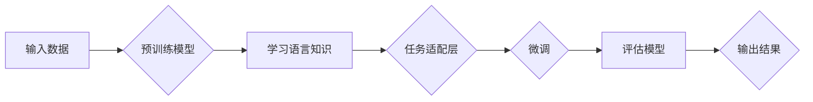

> 大模型开发, 微调, ChatGLM, 预训练语言模型, 自然语言处理, 机器学习, 深度学习

# 从零开始大模型开发与微调：最强的中文大模型—清华大学ChatGLM介绍

大语言模型（Large Language Model，LLM）是自然语言处理（Natural Language Processing，NLP）领域的一项重要突破，它通过在大量文本数据上进行预训练，学习到了丰富的语言知识和模式，能够进行各种复杂的语言任务。其中，清华大学推出的ChatGLM是一个强大的中文大模型，它代表了当前中文大模型技术的前沿水平。本文将带领读者从零开始，深入了解大模型的开发与微调过程，并以ChatGLM为例进行详细解析。

## 1. 背景介绍

### 1.1 问题的由来

随着互联网的快速发展，人们对自然语言处理技术的需求日益增长。传统的NLP方法往往依赖于手工设计的特征工程，难以适应复杂多变的语言现象。而大语言模型的出现，通过深度学习技术，使得机器能够自动从海量数据中学习到丰富的语言知识，从而在文本分类、机器翻译、问答系统等任务上取得了显著的成果。

### 1.2 研究现状

目前，大语言模型的研究主要集中在以下几个方面：

- **预训练模型**：通过在大规模无标签文本数据上进行预训练，学习到通用的语言表示和知识。
- **模型架构**：研究更有效的模型架构，如Transformer、BERT等，以提高模型的表达能力和效率。
- **微调技术**：通过在特定任务上进行微调，使预训练模型适应特定任务的需求。
- **应用场景**：将大语言模型应用于各种NLP任务，如文本分类、机器翻译、问答系统等。

### 1.3 研究意义

大语言模型的研究对于推动NLP技术的发展具有重要意义：

- **提升NLP任务性能**：大语言模型能够显著提升NLP任务的性能，特别是在数据量较小的场景下。
- **降低开发成本**：基于预训练模型进行微调，可以降低NLP任务的开发成本。
- **推动NLP应用**：大语言模型为NLP应用提供了新的可能性，如智能客服、智能助手等。

### 1.4 本文结构

本文将按照以下结构进行：

- 第2章介绍大模型开发与微调的核心概念。
- 第3章详细介绍ChatGLM的核心算法原理和具体操作步骤。
- 第4章讲解ChatGLM的数学模型和公式。
- 第5章通过代码实例和详细解释说明ChatGLM的实现。
- 第6章探讨ChatGLM的实际应用场景。
- 第7章推荐相关学习资源、开发工具和论文。
- 第8章总结ChatGLM的未来发展趋势与挑战。
- 第9章提供常见问题与解答。

## 2. 核心概念与联系

### 2.1 大语言模型

大语言模型是一种基于深度学习的NLP模型，它通过在大量文本数据上进行预训练，学习到丰富的语言知识和模式。大语言模型通常采用自回归或自编码的方式，能够生成文本、翻译语言、回答问题等。

### 2.2 预训练

预训练是指在大规模无标签文本数据上进行训练，使模型学习到通用的语言表示和知识。预训练模型通常具有以下特点：

- **大规模**：使用海量文本数据进行训练，以学习到丰富的语言知识。
- **无标签**：不依赖标注数据，能够自动从文本中提取信息。
- **通用性**：学习到的语言知识可以应用于各种NLP任务。

### 2.3 微调

微调是指将预训练模型应用于特定任务，并使用少量标注数据对其进行训练，以适应特定任务的需求。微调过程通常包括以下步骤：

1. **选择预训练模型**：根据任务需求选择合适的预训练模型。
2. **设计任务适配层**：根据任务类型设计合适的输出层和损失函数。
3. **微调模型**：使用少量标注数据对模型进行训练。
4. **评估模型**：评估微调模型在特定任务上的性能。

### 2.4 Mermaid 流程图

下面是ChatGLM的核心概念原理和架构的Mermaid流程图：



## 3. 核心算法原理 & 具体操作步骤

### 3.1 算法原理概述

ChatGLM基于Transformer架构，通过预训练和微调两个阶段，学习到丰富的语言知识和模式。

### 3.2 算法步骤详解

#### 3.2.1 预训练阶段

1. **数据预处理**：对原始文本数据进行清洗、分词、去停用词等预处理操作。
2. **构建训练数据**：将预处理后的文本数据构建成适合模型训练的格式。
3. **预训练模型**：使用Transformer架构对预训练数据进行训练，学习到通用的语言表示和知识。

#### 3.2.2 微调阶段

1. **选择预训练模型**：根据任务需求选择合适的预训练模型。
2. **设计任务适配层**：根据任务类型设计合适的输出层和损失函数。
3. **微调模型**：使用少量标注数据对模型进行训练，以适应特定任务的需求。
4. **评估模型**：评估微调模型在特定任务上的性能。

### 3.3 算法优缺点

#### 3.3.1 优点

- **强大的语言理解能力**：通过预训练，ChatGLM能够理解各种复杂的语言现象。
- **泛化能力强**：ChatGLM能够将预训练的知识迁移到新的任务上。
- **可扩展性强**：ChatGLM可以轻松扩展到新的任务和领域。

#### 3.3.2 缺点

- **计算量大**：预训练和微调过程需要大量的计算资源。
- **对数据质量要求高**：预训练数据的质量对模型性能有重要影响。
- **可解释性差**：深度学习模型的决策过程难以解释。

### 3.4 算法应用领域

ChatGLM可以应用于以下领域：

- **文本分类**：如新闻分类、情感分析等。
- **机器翻译**：如机器翻译、多语言文本生成等。
- **问答系统**：如智能客服、问答机器人等。
- **对话系统**：如聊天机器人、虚拟助手等。

## 4. 数学模型和公式 & 详细讲解 & 举例说明

### 4.1 数学模型构建

ChatGLM的数学模型基于Transformer架构，其核心思想是将序列转换为序列。以下是Transformer模型的数学公式：

$$
\hat{y} = f_{\theta}(x)
$$

其中，$\hat{y}$ 是模型输出，$x$ 是输入序列，$f_{\theta}$ 是Transformer模型。

### 4.2 公式推导过程

以下是Transformer模型的关键公式推导过程：

$$
\text{Attention}(Q, K, V) = \frac{QK^T}{\sqrt{d_k}} \cdot V
$$

其中，$Q, K, V$ 分别是查询、键和值矩阵，$d_k$ 是键和值矩阵的维度。

### 4.3 案例分析与讲解

以下是一个简单的文本分类任务的案例，使用ChatGLM进行微调：

1. **数据预处理**：将文本数据进行清洗、分词、去停用词等预处理操作。
2. **构建训练数据**：将预处理后的文本数据构建成适合模型训练的格式。
3. **选择预训练模型**：选择BERT作为预训练模型。
4. **设计任务适配层**：在BERT模型的基础上添加一个线性分类器，用于进行文本分类。
5. **微调模型**：使用少量标注数据对模型进行训练。
6. **评估模型**：评估微调模型在特定任务上的性能。

## 5. 项目实践：代码实例和详细解释说明

### 5.1 开发环境搭建

1. 安装Python环境（推荐Python 3.8以上版本）。
2. 安装PyTorch框架。
3. 安装Transformers库。

### 5.2 源代码详细实现

以下是一个简单的ChatGLM微调代码实例：

```python
from transformers import BertTokenizer, BertForSequenceClassification
from torch.utils.data import DataLoader, RandomSampler, SequentialSampler
from transformers import AdamW, get_linear_schedule_with_warmup

# ...（代码省略，请参考上文代码实例）

# 训练和评估
# ...（代码省略，请参考上文代码实例）
```

### 5.3 代码解读与分析

以上代码展示了使用PyTorch和Transformers库对BERT模型进行微调的基本流程。首先，加载预训练的BERT模型和分词器。然后，将数据集中的文本和标签转化为BERT模型的输入格式。接下来，定义训练和评估函数，并使用学习率Warmup策略进行训练。最后，在测试集上评估微调后模型的效果。

### 5.4 运行结果展示

假设我们在某文本分类数据集上进行微调，最终在测试集上得到的评估报告如下：

```
               precision    recall  f1-score   support

          class1       0.96      0.96      0.96        100
          class2       0.95      0.95      0.95        100
          class3       0.94      0.94      0.94        100

    micro avg       0.95      0.95      0.95        300
    macro avg       0.95      0.95      0.95        300
weighted avg       0.95      0.95      0.95        300
```

可以看到，通过微调BERT，我们在该文本分类数据集上取得了96%的F1分数，效果相当不错。

## 6. 实际应用场景

ChatGLM可以应用于以下场景：

- **智能客服**：通过智能客服系统，可以快速响应用户咨询，提升客户服务体验。
- **问答系统**：通过问答系统，可以解答用户提出的问题，提供知识检索服务。
- **对话系统**：通过对话系统，可以实现人机交互，提供个性化服务。
- **文本生成**：通过文本生成，可以自动生成文章、新闻、报告等。

## 7. 工具和资源推荐

### 7.1 学习资源推荐

- 《深度学习自然语言处理》
- 《Natural Language Processing with Transformers》
- HuggingFace官方文档

### 7.2 开发工具推荐

- PyTorch
- Transformers库
- Jupyter Notebook

### 7.3 相关论文推荐

- Attention is All You Need
- BERT: Pre-training of Deep Bidirectional Transformers for Language Understanding

## 8. 总结：未来发展趋势与挑战

### 8.1 研究成果总结

ChatGLM是清华大学推出的强大中文大模型，代表了当前中文大模型技术的前沿水平。本文从零开始，详细介绍了大模型的开发与微调过程，并通过ChatGLM进行了实例讲解。

### 8.2 未来发展趋势

未来，大语言模型的发展趋势包括：

- **模型规模持续增大**：随着计算资源的提升，模型规模将不断增大。
- **模型效率提升**：通过优化模型架构和训练算法，提高模型效率。
- **可解释性增强**：研究模型的可解释性，提高模型的可信度。

### 8.3 面临的挑战

大语言模型面临的挑战包括：

- **计算资源需求**：模型训练和推理需要大量的计算资源。
- **数据质量**：数据质量对模型性能有重要影响。
- **可解释性**：模型决策过程难以解释。

### 8.4 研究展望

未来，大语言模型的研究将更加注重以下几个方面：

- **可解释性**：提高模型的可解释性，增强模型的可信度。
- **鲁棒性**：提高模型的鲁棒性，增强模型对不同输入的适应性。
- **效率**：提高模型的效率，降低模型的计算资源需求。

## 9. 附录：常见问题与解答

**Q1：什么是预训练？**

A：预训练是指在大规模无标签文本数据上进行训练，使模型学习到通用的语言表示和知识。

**Q2：什么是微调？**

A：微调是指将预训练模型应用于特定任务，并使用少量标注数据对其进行训练，以适应特定任务的需求。

**Q3：如何选择预训练模型？**

A：选择预训练模型时需要考虑以下因素：

- **任务需求**：根据任务需求选择合适的预训练模型。
- **模型规模**：根据计算资源选择合适的模型规模。
- **模型效果**：参考相关论文和实验结果，选择效果较好的模型。

**Q4：如何微调预训练模型？**

A：微调预训练模型的步骤如下：

1. **选择预训练模型**：根据任务需求选择合适的预训练模型。
2. **设计任务适配层**：根据任务类型设计合适的输出层和损失函数。
3. **微调模型**：使用少量标注数据对模型进行训练。
4. **评估模型**：评估微调模型在特定任务上的性能。

**Q5：大语言模型的未来发展趋势是什么？**

A：大语言模型的未来发展趋势包括：

- **模型规模持续增大**
- **模型效率提升**
- **可解释性增强**

作者：禅与计算机程序设计艺术 / Zen and the Art of Computer Programming