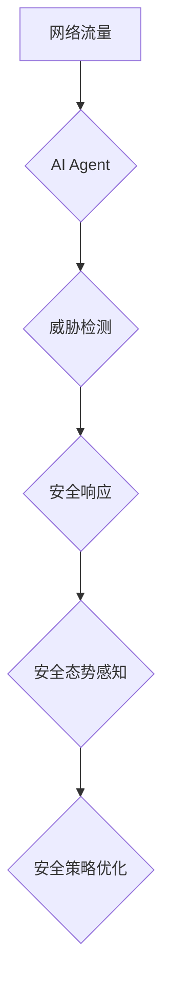

## AI人工智能 Agent：安全防御中智能体的应用

> 关键词：人工智能 Agent, 安全防御, 智能体, 机器学习, 深度学习, 威胁检测, 网络安全

### 1. 背景介绍

在当今数字时代，网络安全面临着前所未有的挑战。传统安全防御方法，例如防火墙和入侵检测系统，越来越难以应对日益复杂的网络攻击。攻击者不断利用新的技术和战术，绕过现有安全措施，造成巨大的经济损失和社会影响。

人工智能（AI）技术作为一种新兴技术，为网络安全领域带来了新的希望。AI能够学习和分析海量数据，识别攻击模式，并做出快速、准确的决策。AI驱动的安全防御系统能够提供更智能、更有效的防护能力。

### 2. 核心概念与联系

**2.1  人工智能 Agent**

人工智能 Agent 是一个能够感知环境、做出决策并执行行动的智能体。它可以独立学习和适应环境变化，并根据目标完成任务。在安全防御领域，AI Agent 可以被设计成识别和响应网络威胁。

**2.2  智能体在安全防御中的应用**

智能体在安全防御中扮演着越来越重要的角色。它们可以用于：

* **威胁检测:** 分析网络流量和系统日志，识别恶意行为和潜在威胁。
* **入侵防御:** 自动响应网络攻击，阻止攻击者入侵系统。
* **安全态势感知:** 监控网络安全状况，提供实时威胁情报。
* **安全策略优化:** 根据攻击趋势和安全事件，优化安全策略和配置。

**2.3  架构图**



### 3. 核心算法原理 & 具体操作步骤

**3.1  算法原理概述**

AI Agent 在安全防御中的核心算法通常基于机器学习和深度学习技术。

* **机器学习:** 通过训练模型，让模型从数据中学习攻击模式和正常行为。
* **深度学习:** 使用多层神经网络，能够学习更复杂的特征和模式。

**3.2  算法步骤详解**

1. **数据收集:** 收集网络流量、系统日志、威胁情报等数据。
2. **数据预处理:** 清洗、转换和格式化数据，使其适合模型训练。
3. **模型训练:** 使用机器学习或深度学习算法，训练模型识别攻击模式。
4. **模型评估:** 使用测试数据评估模型的性能，例如准确率、召回率和F1-score。
5. **模型部署:** 将训练好的模型部署到生产环境中，用于实时威胁检测和响应。

**3.3  算法优缺点**

**优点:**

* **自动化:** AI Agent 可以自动识别和响应威胁，减轻安全人员的工作负担。
* **精准度:** AI 模型能够学习复杂的攻击模式，提高威胁检测的精准度。
* **适应性:** AI Agent 可以根据环境变化和攻击趋势不断学习和适应。

**缺点:**

* **数据依赖:** AI 模型需要大量的数据进行训练，否则性能会下降。
* **解释性:** AI 模型的决策过程往往难以解释，这可能导致安全人员难以理解和信任模型的判断。
* **可攻击性:** AI 模型本身也可能受到攻击，例如通过数据 poisoning 或 adversarial examples。

**3.4  算法应用领域**

AI Agent 在安全防御领域有着广泛的应用，例如：

* **网络入侵检测:** 检测网络流量中的恶意行为，例如扫描、拒绝服务攻击和数据窃取。
* **恶意软件检测:** 识别恶意软件文件和行为，防止恶意软件感染系统。
* **邮件安全:** 检测垃圾邮件、钓鱼邮件和恶意附件。
* **端点安全:** 检测和响应终端设备上的恶意活动。

### 4. 数学模型和公式 & 详细讲解 & 举例说明

**4.1  数学模型构建**

在安全防御领域，AI Agent 通常使用以下数学模型：

* **分类模型:** 用于识别攻击和正常行为，例如支持向量机（SVM）、决策树和随机森林。
* **回归模型:** 用于预测攻击的严重程度或影响范围，例如线性回归和逻辑回归。
* **聚类模型:** 用于将网络流量或系统事件进行分组，识别异常行为，例如k-means聚类和DBSCAN。

**4.2  公式推导过程**

例如，支持向量机（SVM）是一种常用的分类模型。其目标是找到一个超平面，将数据点分成不同的类别。

SVM 的核心公式是：

$$
\min_{w,b} \frac{1}{2} ||w||^2 + C \sum_{i=1}^{n} \xi_i
$$

其中：

* $w$ 是超平面的权重向量。
* $b$ 是超平面的截距。
* $C$ 是惩罚参数，控制模型的复杂度。
* $\xi_i$ 是松弛变量，允许模型在训练过程中出现一些错误分类。

**4.3  案例分析与讲解**

假设我们想要使用 SVM 模型识别网络流量中的恶意行为。我们可以收集网络流量数据，并将其分为恶意流量和正常流量两类。然后，我们可以使用 SVM 模型训练，学习恶意流量和正常流量之间的特征差异。

训练完成后，我们可以使用 SVM 模型对新的网络流量进行分类，判断其是否为恶意流量。

### 5. 项目实践：代码实例和详细解释说明

**5.1  开发环境搭建**

* Python 3.x
* TensorFlow 或 PyTorch
* Jupyter Notebook

**5.2  源代码详细实现**

```python
import tensorflow as tf

# 定义模型结构
model = tf.keras.models.Sequential([
    tf.keras.layers.Dense(128, activation='relu', input_shape=(1024,)),
    tf.keras.layers.Dense(64, activation='relu'),
    tf.keras.layers.Dense(1, activation='sigmoid')
])

# 编译模型
model.compile(optimizer='adam',
              loss='binary_crossentropy',
              metrics=['accuracy'])

# 训练模型
model.fit(x_train, y_train, epochs=10)

# 评估模型
loss, accuracy = model.evaluate(x_test, y_test)
print('Loss:', loss)
print('Accuracy:', accuracy)
```

**5.3  代码解读与分析**

* 我们使用 TensorFlow 库构建了一个简单的深度学习模型。
* 模型包含三层神经网络，第一层输入层有 1024 个神经元，最后一层输出层只有一个神经元，用于预测攻击或正常行为。
* 我们使用 Adam 优化器、二元交叉熵损失函数和准确率作为评估指标。
* 我们使用训练数据训练模型 10 个 epochs。
* 最后，我们使用测试数据评估模型的性能。

**5.4  运行结果展示**

运行结果会显示模型的损失值和准确率。

### 6. 实际应用场景

AI Agent 在安全防御领域有着广泛的应用场景，例如：

* **金融机构:** 检测欺诈交易、识别恶意账户。
* **医疗机构:** 保护患者数据安全、识别医疗设备攻击。
* **政府机构:** 防御网络攻击、保护关键基础设施。
* **企业:** 保护企业数据安全、识别内部威胁。

**6.4  未来应用展望**

未来，AI Agent 在安全防御领域将发挥更加重要的作用。例如：

* **自动化安全运营:** AI Agent 可以自动化许多安全任务，例如威胁检测、事件响应和安全策略优化。
* **个性化安全防护:** AI Agent 可以根据用户的行为和环境，提供个性化的安全防护。
* **跨域安全协作:** AI Agent 可以与其他安全系统协作，实现跨域的安全防护。

### 7. 工具和资源推荐

**7.1  学习资源推荐**

* **书籍:**
    * "Deep Learning" by Ian Goodfellow, Yoshua Bengio, and Aaron Courville
    * "Hands-On Machine Learning with Scikit-Learn, Keras & TensorFlow" by Aurélien Géron
* **在线课程:**
    * Coursera: Machine Learning by Andrew Ng
    * Udacity: Deep Learning Nanodegree
* **博客和网站:**
    * Towards Data Science
    * Machine Learning Mastery

**7.2  开发工具推荐**

* **Python:** 广泛使用的编程语言，用于机器学习和深度学习开发。
* **TensorFlow:** 开源深度学习框架，提供丰富的工具和资源。
* **PyTorch:** 开源深度学习框架，以其灵活性和易用性而闻名。
* **Jupyter Notebook:** 用于交互式编程和数据可视化的工具。

**7.3  相关论文推荐**

* "Deep Learning for Intrusion Detection" by A. Al-Smadi et al.
* "A Survey of Machine Learning Techniques for Network Intrusion Detection" by S. Tavallaee et al.
* "Towards a Unified Framework for Intrusion Detection Systems" by S. Kumar et al.

### 8. 总结：未来发展趋势与挑战

**8.1  研究成果总结**

AI Agent 在安全防御领域取得了显著的成果，能够有效识别和响应网络威胁。

**8.2  未来发展趋势**

未来，AI Agent 在安全防御领域将朝着以下方向发展：

* **更智能的威胁检测:** 使用更先进的机器学习和深度学习算法，识别更复杂的攻击模式。
* **更自动化和高效的安全运营:** 自动化更多安全任务，提高安全运营效率。
* **更个性化的安全防护:** 根据用户的行为和环境，提供个性化的安全防护。
* **更强大的跨域安全协作:** 与其他安全系统协作，实现更全面的安全防护。

**8.3  面临的挑战**

AI Agent 在安全防御领域也面临一些挑战：

* **数据安全和隐私:** AI 模型需要大量的数据进行训练，如何保护数据安全和隐私是一个重要问题。
* **模型可解释性:** AI 模型的决策过程往往难以解释，这可能导致安全人员难以理解和信任模型的判断。
* **模型可攻击性:** AI 模型本身也可能受到攻击，例如通过数据 poisoning 或 adversarial examples。

**8.4  研究展望**

未来，需要进一步研究以下问题：

* 如何开发更安全、更可靠的 AI Agent。
* 如何提高 AI 模型的可解释性和可信任性。
* 如何应对 AI 模型的可攻击性问题。


### 9. 附录：常见问题与解答

**9.1  AI Agent 是否可以完全替代人类安全人员？**

AI Agent 可以自动化许多安全任务，但不能完全替代人类安全人员。人类安全人员仍然需要负责制定安全策略、分析安全事件和做出最终决策。

**9.2  如何评估 AI Agent 的性能？**

AI Agent 的性能可以评估指标，例如准确率、召回率和F1-score。

**9.3  如何保护 AI Agent 免受攻击？**

可以采用以下措施保护 AI Agent 免受攻击：

* 使用安全的训练数据。
* 对模型进行防御性训练。
* 使用安全机制保护模型部署环境。


作者：禅与计算机程序设计艺术 / Zen and the Art of Computer Programming 
