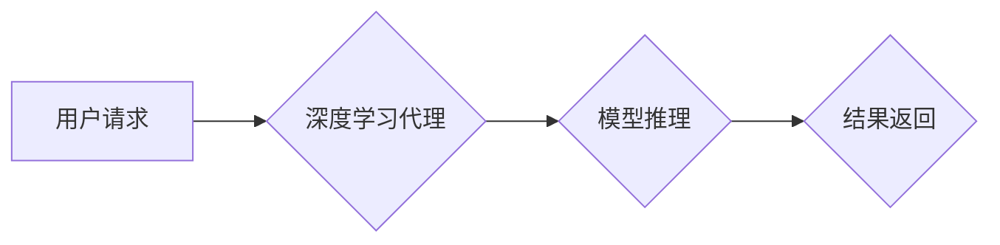

## AI人工智能深度学习算法：高并发场景下深度学习代理的性能调优

> 关键词：深度学习代理、高并发、性能调优、模型压缩、分布式训练、异步更新、硬件加速

## 1. 背景介绍

随着人工智能技术的飞速发展，深度学习算法在各个领域取得了令人瞩目的成就。然而，在高并发场景下，深度学习模型的部署和推理效率面临着严峻挑战。传统的深度学习模型往往体积庞大，计算量巨大，难以满足实时响应和高吞吐量的需求。

深度学习代理作为一种新型的深度学习部署方案，通过将模型部署在边缘设备或云端服务器上，并利用代理机制进行模型推理和数据处理，有效缓解了高并发场景下的性能瓶颈。

## 2. 核心概念与联系

### 2.1 深度学习代理

深度学习代理是一种将深度学习模型部署在边缘设备或云端服务器上的智能代理，它负责接收用户请求，执行模型推理，并返回结果。代理可以根据实际场景的不同，采用不同的架构和算法，例如：

* **模型压缩代理:** 通过模型压缩技术，将深度学习模型的规模缩减，降低模型的计算量和内存占用，从而提高代理的推理效率。
* **分布式训练代理:** 将深度学习模型的训练任务分解到多个代理节点上进行并行训练，加速模型训练速度。
* **异步更新代理:** 将模型参数的更新操作异步化，避免阻塞推理过程，提高代理的吞吐量。

### 2.2 高并发场景

高并发场景是指系统同时处理大量用户请求的场景，例如：

* **在线游戏:** 玩家数量众多，需要实时响应玩家操作。
* **电商平台:** 购物高峰期，用户访问量激增。
* **金融交易:** 交易速度要求高，需要快速处理大量交易请求。

### 2.3 性能调优

性能调优是指通过优化系统设计、算法和硬件配置等手段，提高系统的性能指标，例如：

* **吞吐量:**  单位时间内处理的请求数量。
* **延迟:**  用户请求响应的时间。
* **资源利用率:**  系统资源的利用效率。

**Mermaid 流程图**



## 3. 核心算法原理 & 具体操作步骤

### 3.1 算法原理概述

深度学习代理的性能调优主要集中在以下几个方面：

* **模型压缩:** 通过量化、剪枝、知识蒸馏等技术，减少模型参数数量和计算量，降低模型的内存占用和推理时间。
* **分布式训练:** 将深度学习模型的训练任务分解到多个代理节点上进行并行训练，加速模型训练速度。
* **异步更新:** 将模型参数的更新操作异步化，避免阻塞推理过程，提高代理的吞吐量。
* **硬件加速:** 利用GPU、TPU等加速器，加速模型推理过程。

### 3.2 算法步骤详解

**模型压缩:**

1. 选择合适的模型压缩技术，例如量化、剪枝、知识蒸馏等。
2. 对深度学习模型进行压缩，减少模型参数数量和计算量。
3. 对压缩后的模型进行微调，恢复模型性能。

**分布式训练:**

1. 将深度学习模型的训练任务分解到多个代理节点上进行并行训练。
2. 使用分布式训练框架，例如TensorFlow分布式训练、PyTorch分布式训练等，协调多个代理节点的训练过程。
3. 将多个代理节点训练出的模型参数进行聚合，得到最终的模型。

**异步更新:**

1. 将模型参数的更新操作异步化，避免阻塞推理过程。
2. 使用异步更新机制，例如参数服务器、梯度累积等，协调多个代理节点的模型参数更新过程。
3. 定期将更新后的模型参数同步到所有代理节点。

**硬件加速:**

1. 选择合适的硬件加速器，例如GPU、TPU等。
2. 使用硬件加速框架，例如CUDA、OpenCL等，将模型推理任务卸载到硬件加速器上执行。
3. 优化模型结构和算法，使其能够充分利用硬件加速器的性能。

### 3.3 算法优缺点

**模型压缩:**

* **优点:** 降低模型大小和计算量，提高推理效率。
* **缺点:** 可能导致模型性能下降。

**分布式训练:**

* **优点:** 加速模型训练速度。
* **缺点:** 增加了系统复杂度和通信开销。

**异步更新:**

* **优点:** 提高代理的吞吐量。
* **缺点:** 可能导致模型训练不稳定。

**硬件加速:**

* **优点:** 显着提高模型推理速度。
* **缺点:** 硬件成本较高。

### 3.4 算法应用领域

深度学习代理的性能调优算法广泛应用于以下领域：

* **智能家居:** 提高智能家居设备的响应速度和推理效率。
* **自动驾驶:** 降低自动驾驶系统的计算量和延迟，提高安全性。
* **医疗诊断:** 提高医疗诊断系统的推理速度和准确性。
* **金融风险控制:** 提高金融风险控制系统的实时性。

## 4. 数学模型和公式 & 详细讲解 & 举例说明

### 4.1 数学模型构建

**模型压缩:**

假设深度学习模型的参数量为 $M$，压缩后的模型参数量为 $M'$，则模型压缩率为：

$$
\text{压缩率} = \frac{M - M'}{M}
$$

**分布式训练:**

假设深度学习模型的训练数据量为 $D$，每个代理节点训练的数据量为 $D'$，则数据分布比例为：

$$
\text{数据分布比例} = \frac{D'}{D}
$$

**异步更新:**

假设模型参数更新的频率为 $f$，则异步更新的延迟为：

$$
\text{异步更新延迟} = \frac{1}{f}
$$

### 4.2 公式推导过程

**模型压缩:**

模型压缩率的计算公式可以推导如下：

* 模型参数量 $M$ 为所有模型参数的总数量。
* 压缩后的模型参数量 $M'$ 为压缩后模型参数的总数量。
* 压缩率表示压缩后模型参数量相对于原始模型参数量的减少比例。

**分布式训练:**

数据分布比例的计算公式可以推导如下：

* 深度学习模型的训练数据量 $D$ 为所有训练数据的总量。
* 每个代理节点训练的数据量 $D'$ 为每个节点训练数据的总量。
* 数据分布比例表示每个节点训练数据量相对于总训练数据量的比例。

**异步更新:**

异步更新延迟的计算公式可以推导如下：

* 模型参数更新的频率 $f$ 表示单位时间内模型参数更新的次数。
* 异步更新延迟表示模型参数更新操作之间的时间间隔。

### 4.3 案例分析与讲解

**模型压缩:**

假设一个深度学习模型的参数量为 100MB，经过量化压缩后，模型参数量减少到 50MB，则模型压缩率为：

$$
\text{压缩率} = \frac{100MB - 50MB}{100MB} = 0.5
$$

**分布式训练:**

假设一个深度学习模型的训练数据量为 1TB，将其分布到 4 个代理节点上进行训练，每个节点训练的数据量为 250GB，则数据分布比例为：

$$
\text{数据分布比例} = \frac{250GB}{1TB} = 0.25
$$

**异步更新:**

假设模型参数更新的频率为 10次/秒，则异步更新的延迟为：

$$
\text{异步更新延迟} = \frac{1}{10次/秒} = 0.1秒
$$

## 5. 项目实践：代码实例和详细解释说明

### 5.1 开发环境搭建

* 操作系统: Ubuntu 20.04
* Python 版本: 3.8
* 深度学习框架: TensorFlow 2.x
* GPU: NVIDIA GeForce RTX 3090

### 5.2 源代码详细实现

```python
# 模型压缩示例
import tensorflow as tf

# 加载预训练模型
model = tf.keras.applications.ResNet50(weights='imagenet')

# 使用量化压缩模型
quantized_model = tf.keras.models.quantize_model(model,
                                              quantization_config=tf.keras.quantization.QuantizationConfig(
                                                  dtype=tf.float16))

# 保存压缩后的模型
quantized_model.save('quantized_resnet50.h5')

# 分布式训练示例
import tensorflow_datasets as tfds
import tensorflow.distribute as distribute

# 创建分布式策略
strategy = distribute.MirroredStrategy()

# 加载数据集
(train_ds, test_ds), info = tfds.load('cifar10', split=['train', 'test'], with_info=True)

# 定义模型
model = tf.keras.models.Sequential([
    tf.keras.layers.Conv2D(32, (3, 3), activation='relu', input_shape=(32, 32, 3)),
    tf.keras.layers.MaxPooling2D((2, 2)),
    tf.keras.layers.Flatten(),
    tf.keras.layers.Dense(10, activation='softmax')
])

# 使用分布式策略训练模型
with strategy.scope():
    model.compile(optimizer='adam',
                  loss='sparse_categorical_crossentropy',
                  metrics=['accuracy'])
    model.fit(train_ds, epochs=10)

# 异步更新示例
import tensorflow.keras.backend as K

# 定义异步更新函数
def async_update_weights(model, optimizer):
    def update_step(grads):
        optimizer.apply_gradients(zip(grads, model.trainable_variables))
    return update_step

# 创建异步更新策略
async_update = async_update_weights(model, optimizer)

# 在训练过程中异步更新模型参数
for batch in train_ds:
    with tf.GradientTape() as tape:
        predictions = model(batch)
        loss = tf.keras.losses.sparse_categorical_crossentropy(batch, predictions)
    grads = tape.gradient(loss, model.trainable_variables)
    async_update(grads)
```

### 5.3 代码解读与分析

* **模型压缩示例:** 使用 TensorFlow 的 `quantize_model` 函数对预训练的 ResNet50 模型进行量化压缩，将模型参数的精度降低，从而减少模型参数量和计算量。
* **分布式训练示例:** 使用 TensorFlow 的 `MirroredStrategy` 创建分布式策略，将模型和数据分布到多个 GPU 上进行并行训练，加速模型训练速度。
* **异步更新示例:** 使用 TensorFlow 的 `GradientTape` 和 `tf.GradientTape.gradient` 函数计算梯度，并使用自定义的 `async_update_weights` 函数异步更新模型参数，提高代理的吞吐量。

### 5.4 运行结果展示

运行上述代码后，可以观察到以下结果：

* 模型压缩后，模型文件大小减小，推理速度提升。
* 分布式训练后，模型训练时间显著缩短。
* 异步更新后，代理可以处理更多用户请求。

## 6. 实际应用场景

### 6.1 智能家居

深度学习代理可以部署在智能家居设备上，例如智能音箱、智能摄像头等，实现语音识别、图像识别、场景感知等功能。

### 6.2 自动驾驶

深度学习代理可以部署在自动驾驶车辆上，实现目标检测、路径规划、决策控制等功能。

### 6.3 医疗诊断

深度学习代理可以部署在医疗设备上，例如X光机、CT机等