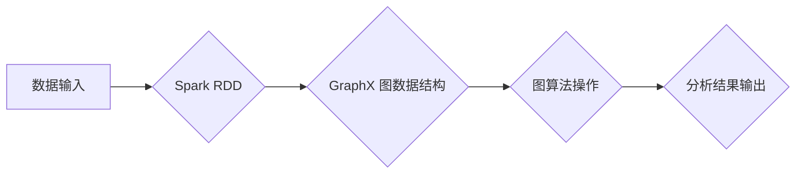

## GraphX原理与代码实例讲解

> 关键词：GraphX, 图计算, Spark, 算法, 数据结构, 代码实例

## 1. 背景介绍

随着大数据时代的到来，海量数据分析和处理成为越来越重要的课题。传统的关系数据库难以有效处理复杂网络结构的数据，而图数据库则更适合存储和查询这种数据。GraphX 是 Apache Spark 上构建的一个图计算框架，它提供了高效的图算法和数据结构，能够处理海量图数据，并进行各种图分析任务。

GraphX 的出现，为大规模图数据分析提供了强大的工具，它结合了 Spark 的高性能和易用性，使得图计算更加便捷高效。

## 2. 核心概念与联系

GraphX 的核心概念是图，图由节点和边组成。节点代表图中的实体，边代表实体之间的关系。GraphX 提供了两种主要的图数据结构：

* **Vertex:** 代表图中的节点，每个节点拥有一个唯一标识符和一些属性。
* **Edge:** 代表图中的边，每个边连接两个节点，并可能拥有属性。

GraphX 的工作原理是将图数据存储在 Spark 的 Resilient Distributed Datasets (RDD) 中，并通过一系列图算法操作进行分析。

**Mermaid 流程图**



## 3. 核心算法原理 & 具体操作步骤

### 3.1  算法原理概述

GraphX 提供了多种图算法，例如：

* **PageRank:** 计算节点的重要性，用于搜索引擎排名等。
* **Shortest Path:** 寻找节点之间的最短路径，用于导航、物流等。
* **Connected Components:** 找出图中相互连接的节点组，用于社交网络分析等。
* **Centrality:** 计算节点的中心性，用于识别关键节点，例如枢纽节点。

这些算法都基于图的结构和节点之间的关系进行计算，并利用 Spark 的并行处理能力进行高效执行。

### 3.2  算法步骤详解

以 PageRank 算法为例，其基本步骤如下：

1. **初始化:** 为每个节点赋予初始 PageRank 值，通常为 1/N，其中 N 是节点总数。
2. **迭代计算:** 迭代计算每个节点的 PageRank 值，公式如下:

$$PR(v) = (1-d) + d \sum_{u \in \text{in}(v)} \frac{PR(u)}{out(u)}$$

其中:

* $PR(v)$ 是节点 v 的 PageRank 值。
* $d$ 是阻尼因子，通常为 0.85。
* $in(v)$ 是指向节点 v 的边的集合。
* $out(u)$ 是节点 u 的出度，即连接到其他节点的边的数量。

3. **收敛判断:** 迭代计算直到 PageRank 值收敛，即相邻两次迭代的 PageRank 值变化小于某个阈值。

### 3.3  算法优缺点

**优点:**

* **高效:** 利用 Spark 的并行处理能力，能够高效处理海量图数据。
* **易用:** 提供了简洁的 API，方便用户使用。
* **灵活:** 支持多种图算法和数据结构。

**缺点:**

* **内存限制:** 对于非常大的图数据，可能需要进行数据分片，增加复杂度。
* **算法选择:** 需要根据具体应用场景选择合适的图算法。

### 3.4  算法应用领域

GraphX 的图算法广泛应用于以下领域:

* **社交网络分析:** 识别关键用户、分析用户关系、推荐好友等。
* **推荐系统:** 基于用户行为和商品关系进行商品推荐。
* **知识图谱:** 建立知识图谱，进行知识推理和问答。
* **生物信息学:** 分析蛋白质相互作用网络、基因调控网络等。
* **交通运输:** 分析交通流量、规划路线等。

## 4. 数学模型和公式 & 详细讲解 & 举例说明

### 4.1  数学模型构建

GraphX 的核心数学模型是图，图可以用邻接矩阵或邻接列表表示。

* **邻接矩阵:** 用一个矩阵表示图的结构，矩阵的行和列代表节点，矩阵元素表示节点之间的关系。如果两个节点之间存在边，则对应元素为 1，否则为 0。

* **邻接列表:** 用一个列表表示每个节点的邻居节点。每个节点对应一个列表，列表中包含该节点连接的邻居节点。

### 4.2  公式推导过程

以 PageRank 算法为例，其公式推导过程如下:

1. 假设图中节点的总数为 N，每个节点的 PageRank 值为 PR(v)。
2. 每个节点的 PageRank 值等于 (1-d) + d ∑_{u \in \text{in}(v)} \frac{PR(u)}{out(u)}。
3. 其中，d 是阻尼因子，通常为 0.85，表示用户在浏览网页时可能随机跳转到其他网页的概率。
4. ∑_{u \in \text{in}(v)} \frac{PR(u)}{out(u)} 表示从指向节点 v 的所有节点 u 中，每个节点 u 的 PageRank 值除以节点 u 的出度。

### 4.3  案例分析与讲解

假设有一个简单的图，包含三个节点 A、B、C，其中 A 和 B 之间有一条边，B 和 C 之间有一条边。

* 设初始 PageRank 值为 1/3。
* 阻尼因子 d = 0.85。

根据 PageRank 算法公式，可以计算出每个节点的 PageRank 值。

## 5. 项目实践：代码实例和详细解释说明

### 5.1  开发环境搭建

* 安装 Java JDK
* 安装 Apache Spark
* 安装 GraphX 库

### 5.2  源代码详细实现

```scala
import org.apache.spark.graphx._
import org.apache.spark.SparkContext

object PageRankExample {
  def main(args: Array[String]): Unit = {
    val sc = new SparkContext("local", "PageRankExample")

    // 定义图数据
    val vertices: VertexRDD[Double] = sc.parallelize(List(
      (1, 0.0),
      (2, 0.0),
      (3, 0.0)
    ))

    val edges: EdgeTripletRDD = sc.parallelize(List(
      Edge(1, 2),
      Edge(2, 3)
    ))

    // 计算 PageRank 值
    val pagerank = Graph(vertices, edges).pageRank(0.85).vertices

    // 打印结果
    pagerank.collect().foreach(println)

    sc.stop()
  }
}
```

### 5.3  代码解读与分析

* `VertexRDD[Double]` 表示图中的节点，每个节点拥有一个唯一标识符和一个 PageRank 值。
* `EdgeTripletRDD` 表示图中的边，每个边连接两个节点。
* `Graph(vertices, edges)` 创建一个 GraphX 图对象。
* `pageRank(0.85)` 计算 PageRank 值，阻尼因子为 0.85。
* `vertices` 返回计算后的 PageRank 值。

### 5.4  运行结果展示

运行代码后，会输出每个节点的 PageRank 值。

## 6. 实际应用场景

GraphX 在实际应用场景中具有广泛的应用前景，例如:

* **社交网络分析:** 分析用户关系、推荐好友、识别关键用户等。
* **推荐系统:** 基于用户行为和商品关系进行商品推荐。
* **知识图谱:** 建立知识图谱，进行知识推理和问答。
* **生物信息学:** 分析蛋白质相互作用网络、基因调控网络等。
* **交通运输:** 分析交通流量、规划路线等。

### 6.4  未来应用展望

随着大数据和人工智能技术的不断发展，GraphX 的应用场景将会更加广泛。例如:

* **图神经网络:** 将 GraphX 与图神经网络结合，进行更深入的图数据分析。
* **联邦学习:** 将 GraphX 应用于联邦学习，实现隐私保护下的图数据分析。
* **实时图计算:** 将 GraphX 与流处理框架结合，实现实时图数据分析。

## 7. 工具和资源推荐

### 7.1  学习资源推荐

* **Apache GraphX 官方文档:** https://spark.apache.org/docs/latest/graphx-programming-guide.html
* **GraphX 入门教程:** https://www.tutorialspoint.com/spark/spark_graphx.htm
* **GraphX 实战案例:** https://github.com/apache/spark/tree/master/examples/src/main/scala/org/apache/spark/graphx

### 7.2  开发工具推荐

* **Apache Spark:** https://spark.apache.org/
* **Scala:** https://www.scala-lang.org/

### 7.3  相关论文推荐

* **GraphX: A Graph Processing Framework on Apache Spark:** https://dl.acm.org/doi/10.1145/2807483.2807504

## 8. 总结：未来发展趋势与挑战

### 8.1  研究成果总结

GraphX 作为 Apache Spark 上的图计算框架，为大规模图数据分析提供了高效的工具和方法。它结合了 Spark 的高性能和易用性，使得图计算更加便捷高效。

### 8.2  未来发展趋势

GraphX 的未来发展趋势包括:

* **更强大的图算法:** 开发更先进的图算法，例如图神经网络、图匹配等。
* **更灵活的数据结构:** 支持更多类型的图数据结构，例如动态图、混合图等。
* **更完善的生态系统:** 构建更完善的 GraphX 生态系统，包括更多工具、库和应用。

### 8.3  面临的挑战

GraphX 还面临一些挑战，例如:

* **内存限制:** 对于非常大的图数据，可能需要进行数据分片，增加复杂度。
* **算法选择:** 需要根据具体应用场景选择合适的图算法。
* **性能优化:** 进一步优化 GraphX 的性能，使其能够处理更复杂、更大的图数据。

### 8.4  研究展望

未来，GraphX 将继续发展成为一个更强大、更灵活、更易用的图计算框架，为大规模图数据分析提供更丰富的工具和方法。


## 9. 附录：常见问题与解答

### 9.1  问题：如何安装 GraphX？

### 9.2  答案：

GraphX 是 Apache Spark 的一部分，因此只需安装 Apache Spark 即可使用 GraphX。

### 9.3  问题：GraphX 支持哪些图算法？

### 9.4  答案：

GraphX 支持多种图算法，例如 PageRank、Shortest Path、Connected Components、Centrality 等。

### 9.5  问题：GraphX 的数据结构有哪些？

### 9.6  答案：

GraphX 提供了两种主要的图数据结构：Vertex 和 Edge。

作者：禅与计算机程序设计艺术 / Zen and the Art of Computer Programming


