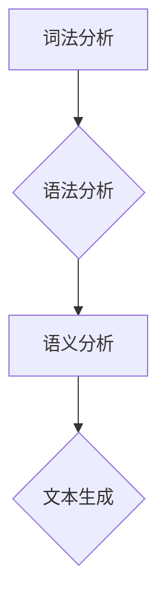

## Natural Language Processing

> 关键词：自然语言处理、NLP、机器学习、深度学习、文本分类、情感分析、机器翻译、语言模型

## 1. 背景介绍

自然语言处理（Natural Language Processing，简称NLP）是人工智能领域的一个重要分支，旨在使计算机能够理解、处理和生成人类语言。随着互联网和移动互联网的快速发展，海量文本数据涌现，NLP技术在各个领域都得到了广泛应用，例如搜索引擎、机器翻译、语音助手、聊天机器人、文本摘要、情感分析等。

NLP技术的发展经历了多个阶段，从早期基于规则的方法到如今的深度学习时代，取得了显著的进步。早期NLP系统主要依赖于人工编写的规则和语法分析，但由于语言的复杂性和多样性，这些方法难以处理复杂的语言现象。随着机器学习和深度学习技术的兴起，NLP系统开始能够从海量文本数据中学习语言模式和规律，从而实现更准确、更智能的语言处理。

## 2. 核心概念与联系

NLP的核心目标是构建能够理解和生成人类语言的计算机系统。为了实现这一目标，NLP需要解决许多关键问题，例如：

* **词法分析（Lexical Analysis）：** 将文本分解成单词或词组。
* **语法分析（Syntactic Analysis）：** 分析文本的语法结构，识别句子成分和关系。
* **语义分析（Semantic Analysis）：** 理解文本的含义，识别词义、概念和关系。
* ** discourse analysis：** 分析文本的对话结构和逻辑关系。
* **文本生成（Text Generation）：** 根据给定的输入生成自然流畅的文本。

这些问题之间相互关联，形成一个完整的NLP处理流程。



## 3. 核心算法原理 & 具体操作步骤

### 3.1  算法原理概述

NLP中常用的算法包括：

* **统计语言模型（Statistical Language Models）：** 基于统计方法，预测下一个词出现的概率。
* **支持向量机（Support Vector Machines）：** 用于分类和回归任务，可以用于文本分类、情感分析等。
* **神经网络（Neural Networks）：** 能够学习复杂的语言模式，例如循环神经网络（RNN）、长短期记忆网络（LSTM）、Transformer等。

### 3.2  算法步骤详解

以文本分类为例，使用支持向量机进行文本分类的步骤如下：

1. **数据预处理：** 将文本数据进行清洗、分词、词向量化等处理。
2. **特征提取：** 从预处理后的文本数据中提取特征，例如词频、词向量等。
3. **模型训练：** 使用训练数据训练支持向量机模型，学习文本分类的决策边界。
4. **模型评估：** 使用测试数据评估模型的性能，例如准确率、召回率、F1-score等。
5. **模型部署：** 将训练好的模型部署到实际应用场景中，用于对新文本进行分类。

### 3.3  算法优缺点

**统计语言模型：**

* **优点：** 计算简单，易于实现。
* **缺点：** 难以捕捉长距离依赖关系，对未知词语处理能力有限。

**支持向量机：**

* **优点：** 能够处理高维数据，具有良好的泛化能力。
* **缺点：** 对参数选择敏感，训练时间较长。

**神经网络：**

* **优点：** 能够学习复杂的语言模式，性能优异。
* **缺点：** 计算复杂，需要大量数据进行训练，解释性较差。

### 3.4  算法应用领域

NLP算法广泛应用于以下领域：

* **搜索引擎：** 文本检索、关键词提取、搜索结果排序。
* **机器翻译：** 将一种语言翻译成另一种语言。
* **语音助手：** 理解用户的语音指令，并进行相应的操作。
* **聊天机器人：** 与用户进行自然语言对话。
* **文本摘要：** 从长文本中提取关键信息，生成简短的摘要。
* **情感分析：** 分析文本中的情感倾向，例如正面、负面、中性。

## 4. 数学模型和公式 & 详细讲解 & 举例说明

### 4.1  数学模型构建

在NLP中，常用的数学模型包括：

* **概率模型：** 用于描述语言现象的概率分布，例如词语出现的概率、句子结构的概率等。
* **统计模型：** 基于统计方法，例如统计语言模型、朴素贝叶斯分类器等。
* **神经网络模型：** 能够学习复杂的非线性关系，例如RNN、LSTM、Transformer等。

### 4.2  公式推导过程

以朴素贝叶斯分类器为例，其核心公式为：

$$P(C|x) = \frac{P(x|C)P(C)}{P(x)}$$

其中：

* $P(C|x)$ 是给定文本 $x$ 的条件下类别 $C$ 的概率。
* $P(x|C)$ 是给定类别 $C$ 的条件下文本 $x$ 的概率。
* $P(C)$ 是类别 $C$ 的先验概率。
* $P(x)$ 是文本 $x$ 的概率。

### 4.3  案例分析与讲解

假设我们有一个文本分类任务，需要将文本分类为“正面”或“负面”情感。我们可以使用朴素贝叶斯分类器进行分类。

首先，我们需要收集训练数据，并计算每个类别下词语的概率。例如，如果“开心”这个词在“正面”情感文本中出现的频率较高，那么 $P("开心"|正面)$ 的值会比较高。

然后，对于一个新的文本，我们可以计算其属于“正面”或“负面”情感的概率，并选择概率更高的类别作为分类结果。

## 5. 项目实践：代码实例和详细解释说明

### 5.1  开发环境搭建

* Python 3.x
* TensorFlow 或 PyTorch
* NLTK 或 spaCy

### 5.2  源代码详细实现

以下是一个使用 TensorFlow 实现文本分类的简单代码示例：

```python
import tensorflow as tf

# 定义模型
model = tf.keras.models.Sequential([
    tf.keras.layers.Embedding(input_dim=vocab_size, output_dim=embedding_dim),
    tf.keras.layers.LSTM(units=128),
    tf.keras.layers.Dense(units=num_classes, activation='softmax')
])

# 编译模型
model.compile(optimizer='adam',
              loss='sparse_categorical_crossentropy',
              metrics=['accuracy'])

# 训练模型
model.fit(x_train, y_train, epochs=10)

# 评估模型
loss, accuracy = model.evaluate(x_test, y_test)
print('Loss:', loss)
print('Accuracy:', accuracy)
```

### 5.3  代码解读与分析

* **Embedding 层：** 将词向量化，将每个词映射到一个低维向量空间。
* **LSTM 层：** 能够捕捉文本中的长距离依赖关系。
* **Dense 层：** 全连接层，用于输出分类结果。
* **Adam 优化器：** 用于更新模型参数。
* **Sparse Categorical Crossentropy 损失函数：** 用于计算分类任务的损失。
* **Accuracy 指标：** 用于评估模型的准确率。

### 5.4  运行结果展示

训练完成后，我们可以使用模型对新的文本进行分类，并查看其分类结果和概率。

## 6. 实际应用场景

NLP技术在各个领域都有广泛的应用，例如：

* **搜索引擎：** Google、百度等搜索引擎使用 NLP 技术进行关键词提取、文本检索、搜索结果排序等。
* **机器翻译：** Google Translate、DeepL 等机器翻译工具使用 NLP 技术将一种语言翻译成另一种语言。
* **语音助手：** Siri、Alexa、Google Assistant 等语音助手使用 NLP 技术理解用户的语音指令，并进行相应的操作。
* **聊天机器人：** 许多聊天机器人使用 NLP 技术与用户进行自然语言对话，例如客服机器人、聊天伴侣等。
* **文本摘要：** 许多新闻网站和文档阅读器使用 NLP 技术生成文本摘要，帮助用户快速了解文章内容。
* **情感分析：** 许多社交媒体平台和市场调研公司使用 NLP 技术分析用户的情感倾向，例如对产品、服务或事件的评价。

### 6.4  未来应用展望

随着 NLP 技术的不断发展，未来将有更多新的应用场景出现，例如：

* **个性化教育：** 根据学生的学习情况，提供个性化的学习内容和辅导。
* **医疗诊断：** 使用 NLP 技术分析患者的病历和症状，辅助医生进行诊断。
* **法律服务：** 使用 NLP 技术分析法律文件，辅助律师进行法律研究和案件处理。
* **创意写作：** 使用 NLP 技术辅助作家进行创意写作，例如生成故事梗概、人物对话等。

## 7. 工具和资源推荐

### 7.1  学习资源推荐

* **斯坦福大学 NLP课程：** https://web.stanford.edu/class/cs224n/
* **DeepLearning.AI 自然语言处理专业证书：** https://www.deeplearning.ai/specializations/natural-language-processing-with-deep-learning/
* **Hugging Face Transformers 库：** https://huggingface.co/transformers/

### 7.2  开发工具推荐

* **TensorFlow：** https://www.tensorflow.org/
* **PyTorch：** https://pytorch.org/
* **NLTK：** https://www.nltk.org/
* **spaCy：** https://spacy.io/

### 7.3  相关论文推荐

* **Attention Is All You Need：** https://arxiv.org/abs/1706.03762
* **BERT：Pre-training of Deep Bidirectional Transformers for Language Understanding：** https://arxiv.org/abs/1810.04805
* **GPT-3：Language Models are Few-Shot Learners：** https://arxiv.org/abs/2005.14165

## 8. 总结：未来发展趋势与挑战

### 8.1  研究成果总结

NLP技术取得了显著的进步，例如：

* **模型性能提升：** 深度学习模型的性能大幅提升，在许多 NLP 任务上取得了人类水平的性能。
* **模型规模扩大：** 模型规模不断扩大，例如 GPT-3 等模型拥有数十亿参数。
* **应用场景拓展：** NLP技术应用场景不断拓展，例如个性化教育、医疗诊断等。

### 8.2  未来发展趋势

* **更强大的模型：** 研究人员将继续开发更强大的 NLP 模型，例如更加高效、更加鲁棒、更加可解释的模型。
* **跨语言理解：** 研究人员将致力于开发能够跨语言理解的 NLP 模型，例如能够理解多种语言的机器翻译系统。
* **多模态理解：** 研究人员将探索将 NLP 与其他模态（例如图像、音频）结合起来，实现多模态理解。

### 8.3  面临的挑战

* **数据偏见：** NLP模型的训练数据可能存在偏见，导致模型输出结果存在偏差。
* **可解释性：** 深度学习模型的决策过程难以解释，这使得模型的应用受到限制。
* **安全性和隐私性：** NLP模型可能被用于恶意目的，例如生成虚假信息、进行身份盗窃等。

### 8.4  研究展望

未来，NLP研究将继续朝着更强大、更安全、更可解释的方向发展，为人类社会带来更多福祉。

## 9. 附录：常见问题与解答

* **什么是词向量？** 词向量是一种将词语映射到低维向量空间的技术，可以捕捉词语之间的语义关系。
* **什么是 RNN？** RNN（循环神经网络）是一种能够处理序列数据的深度学习模型，可以捕捉文本中的