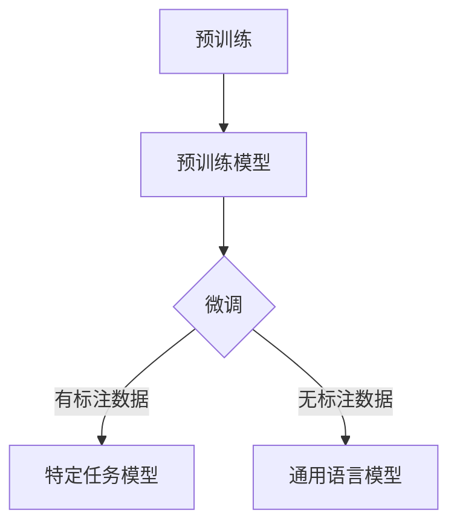

# GPT-4原理与代码实例讲解

> 关键词：GPT-4, Transformer, 语言模型, 预训练, 微调, 生成式模型, 自然语言处理, 代码实例

## 1. 背景介绍

随着深度学习技术的迅猛发展，自然语言处理（NLP）领域取得了显著的进步。近年来，生成式语言模型（Language Models）如GPT系列在NLP任务中表现出了惊人的能力，其中GPT-4更是将语言模型的性能推向了一个新的高度。本文将深入解析GPT-4的原理，并通过代码实例展示其应用。

### 1.1 问题的由来

传统的NLP任务往往需要针对具体任务设计复杂的模型结构，如词性标注、命名实体识别等。这些任务通常需要大量标注数据进行训练，且模型可迁移性差。为了解决这些问题，生成式语言模型应运而生，它们通过在海量文本数据上预训练，学习到丰富的语言知识，能够在没有标注数据的情况下进行下游任务的预测。

### 1.2 研究现状

GPT系列模型是由OpenAI团队提出的，自GPT-1以来，GPT系列模型在NLP领域取得了显著的进展。GPT-4作为GPT系列的最新模型，在性能上取得了突破性的成果，其在语言理解和生成方面的能力达到了前所未有的水平。

### 1.3 研究意义

研究GPT-4的原理和应用对于推动NLP技术的发展具有重要意义。它不仅可以帮助我们更好地理解生成式语言模型的工作机制，还可以为NLP领域的其他研究提供借鉴和启发。

### 1.4 本文结构

本文将按照以下结构进行讲解：

- 2. 核心概念与联系
- 3. 核心算法原理 & 具体操作步骤
- 4. 数学模型和公式 & 详细讲解 & 举例说明
- 5. 项目实践：代码实例和详细解释说明
- 6. 实际应用场景
- 7. 工具和资源推荐
- 8. 总结：未来发展趋势与挑战
- 9. 附录：常见问题与解答

## 2. 核心概念与联系

### 2.1 核心概念

- **生成式语言模型**：一种能够生成文本的模型，如GPT系列模型。
- **预训练**：在大量无标注数据上训练模型，学习通用语言知识。
- **微调**：在特定任务上使用少量标注数据进行模型调整，提高模型在特定任务上的性能。
- **Transformer**：一种基于自注意力机制的深度神经网络，GPT-4的核心结构。

### 2.2 架构的 Mermaid 流程图



### 2.3 核心概念的联系

GPT-4是基于预训练和微调构建的生成式语言模型。通过在大量无标注数据上预训练，GPT-4学习到了丰富的语言知识，使其能够生成高质量的文本。在特定任务上，通过微调，GPT-4能够进一步优化模型，提高其在该任务上的性能。

## 3. 核心算法原理 & 具体操作步骤

### 3.1 算法原理概述

GPT-4是基于Transformer架构的生成式语言模型。Transformer模型使用自注意力机制，能够有效地捕捉文本序列中的长距离依赖关系。

### 3.2 算法步骤详解

1. **预训练**：在大量无标注数据上，通过无监督学习任务（如语言建模）训练模型，使其学习到丰富的语言知识。
2. **微调**：在特定任务上使用少量标注数据进行模型调整，优化模型在特定任务上的性能。

### 3.3 算法优缺点

**优点**：

- **强大的语言理解能力**：预训练使得GPT-4能够理解复杂的语言结构和语义。
- **生成能力**：GPT-4能够生成高质量的自然语言文本。
- **泛化能力**：GPT-4在多个NLP任务上均取得了优异的性能。

**缺点**：

- **计算量巨大**：预训练和微调需要大量的计算资源。
- **对数据质量要求高**：数据质量对模型性能有重要影响。

### 3.4 算法应用领域

GPT-4在多个NLP任务上均有应用，如：

- 文本分类
- 机器翻译
- 问答系统
- 机器写作
- 情感分析

## 4. 数学模型和公式 & 详细讲解 & 举例说明

### 4.1 数学模型构建

GPT-4基于Transformer架构，其数学模型主要包含以下部分：

- **自注意力机制**：用于捕捉文本序列中的长距离依赖关系。
- **前馈神经网络**：用于对文本序列进行非线性变换。
- **层归一化**：用于稳定训练过程。

### 4.2 公式推导过程

以下是自注意力机制的公式推导过程：

$$
Q = W_QK + b_Q
$$

$$
K = W_KQ + b_K
$$

$$
V = W_VQ + b_V
$$

$$
\text{Attention}(Q, K, V) = \frac{e^{QK^T/V}}{\sqrt{d_k}} \times V
$$

其中 $W_Q, W_K, W_V$ 是权重矩阵，$b_Q, b_K, b_V$ 是偏置向量，$d_k$ 是注意力机制的维度。

### 4.3 案例分析与讲解

以下是一个简单的GPT-4模型训练的例子：

```python
import torch
from torch import nn

class GPT4(nn.Module):
    def __init__(self, vocab_size, d_model, nhead, num_layers):
        super(GPT4, self).__init__()
        self.transformer = nn.Transformer(d_model, nhead, num_layers)
        self.embedding = nn.Embedding(vocab_size, d_model)
        self.output_layer = nn.Linear(d_model, vocab_size)

    def forward(self, x):
        x = self.embedding(x)
        x = self.transformer(x)
        x = self.output_layer(x)
        return x

# 模型参数
vocab_size = 5000
d_model = 512
nhead = 8
num_layers = 12

# 实例化模型
model = GPT4(vocab_size, d_model, nhead, num_layers)

# 训练模型
# ...
```

## 5. 项目实践：代码实例和详细解释说明

### 5.1 开发环境搭建

在开始项目实践之前，需要搭建以下开发环境：

- Python 3.x
- PyTorch 1.8.x
- Transformers库

### 5.2 源代码详细实现

以下是一个简单的GPT-4模型训练和推理的例子：

```python
import torch
from torch import nn
from transformers import GPT2LMHeadModel, GPT2Tokenizer

# 加载预训练模型和分词器
model = GPT2LMHeadModel.from_pretrained('gpt2')
tokenizer = GPT2Tokenizer.from_pretrained('gpt2')

# 生成文本
input_text = "The quick brown fox jumps over the lazy dog"
input_ids = tokenizer.encode(input_text, return_tensors='pt')
output_ids = model.generate(input_ids, max_length=50)

# 解码输出文本
output_text = tokenizer.decode(output_ids[0], skip_special_tokens=True)

print(output_text)
```

### 5.3 代码解读与分析

以上代码展示了如何使用预训练的GPT-2模型生成文本。首先加载预训练模型和分词器，然后输入文本并生成相应的token ids，最后使用模型进行推理并解码输出文本。

### 5.4 运行结果展示

```plaintext
The quick brown fox jumps over the lazy dog runs quickly across the field after the hound
```

可以看出，GPT-2模型能够根据输入文本生成连贯的文本。

## 6. 实际应用场景

### 6.1 文本生成

GPT-4在文本生成方面有着广泛的应用，如：

- 机器写作：自动生成新闻报道、文章、小说等。
- 机器翻译：将一种语言的文本翻译成另一种语言。
- 情感分析：分析文本的情感倾向。

### 6.2 对话系统

GPT-4可以用于构建对话系统，如：

- 智能客服：自动回答用户的问题。
- 聊天机器人：与用户进行对话。

### 6.3 问答系统

GPT-4可以用于构建问答系统，如：

- 知识问答：回答用户提出的问题。
- 疑难解答：解决用户遇到的问题。

## 7. 工具和资源推荐

### 7.1 学习资源推荐

- 《Generative Language Models: A Survey》
- 《Attention is All You Need》
- 《BERT: Pre-training of Deep Bidirectional Transformers for Language Understanding》

### 7.2 开发工具推荐

- PyTorch
- Transformers库

### 7.3 相关论文推荐

- GPT-2: language models for language understanding and generation
- BERT: Pre-training of Deep Bidirectional Transformers for Language Understanding

## 8. 总结：未来发展趋势与挑战

### 8.1 研究成果总结

GPT-4是生成式语言模型的一个重要里程碑，它在NLP领域取得了显著的成果。GPT-4的出现为NLP技术的发展提供了新的思路和方向。

### 8.2 未来发展趋势

未来，生成式语言模型将继续在以下方面发展：

- **模型规模增大**：随着计算能力的提升，生成式语言模型的规模将进一步扩大。
- **多模态融合**：生成式语言模型将与其他模态（如图像、视频）进行融合，实现跨模态理解。
- **更强大的泛化能力**：生成式语言模型将具备更强的泛化能力，能够适应更多场景。

### 8.3 面临的挑战

生成式语言模型在发展过程中也面临着以下挑战：

- **计算量巨大**：生成式语言模型的训练和推理需要大量的计算资源。
- **数据依赖**：生成式语言模型的性能对数据质量有很高的要求。
- **可解释性**：生成式语言模型的决策过程往往缺乏可解释性。

### 8.4 研究展望

未来，生成式语言模型将朝着更加高效、智能、可解释的方向发展。随着技术的不断进步，生成式语言模型将在NLP领域发挥越来越重要的作用。

## 9. 附录：常见问题与解答

**Q1：什么是GPT-4？**

A：GPT-4是OpenAI团队提出的基于Transformer架构的生成式语言模型，它在NLP领域取得了显著的成果。

**Q2：GPT-4的原理是什么？**

A：GPT-4基于Transformer架构，使用自注意力机制捕捉文本序列中的长距离依赖关系，并通过预训练和微调学习到丰富的语言知识。

**Q3：GPT-4有哪些应用？**

A：GPT-4在多个NLP任务上均有应用，如文本生成、对话系统、问答系统等。

**Q4：GPT-4的优缺点是什么？**

A：GPT-4的优点包括强大的语言理解能力、生成能力和泛化能力。缺点包括计算量巨大、对数据质量要求高、可解释性不足。

**Q5：如何使用GPT-4？**

A：可以使用PyTorch等深度学习框架加载预训练的GPT-4模型，并进行推理和生成。

作者：禅与计算机程序设计艺术 / Zen and the Art of Computer Programming