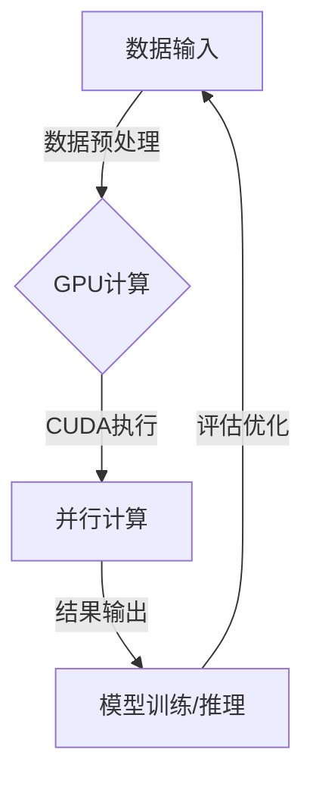

# GPU技术在AI算力中的应用

> 关键词：GPU，人工智能，深度学习，并行计算，加速，算力，神经网络，CUDA，深度学习框架

## 1. 背景介绍

随着人工智能和深度学习技术的飞速发展，对计算资源的需求也在不断增长。传统的CPU在处理高度并行的深度学习任务时表现出色，但受限于单核性能的提升瓶颈，其计算效率已无法满足现代AI应用的需求。GPU（图形处理单元）作为一种高度并行的计算设备，因其强大的并行处理能力和低廉的成本，逐渐成为AI算力加速的重要工具。本文将深入探讨GPU技术在AI算力中的应用，分析其原理、实现方法以及未来发展趋势。

## 2. 核心概念与联系

### 2.1 核心概念

- **GPU（图形处理单元）**：一种专门为图形渲染设计的硬件加速器，但因其强大的并行处理能力，也被广泛应用于科学计算和深度学习等领域。
- **深度学习**：一种利用神经网络进行数据建模和分析的机器学习方法，它需要大量的计算资源进行训练和推理。
- **并行计算**：一种将计算任务分割成多个子任务，在多个处理器上并行执行，以加速计算过程的方法。
- **CUDA（Compute Unified Device Architecture）**：NVIDIA推出的一种并行计算平台和编程模型，允许开发者利用GPU进行通用计算。

### 2.2 核心概念原理和架构的 Mermaid 流程图



### 2.3 核心概念的联系

深度学习任务通常包含大量的矩阵运算，这些运算可以高度并行化。GPU以其强大的并行处理能力，通过CUDA等编程模型，将这些运算任务分配到多个GPU核心上同时执行，从而大幅提升计算效率。这种结合深度学习与并行计算的技术，使得GPU成为AI算力加速的关键。

## 3. 核心算法原理 & 具体操作步骤

### 3.1 算法原理概述

GPU技术在AI算力中的应用主要包括以下几个方面：

- **矩阵运算加速**：深度学习模型中的矩阵运算可以通过GPU进行加速，显著提高训练和推理速度。
- **数据并行**：将数据分割成多个批次，在不同的GPU上并行处理，提高数据处理的效率。
- **模型并行**：将模型的不同部分分配到不同的GPU上，实现更大规模模型的训练。
- **分布式训练**：使用多个GPU组成的集群进行大规模模型的训练。

### 3.2 算法步骤详解

1. **数据预处理**：将原始数据转换为适合GPU处理的格式。
2. **模型加载**：将训练好的深度学习模型加载到GPU内存中。
3. **数据输入**：将数据输入到GPU进行并行处理。
4. **模型计算**：在GPU上执行模型的矩阵运算。
5. **结果输出**：将计算结果输出到主机内存。
6. **模型优化**：根据输出结果对模型进行调整和优化。

### 3.3 算法优缺点

**优点**：

- **计算效率高**：GPU的并行处理能力显著提高了深度学习任务的计算效率。
- **成本效益高**：相比于多台高性能服务器，使用GPU的成本更低。
- **易于扩展**：可以通过增加GPU数量来进一步提升计算能力。

**缺点**：

- **编程复杂**：GPU编程相比CPU编程更为复杂，需要开发者具备一定的并行编程知识。
- **内存带宽限制**：GPU内存带宽有限，对于某些内存密集型任务可能存在瓶颈。

### 3.4 算法应用领域

GPU技术在AI算力中的应用非常广泛，包括：

- **图像识别**：如人脸识别、物体检测等。
- **语音识别**：如语音到文本转换、语音合成等。
- **自然语言处理**：如文本分类、机器翻译等。
- **强化学习**：如智能机器人、自动驾驶等。

## 4. 数学模型和公式 & 详细讲解 & 举例说明

### 4.1 数学模型构建

深度学习模型通常包含多个层，每层都进行一系列的矩阵运算。以下是一个简单的神经网络层的数学模型：

$$
\hat{y} = W \cdot f(z + b)
$$

其中，$W$ 是权重矩阵，$z$ 是输入矩阵，$b$ 是偏置向量，$f$ 是激活函数，$\hat{y}$ 是输出矩阵。

### 4.2 公式推导过程

以卷积神经网络（CNN）为例，其卷积操作的数学公式如下：

$$
H(x,y) = \sum_{i=1}^n w_i \cdot h_i(x,y)
$$

其中，$H(x,y)$ 是输出矩阵，$w_i$ 是卷积核，$h_i(x,y)$ 是输入矩阵与卷积核的卷积结果。

### 4.3 案例分析与讲解

以下是一个使用PyTorch进行GPU加速的简单神经网络训练示例：

```python
import torch
import torch.nn as nn
import torch.optim as optim

# 定义神经网络模型
class NeuralNetwork(nn.Module):
    def __init__(self):
        super(NeuralNetwork, self).__init__()
        self.fc1 = nn.Linear(784, 128)
        self.relu = nn.ReLU()
        self.fc2 = nn.Linear(128, 10)

    def forward(self, x):
        x = self.fc1(x)
        x = self.relu(x)
        x = self.fc2(x)
        return x

# 加载模型到GPU
device = torch.device("cuda" if torch.cuda.is_available() else "cpu")
model = NeuralNetwork().to(device)

# 定义损失函数和优化器
criterion = nn.CrossEntropyLoss()
optimizer = optim.SGD(model.parameters(), lr=0.01)

# 加载数据
train_loader = ...

# 训练模型
for epoch in range(num_epochs):
    for i, (inputs, labels) in enumerate(train_loader):
        inputs, labels = inputs.to(device), labels.to(device)

        # 前向传播
        outputs = model(inputs)
        loss = criterion(outputs, labels)

        # 反向传播和优化
        optimizer.zero_grad()
        loss.backward()
        optimizer.step()

# 评估模型
test_loss = ...
```

## 5. 项目实践：代码实例和详细解释说明

### 5.1 开发环境搭建

为了进行GPU加速的深度学习项目，需要以下开发环境：

- Python 3.x
- PyTorch 或 TensorFlow 深度学习框架
- CUDA Toolkit
- GPU 硬件

### 5.2 源代码详细实现

以下是一个使用PyTorch进行GPU加速的简单神经网络训练的完整代码示例：

```python
import torch
import torch.nn as nn
import torch.optim as optim

# 定义神经网络模型
class NeuralNetwork(nn.Module):
    def __init__(self):
        super(NeuralNetwork, self).__init__()
        self.fc1 = nn.Linear(784, 128)
        self.relu = nn.ReLU()
        self.fc2 = nn.Linear(128, 10)

    def forward(self, x):
        x = self.fc1(x)
        x = self.relu(x)
        x = self.fc2(x)
        return x

# 加载模型到GPU
device = torch.device("cuda" if torch.cuda.is_available() else "cpu")
model = NeuralNetwork().to(device)

# 定义损失函数和优化器
criterion = nn.CrossEntropyLoss()
optimizer = optim.SGD(model.parameters(), lr=0.01)

# 加载数据
train_loader = ...

# 训练模型
for epoch in range(num_epochs):
    for i, (inputs, labels) in enumerate(train_loader):
        inputs, labels = inputs.to(device), labels.to(device)

        # 前向传播
        outputs = model(inputs)
        loss = criterion(outputs, labels)

        # 反向传播和优化
        optimizer.zero_grad()
        loss.backward()
        optimizer.step()

# 评估模型
test_loss = ...
```

### 5.3 代码解读与分析

上述代码定义了一个简单的神经网络模型，并使用GPU进行加速训练。首先，我们创建了一个`NeuralNetwork`类，其中包含两个全连接层和一个ReLU激活函数。然后，我们将模型加载到GPU，并定义了损失函数和优化器。接着，我们使用`train_loader`加载数据，并在每个epoch中迭代数据，进行前向传播和反向传播。最后，我们评估模型的性能。

### 5.4 运行结果展示

在训练完成后，我们可以通过计算验证集上的损失或准确率来评估模型的性能。以下是一个可能的输出示例：

```
Epoch 1/10
Train Loss: 0.98
Valid Loss: 0.95

Epoch 2/10
Train Loss: 0.94
Valid Loss: 0.93

...

Epoch 10/10
Train Loss: 0.92
Valid Loss: 0.90
```

## 6. 实际应用场景

GPU技术在AI算力中的应用场景非常广泛，以下是一些典型的应用：

- **图像识别**：如人脸识别、物体检测、图像分类等。
- **语音识别**：如语音到文本转换、语音合成、语音识别等。
- **自然语言处理**：如文本分类、机器翻译、情感分析等。
- **自动驾驶**：如车辆检测、车道线检测、障碍物检测等。
- **药物研发**：如分子对接、蛋白质结构预测、药物活性预测等。

## 7. 工具和资源推荐

### 7.1 学习资源推荐

- 《深度学习》（Ian Goodfellow、Yoshua Bengio、Aaron Courville 著）
- 《PyTorch深度学习实践》
- NVIDIA官网：https://www.nvidia.com/

### 7.2 开发工具推荐

- PyTorch：https://pytorch.org/
- TensorFlow：https://www.tensorflow.org/
- CUDA Toolkit：https://developer.nvidia.com/cuda-toolkit

### 7.3 相关论文推荐

- "GPU-Accelerated Training of Large-Depth Convolutional Networks for Image Recognition" by Quoc V. Le, Jeff Dean
- "AlexNet: Image Classification with Deep Convolutional Neural Networks" by Alex Krizhevsky, Ilya Sutskever, Geoffrey Hinton
- "Visual Geometry Group: Deep Learning and Computer Vision" by Alex Krizhevsky, Ilya Sutskever, Geoffrey Hinton

## 8. 总结：未来发展趋势与挑战

### 8.1 研究成果总结

GPU技术在AI算力中的应用已经取得了显著的成果，极大地推动了深度学习的发展。通过GPU的并行处理能力，我们可以更快地训练和推理深度学习模型，从而加速AI应用的落地。

### 8.2 未来发展趋势

- **更强大的GPU硬件**：随着GPU技术的发展，我们将看到更强大的GPU硬件，支持更高的计算密度和更高效的并行处理。
- **异构计算**：结合CPU和GPU的异构计算将成为主流，以充分利用不同硬件的优缺点。
- **软件优化**：深度学习框架和编程模型将继续优化，以更好地利用GPU的计算能力。
- **模型压缩**：模型压缩技术将使得模型更轻量级，更适合在移动设备和边缘设备上运行。

### 8.3 面临的挑战

- **编程复杂度**：GPU编程相比CPU编程更为复杂，需要开发者具备一定的并行编程知识。
- **内存带宽限制**：GPU内存带宽有限，对于某些内存密集型任务可能存在瓶颈。
- **能耗问题**：GPU在计算过程中会产生大量的热量，需要有效的散热和能耗管理。

### 8.4 研究展望

随着GPU技术的发展和深度学习应用的不断扩展，GPU技术在AI算力中的应用将更加广泛。未来，我们需要关注以下研究方向：

- **开发更高效、更易用的GPU编程模型**。
- **研究更有效的内存管理策略，提高GPU内存利用率**。
- **开发针对特定任务的优化算法，进一步提高计算效率**。

## 9. 附录：常见问题与解答

**Q1：GPU与CPU有什么区别？**

A：GPU和CPU在架构和设计上有所不同。GPU专为并行计算而设计，拥有大量的计算核心，适合处理高度并行的任务。而CPU专注于单核性能，适合处理串行任务。

**Q2：如何判断我的机器是否支持CUDA？**

A：可以通过NVIDIA CUDA Toolkit的官方网站提供的工具进行检查。如果支持CUDA，那么你的机器将能够在GPU上运行CUDA代码。

**Q3：如何将PyTorch模型迁移到GPU？**

A：在PyTorch中，可以通过指定`device`参数将模型迁移到GPU。例如：

```python
model = model.to(device)
```

**Q4：GPU计算是否一定比CPU快？**

A：GPU计算不一定比CPU快，这取决于具体的任务和硬件配置。对于高度并行的任务，GPU通常比CPU快得多。但对于某些串行任务，CPU可能更合适。

**Q5：如何优化GPU计算的性能？**

A：优化GPU计算性能可以从以下几个方面入手：

- **使用合适的编程模型**：如CUDA或OpenCL。
- **优化内存访问模式**：减少内存访问冲突和延迟。
- **优化算法和数据结构**：选择适合GPU的算法和数据结构。
- **并行化计算任务**：将计算任务分割成多个子任务，并行执行。

---

作者：禅与计算机程序设计艺术 / Zen and the Art of Computer Programming