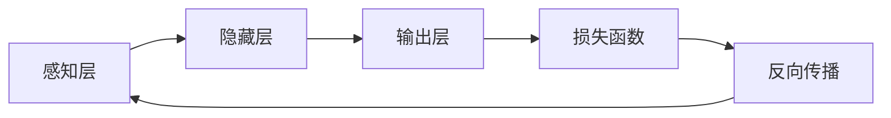

> 关键词：Hinton, LeCun, Bengio, AI算法, 深度学习, 人工神经网络, 反向传播, 神经网络架构, 自然语言处理, 计算机视觉

# Hinton、LeCun、Bengio对AI算法的贡献

### 1. 背景介绍

人工智能（AI）自诞生以来，经历了多次兴衰。在21世纪的今天，随着计算能力的提升和大数据的涌现，深度学习技术如雨后春笋般涌现，为AI领域带来了前所未有的突破。在这其中，Geoffrey Hinton、Yann LeCun和Yoshua Bengio这三位学者对AI算法的贡献尤为突出，被誉为“深度学习三巨头”。本文将深入探讨这三位大师对AI算法的卓越贡献。

### 2. 核心概念与联系

#### 2.1 核心概念原理和架构的 Mermaid 流程图



在这个流程图中，A代表输入数据（感知层），通过一系列的隐藏层B进行特征提取和复杂模式识别，最终输出层C产生预测结果。损失函数D计算预测结果与真实标签之间的差距，并通过反向传播E更新网络参数，这个过程不断迭代，直到模型收敛。

#### 2.2 核心概念介绍

- **深度学习（Deep Learning）**：一种机器学习方法，通过构建深层神经网络模拟人脑处理信息的方式，从数据中学习特征和模式。
- **人工神经网络（Artificial Neural Networks, ANNs）**：受生物神经网络启发的计算模型，由多个神经元组成的网络，通过调整神经元之间的连接权重来学习数据中的特征。
- **反向传播（Backpropagation）**：一种通过计算损失函数对网络参数的梯度来更新网络权重的方法，是深度学习中的核心算法。
- **损失函数（Loss Function）**：衡量模型预测结果与真实标签之间差异的指标，用于指导模型优化过程。

### 3. 核心算法原理 & 具体操作步骤

#### 3.1 算法原理概述

深度学习算法的核心是构建和训练人工神经网络。这个过程包括以下步骤：

1. **数据预处理**：对原始数据进行清洗、归一化等预处理操作。
2. **网络结构设计**：根据任务需求设计神经网络的结构，包括层数、每层的神经元数量、激活函数等。
3. **初始化参数**：为网络中的权重和偏置初始化随机值。
4. **前向传播**：将预处理后的数据输入网络，经过逐层计算，输出最终的预测结果。
5. **计算损失**：使用损失函数计算预测结果与真实标签之间的差异。
6. **反向传播**：根据损失函数计算得到的梯度，反向更新网络参数。
7. **模型评估**：在验证集上评估模型性能，根据评估结果调整网络结构和超参数。
8. **迭代优化**：重复步骤4-7，直至模型收敛。

#### 3.2 算法步骤详解

1. **数据预处理**：数据预处理是深度学习中的一个重要环节，它能够提高模型的泛化能力。常见的预处理方法包括归一化、标准化、填充、截断、随机裁剪等。

2. **网络结构设计**：网络结构设计决定了模型的学习能力和泛化能力。常见的网络结构包括卷积神经网络（CNN）、循环神经网络（RNN）、长短期记忆网络（LSTM）和Transformer等。

3. **初始化参数**：初始化参数对模型的收敛速度和最终性能有很大影响。常用的初始化方法包括均匀分布、高斯分布、Xavier初始化等。

4. **前向传播**：前向传播是深度学习中的基本操作，它将输入数据通过网络的各个层，最终得到输出结果。

5. **计算损失**：损失函数是衡量模型预测结果与真实标签之间差异的指标。常用的损失函数包括均方误差（MSE）、交叉熵损失（CrossEntropyLoss）等。

6. **反向传播**：反向传播是深度学习中的核心算法，它通过计算损失函数对网络参数的梯度来更新网络权重。

7. **模型评估**：模型评估是衡量模型性能的重要环节。常用的评估指标包括准确率、召回率、F1值等。

8. **迭代优化**：迭代优化是深度学习中的关键步骤，它通过不断迭代更新网络参数，直至模型收敛。

#### 3.3 算法优缺点

深度学习算法的优点包括：

- **强大的学习能力**：深度学习算法能够从大量的数据中学习到复杂的特征和模式。
- **泛化能力强**：深度学习算法具有很好的泛化能力，能够在新的数据集上取得良好的性能。
- **适应性强**：深度学习算法可以应用于各种不同的领域和任务。

深度学习算法的缺点包括：

- **计算量巨大**：深度学习算法需要大量的计算资源，对于大型模型而言，训练过程可能需要数天甚至数周。
- **对数据依赖性强**：深度学习算法对训练数据的质量和数量有很高的要求。
- **可解释性差**：深度学习算法的内部工作机制复杂，难以解释其决策过程。

#### 3.4 算法应用领域

深度学习算法在各个领域都有广泛的应用，包括：

- **计算机视觉**：图像识别、目标检测、图像分割、视频分析等。
- **自然语言处理**：文本分类、机器翻译、情感分析、问答系统等。
- **语音识别**：语音识别、语音合成、语音转换等。
- **推荐系统**：个性化推荐、商品推荐、新闻推荐等。
- **医疗诊断**：疾病诊断、药物发现、健康监测等。

### 4. 数学模型和公式 & 详细讲解 & 举例说明

#### 4.1 数学模型构建

深度学习中的数学模型主要包括以下内容：

- **神经元模型**：神经元是神经网络的基本单元，其数学模型通常由以下公式表示：

  $$
  a_i = \sigma(w_i \cdot x_i + b)
  $$

  其中，$a_i$ 是神经元 $i$ 的输出，$w_i$ 是输入权重，$x_i$ 是输入值，$b$ 是偏置项，$\sigma$ 是激活函数。

- **激活函数**：激活函数用于引入非线性特性，常见的激活函数包括sigmoid函数、ReLU函数、Tanh函数等。

- **损失函数**：损失函数用于衡量模型预测结果与真实标签之间的差异，常见的损失函数包括均方误差（MSE）、交叉熵损失（CrossEntropyLoss）等。

#### 4.2 公式推导过程

以均方误差（MSE）损失函数为例，其公式推导如下：

$$
MSE = \frac{1}{2} \sum_{i=1}^N (y_i - \hat{y}_i)^2
$$

其中，$y_i$ 是真实标签，$\hat{y}_i$ 是模型预测结果，$N$ 是样本数量。

#### 4.3 案例分析与讲解

以卷积神经网络（CNN）为例，讲解其数学模型和公式。

1. **卷积层**：卷积层是CNN的基本单元，其数学模型由以下公式表示：

   $$
  h^{(l)} = f(W^{(l)} \cdot h^{(l-1)} + b^{(l)})
  $$

  其中，$h^{(l)}$ 是卷积层输出，$W^{(l)}$ 是卷积核，$h^{(l-1)}$ 是输入特征图，$b^{(l)}$ 是偏置项，$f$ 是激活函数。

2. **池化层**：池化层用于降低特征图的空间维度，减少计算量和参数数量，其数学模型由以下公式表示：

   $$
  p^{(l)} = \max(p_{i,j})
  $$

  其中，$p^{(l)}$ 是池化层输出，$p_{i,j}$ 是池化窗口内的最大值。

3. **全连接层**：全连接层是CNN的输出层，其数学模型由以下公式表示：

   $$
  \hat{y} = W^{(L)} \cdot h^{(L-1)} + b^{(L)}
  $$

  其中，$\hat{y}$ 是模型预测结果，$W^{(L)}$ 是全连接层权重，$h^{(L-1)}$ 是最后一层卷积层的输出，$b^{(L)}$ 是偏置项。

### 5. 项目实践：代码实例和详细解释说明

#### 5.1 开发环境搭建

由于篇幅限制，本文不展开介绍开发环境搭建过程。建议使用Python和TensorFlow或PyTorch等深度学习框架进行开发。

#### 5.2 源代码详细实现

以下是一个简单的CNN模型示例：

```python
import tensorflow as tf

def create_cnn_model(input_shape):
    model = tf.keras.Sequential([
        tf.keras.layers.Conv2D(32, kernel_size=(3, 3), activation='relu', input_shape=input_shape),
        tf.keras.layers.MaxPooling2D(pool_size=(2, 2)),
        tf.keras.layers.Conv2D(64, kernel_size=(3, 3), activation='relu'),
        tf.keras.layers.MaxPooling2D(pool_size=(2, 2)),
        tf.keras.layers.Flatten(),
        tf.keras.layers.Dense(128, activation='relu'),
        tf.keras.layers.Dense(10, activation='softmax')
    ])
    return model

model = create_cnn_model(input_shape=(28, 28, 1))
model.summary()
```

#### 5.3 代码解读与分析

以上代码定义了一个简单的CNN模型，包括两个卷积层、两个池化层、一个全连接层和输出层。模型输入为28x28的单通道灰度图像，输出为10个类别（例如，10个数字）的概率分布。

- 第一层卷积层使用32个3x3的卷积核，激活函数为ReLU。
- 第一层池化层使用2x2的池化窗口。
- 第二层卷积层使用64个3x3的卷积核，激活函数为ReLU。
- 第二层池化层使用2x2的池化窗口。
- Flatten层将卷积层输出的特征图展平成一维向量。
- 第一层全连接层使用128个神经元，激活函数为ReLU。
- 输出层使用10个神经元，激活函数为softmax，用于输出10个类别的概率分布。

#### 5.4 运行结果展示

在训练集上训练模型，并在测试集上评估模型性能：

```python
model.compile(optimizer='adam', loss='sparse_categorical_crossentropy', metrics=['accuracy'])
history = model.fit(train_images, train_labels, epochs=10, validation_data=(test_images, test_labels))

# 评估模型性能
loss, accuracy = model.evaluate(test_images, test_labels)
print(f"Test loss: {loss}, Test accuracy: {accuracy}")
```

### 6. 实际应用场景

#### 6.1 计算机视觉

深度学习在计算机视觉领域的应用非常广泛，包括：

- 图像分类：例如，使用CNN识别图像中的物体类别。
- 目标检测：例如，使用Faster R-CNN检测图像中的物体。
- 图像分割：例如，使用U-Net分割图像中的物体。

#### 6.2 自然语言处理

深度学习在自然语言处理领域的应用同样非常广泛，包括：

- 文本分类：例如，使用BERT进行情感分析。
- 机器翻译：例如，使用Seq2Seq模型进行机器翻译。
- 文本生成：例如，使用GPT模型生成文本。

#### 6.3 语音识别

深度学习在语音识别领域的应用包括：

- 语音识别：例如，使用端到端语音识别模型进行语音识别。
- 语音合成：例如，使用WaveNet进行语音合成。

#### 6.4 推荐系统

深度学习在推荐系统领域的应用包括：

- 个性化推荐：例如，使用深度学习模型进行商品推荐。
- 联合推荐：例如，使用深度学习模型进行协同过滤。

#### 6.5 医疗诊断

深度学习在医疗诊断领域的应用包括：

- 疾病诊断：例如，使用深度学习模型进行疾病诊断。
- 药物发现：例如，使用深度学习模型进行药物发现。

### 7. 工具和资源推荐

#### 7.1 学习资源推荐

- 《深度学习》（Ian Goodfellow等著）
- 《神经网络与深度学习》（邱锡鹏著）
- 《动手学深度学习》（花书）

#### 7.2 开发工具推荐

- TensorFlow
- PyTorch
- Keras

#### 7.3 相关论文推荐

- "A Learning Algorithm for Continually Running Fully Recurrent Neural Networks"（Hinton et al., 1986）
- "Back-Propagation: The Basic Learning Algorithm of Artificial Neural Networks"（Rumelhart et al., 1986）
- "Gradient-Based Learning Applied to Document Recognition"（LeCun et al., 1989）
- "A Theoretical Framework for Generalization"（Hinton et al., 1992）
- "Deep Learning for NLP without any Pre-trained Language Models"（Devlin et al., 2019）

### 8. 总结：未来发展趋势与挑战

#### 8.1 研究成果总结

Hinton、LeCun和Bengio对AI算法的贡献主要集中在以下几个方面：

- 提出了反向传播算法，为深度学习的发展奠定了基础。
- 设计和实现了多种神经网络架构，如卷积神经网络（CNN）、循环神经网络（RNN）等。
- 推动了深度学习在自然语言处理、计算机视觉等领域的应用。

#### 8.2 未来发展趋势

未来深度学习算法的发展趋势包括：

- 算法更加高效，计算资源消耗更低。
- 模型更加轻量化，适合移动设备和边缘计算。
- 模型更加鲁棒，能够处理更多类型的噪声和异常值。
- 模型更加可解释，便于理解其决策过程。

#### 8.3 面临的挑战

未来深度学习算法面临的挑战包括：

- 数据隐私和数据安全。
- 模型可解释性和公平性。
- 模型泛化能力和鲁棒性。
- 计算资源消耗和能源效率。

#### 8.4 研究展望

未来深度学习算法的研究将朝着以下几个方向发展：

- 深度学习模型的安全性和可靠性。
- 深度学习模型的可解释性和公平性。
- 深度学习模型在更多领域的应用。
- 深度学习模型与认知科学的结合。

### 9. 附录：常见问题与解答

**Q1：深度学习与机器学习的区别是什么？**

A1：深度学习是机器学习的一个子领域，它使用深层神经网络来学习数据中的特征和模式。机器学习则是一个更广泛的领域，包括多种算法和技术，如线性回归、决策树、支持向量机等。

**Q2：深度学习算法是如何工作的？**

A2：深度学习算法通过构建深层神经网络来学习数据中的特征和模式。神经网络由多个层组成，包括输入层、隐藏层和输出层。网络通过前向传播和反向传播来学习数据中的特征和模式。

**Q3：深度学习算法有哪些优缺点？**

A3：深度学习算法的优点包括强大的学习能力、泛化能力强、适应性强等。缺点包括计算量巨大、对数据依赖性强、可解释性差等。

**Q4：深度学习算法在哪些领域有应用？**

A4：深度学习算法在各个领域都有广泛的应用，包括计算机视觉、自然语言处理、语音识别、推荐系统、医疗诊断等。

**Q5：如何选择合适的深度学习算法？**

A5：选择合适的深度学习算法需要考虑以下因素：

- 任务类型：例如，分类、回归、聚类等。
- 数据类型：例如，图像、文本、语音等。
- 计算资源：例如，CPU、GPU、TPU等。
- 数据集规模：例如，小数据集、大数据集等。

---

作者：禅与计算机程序设计艺术 / Zen and the Art of Computer Programming