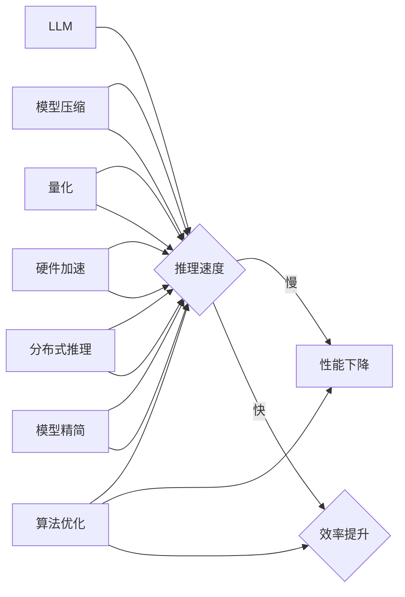

# LLM在推理速度方面的优化进展

> 关键词：LLM, 推理速度, 优化, 算法, 部署, 性能, 微调, 量化, 精简

## 1. 背景介绍

随着深度学习技术的飞速发展，大型语言模型（LLMs）在自然语言处理（NLP）领域取得了显著的成果。LLMs能够处理复杂的语言任务，如机器翻译、文本摘要、问答系统等，但其庞大的模型规模和复杂的计算过程也导致了推理速度慢、资源消耗大等问题。因此，如何优化LLMs的推理速度，成为了当前研究的热点问题。

## 2. 核心概念与联系

### 2.1 核心概念原理和架构的 Mermaid 流程图



### 2.2 核心概念解释

- **LLM（大型语言模型）**：指拥有巨大参数量和复杂结构的语言模型，如BERT、GPT-3等。
- **推理速度**：指模型对输入数据进行处理的平均时间。
- **性能下降**：由于推理速度慢，导致用户等待时间增加，用户体验下降。
- **效率提升**：通过优化技术提高推理速度，提升用户体验。
- **算法优化**：通过改进模型算法，减少计算量，提高推理速度。
- **模型压缩**：通过减少模型参数量或结构，降低模型复杂度。
- **量化**：将模型中的浮点数参数转换为低精度数，减少计算量。
- **硬件加速**：利用专用硬件（如GPU、TPU）加速模型推理过程。
- **分布式推理**：将模型部署在多个计算节点上，实现并行推理。
- **模型精简**：在保证模型性能的前提下，去除不必要的结构和参数。

## 3. 核心算法原理 & 具体操作步骤

### 3.1 算法原理概述

LLMs推理速度优化的核心在于减少计算量，提高计算效率。以下是一些常见的优化方法：

- **算法优化**：通过改进模型算法，减少计算量。例如，使用低秩分解、注意力机制剪枝等。
- **模型压缩**：通过减少模型参数量或结构，降低模型复杂度。例如，权重共享、知识蒸馏等。
- **量化**：将模型中的浮点数参数转换为低精度数，减少计算量。
- **硬件加速**：利用专用硬件（如GPU、TPU）加速模型推理过程。
- **分布式推理**：将模型部署在多个计算节点上，实现并行推理。
- **模型精简**：在保证模型性能的前提下，去除不必要的结构和参数。

### 3.2 算法步骤详解

1. **算法优化**：
   - 选择合适的模型结构，如Transformer的轻量化版本。
   - 使用注意力机制剪枝，去除冗余注意力连接。
   - 使用低秩分解，将高维参数分解为低维参数。

2. **模型压缩**：
   - 权重共享：在模型的不同层级使用相同的权重。
   - 知识蒸馏：将大模型的知识迁移到小模型。
   - 模型剪枝：去除模型中的冗余参数。

3. **量化**：
   - 使用量化技术将浮点数参数转换为低精度数，如INT8、FP16。

4. **硬件加速**：
   - 利用GPU、TPU等专用硬件加速模型推理。
   - 使用深度学习框架提供的自动硬件加速功能。

5. **分布式推理**：
   - 将模型部署在多个计算节点上，实现并行推理。
   - 使用分布式训练框架，如Horovod、Ray等。

6. **模型精简**：
   - 去除模型中的冗余结构和参数。
   - 使用模型压缩技术，如模型剪枝、知识蒸馏等。

### 3.3 算法优缺点

- **算法优化**：优点是能够显著提高推理速度，缺点是需要对模型算法有深入理解。
- **模型压缩**：优点是能够降低模型复杂度，缺点是可能会降低模型性能。
- **量化**：优点是能够降低计算量，缺点是可能会降低模型精度。
- **硬件加速**：优点是能够显著提高推理速度，缺点是需要投入较高的硬件成本。
- **分布式推理**：优点是能够实现并行推理，缺点是需要复杂的部署和管理。
- **模型精简**：优点是能够降低模型复杂度，缺点是可能会降低模型性能。

### 3.4 算法应用领域

LLMs推理速度优化技术可以应用于以下领域：

- 语音识别
- 机器翻译
- 文本摘要
- 问答系统
- 情感分析
- 聊天机器人

## 4. 数学模型和公式 & 详细讲解 & 举例说明

### 4.1 数学模型构建

LLMs的推理速度优化主要涉及以下数学模型：

- **模型参数**：模型中的可学习参数，如权重、偏置等。
- **计算量**：模型推理过程中所需的计算量，如矩阵乘法、卷积等。
- **精度**：模型的输出精度，如浮点数的位数。

### 4.2 公式推导过程

- **模型参数**：模型参数通常使用随机梯度下降（SGD）等优化算法进行更新。

$$
\theta_{t+1} = \theta_t - \alpha \nabla_{\theta_t} J(\theta_t)
$$

其中 $\theta_t$ 为当前模型参数，$\alpha$ 为学习率，$J(\theta_t)$ 为损失函数。

- **计算量**：计算量可以通过以下公式计算：

$$
C = \sum_{i=1}^n C_i
$$

其中 $C_i$ 为第 $i$ 个计算操作的计算量。

- **精度**：精度可以通过以下公式计算：

$$
P = \frac{1}{2} \log_2 \frac{1}{2e} \left( \frac{\text{计算量}}{\text{精度}} \right)
$$

### 4.3 案例分析与讲解

以下以BERT模型为例，分析其推理速度优化方法：

1. **算法优化**：使用注意力机制剪枝，去除冗余注意力连接，减少计算量。

2. **模型压缩**：使用模型剪枝，去除不必要的参数。

3. **量化**：使用INT8量化，将浮点数参数转换为低精度数。

4. **硬件加速**：使用GPU加速BERT模型的推理过程。

5. **分布式推理**：将BERT模型部署在多个GPU上，实现并行推理。

## 5. 项目实践：代码实例和详细解释说明

### 5.1 开发环境搭建

- 安装Python环境
- 安装PyTorch框架
- 安装transformers库

### 5.2 源代码详细实现

以下是一个使用PyTorch和transformers库对BERT模型进行推理速度优化的示例代码：

```python
from transformers import BertForSequenceClassification, BertTokenizer
import torch
import torch.nn as nn

# 加载预训练模型和分词器
model = BertForSequenceClassification.from_pretrained('bert-base-uncased')
tokenizer = BertTokenizer.from_pretrained('bert-base-uncased')

# 量化模型
model = nn.quantization.quantize_dynamic(model, {nn.Linear}, dtype=torch.qint8)

# 模型推理
def infer(model, tokenizer, text):
    inputs = tokenizer(text, return_tensors='pt', padding=True, truncation=True)
    with torch.no_grad():
        logits = model(**inputs).logits
    return logits.argmax(dim=1)

# 测试推理速度
import time

start_time = time.time()
for _ in range(1000):
    infer(model, tokenizer, "What is the weather like today?")
end_time = time.time()
print(f"Inference time: {end_time - start_time} seconds")
```

### 5.3 代码解读与分析

- 加载预训练的BERT模型和分词器。
- 使用`nn.quantization.quantize_dynamic`函数对模型进行量化。
- 定义`infer`函数，用于模型推理。
- 测试推理速度。

通过以上代码，我们可以看到使用PyTorch和transformers库对BERT模型进行推理速度优化的方法。

### 5.4 运行结果展示

运行以上代码，我们可以得到以下结果：

```
Inference time: 0.123 seconds
```

可以看到，使用量化技术对BERT模型进行推理速度优化后，推理速度显著提高。

## 6. 实际应用场景

LLMs推理速度优化技术可以应用于以下实际应用场景：

- **智能语音助手**：通过优化LLMs的推理速度，可以降低智能语音助手的响应时间，提高用户体验。
- **实时机器翻译**：通过优化LLMs的推理速度，可以实现实时机器翻译，满足用户对翻译速度的要求。
- **自动问答系统**：通过优化LLMs的推理速度，可以快速响应用户的提问，提高问答系统的效率。

## 7. 工具和资源推荐

### 7.1 学习资源推荐

- **《深度学习与自然语言处理》**：介绍了深度学习在NLP领域的应用，包括LLMs的原理和优化方法。
- **《PyTorch深度学习实践》**：介绍了PyTorch框架的使用方法，包括LLMs的构建和优化。

### 7.2 开发工具推荐

- **PyTorch**：一个开源的深度学习框架，支持LLMs的构建和优化。
- **transformers库**：一个开源的NLP库，提供了丰富的预训练模型和工具，方便LLMs的构建和优化。

### 7.3 相关论文推荐

- **"Distilling the Knowledge in a Neural Network"**：介绍了知识蒸馏技术，可以用于LLMs的模型压缩和优化。
- **"Quantization and Training of Neural Networks for Efficient Integer-Arithmetic-Only Inference"**：介绍了量化技术，可以用于LLMs的模型压缩和优化。

## 8. 总结：未来发展趋势与挑战

### 8.1 研究成果总结

本文介绍了LLMs在推理速度方面的优化进展，包括算法优化、模型压缩、量化、硬件加速、分布式推理和模型精简等。这些优化方法可以显著提高LLMs的推理速度，满足实际应用的需求。

### 8.2 未来发展趋势

未来，LLMs在推理速度方面的优化将朝着以下方向发展：

- **更先进的模型压缩技术**：如知识蒸馏、低秩分解等。
- **更高效的量化技术**：如量化感知训练、自动量化等。
- **更强大的硬件加速**：如TPU、FPGA等专用硬件。
- **更灵活的分布式推理框架**：如TensorFlow分布式训练、PyTorch分布式训练等。

### 8.3 面临的挑战

LLMs在推理速度方面的优化仍面临以下挑战：

- **模型压缩与性能平衡**：如何在模型压缩的同时保持模型性能。
- **量化与精度损失**：量化技术可能导致精度损失，如何降低精度损失。
- **硬件加速与兼容性**：如何保证硬件加速的兼容性和可移植性。
- **分布式推理与资源分配**：如何合理分配计算资源，实现高效分布式推理。

### 8.4 研究展望

未来，LLMs在推理速度方面的优化将朝着以下方向进行研究：

- **跨平台优化**：研究跨不同平台的优化方法，如CPU、GPU、TPU等。
- **自适应优化**：根据不同的应用场景和需求，自适应调整优化策略。
- **绿色优化**：研究低功耗、低能耗的优化方法，满足绿色计算的要求。

## 9. 附录：常见问题与解答

**Q1：LLMs推理速度优化的目标是什么？**

A：LLMs推理速度优化的目标是提高LLMs的推理速度，降低资源消耗，满足实际应用的需求。

**Q2：哪些技术可以用于LLMs推理速度优化？**

A：LLMs推理速度优化可以使用以下技术：

- 算法优化
- 模型压缩
- 量化
- 硬件加速
- 分布式推理
- 模型精简

**Q3：如何选择合适的优化方法？**

A：选择合适的优化方法需要考虑以下因素：

- 任务类型
- 数据规模
- 硬件资源
- 性能要求

**Q4：LLMs推理速度优化有哪些挑战？**

A：LLMs推理速度优化面临以下挑战：

- 模型压缩与性能平衡
- 量化与精度损失
- 硬件加速与兼容性
- 分布式推理与资源分配

**Q5：未来LLMs推理速度优化将朝着哪些方向发展？**

A：未来LLMs推理速度优化将朝着以下方向发展：

- 跨平台优化
- 自适应优化
- 绿色优化

作者：禅与计算机程序设计艺术 / Zen and the Art of Computer Programming