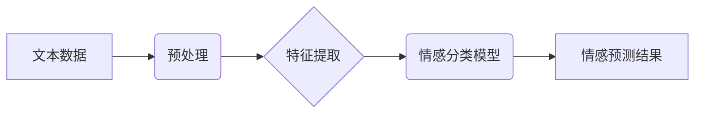
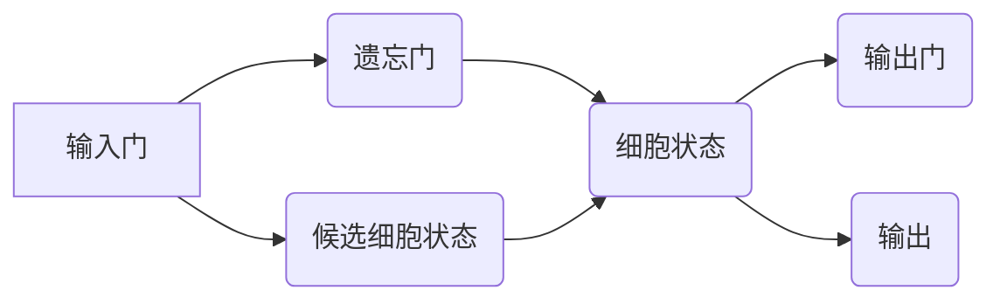

## Python深度学习实践：文本情感分类的深度学习方法

> 关键词：深度学习、文本情感分类、自然语言处理、Recurrent Neural Networks(RNN)、Long Short-Term Memory(LSTM)、Convolutional Neural Networks(CNN)、Python、TensorFlow、PyTorch

## 1. 背景介绍

在当今数据爆炸的时代，文本数据已成为重要的信息来源。如何有效地理解和分析文本情感，对于商业决策、市场调研、用户体验优化等领域具有重要意义。文本情感分类，即根据文本内容判断其表达的情感倾向（例如正面、负面或中性），成为了自然语言处理 (NLP) 领域的重要研究方向。

传统的文本情感分类方法主要依赖于规则匹配和特征工程，但这些方法难以捕捉文本中的复杂语义关系，且需要大量的标注数据进行训练。深度学习的出现为文本情感分类带来了新的机遇。深度学习模型能够自动学习文本特征，并对复杂语义关系进行建模，从而提高情感分类的准确率和鲁棒性。

## 2. 核心概念与联系

文本情感分类的核心概念包括：

* **自然语言处理 (NLP)：** 致力于使计算机能够理解、处理和生成人类语言。
* **情感分析：** 从文本中识别和提取情感信息，包括情感极性和情感强度。
* **深度学习：** 一种机器学习方法，利用多层神经网络学习数据特征，并进行复杂模式识别。

**核心概念架构图：**



## 3. 核心算法原理 & 具体操作步骤

### 3.1  算法原理概述

深度学习模型在文本情感分类中发挥着重要作用。常用的深度学习算法包括：

* **Recurrent Neural Networks (RNN)：** RNN 能够处理序列数据，例如文本，并捕捉文本中的时间依赖关系。
* **Long Short-Term Memory (LSTM)：** LSTM 是 RNN 的一种改进型，能够更好地处理长距离依赖关系。
* **Convolutional Neural Networks (CNN)：** CNN 通常用于图像处理，但也可以应用于文本分类，通过卷积核提取文本特征。

### 3.2  算法步骤详解

**以 LSTM 为例，文本情感分类的具体操作步骤如下：**

1. **数据预处理：** 将文本数据进行清洗、分词、词向量化等预处理操作，以便模型能够理解和处理文本信息。
2. **模型构建：** 使用 LSTM 网络构建情感分类模型，包括输入层、隐藏层和输出层。
3. **模型训练：** 使用标注数据训练 LSTM 模型，通过反向传播算法调整模型参数，使模型能够准确地预测文本的情感倾向。
4. **模型评估：** 使用测试数据评估模型的性能，例如准确率、召回率和 F1-score。
5. **模型部署：** 将训练好的模型部署到实际应用场景中，用于预测新的文本情感。

### 3.3  算法优缺点

**LSTM 算法的优缺点：**

* **优点：** 能够有效地捕捉文本中的长距离依赖关系，在情感分类任务中表现出色。
* **缺点：** 训练时间较长，参数量较大，需要大量的计算资源。

### 3.4  算法应用领域

文本情感分类算法广泛应用于以下领域：

* **社交媒体分析：** 分析用户对产品、服务或事件的情感态度。
* **市场调研：** 了解消费者对产品或品牌的看法。
* **客户服务：** 自动识别客户的投诉或反馈，并提供相应的解决方案。
* **舆情监测：** 监测网络上对特定事件或人物的情感倾向。

## 4. 数学模型和公式 & 详细讲解 & 举例说明

### 4.1  数学模型构建

LSTM 模型的数学模型构建主要基于循环神经网络 (RNN) 的基础，并引入了门控机制来解决梯度消失问题。

**LSTM 单元结构：**



### 4.2  公式推导过程

LSTM 单元中的门控机制使用 sigmoid 函数和 tanh 函数来控制信息的流动。

* **遗忘门：** $f_t = \sigma(W_f \cdot [h_{t-1}, x_t] + b_f)$
* **输入门：** $i_t = \sigma(W_i \cdot [h_{t-1}, x_t] + b_i)$
* **候选细胞状态：** $\tilde{C}_t = \tanh(W_c \cdot [h_{t-1}, x_t] + b_c)$
* **细胞状态：** $C_t = f_t \cdot C_{t-1} + i_t \cdot \tilde{C}_t$
* **输出门：** $o_t = \sigma(W_o \cdot [h_{t-1}, x_t] + b_o)$
* **输出：** $h_t = o_t \cdot \tanh(C_t)$

其中：

* $f_t$, $i_t$, $o_t$ 分别表示遗忘门、输入门和输出门的值。
* $C_t$ 表示当前时间步的细胞状态。
* $h_t$ 表示当前时间步的隐藏状态。
* $W_f$, $W_i$, $W_c$, $W_o$ 分别表示遗忘门、输入门、候选细胞状态和输出门的权重矩阵。
* $b_f$, $b_i$, $b_c$, $b_o$ 分别表示遗忘门、输入门、候选细胞状态和输出门的偏置项。
* $x_t$ 表示当前时间步的输入向量。
* $h_{t-1}$ 表示前一个时间步的隐藏状态。
* $\sigma$ 表示 sigmoid 函数。
* $\tanh$ 表示 tanh 函数。

### 4.3  案例分析与讲解

假设我们有一个文本序列 "今天天气真好"，我们需要使用 LSTM 模型预测其情感倾向。

1. 将文本序列进行词向量化，得到一个词向量序列。
2. 将词向量序列输入 LSTM 模型。
3. LSTM 模型会根据词向量序列的上下文信息，计算每个时间步的隐藏状态。
4. 最后，将隐藏状态输入到输出层，预测文本的情感倾向。

## 5. 项目实践：代码实例和详细解释说明

### 5.1  开发环境搭建

* Python 3.6+
* TensorFlow 或 PyTorch
* Jupyter Notebook

### 5.2  源代码详细实现

```python
import tensorflow as tf

# 定义 LSTM 模型
model = tf.keras.Sequential([
    tf.keras.layers.Embedding(input_dim=vocab_size, output_dim=embedding_dim),
    tf.keras.layers.LSTM(units=128),
    tf.keras.layers.Dense(units=num_classes, activation='softmax')
])

# 编译模型
model.compile(optimizer='adam',
              loss='sparse_categorical_crossentropy',
              metrics=['accuracy'])

# 训练模型
model.fit(x_train, y_train, epochs=10, batch_size=32)

# 评估模型
loss, accuracy = model.evaluate(x_test, y_test)
print('Test Loss:', loss)
print('Test Accuracy:', accuracy)
```

### 5.3  代码解读与分析

* **Embedding 层：** 将词向量化后的文本序列转换为稠密的向量表示。
* **LSTM 层：** 使用 LSTM 网络捕捉文本序列中的时间依赖关系。
* **Dense 层：** 全连接层，用于将 LSTM 输出映射到情感类别。
* **编译模型：** 使用 Adam 优化器、稀疏类别交叉熵损失函数和准确率作为评估指标。
* **训练模型：** 使用训练数据训练模型，设置训练轮数和批处理大小。
* **评估模型：** 使用测试数据评估模型的性能。

### 5.4  运行结果展示

训练完成后，可以查看模型的训练损失和准确率曲线，以及测试集上的准确率。

## 6. 实际应用场景

文本情感分类在各个领域都有广泛的应用场景：

* **电商平台：** 分析用户对商品的评价，了解用户需求和产品优缺点。
* **社交媒体监测：** 监测用户对品牌、产品或事件的情感态度，及时了解舆情变化。
* **客户服务：** 自动识别客户的投诉或反馈，提供更精准的解决方案。
* **市场调研：** 分析用户对产品或服务的满意度，改进产品设计和营销策略。

### 6.4  未来应用展望

随着深度学习技术的不断发展，文本情感分类的应用场景将会更加广泛。例如：

* **个性化推荐：** 根据用户的文本情感偏好，提供个性化的产品推荐。
* **情感机器人：** 开发能够理解和回应人类情感的机器人。
* **医疗诊断：** 分析患者的文本记录，辅助医生进行诊断。

## 7. 工具和资源推荐

### 7.1  学习资源推荐

* **书籍：**
    * 《深度学习》 - Ian Goodfellow, Yoshua Bengio, Aaron Courville
    * 《自然语言处理入门》 - Jacob Eisenstein
* **在线课程：**
    * Coursera: Natural Language Processing Specialization
    * edX: Deep Learning
* **博客和网站：**
    * Towards Data Science
    * Machine Learning Mastery

### 7.2  开发工具推荐

* **Python：** 广泛用于深度学习开发，拥有丰富的库和工具。
* **TensorFlow：** Google 开发的开源深度学习框架。
* **PyTorch：** Facebook 开发的开源深度学习框架。
* **Jupyter Notebook：** 用于交互式编程和数据可视化的工具。

### 7.3  相关论文推荐

* **Recurrent Neural Network Regularization** - Zaremba, W., Sutskever, I., & Martens, J. (2014).
* **Long Short-Term Memory** - Hochreiter, S., & Schmidhuber, J. (1997).
* **Convolutional Neural Networks for Sentence Classification** - Kim, Y. (2014).

## 8. 总结：未来发展趋势与挑战

### 8.1  研究成果总结

深度学习在文本情感分类领域取得了显著的成果，能够有效地捕捉文本中的复杂语义关系，并实现更高的准确率。

### 8.2  未来发展趋势

* **迁移学习：** 利用预训练模型，减少训练数据需求，提高模型泛化能力。
* **多模态情感分析：** 将文本与其他模态信息（例如图像、音频）结合，进行更全面的情感分析。
* **解释性深度学习：** 提高模型的可解释性，帮助用户理解模型的决策过程。

### 8.3  面临的挑战

* **数据标注：** 高质量的标注数据是深度学习模型训练的基础，但标注数据成本高昂，且难以获取。
* **模型复杂度：** 深度学习模型参数量大，训练时间长，需要强大的计算资源。
* **数据偏差：** 训练数据可能存在偏差，导致模型在某些场景下表现不佳。

### 8.4  研究展望

未来，文本情感分类研究将继续朝着更准确、更鲁棒、更可解释的方向发展。


## 9. 附录：常见问题与解答

* **如何选择合适的深度学习模型？**

选择合适的深度学习模型取决于具体任务和数据特点。对于文本情感分类任务，LSTM 和 CNN 都是常用的模型选择。

* **如何处理文本数据？**

文本数据需要进行预处理，包括清洗、分词、词向量