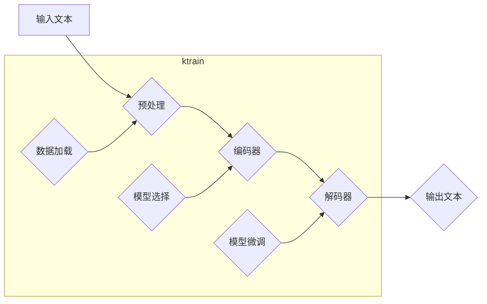

## Transformer大模型实战 ktrain库

> 关键词：Transformer, 大模型, ktrain, 自然语言处理, 深度学习, 预训练模型, 序列建模

## 1. 背景介绍

近年来，深度学习在自然语言处理 (NLP) 领域取得了突破性进展，其中 Transformer 架构扮演着至关重要的角色。自 2017 年 Google 发布论文《Attention Is All You Need》以来，Transformer 模型凭借其强大的序列建模能力和并行训练效率，在机器翻译、文本摘要、问答系统等任务上取得了显著的成绩。

然而，Transformer 模型的训练通常需要海量数据和强大的计算资源，对于普通开发者来说，部署和使用这些大型模型仍然存在一定的难度。为了降低开发门槛，并使 Transformer 模型更易于应用于实际场景，出现了许多基于 Transformer 的开源库和工具。其中，ktrain 库凭借其简洁易用、功能丰富和对预训练模型的支持，成为了众多开发者首选的工具之一。

## 2. 核心概念与联系

### 2.1 Transformer 架构

Transformer 模型的核心是注意力机制 (Attention)，它允许模型关注输入序列中不同位置之间的关系，从而更好地理解上下文信息。与传统的循环神经网络 (RNN) 不同，Transformer 模型采用并行计算方式，可以更有效地处理长序列数据。

Transformer 架构通常由以下几个部分组成：

* **编码器 (Encoder):** 用于将输入序列转换为隐藏表示。编码器由多个 Transformer 块组成，每个块包含多头注意力层和前馈神经网络。
* **解码器 (Decoder):** 用于根据编码器的输出生成目标序列。解码器也由多个 Transformer 块组成，每个块包含多头注意力层、masked 多头注意力层和前馈神经网络。
* **位置编码 (Positional Encoding):** 由于 Transformer 模型没有循环结构，无法直接感知输入序列中的位置信息。因此，需要使用位置编码来嵌入位置信息。
* **层归一化 (Layer Normalization):** 用于稳定训练过程，提高模型的收敛速度。

### 2.2 ktrain 库

ktrain 是一个基于 PyTorch 的深度学习库，专门针对 Transformer 模型的训练和应用进行了优化。ktrain 提供了以下优势：

* **易于使用:** ktrain 的 API 简洁易懂，即使是初学者也能快速上手。
* **预训练模型支持:** ktrain 支持多种预训练 Transformer 模型，例如 BERT、RoBERTa、GPT-2 等，可以方便地进行微调。
* **自动数据处理:** ktrain 可以自动处理文本数据，例如分词、词嵌入等。
* **可视化工具:** ktrain 提供了可视化工具，可以方便地观察模型训练过程和结果。

### 2.3  流程图



## 3. 核心算法原理 & 具体操作步骤

### 3.1 算法原理概述

Transformer 模型的核心算法是注意力机制，它允许模型关注输入序列中不同位置之间的关系。注意力机制可以看作是一种加权求和操作，每个位置的权重代表其对目标位置的重要性。

### 3.2 算法步骤详解

1. **输入嵌入:** 将输入序列中的每个单词转换为向量表示，称为词嵌入。
2. **位置编码:** 为每个词嵌入添加位置信息，以便模型能够感知词序。
3. **多头注意力:** 对输入序列进行多头注意力计算，每个头关注不同的方面，并将其结果进行融合。
4. **前馈神经网络:** 对注意力输出进行非线性变换，提取更深层次的特征。
5. **解码器:** 使用类似的机制解码目标序列。

### 3.3 算法优缺点

**优点:**

* 能够处理长序列数据
* 并行计算效率高
* 表现力强，在许多 NLP 任务上取得了state-of-the-art的结果

**缺点:**

* 训练成本高，需要大量数据和计算资源
* 模型参数量大，部署成本较高

### 3.4 算法应用领域

* 机器翻译
* 文本摘要
* 问答系统
* 情感分析
* 代码生成

## 4. 数学模型和公式 & 详细讲解 & 举例说明

### 4.1 数学模型构建

Transformer 模型的数学模型主要基于线性变换、注意力机制和非线性激活函数。

* **线性变换:** 用于将输入数据转换为不同的表示形式。
* **注意力机制:** 用于计算输入序列中不同位置之间的关系。
* **非线性激活函数:** 用于引入非线性，提高模型的表达能力。

### 4.2 公式推导过程

**注意力机制公式:**

$$
Attention(Q, K, V) = softmax(\frac{QK^T}{\sqrt{d_k}})V
$$

其中:

* $Q$：查询矩阵
* $K$：键矩阵
* $V$：值矩阵
* $d_k$：键向量的维度
* $softmax$：softmax 函数

**多头注意力机制公式:**

$$
MultiHead(Q, K, V) = Concat(head_1, head_2,..., head_h)W_O
$$

其中:

* $head_i$：第 $i$ 个注意力头的输出
* $h$：多头数量
* $W_O$：最终线性变换矩阵

### 4.3 案例分析与讲解

假设我们有一个句子 "The cat sat on the mat"，想要计算 "cat" 和 "mat" 之间的注意力权重。

1. 将句子中的每个单词转换为词嵌入向量。
2. 计算 "cat" 和 "mat" 的查询向量 $Q$ 和键向量 $K$。
3. 计算 $QK^T$，得到一个分数矩阵。
4. 对分数矩阵进行 softmax 操作，得到注意力权重。
5. 将注意力权重与值向量 $V$ 进行加权求和，得到 "cat" 和 "mat" 之间的上下文表示。

## 5. 项目实践：代码实例和详细解释说明

### 5.1 开发环境搭建

* Python 3.6+
* PyTorch 1.0+
* ktrain 0.10+

### 5.2 源代码详细实现

```python
from ktrain import text_classifier
from ktrain.data import get_dataset
from ktrain.metrics import accuracy

# 加载预训练模型
model = text_classifier.get_model("bert-base-uncased")

# 加载数据集
train_data = get_dataset("imdb", split="train")
val_data = get_dataset("imdb", split="val")

# 微调模型
trainer = text_classifier.fit(model, train_data, val_data, epochs=3, batch_size=32)

# 评估模型
_, val_loss = trainer.evaluate(val_data)
print(f"Validation Loss: {val_loss:.4f}")

# 保存模型
trainer.save("imdb_classifier")
```

### 5.3 代码解读与分析

* 使用 `text_classifier.get_model()` 函数加载预训练的 BERT 模型。
* 使用 `get_dataset()` 函数加载 IMDB 数据集。
* 使用 `text_classifier.fit()` 函数微调模型。
* 使用 `trainer.evaluate()` 函数评估模型性能。
* 使用 `trainer.save()` 函数保存模型。

### 5.4 运行结果展示

运行上述代码后，会输出模型在验证集上的损失值。

## 6. 实际应用场景

ktrain 库可以应用于各种 NLP 任务，例如：

* **文本分类:** 分别将文本分类为正负面情感、垃圾邮件、新闻类别等。
* **文本摘要:** 生成文本的简短摘要。
* **问答系统:** 根据给定的问题，从文本中找到答案。
* **机器翻译:** 将文本从一种语言翻译成另一种语言。

### 6.4 未来应用展望

随着 Transformer 模型的不断发展，ktrain 库也将不断更新和完善，支持更多类型的模型和任务。未来，ktrain 库有望成为更强大、更易用的 Transformer 模型开发工具。

## 7. 工具和资源推荐

### 7.1 学习资源推荐

* **ktrain 官方文档:** https://ktrain.ai/docs/
* **Transformer 架构论文:** https://arxiv.org/abs/1706.03762
* **Hugging Face Transformers 库:** https://huggingface.co/docs/transformers/index

### 7.2 开发工具推荐

* **PyTorch:** https://pytorch.org/
* **Jupyter Notebook:** https://jupyter.org/

### 7.3 相关论文推荐

* **BERT: Pre-training of Deep Bidirectional Transformers for Language Understanding:** https://arxiv.org/abs/1810.04805
* **RoBERTa: A Robustly Optimized BERT Pretraining Approach:** https://arxiv.org/abs/1907.11692
* **GPT-2: Transformer Language Modeling for Open-Domain Text Generation:** https://openai.com/blog/better-language-models/

## 8. 总结：未来发展趋势与挑战

### 8.1 研究成果总结

Transformer 模型及其相关的库和工具，如 ktrain，在 NLP 领域取得了显著的进展，为自然语言理解和生成提供了强大的工具。

### 8.2 未来发展趋势

* **模型规模的进一步扩大:** 预计未来 Transformer 模型的规模将继续扩大，从而提升模型的性能。
* **高效训练方法的探索:** 为了应对大型模型的训练成本，将继续探索更有效的训练方法。
* **跨模态理解:** 将 Transformer 模型应用于跨模态理解，例如文本-图像、文本-音频等。

### 8.3 面临的挑战

* **数据获取和标注:** 大型 Transformer 模型需要海量数据进行训练，数据获取和标注仍然是一个挑战。
* **计算资源:** 大型模型的训练需要大量的计算资源，这对于个人开发者和小型团队来说是一个负担。
* **模型解释性:** Transformer 模型的内部机制较为复杂，缺乏足够的解释性，这限制了模型的应用场景。

### 8.4 研究展望

未来研究将继续探索 Transformer 模型的潜力，解决其面临的挑战，并将其应用于更广泛的领域。


## 9. 附录：常见问题与解答

* **Q: 如何选择合适的预训练模型？**

A: 选择预训练模型需要根据具体任务和数据特点进行考虑。例如，对于文本分类任务，BERT 和 RoBERTa 是不错的选择；对于文本生成任务，GPT-2 和 T5 是更好的选择。

* **Q: 如何微调预训练模型？**

A: 微调预训练模型需要使用少量标记数据进行训练。ktrain 库提供了方便的微调接口，可以轻松地微调预训练模型。

* **Q: 如何部署 Transformer 模型？**

A: Transformer 模型可以部署在云端、边缘设备或本地机器上。ktrain 库提供了部署工具，可以方便地将模型部署到不同的环境中。


作者：禅与计算机程序设计艺术 / Zen and the Art of Computer Programming 
