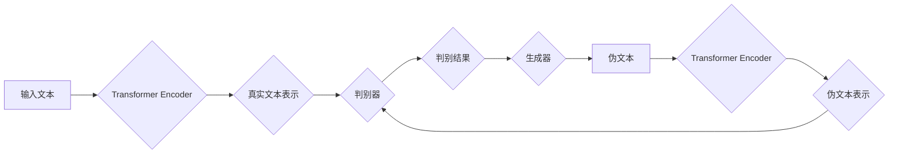

## Transformer大模型实战 训练ELECTRA 模型

> 关键词：Transformer, ELECTRA, 大模型, 自然语言处理, 预训练, 语言模型, 

## 1. 背景介绍

近年来，深度学习在自然语言处理 (NLP) 领域取得了突破性进展，其中 Transformer 架构和基于 Transformer 的大语言模型 (LLM) 扮演着至关重要的角色。BERT、GPT-3 等模型的出现，显著提升了文本理解、生成和翻译等任务的性能。然而，这些模型的训练成本高昂，对计算资源要求极高。

为了解决这个问题，Google 研究团队提出了 ELECTRA 模型，它是一种基于 Transformer 的高效预训练语言模型。ELECTRA 采用了一种新的预训练方法，通过对比学习的方式，在更小的数据集和计算资源下，也能达到与 BERT 相当甚至更好的性能。

## 2. 核心概念与联系

### 2.1 Transformer 架构

Transformer 架构是一种基于注意力机制的序列到序列模型，它能够有效地处理长距离依赖关系，并取得了在机器翻译、文本摘要等任务上的优异表现。

Transformer 的核心组件包括：

* **编码器 (Encoder):** 用于将输入序列编码成固定长度的向量表示。
* **解码器 (Decoder):** 用于根据编码后的向量表示生成输出序列。
* **注意力机制 (Attention):** 用于捕捉输入序列中不同词之间的关系，并赋予它们不同的权重。

### 2.2 ELECTRA 预训练方法

ELECTRA 的核心思想是通过对比学习的方式进行预训练。它将预训练任务分解为两个部分：

* **生成器 (Generator):** 负责生成与原始文本相似的伪文本。
* **判别器 (Discriminator):** 负责区分真实文本和伪文本。

ELECTRA 的训练过程如下：

1. **生成器训练:** 使用 Transformer 的解码器部分作为生成器，从输入文本中生成伪文本。
2. **判别器训练:** 使用 Transformer 的编码器部分作为判别器，学习区分真实文本和伪文本。
3. **联合训练:** 将生成器和判别器联合训练，生成器不断生成更逼真的伪文本，判别器则不断提高区分真实文本和伪文本的能力。

**Mermaid 流程图:**



## 3. 核心算法原理 & 具体操作步骤

### 3.1 算法原理概述

ELECTRA 的核心算法原理是基于对比学习的预训练方法。通过训练一个生成器和一个判别器，让它们在对抗游戏中不断提升，最终使得生成器能够生成与真实文本相似的伪文本，而判别器能够准确区分真实文本和伪文本。

### 3.2 算法步骤详解

1. **数据预处理:** 将原始文本数据进行分词、标记等预处理操作，使其能够被模型理解。
2. **生成器训练:** 使用 Transformer 的解码器部分作为生成器，从输入文本中生成伪文本。
3. **判别器训练:** 使用 Transformer 的编码器部分作为判别器，学习区分真实文本和伪文本。
4. **联合训练:** 将生成器和判别器联合训练，生成器不断生成更逼真的伪文本，判别器则不断提高区分真实文本和伪文本的能力。
5. **微调:** 将预训练好的 ELECTRA 模型微调到具体的下游任务，例如文本分类、问答系统等。

### 3.3 算法优缺点

**优点:**

* **高效:** 相比于 BERT 等模型，ELECTRA 的训练成本更低，对计算资源要求更低。
* **性能优异:** 在多个 NLP 任务上，ELECTRA 的性能与 BERT 相当甚至更好。
* **可扩展性强:** ELECTRA 的架构可以很容易地扩展到更大的模型规模。

**缺点:**

* **训练复杂:** ELECTRA 的训练过程相对复杂，需要对生成器和判别器进行联合训练。
* **数据依赖性:** ELECTRA 的性能与训练数据质量密切相关。

### 3.4 算法应用领域

ELECTRA 广泛应用于各种 NLP 任务，例如：

* **文本分类:** 识别文本的类别，例如情感分析、主题分类等。
* **问答系统:** 回答用户提出的问题。
* **机器翻译:** 将文本从一种语言翻译成另一种语言。
* **文本摘要:** 生成文本的简短摘要。
* **对话系统:** 与用户进行自然语言对话。

## 4. 数学模型和公式 & 详细讲解 & 举例说明

### 4.1 数学模型构建

ELECTRA 的数学模型主要包括两个部分：生成器和判别器。

* **生成器:** 使用 Transformer 的解码器部分作为生成器，其目标是生成与输入文本相似的伪文本。
* **判别器:** 使用 Transformer 的编码器部分作为判别器，其目标是区分真实文本和伪文本。

### 4.2 公式推导过程

ELECTRA 的训练目标是最大化判别器的准确率，同时最小化生成器的损失函数。

* **判别器损失函数:** 使用交叉熵损失函数，计算判别器对真实文本和伪文本的分类准确率。

$$
L_{D} = -\frac{1}{N} \sum_{i=1}^{N} y_i \log(p_i) + (1-y_i) \log(1-p_i)
$$

其中：

* $N$ 是样本数量。
* $y_i$ 是真实标签，1 表示真实文本，0 表示伪文本。
* $p_i$ 是判别器对样本 $i$ 的预测概率。

* **生成器损失函数:** 使用判别器对生成文本的预测概率作为损失函数，目标是生成与真实文本相似的文本，使得判别器难以区分。

$$
L_{G} = -\frac{1}{N} \sum_{i=1}^{N} \log(1-p_i)
$$

其中：

* $p_i$ 是判别器对生成文本 $i$ 的预测概率。

### 4.3 案例分析与讲解

假设我们有一个输入文本 "今天天气很好"，ELECTRA 的生成器会根据这个输入文本生成一个类似的伪文本，例如 "今天天气很晴朗"。然后，判别器会根据这两个文本的编码表示，判断它们是真实文本还是伪文本。

如果判别器能够准确区分真实文本和伪文本，则说明生成器生成的伪文本质量较高。反之，如果判别器无法准确区分，则说明生成器需要进一步训练，生成更逼真的伪文本。

## 5. 项目实践：代码实例和详细解释说明

### 5.1 开发环境搭建

为了训练 ELECTRA 模型，需要搭建一个合适的开发环境。

* **操作系统:** Linux 或 macOS
* **编程语言:** Python
* **深度学习框架:** TensorFlow 或 PyTorch
* **硬件资源:** GPU

### 5.2 源代码详细实现

ELECTRA 的源代码可以从 HuggingFace 模型库下载。

```python
from transformers import ElectraForMaskedLM, ElectraTokenizer

# 下载预训练模型和词典
model_name = "google/electra-small-discriminator"
tokenizer = ElectraTokenizer.from_pretrained(model_name)
model = ElectraForMaskedLM.from_pretrained(model_name)

# 输入文本
text = "今天天气很好"

# 对文本进行分词和标记
inputs = tokenizer(text, return_tensors="pt")

# 使用模型进行预测
outputs = model(**inputs)

# 获取预测结果
predictions = outputs.logits.argmax(-1)
```

### 5.3 代码解读与分析

* **下载预训练模型和词典:** 使用 `from_pretrained()` 方法从 HuggingFace 模型库下载预训练好的 ELECTRA 模型和词典。
* **输入文本:** 将需要处理的文本输入到模型中。
* **分词和标记:** 使用 `tokenizer` 对文本进行分词和标记，将其转换为模型可以理解的格式。
* **使用模型进行预测:** 使用 `model(**inputs)` 调用模型进行预测，得到预测结果。
* **获取预测结果:** 从模型输出中获取预测结果，例如预测每个词的下一个词。

### 5.4 运行结果展示

运行上述代码后，会输出每个词的下一个词的预测结果。例如，对于输入文本 "今天天气很好"，模型可能会预测下一个词为 "是"。

## 6. 实际应用场景

ELECTRA 在各种实际应用场景中都取得了不错的效果，例如：

* **搜索引擎:** 使用 ELECTRA 来理解用户搜索意图，提高搜索结果的准确率。
* **聊天机器人:** 使用 ELECTRA 来训练更智能的聊天机器人，使其能够进行更自然流畅的对话。
* **文本摘要:** 使用 ELECTRA 来生成文本的简短摘要，例如新闻文章的摘要。
* **机器翻译:** 使用 ELECTRA 来提高机器翻译的准确率和流畅度。

### 6.4 未来应用展望

随着深度学习技术的不断发展，ELECTRA 的应用场景将会更加广泛。例如：

* **个性化推荐:** 使用 ELECTRA 来理解用户的兴趣偏好，提供更个性化的推荐。
* **自动写作:** 使用 ELECTRA 来辅助自动写作，例如生成新闻报道、小说等。
* **代码生成:** 使用 ELECTRA 来生成代码，提高软件开发效率。

## 7. 工具和资源推荐

### 7.1 学习资源推荐

* **论文:**

    * "ELECTRA: Pre-training Text Encoders as Discriminators Rather Than Generators"

* **博客:**

    * https://huggingface.co/blog/electra

* **在线课程:**

    * https://www.coursera.org/learn/natural-language-processing

### 7.2 开发工具推荐

* **深度学习框架:** TensorFlow, PyTorch
* **自然语言处理库:** NLTK, SpaCy
* **代码编辑器:** VS Code, Sublime Text

### 7.3 相关论文推荐

* BERT: Pre-training of Deep Bidirectional Transformers for Language Understanding
* GPT-3: Language Models are Few-Shot Learners
* RoBERTa: A Robustly Optimized BERT Pretraining Approach

## 8. 总结：未来发展趋势与挑战

### 8.1 研究成果总结

ELECTRA 作为一种高效的预训练语言模型，在 NLP 领域取得了显著的成果。其对比学习方法有效降低了训练成本，同时保持了高性能。

### 8.2 未来发展趋势

未来，ELECTRA 模型将会朝着以下方向发展：

* **模型规模:** 继续探索更大的模型规模，提升模型的表达能力和泛化能力。
* **多模态学习:** 将文本与其他模态数据（例如图像、音频）进行融合，构建更全面的理解模型。
* **可解释性:** 研究 ELECTRA 模型的内部机制，提高模型的可解释性和可控性。

### 8.3 面临的挑战

ELECTRA 模型也面临着一些挑战：

* **数据依赖性:** 模型性能与训练数据质量密切相关，需要不断收集和清洗高质量的训练数据。
* **计算资源:** 训练大型模型需要大量的计算资源，成本较高。
* **伦理问题:** 大模型的应用可能带来一些伦理问题，例如信息操纵、隐私泄露等，需要谨慎对待。

### 8.4 研究展望

尽管面临挑战，但 ELECTRA 模型的未来发展前景依然广阔。随着技术的不断进步，相信 ELECTRA 将在更多领域发挥重要作用，推动 NLP 领域的发展。

## 9. 附录：常见问题与解答

* **Q: ELECTRA 与 BERT 的区别是什么？**

A: BERT 和 ELECTRA 都是基于 Transformer 架构的预训练语言模型，但它们在预训练方法上有所不同。BERT 使用 masked language modeling (MLM) 和 next sentence