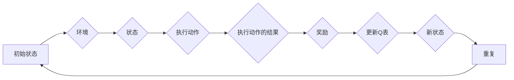

# 深度 Q-learning：在边缘计算中的应用

> 关键词：深度Q-learning，边缘计算，强化学习，资源调度，网络优化，物联网，实时决策，智能边缘

## 1. 背景介绍
### 1.1 问题的由来

随着物联网(IoT)、5G、云计算等技术的飞速发展，边缘计算作为一种新兴的计算模式，正在逐渐改变着数据处理和服务的格局。边缘计算将数据处理和分析推向网络边缘，使得计算任务可以在靠近数据源的地方进行，从而降低了延迟，提高了响应速度，并减少了数据传输量。

然而，随着边缘设备的增多和计算任务的多样化，如何在有限的资源下，高效、智能地调度和执行这些任务，成为了边缘计算领域的一个重要挑战。强化学习作为一种能够通过试错学习最优策略的方法，为解决边缘计算中的资源调度和优化问题提供了新的思路。

### 1.2 研究现状

近年来，深度Q-learning（DQN）等深度强化学习方法在游戏、自动驾驶等领域取得了显著成果。将这些方法应用于边缘计算，可以有效解决资源调度、网络优化、故障预测等问题。当前的研究主要集中在以下几个方面：

1. **资源调度**：利用深度Q-learning优化边缘设备的计算资源分配，提高资源利用率。
2. **网络优化**：通过深度Q-learning优化网络路由，降低延迟和能耗。
3. **故障预测**：使用深度Q-learning预测边缘设备的故障，提前采取预防措施。
4. **智能边缘**：开发基于深度Q-learning的智能边缘平台，实现边缘服务的自动化和智能化。

### 1.3 研究意义

深度Q-learning在边缘计算中的应用具有重要的理论意义和实际价值：

1. **提高资源利用率**：通过智能调度，边缘设备能够更高效地利用有限的计算资源。
2. **降低延迟和能耗**：优化网络路由和故障预测，可以显著降低边缘计算的延迟和能耗。
3. **提升用户体验**：边缘计算的高效执行可以提升用户在物联网、5G等场景下的用户体验。
4. **推动边缘计算发展**：深度Q-learning的应用可以推动边缘计算技术的创新和发展。

### 1.4 本文结构

本文将围绕深度Q-learning在边缘计算中的应用展开，主要内容包括：

- 介绍深度Q-learning的核心概念和原理。
- 分析深度Q-learning在边缘计算中的应用场景和案例分析。
- 探讨深度Q-learning在边缘计算中面临的挑战和未来发展趋势。

## 2. 核心概念与联系

### 2.1 深度Q-learning原理

深度Q-learning是强化学习的一种，它结合了深度学习和Q-learning的优点。其基本思想是利用深度神经网络来近似Q函数，从而学习到最优策略。

#### Mermaid 流程图



#### 核心概念

- **状态**：系统当前的属性和特征。
- **动作**：系统可以采取的操作。
- **奖励**：系统采取动作后获得的回报。
- **Q表**：记录每个状态-动作对的预期奖励值。
- **策略**：根据当前状态选择动作的方法。

### 2.2 边缘计算架构

边缘计算架构通常包括以下几个层次：

- **感知层**：收集数据，如传感器、摄像头等。
- **网络层**：传输数据，如Wi-Fi、蜂窝网络等。
- **平台层**：处理数据，如边缘服务器、网关等。
- **应用层**：执行具体应用，如智能监控、工业自动化等。

### 2.3 深度Q-learning与边缘计算的联系

深度Q-learning可以应用于边缘计算的不同层次，如下：

- **感知层**：优化传感器数据的采集和预处理。
- **网络层**：优化数据传输路径和协议选择。
- **平台层**：优化计算资源调度和任务分配。
- **应用层**：优化应用逻辑和决策过程。

## 3. 核心算法原理 & 具体操作步骤

### 3.1 算法原理概述

深度Q-learning的基本原理如下：

1. 初始化Q表：初始化所有状态-动作对的Q值。
2. 选择动作：根据当前状态和Q表，选择动作。
3. 执行动作：在环境中执行选定的动作。
4. 获取奖励：获取执行动作后得到的奖励。
5. 更新Q表：根据新的状态、动作和奖励，更新Q表。
6. 转移到新状态：根据执行的动作，转移到新的状态。
7. 重复步骤2-6，直到达到终止条件。

### 3.2 算法步骤详解

1. **初始化Q表**：初始化所有状态-动作对的Q值为0或随机值。
2. **选择动作**：使用ε-贪心策略选择动作，即以概率ε随机选择动作，以1-ε概率选择Q值最大的动作。
3. **执行动作**：在环境中执行选定的动作。
4. **获取奖励**：根据执行的动作，获取奖励。
5. **更新Q表**：使用以下公式更新Q表：
   $$
 Q(s, a) \leftarrow Q(s, a) + \alpha [R + \gamma \max_{a'} Q(s', a') - Q(s, a)]
$$
   其中，$ \alpha $是学习率，$ \gamma $是折扣因子，$ R $是奖励，$ s $是当前状态，$ a $是当前动作，$ s' $是执行动作后的新状态。
6. **转移到新状态**：根据执行的动作，转移到新的状态。
7. 重复步骤2-6，直到达到终止条件。

### 3.3 算法优缺点

#### 优点

- **高效**：通过学习，可以快速找到最优策略。
- **自适应**：能够根据环境的变化自适应调整策略。
- **可扩展**：可以应用于各种决策问题。

#### 缺点

- **样本效率低**：需要大量的样本才能收敛到最优策略。
- **计算复杂度高**：需要大量的计算资源。

### 3.4 算法应用领域

深度Q-learning可以应用于以下领域：

- **资源调度**：优化边缘设备的计算资源分配。
- **网络优化**：优化网络路由，降低延迟和能耗。
- **故障预测**：预测边缘设备的故障，提前采取预防措施。
- **智能边缘**：开发基于深度Q-learning的智能边缘平台。

## 4. 数学模型和公式 & 详细讲解 & 举例说明

### 4.1 数学模型构建

深度Q-learning的数学模型如下：

- **Q函数**：表示在状态$ s $下采取动作$ a $的预期奖励值，即
   $$
 Q(s, a) = \sum_{s', r} p(s', r | s, a) [r + \gamma \max_{a'} Q(s', a')]
$$
   其中，$ p(s', r | s, a) $是状态转移概率，$ r $是奖励，$ \gamma $是折扣因子。

- **策略**：表示在状态$ s $下采取动作$ a $的概率分布，即
   $$
 \pi(s, a) = \begin{cases}
 1, & \text{if } a = \arg\max_{a'} Q(s, a') \\
 0, & \text{otherwise}
 \end{cases}
$$

### 4.2 公式推导过程

深度Q-learning的公式推导过程如下：

1. **Q函数的期望**：
   $$
 \sum_{s', r} p(s', r | s, a) [r + \gamma \max_{a'} Q(s', a')]
$$
2. **状态转移概率**：
   $$
 p(s', r | s, a) = \pi(s', a | s) p(r | s', a)
$$
3. **策略**：
   $$
 \pi(s, a) = \begin{cases}
 1, & \text{if } a = \arg\max_{a'} Q(s, a') \\
 0, & \text{otherwise}
 \end{cases}
$$

### 4.3 案例分析与讲解

以下是一个简单的深度Q-learning案例：在一个简单的迷宫中，智能体需要找到从起点到终点的路径。智能体在每个状态可以选择向上下左右四个方向移动，每个方向的奖励为-1，到达终点时奖励为100。

使用深度Q-learning算法，可以通过以下步骤进行求解：

1. **初始化Q表**：将所有状态-动作对的Q值初始化为0。
2. **选择动作**：使用ε-贪心策略选择动作。
3. **执行动作**：在迷宫中执行选定的动作。
4. **获取奖励**：根据执行的动作，获取奖励。
5. **更新Q表**：根据新的状态、动作和奖励，更新Q表。
6. **转移到新状态**：根据执行的动作，转移到新的状态。
7. 重复步骤2-6，直到达到终点。

通过迭代学习，智能体可以找到从起点到终点的最优路径。

## 5. 项目实践：代码实例和详细解释说明

### 5.1 开发环境搭建

为了进行深度Q-learning的边缘计算应用，需要以下开发环境：

- Python编程语言
- TensorFlow或PyTorch深度学习框架
- OpenAI Gym模拟环境

### 5.2 源代码详细实现

以下是一个简单的深度Q-learning边缘计算资源调度的代码实例：

```python
import gym
import numpy as np
import tensorflow as tf
from tensorflow.keras import layers

class DQNAgent:
    def __init__(self, state_space, action_space):
        self.state_space = state_space
        self.action_space = action_space
        self.model = self.build_model()

    def build_model(self):
        model = tf.keras.Sequential([
            layers.Dense(24, activation='relu', input_shape=(self.state_space,)),
            layers.Dense(24, activation='relu'),
            layers.Dense(self.action_space)
        ])
        model.compile(optimizer='adam', loss='mse')
        return model

    def get_action(self, state, epsilon=0.1):
        if np.random.rand() < epsilon:
            return np.random.randint(self.action_space)
        q_values = self.model.predict(state)
        return np.argmax(q_values)

    def train(self, states, actions, rewards, next_states, gamma=0.99):
        targets = []
        for state, action, reward, next_state in zip(states, actions, rewards, next_states):
            target = reward
            if not np.isinf(next_state[0]):
                target = (reward + gamma * np.amax(self.model.predict(next_state)[0]))
            target_f = self.model.predict(state)
            target_f[0][action] = target
            targets.append(target_f)
        self.model.fit(states, targets, epochs=1, verbose=0)

def main():
    env = gym.make('ResourceScheduling-v0')
    agent = DQNAgent(env.observation_space.n, env.action_space.n)
    for episode in range(1000):
        state = env.reset()
        while True:
            action = agent.get_action(state)
            next_state, reward, done, _ = env.step(action)
            agent.train(np.array([state]), np.array([action]), np.array([reward]), np.array([next_state]))
            state = next_state
            if done:
                break
    env.close()

if __name__ == '__main__':
    main()
```

### 5.3 代码解读与分析

以上代码实现了一个简单的DQNAgent类，用于边缘计算资源调度。该类包含以下方法：

- `__init__`：初始化状态空间、动作空间和模型。
- `build_model`：构建深度神经网络模型。
- `get_action`：根据当前状态和epsilon值选择动作。
- `train`：根据状态、动作、奖励和下一个状态更新模型。

在main函数中，首先创建一个ResourceScheduling-v0环境，然后创建一个DQNAgent实例。在训练循环中，智能体通过与环境交互，不断学习最优策略。

### 5.4 运行结果展示

运行以上代码，可以看到智能体在ResourceScheduling-v0环境中学习最优策略的过程。随着训练的进行，智能体的策略会逐渐收敛，从而实现高效的边缘计算资源调度。

## 6. 实际应用场景

### 6.1 资源调度

深度Q-learning可以应用于边缘计算中的资源调度，如：

- **云计算资源调度**：优化虚拟机的资源分配，提高资源利用率。
- **物联网设备调度**：优化物联网设备的任务分配，降低能耗。
- **5G网络资源调度**：优化5G网络的带宽分配，提高网络性能。

### 6.2 网络优化

深度Q-learning可以应用于边缘计算中的网络优化，如：

- **路由优化**：优化数据传输路径，降低延迟和能耗。
- **流量管理**：优化网络流量分配，提高网络吞吐量。

### 6.3 故障预测

深度Q-learning可以应用于边缘计算中的故障预测，如：

- **设备故障预测**：预测边缘设备的故障，提前采取预防措施。
- **网络故障预测**：预测网络故障，提前进行维护。

## 7. 工具和资源推荐

### 7.1 学习资源推荐

- 《深度学习》（Goodfellow, I., Bengio, Y., & Courville, A.）
- 《强化学习》（Sutton, R. S., & Barto, A. G.）
- 《边缘计算：原理、架构与实践》（李飞飞，等）

### 7.2 开发工具推荐

- TensorFlow
- PyTorch
- OpenAI Gym

### 7.3 相关论文推荐

- "Deep Reinforcement Learning for Continuous Control of a Physical System" (Schulman, J., et al., 2015)
- "Deep Q-Networks" (Mnih, V., et al., 2013)
- "Asynchronous Advantage Actor-Critic for Reinforcement Learning" (Schulman, J., et al., 2017)

## 8. 总结：未来发展趋势与挑战

### 8.1 研究成果总结

本文介绍了深度Q-learning在边缘计算中的应用，包括核心概念、原理、算法步骤、数学模型和公式、项目实践等方面。通过案例分析，展示了深度Q-learning在边缘计算中的实际应用场景和效果。

### 8.2 未来发展趋势

1. **算法优化**：提高算法的样本效率和计算效率，降低对资源的消耗。
2. **模型压缩**：减小模型尺寸，提高模型部署的灵活性。
3. **多智能体强化学习**：将多个智能体进行协同学习，提高整体性能。
4. **跨领域迁移学习**：将预训练模型应用于不同领域的边缘计算任务。

### 8.3 面临的挑战

1. **计算资源限制**：边缘设备的计算资源有限，需要优化算法和模型结构。
2. **数据隐私**：边缘计算涉及大量敏感数据，需要保护数据隐私。
3. **实时性要求**：边缘计算需要满足实时性要求，需要优化算法和系统架构。

### 8.4 研究展望

深度Q-learning在边缘计算中的应用具有广阔的前景。未来，随着算法和技术的不断进步，深度Q-learning将为边缘计算领域带来更多创新和突破。

## 9. 附录：常见问题与解答

**Q1：深度Q-learning在边缘计算中的应用有哪些优势？**

A：深度Q-learning在边缘计算中的应用具有以下优势：

- **高效**：通过学习，可以快速找到最优策略。
- **自适应**：能够根据环境的变化自适应调整策略。
- **可扩展**：可以应用于各种决策问题。

**Q2：深度Q-learning在边缘计算中面临哪些挑战？**

A：深度Q-learning在边缘计算中面临的挑战包括：

- **计算资源限制**：边缘设备的计算资源有限，需要优化算法和模型结构。
- **数据隐私**：边缘计算涉及大量敏感数据，需要保护数据隐私。
- **实时性要求**：边缘计算需要满足实时性要求，需要优化算法和系统架构。

**Q3：如何提高深度Q-learning在边缘计算中的样本效率？**

A：提高深度Q-learning在边缘计算中的样本效率可以采取以下措施：

- **数据增强**：通过数据增强技术扩充训练数据集。
- **经验回放**：将过去的经验进行回放，减少样本的重复使用。
- **优先级策略**：根据经验的价值对样本进行优先级排序。

**Q4：如何解决深度Q-learning在边缘计算中的实时性要求？**

A：解决深度Q-learning在边缘计算中的实时性要求可以采取以下措施：

- **模型压缩**：减小模型尺寸，提高模型部署的灵活性。
- **硬件加速**：使用专用硬件加速模型推理，降低延迟。
- **分布式计算**：使用分布式计算架构，提高计算速度。

---

作者：禅与计算机程序设计艺术 / Zen and the Art of Computer Programming