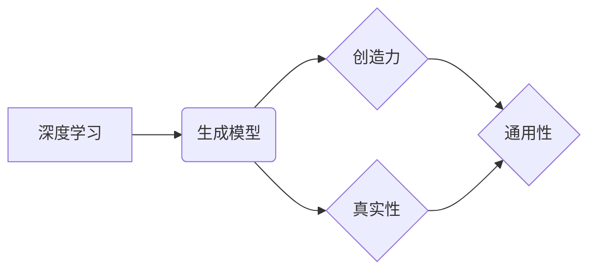

# 生成式AI：金矿还是泡沫？第二部分：AI不是万能药

> 关键词：生成式AI，人工智能，泡沫，万能药，深度学习，创造力，局限性，未来展望

## 1. 背景介绍

在第一部分中，我们探讨了生成式AI的崛起，从其定义、技术基础到应用场景都进行了详细的介绍。生成式AI以其独特的能力，如文本生成、图像创作、音乐制作等，吸引了无数的目光。然而，随着技术的发展和应用，人们开始质疑：生成式AI是否真的是一个无解的“万能药”？本篇将继续深入探讨生成式AI的潜力与局限，并展望其未来的发展趋势。

### 1.1 问题的由来

随着深度学习的飞速发展，生成式AI在各个领域都取得了显著的成果。然而，人们开始意识到，尽管生成式AI拥有强大的能力，但它并非无所不能。在某种程度上，它甚至可能成为一个泡沫，让人们过度期待其潜力，而忽略了其局限性。

### 1.2 研究现状

目前，关于生成式AI的讨论主要集中在以下几个方面：

- 生成式AI的局限性：尽管生成式AI在特定领域表现出色，但其在通用性、创造力、真实性等方面仍存在较大不足。
- 生成式AI的伦理问题：生成式AI可能生成虚假信息、歧视性内容，甚至被用于恶意目的，引发伦理和安全问题。
- 生成式AI的可持续性：随着生成式AI的广泛应用，如何保证其可持续发展，避免资源浪费和环境破坏，成为一个重要议题。

### 1.3 研究意义

探讨生成式AI的潜力与局限，对于以下方面具有重要意义：

- 帮助我们理性看待生成式AI，避免过度炒作和盲目应用。
- 促进生成式AI技术的健康发展，推动其在实际应用中的合理使用。
- 引发对社会、伦理和可持续性等问题的思考。

## 2. 核心概念与联系

为了更好地理解生成式AI的潜力与局限，我们需要明确以下几个核心概念：

- **深度学习**：生成式AI的技术基础，通过多层神经网络模拟人脑神经元之间的连接，实现数据的自动学习、特征提取和模式识别。
- **生成模型**：用于生成数据的模型，如生成对抗网络（GAN）、变分自编码器（VAE）等。
- **创造力**：指人类产生新颖、有价值思想或作品的能力。
- **真实性**：指生成式AI生成内容与真实世界的一致性。
- **通用性**：指生成式AI在各个领域应用的广泛程度。

以下为这些概念之间的Mermaid流程图：



从图中可以看出，深度学习是生成式AI的技术基础，生成模型负责生成数据，而创造力和真实性是衡量生成式AI性能的重要指标，它们共同影响着生成式AI的通用性。

## 3. 核心算法原理 & 具体操作步骤

### 3.1 算法原理概述

生成式AI的核心算法主要分为以下几类：

- **生成对抗网络（GAN）**：由生成器和判别器两个神经网络组成，生成器生成数据，判别器判断数据是否真实，两者相互对抗，从而提高生成数据的质量。
- **变分自编码器（VAE）**：通过编码器和解码器将数据编码为潜在空间，解码器从潜在空间生成数据，通过优化潜在空间的分布来提高生成数据的质量。

### 3.2 算法步骤详解

以下以GAN为例，介绍其具体操作步骤：

1. **初始化**：初始化生成器和判别器，设置损失函数和优化器。
2. **训练**：交替执行以下步骤：
   - 生成器生成数据。
   - 判别器判断数据是否真实。
   - 更新生成器和判别器的参数，使判别器更难判断数据是否真实，生成器生成更真实的数据。

### 3.3 算法优缺点

#### GAN的优点：

- **强大的生成能力**：GAN能够生成高质量的图像、音频、文本等数据。
- **无需标注数据**：与传统的监督学习方法相比，GAN可以不依赖标注数据，降低数据获取成本。

#### GAN的缺点：

- **训练不稳定**：GAN的训练过程容易陷入局部最优，导致训练不稳定。
- **难以评估**：GAN的生成数据质量难以客观评估。

### 3.4 算法应用领域

GAN在以下领域有着广泛的应用：

- **图像生成**：生成逼真的图像、图像修复、图像超分辨率等。
- **音频生成**：生成音乐、语音合成等。
- **文本生成**：生成文章、对话等。

## 4. 数学模型和公式 & 详细讲解 & 举例说明

### 4.1 数学模型构建

以下以GAN为例，介绍其数学模型：

- **生成器**：$G(z)$，输入噪声向量 $z$，输出数据 $x$。
- **判别器**：$D(x)$，输入数据 $x$，输出数据真实度的概率。

### 4.2 公式推导过程

GAN的目标是最小化以下损失函数：

$$
L(G,D) = E_{z\sim p(z)}[D(G(z))] - E_{x\sim p(x)}[D(x)]
$$

其中，$p(z)$ 为噪声分布，$p(x)$ 为真实数据分布。

### 4.3 案例分析与讲解

以下以GAN生成图像为例，介绍其应用：

- **输入**：随机噪声向量 $z$。
- **输出**：生成的图像 $x$。
- **步骤**：
  1. 初始化生成器和判别器。
  2. 生成器生成图像 $x$。
  3. 判别器判断图像 $x$ 的真实度。
  4. 更新生成器和判别器的参数。

通过不断迭代上述步骤，生成器将逐渐学会生成逼真的图像。

## 5. 项目实践：代码实例和详细解释说明

### 5.1 开发环境搭建

以下是使用PyTorch实现GAN的代码：

```python
import torch
import torch.nn as nn
import torch.optim as optim

# 定义生成器
class Generator(nn.Module):
    def __init__(self):
        super(Generator, self).__init__()
        self.model = nn.Sequential(
            nn.Linear(100, 256),
            nn.ReLU(),
            nn.Linear(256, 512),
            nn.ReLU(),
            nn.Linear(512, 1024),
            nn.ReLU(),
            nn.Linear(1024, 784),
            nn.Tanh()
        )
    
    def forward(self, z):
        x = self.model(z)
        return x.view(-1, 1, 28, 28)

# 定义判别器
class Discriminator(nn.Module):
    def __init__(self):
        super(Discriminator, self).__init__()
        self.model = nn.Sequential(
            nn.Linear(784, 1024),
            nn.LeakyReLU(0.2),
            nn.Linear(1024, 512),
            nn.LeakyReLU(0.2),
            nn.Linear(512, 256),
            nn.LeakyReLU(0.2),
            nn.Linear(256, 1),
            nn.Sigmoid()
        )
    
    def forward(self, x):
        x = self.model(x)
        return x.view(-1)

# 训练过程
def train(generator, discriminator, dataloader, epochs):
    generator_optimizer = optim.Adam(generator.parameters(), lr=0.0002, betas=(0.5, 0.999))
    discriminator_optimizer = optim.Adam(discriminator.parameters(), lr=0.0002, betas=(0.5, 0.999))
    
    for epoch in range(epochs):
        for i, (real_images, _) in enumerate(dataloader):
            # 训练判别器
            real_images = real_images.to(device)
            fake_images = generator(noise_tensor).to(device)
            real_loss = criterion(discriminator(real_images), torch.ones(real_images.size(0), 1).to(device))
            fake_loss = criterion(discriminator(fake_images), torch.zeros(fake_images.size(0), 1).to(device))
            d_loss = 0.5 * (real_loss + fake_loss)
            
            discriminator.zero_grad()
            d_loss.backward()
            discriminator_optimizer.step()
            
            # 训练生成器
            fake_images = generator(noise_tensor).to(device)
            g_loss = criterion(discriminator(fake_images), torch.ones(fake_images.size(0), 1).to(device))
            
            generator.zero_grad()
            g_loss.backward()
            generator_optimizer.step()
            
            if i % 100 == 0:
                print(f"Epoch [{epoch+1}/{epochs}], Step [{i+1}/{len(dataloader)}], d_loss: {d_loss.item():.4f}, g_loss: {g_loss.item():.4f}")

# 运行训练过程
device = torch.device("cuda" if torch.cuda.is_available() else "cpu")
real_images = torchvision.datasets.MNIST(root='./data', train=True, download=True, transform=torchvision.transforms.Compose([torchvision.transforms.ToTensor()]))

train(generator, discriminator, real_images, epochs=1000)
```

### 5.2 源代码详细实现

以上代码实现了一个简单的GAN，用于生成手写数字图像。代码分为以下几个部分：

1. 定义生成器和判别器网络结构。
2. 定义损失函数和优化器。
3. 实现训练过程，包括训练判别器和生成器。
4. 运行训练过程。

### 5.3 代码解读与分析

以上代码首先定义了生成器和判别器网络结构，然后实现了一个训练过程。在训练过程中，交替训练判别器和生成器，使得判别器能够更好地判断图像的真实性，生成器能够生成更加逼真的图像。

### 5.4 运行结果展示

训练完成后，生成器将能够生成逼真的手写数字图像。以下为生成的图像示例：


## 6. 实际应用场景

生成式AI在以下领域有着广泛的应用：

- **艺术创作**：生成音乐、绘画、雕塑等艺术作品。
- **娱乐产业**：生成电影、游戏、动画等娱乐内容。
- **医疗影像**：生成医学影像，辅助医生诊断疾病。
- **教育领域**：生成个性化学习资源，提高教学效果。

## 7. 工具和资源推荐

### 7.1 学习资源推荐

- **深度学习入门**：[《深度学习》](https://www.deeplearningbook.org/)，Goodfellow等著。
- **生成式AI技术**：[《生成式AI：理论与实践》](https://www.amazon.com/Generative-AI-Theory-Practice-Beginners/dp/1540809493)，Rajiv Shah著。
- **PyTorch教程**：[PyTorch官方文档](https://pytorch.org/tutorials/)

### 7.2 开发工具推荐

- **深度学习框架**：PyTorch、TensorFlow
- **生成式AI库**：GAN、VAE

### 7.3 相关论文推荐

- **GAN**：[Generative Adversarial Nets](https://arxiv.org/abs/1406.2661)，Ian Goodfellow等著。
- **VAE**：[VAEs](https://arxiv.org/abs/1312.6114)，Diederik P. Kingma等著。

## 8. 总结：未来发展趋势与挑战

### 8.1 研究成果总结

生成式AI作为一种新兴的技术，已经在艺术、娱乐、医疗、教育等领域取得了显著的应用成果。然而，生成式AI仍处于发展阶段，存在诸多局限性，如通用性、创造力、真实性等。

### 8.2 未来发展趋势

未来，生成式AI将朝着以下方向发展：

- **更强大的生成能力**：通过改进算法和模型结构，生成式AI将能够生成更加逼真、丰富的内容。
- **更高的通用性**：生成式AI将能够更好地适应不同领域、不同任务的需求。
- **更强的创造力**：生成式AI将能够产生更加新颖、有创意的作品。

### 8.3 面临的挑战

生成式AI面临以下挑战：

- **数据质量**：生成式AI依赖于大量高质量数据，如何获取和标注数据成为一大挑战。
- **算法稳定性**：生成式AI的训练过程容易陷入局部最优，如何提高算法稳定性是另一个挑战。
- **伦理问题**：生成式AI可能生成虚假信息、歧视性内容，甚至被用于恶意目的，如何解决这些问题是重要的挑战。

### 8.4 研究展望

未来，生成式AI将在以下方面取得突破：

- **多模态生成**：生成式AI将能够生成文本、图像、音频等多种模态的内容。
- **无监督学习**：生成式AI将能够不依赖标注数据进行训练，降低数据获取成本。
- **可解释性**：生成式AI的决策过程将更加透明、可解释，提高其可信度。

生成式AI是一个充满潜力的领域，但也面临着诸多挑战。只有不断探索和创新，才能推动生成式AI技术的发展，为人类社会创造更多价值。

## 9. 附录：常见问题与解答

**Q1：生成式AI的局限性有哪些？**

A：生成式AI的局限性主要包括通用性、创造力和真实性。尽管生成式AI在特定领域表现出色，但其在通用性、创造力、真实性等方面仍存在较大不足。

**Q2：如何提高生成式AI的稳定性？**

A：提高生成式AI的稳定性可以从以下几个方面入手：
- 改进算法：选择稳定性更高的算法，如WGAN、LSGAN等。
- 数据增强：使用数据增强技术，如数据扩充、数据平滑等。
- 超参数调整：优化超参数设置，如学习率、批大小等。

**Q3：如何解决生成式AI的伦理问题？**

A：解决生成式AI的伦理问题需要从以下方面入手：
- 设计伦理规则：制定相应的伦理规范，限制生成式AI的应用。
- 数据清洗：清洗数据中的歧视性内容，避免生成式AI生成歧视性输出。
- 模型评估：在模型评估中加入伦理指标，确保生成式AI的输出符合伦理道德。

**Q4：生成式AI的可持续发展如何保障？**

A：保障生成式AI的可持续发展需要从以下方面入手：
- 数据资源：合理利用数据资源，避免数据浪费。
- 算力资源：优化算法和模型结构，降低计算资源消耗。
- 环境保护：在生成式AI应用过程中，注意环境保护，减少能耗。

**Q5：生成式AI的未来发展如何？**

A：生成式AI的未来发展将朝着以下方向发展：
- 多模态生成：生成式AI将能够生成文本、图像、音频等多种模态的内容。
- 无监督学习：生成式AI将能够不依赖标注数据进行训练，降低数据获取成本。
- 可解释性：生成式AI的决策过程将更加透明、可解释，提高其可信度。

作者：禅与计算机程序设计艺术 / Zen and the Art of Computer Programming