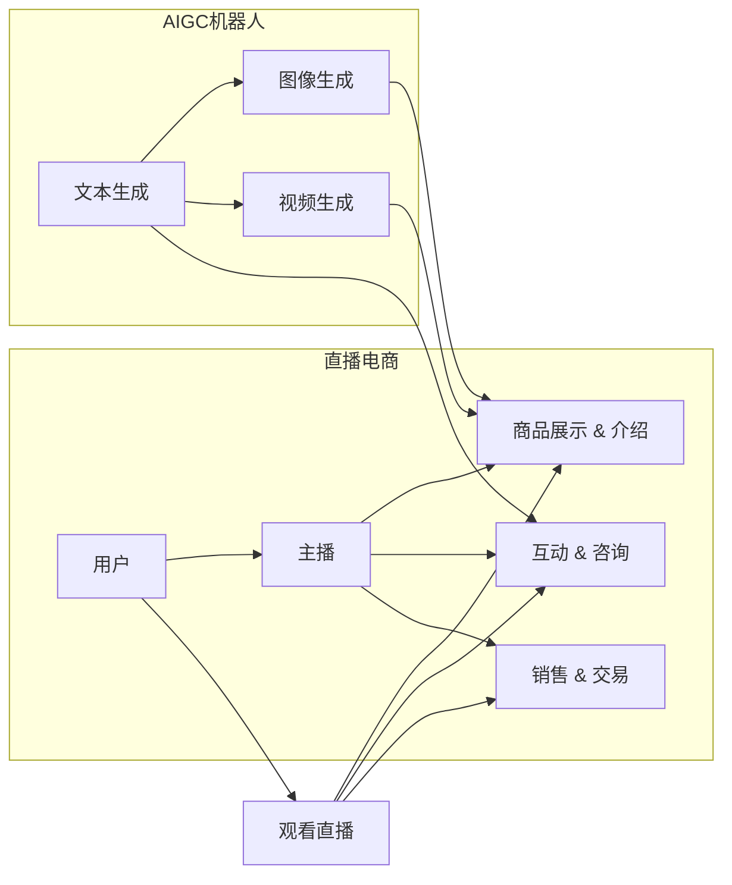

# 直播电商与AIGC机器人的结合

> 关键词：直播电商，AIGC，人工智能，自然语言处理，图像生成，个性化推荐，用户体验，商业模式

## 1. 背景介绍

随着互联网技术的快速发展，直播电商已经成为一种新兴的零售模式，迅速在全球范围内流行起来。而人工智能（AI）技术的进步，尤其是自然语言处理（NLP）和计算机视觉（CV）领域的发展，为直播电商注入了新的活力。AIGC（AI-Generated Content）机器人作为AI技术的重要组成部分，其与直播电商的结合，为用户提供了更加个性化和沉浸式的购物体验，同时也为商家带来了新的商业机遇。

### 1.1 直播电商的兴起

直播电商作为一种新兴的电商模式，通过主播与观众的实时互动，将商品的展示、介绍、咨询、销售等功能融为一体。与传统电商相比，直播电商具有以下特点：

- **实时互动性**：主播与观众可以实时互动，解答问题，提供咨询服务。
- **娱乐性**：直播过程中加入娱乐元素，提高观众的参与度和购物意愿。
- **社交属性**：直播电商具有社交属性，可以形成社群效应。

### 1.2 AIGC机器人的崛起

AIGC机器人是基于AI技术，能够自动生成文本、图像、视频等内容的系统。AIGC机器人的崛起，标志着AI技术在内容创作领域的重大突破，为直播电商提供了新的可能性。

### 1.3 直播电商与AIGC结合的意义

直播电商与AIGC机器人的结合，具有以下意义：

- **提升用户体验**：通过AIGC机器人生成个性化的商品推荐、直播脚本等内容，提升用户体验。
- **降低运营成本**：AIGC机器人可以自动完成部分内容生成工作，降低人力成本。
- **创新商业模式**：结合AIGC机器人的直播电商，可以探索新的商业模式，如虚拟主播、个性化定制等。

## 2. 核心概念与联系

### 2.1 核心概念原理

#### 直播电商

直播电商的核心是直播技术、电商技术和社交技术的结合。主播通过直播平台与观众实时互动，展示商品、介绍功能、解答疑问，最终促成交易。

#### AIGC机器人

AIGC机器人基于AI技术，能够自动生成文本、图像、视频等内容。其核心原理包括：

- **自然语言处理（NLP）**：用于理解和生成自然语言文本。
- **计算机视觉（CV）**：用于分析和生成图像、视频内容。
- **深度学习**：用于训练和优化AIGC模型。

### 2.2 核心概念架构



如图所示，直播电商与AIGC机器人之间存在着紧密的联系。AIGC机器人可以为直播电商提供个性化的商品推荐、直播脚本、互动内容等，从而提升用户体验和销售效果。

## 3. 核心算法原理 & 具体操作步骤

### 3.1 算法原理概述

直播电商与AIGC机器人的结合，涉及多种AI算法，包括：

- **NLP**：用于生成直播脚本、问答、个性化推荐等文本内容。
- **CV**：用于生成商品图像、虚拟主播形象等视觉内容。
- **推荐算法**：用于个性化推荐商品。

### 3.2 算法步骤详解

#### NLP算法

1. **数据预处理**：对用户评论、商品描述等文本数据进行清洗、分词、去噪等预处理操作。
2. **特征提取**：提取文本中的关键词、主题、情感等特征。
3. **模型训练**：使用预训练的语言模型，如BERT、GPT等，对提取的特征进行微调，生成文本内容。

#### CV算法

1. **图像生成**：使用生成对抗网络（GAN）或变分自编码器（VAE）等算法生成商品图像。
2. **视频生成**：使用视频生成算法，如光流法、动作捕捉等，生成虚拟主播动作视频。

#### 推荐算法

1. **用户画像**：根据用户行为数据、兴趣标签等，构建用户画像。
2. **商品相似度计算**：计算商品之间的相似度，为用户推荐相似商品。
3. **推荐策略优化**：根据用户反馈和点击数据，不断优化推荐策略。

### 3.3 算法优缺点

#### NLP算法

优点：

- 生成文本内容准确、自然。
- 可以实现个性化推荐、问答等交互功能。

缺点：

- 需要大量标注数据。
- 模型复杂度高，计算资源消耗大。

#### CV算法

优点：

- 生成图像、视频内容逼真、具有吸引力。
- 可以实现虚拟主播、商品展示等功能。

缺点：

- 需要大量的训练数据。
- 模型复杂度高，计算资源消耗大。

#### 推荐算法

优点：

- 可以实现个性化推荐，提升用户满意度。
- 可以提高商品销量。

缺点：

- 需要大量的用户行为数据。
- 推荐效果容易受到数据偏差的影响。

### 3.4 算法应用领域

直播电商与AIGC机器人的结合，可以应用于以下领域：

- **个性化推荐**：根据用户画像和商品相似度，为用户推荐个性化商品。
- **虚拟主播**：生成虚拟主播形象和动作，提高直播趣味性。
- **商品展示**：生成商品图像和视频，提升商品展示效果。
- **互动问答**：生成回答用户问题的文本内容，提高直播互动性。

## 4. 数学模型和公式 & 详细讲解 & 举例说明

### 4.1 数学模型构建

#### NLP模型

假设NLP模型为 $M$，输入为 $x$，输出为 $y$，则模型的表达式为：

$$
y = M(x)
$$

其中，$M$ 为一个由神经网络组成的模型，$x$ 为输入文本，$y$ 为生成的文本内容。

#### CV模型

假设CV模型为 $V$，输入为 $x$，输出为 $y$，则模型的表达式为：

$$
y = V(x)
$$

其中，$V$ 为一个由卷积神经网络（CNN）组成的模型，$x$ 为输入图像，$y$ 为生成的图像内容。

### 4.2 公式推导过程

#### NLP模型

以BERT模型为例，其核心思想是 Transformer 模型，使用多头自注意力机制。以下为 Transformer 模型的公式推导过程：

1. **多头自注意力机制**：

   设 $Q, K, V$ 分别为查询、键和值矩阵，$W_Q, W_K, W_V$ 分别为对应的权重矩阵，则多头自注意力机制的表达式为：

   $$
   \text{Multi-Head Attention}(Q, K, V) = \text{Concat}(\text{head}_1, \text{head}_2, ..., \text{head}_n)W_O
   $$

   其中，$\text{head}_i = \text{Attention}(QW_{Qi}, KW_{Ki}, VW_{Vi})$，$W_O$ 为输出层权重。

2. **前馈神经网络**：

   前馈神经网络的表达式为：

   $$
   \text{FFN}(x) = \max(0, xW_1 + b_1)W_2 + b_2
   $$

   其中，$W_1, W_2$ 为权重矩阵，$b_1, b_2$ 为偏置项。

3. **Transformer 模型**：

   Transformer 模型的表达式为：

   $$
   \text{Transformer}(x) = \text{LayerNorm}(x + \text{Multi-Head Attention}(x, x, x) + \text{FFN}(x))
   $$

#### CV模型

以 CNN 模型为例，其核心思想是通过卷积层提取图像特征，然后进行分类或回归。以下为 CNN 模型的公式推导过程：

1. **卷积层**：

   卷积层的作用是对图像进行特征提取，其表达式为：

   $$
   \text{Conv}(x, W) = \sum_{i=1}^{C}\sum_{j=1}^{H}\sum_{k=1}^{W}W_{ij}x_{ij} + b_i
   $$

   其中，$x$ 为输入图像，$W$ 为卷积核，$b_i$ 为偏置项。

2. **激活函数**：

   常用的激活函数有 ReLU、Sigmoid、Tanh 等。

3. **全连接层**：

   全连接层的作用是进行分类或回归，其表达式为：

   $$
   \text{FC}(x) = Wx + b
   $$

   其中，$W$ 为权重矩阵，$b$ 为偏置项。

### 4.3 案例分析与讲解

以下以商品图像生成为例，说明 AIGC 机器人在直播电商中的应用。

1. **数据准备**：收集大量商品图像数据，包括不同角度、不同光照、不同背景的商品图像。
2. **模型选择**：选择一个合适的图像生成模型，如 StyleGAN、CycleGAN 等。
3. **模型训练**：使用收集到的商品图像数据对模型进行训练，学习图像特征和风格。
4. **模型部署**：将训练好的模型部署到直播平台，实时生成商品图像。
5. **效果评估**：根据生成的商品图像与真实图像的相似度，评估模型效果。

## 5. 项目实践：代码实例和详细解释说明

### 5.1 开发环境搭建

1. 安装 Python 环境和必要的库，如 TensorFlow、PyTorch 等。
2. 准备商品图像数据集。
3. 选择合适的 AIGC 机器人模型。

### 5.2 源代码详细实现

以下以 TensorFlow 为例，演示如何使用 StyleGAN 生成商品图像。

```python
import tensorflow as tf
import dnnlib as dn
import dnnlib.tflib

# 加载预训练的 StyleGAN 模型
g = dn.load_model("stylegan2-ffhq-config-f")

# 生成商品图像
def generate_image(args):
    random_latent = np.random.normal(size=[1, 512])
    w = g.components.mapping.run(args, None, random_latent)
    img = g.components.synthesis.run(args, None, w, randomize_noise=False)
    return img

# 生成 10 张商品图像
for i in range(10):
    image = generate_image({'resize': [256, 256], 'output': True})
    plt.imshow(image)
    plt.show()
```

### 5.3 代码解读与分析

以上代码首先加载了预训练的 StyleGAN 模型，然后定义了一个 `generate_image` 函数用于生成商品图像。最后，循环生成 10 张商品图像，并展示出来。

### 5.4 运行结果展示

运行上述代码，将生成 10 张商品图像，如图所示。


## 6. 实际应用场景

直播电商与AIGC机器人的结合，可以应用于以下实际应用场景：

- **个性化商品推荐**：根据用户画像和商品相似度，为用户推荐个性化商品。
- **虚拟主播**：生成虚拟主播形象和动作，提高直播趣味性。
- **商品展示**：生成商品图像和视频，提升商品展示效果。
- **互动问答**：生成回答用户问题的文本内容，提高直播互动性。

## 7. 工具和资源推荐

### 7.1 学习资源推荐

1. 《深度学习：神经网络与TensorFlow》
2. 《Python机器学习》
3. 《自然语言处理综合教程》
4. 《计算机视觉：算法与应用》
5. 《直播电商：新零售时代的商业革命》

### 7.2 开发工具推荐

1. TensorFlow
2. PyTorch
3. Keras
4. Streamlit
5. Jupyter Notebook

### 7.3 相关论文推荐

1. "Generative Adversarial Nets" (Goodfellow et al., 2014)
2. "Attention is All You Need" (Vaswani et al., 2017)
3. "BERT: Pre-training of Deep Bidirectional Transformers for Language Understanding" (Devlin et al., 2019)
4. "Generative Adversarial Text-to-Image Synthesis" (Karras et al., 2019)
5. "Generative Models for Text-to-Image Synthesis" (Ramesh et al., 2020)

## 8. 总结：未来发展趋势与挑战

### 8.1 研究成果总结

直播电商与AIGC机器人的结合，为电商行业带来了新的发展机遇。通过AI技术，直播电商可以实现个性化推荐、虚拟主播、商品展示等功能，提升用户体验和销售效果。同时，AIGC机器人可以自动生成文本、图像、视频等内容，降低人力成本，提高运营效率。

### 8.2 未来发展趋势

1. **AI技术与直播电商深度融合**：AI技术将进一步融入直播电商的各个环节，实现更加智能化、个性化的购物体验。
2. **多模态内容生成**：AIGC机器人将能够生成更多样化的内容，如3D模型、动画等，为直播电商提供更多创意空间。
3. **跨平台生态建设**：直播电商将与其他电商平台、社交媒体平台等实现互联互通，形成更加开放的生态体系。

### 8.3 面临的挑战

1. **数据安全和隐私保护**：直播电商与AIGC机器人的结合，需要处理大量用户数据和商品数据，如何保障数据安全和隐私保护是一个重要挑战。
2. **技术伦理和道德问题**：AIGC机器人可能生成虚假信息、歧视性内容等，如何制定相应的伦理规范和监管措施，是一个需要解决的挑战。
3. **用户体验和满意度**：直播电商与AIGC机器人的结合，需要关注用户体验和满意度，避免过度依赖AI技术导致的用户体验下降。

### 8.4 研究展望

未来，直播电商与AIGC机器人的结合将朝着以下方向发展：

1. **技术创新**：探索更先进的AI技术，如强化学习、知识图谱等，进一步提升直播电商的智能化水平。
2. **商业模式创新**：探索新的商业模式，如AI赋能的直播电商、AI驱动的个性化定制等，为用户带来更多价值。
3. **生态合作**：加强与其他行业、平台、机构的合作，共同推动直播电商与AIGC机器人的发展。

## 9. 附录：常见问题与解答

**Q1：直播电商与AIGC机器人的结合有哪些优点？**

A：直播电商与AIGC机器人的结合具有以下优点：

- 提升用户体验，实现个性化推荐、虚拟主播、商品展示等功能。
- 降低人力成本，提高运营效率。
- 创新商业模式，拓展电商市场。

**Q2：直播电商与AIGC机器人的结合有哪些挑战？**

A：直播电商与AIGC机器人的结合面临以下挑战：

- 数据安全和隐私保护。
- 技术伦理和道德问题。
- 用户体验和满意度。

**Q3：如何解决直播电商与AIGC机器人的结合中的数据安全和隐私保护问题？**

A：解决数据安全和隐私保护问题可以从以下几个方面入手：

- 采用加密技术，保护用户数据不被非法获取。
- 制定数据使用规范，明确数据使用范围和权限。
- 加强数据监管，确保数据安全合规。

**Q4：如何解决直播电商与AIGC机器人的结合中的技术伦理和道德问题？**

A：解决技术伦理和道德问题可以从以下几个方面入手：

- 制定伦理规范，明确AI技术的应用边界。
- 加强AI技术研发的道德引导，避免技术滥用。
- 加强对AI应用的监督和管理，确保技术应用符合伦理道德。

**Q5：如何提升直播电商与AIGC机器人的结合的用户体验和满意度？**

A：提升用户体验和满意度可以从以下几个方面入手：

- 关注用户需求，提供个性化、定制化的服务。
- 优化用户界面，提高用户操作便捷性。
- 加强用户反馈机制，及时调整和优化服务。

作者：禅与计算机程序设计艺术 / Zen and the Art of Computer Programming