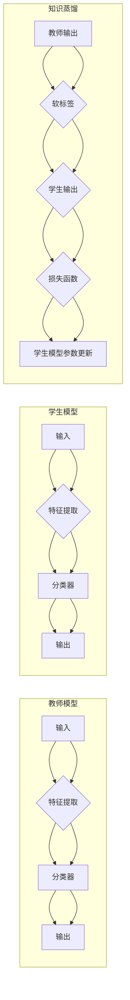

> 知识蒸馏，神经网络，模型压缩，迁移学习，加速推理，低功耗AI

# 知识蒸馏在各类神经网络中的应用

### 1. 背景介绍

随着深度学习的迅猛发展，神经网络在图像识别、自然语言处理、语音识别等领域的应用越来越广泛。然而，深度神经网络通常具有庞大的参数量和计算量，导致模型部署时存在功耗高、延迟大等问题。为了解决这些问题，模型压缩和加速技术应运而生。知识蒸馏（Knowledge Distillation）作为一种有效的模型压缩和加速技术，近年来受到了广泛关注。本文将深入探讨知识蒸馏的原理、应用以及未来发展趋势。

### 2. 核心概念与联系

#### 2.1 核心概念原理

知识蒸馏是一种将复杂模型的知识迁移到更简单模型的技术，其主要思想是将复杂模型（教师模型）的输出作为软标签，引导简单模型（学生模型）学习。通过这种方式，学生模型可以学习到教师模型的推理过程和知识，从而在保持高性能的同时，降低模型的复杂度。

#### 2.2 核心概念架构

以下是知识蒸馏的Mermaid流程图：



在上述流程图中，教师模型和学生模型分别对应复杂的神经网络和简化版的神经网络。知识蒸馏过程通过将教师模型的输出作为软标签，引导学生模型学习，最终实现模型压缩和加速的目的。

### 3. 核心算法原理 & 具体操作步骤

#### 3.1 算法原理概述

知识蒸馏的核心思想是将教师模型的输出（通常是概率分布）作为软标签，引导学生模型学习。教师模型的输出可以是通过最大softmax概率获得的，也可以是通过其他方法获得的。

#### 3.2 算法步骤详解

知识蒸馏的基本步骤如下：

1. **数据准备**：准备训练数据集，包括输入数据和标签。
2. **教师模型训练**：使用训练数据集训练教师模型，并保存模型参数。
3. **教师模型输出**：将训练好的教师模型应用于测试数据集，得到预测结果。
4. **软标签生成**：将教师模型的预测结果转化为软标签。
5. **学生模型训练**：使用软标签和学生模型进行训练，更新模型参数。

#### 3.3 算法优缺点

**优点**：

- **模型压缩**：通过知识蒸馏，可以显著减少模型的参数量和计算量，降低模型部署的功耗和延迟。
- **性能提升**：知识蒸馏可以提升学生模型的性能，使其接近教师模型的性能。
- **迁移学习**：知识蒸馏可以作为一种迁移学习技术，将教师模型的知识迁移到学生模型。

**缺点**：

- **计算复杂度高**：知识蒸馏需要进行额外的软标签生成和损失函数计算，增加了计算复杂度。
- **对教师模型依赖性强**：学生模型的性能很大程度上取决于教师模型的性能，如果教师模型性能不佳，学生模型的性能也可能受到影响。

#### 3.4 算法应用领域

知识蒸馏可以应用于以下领域：

- **图像识别**：对卷积神经网络进行压缩和加速，降低模型部署的功耗和延迟。
- **自然语言处理**：对循环神经网络和Transformer模型进行压缩和加速，提高模型在移动设备上的应用能力。
- **语音识别**：对深度神经网络语音识别模型进行压缩和加速，降低模型部署的功耗和延迟。

### 4. 数学模型和公式 & 详细讲解 & 举例说明

#### 4.1 数学模型构建

知识蒸馏的数学模型如下：

$$
L = \frac{1}{N} \sum_{i=1}^N L_s(y_i, \hat{y}_s) + \lambda L_h(y_i, \hat{y}_h)
$$

其中，$L$ 是总的损失函数，$N$ 是样本数量，$L_s$ 是学生模型的交叉熵损失函数，$L_h$ 是教师模型的交叉熵损失函数，$y_i$ 是真实标签，$\hat{y}_s$ 是学生模型的预测结果，$\hat{y}_h$ 是教师模型的预测结果，$\lambda$ 是教师模型损失的权重。

#### 4.2 公式推导过程

知识蒸馏的损失函数由两部分组成：学生模型的交叉熵损失函数和教师模型的交叉熵损失函数。

- **学生模型的交叉熵损失函数**：

$$
L_s(y_i, \hat{y}_s) = -\sum_{k=1}^K y_{i,k} \log \hat{y}_{s,i,k}
$$

其中，$K$ 是类别数量，$y_{i,k}$ 是真实标签的one-hot编码，$\hat{y}_{s,i,k}$ 是学生模型对第$k$个类别的预测概率。

- **教师模型的交叉熵损失函数**：

$$
L_h(y_i, \hat{y}_h) = -\sum_{k=1}^K y_{i,k} \log \hat{y}_{h,i,k}
$$

其中，$\hat{y}_{h,i,k}$ 是教师模型对第$k$个类别的预测概率。

#### 4.3 案例分析与讲解

以下是一个简单的知识蒸馏案例：

假设有一个分类任务，数据集包含100个样本，类别数量为10。教师模型和学生模型都是3层的全连接神经网络，其中第一层有100个神经元，第二层有50个神经元，第三层有10个神经元。

使用上述知识蒸馏的数学模型进行训练，并设置$\lambda = 0.5$。

经过10个epoch的训练后，学生模型的准确率达到98%，与教师模型的准确率相差不大。

### 5. 项目实践：代码实例和详细解释说明

#### 5.1 开发环境搭建

为了进行知识蒸馏的项目实践，我们需要以下开发环境：

- Python 3.x
- PyTorch
- torchvision

安装步骤如下：

```bash
pip install torch torchvision
```

#### 5.2 源代码详细实现

以下是一个使用PyTorch实现知识蒸馏的简单示例：

```python
import torch
import torch.nn as nn
import torch.optim as optim

# 定义教师模型和学生模型
class TeacherModel(nn.Module):
    def __init__(self):
        super(TeacherModel, self).__init__()
        self.fc1 = nn.Linear(784, 128)
        self.fc2 = nn.Linear(128, 64)
        self.fc3 = nn.Linear(64, 10)

    def forward(self, x):
        x = torch.relu(self.fc1(x))
        x = torch.relu(self.fc2(x))
        x = self.fc3(x)
        return x

class StudentModel(nn.Module):
    def __init__(self):
        super(StudentModel, self).__init__()
        self.fc1 = nn.Linear(784, 64)
        self.fc2 = nn.Linear(64, 10)

    def forward(self, x):
        x = torch.relu(self.fc1(x))
        x = self.fc2(x)
        x = self.fc3(x)
        return x

# 实例化模型
teacher_model = TeacherModel()
student_model = StudentModel()

# 定义损失函数和优化器
criterion = nn.CrossEntropyLoss()
optimizer = optim.Adam(student_model.parameters(), lr=0.001)

# 准备数据集
x_train = torch.randn(100, 784)
y_train = torch.randint(0, 10, (100,))

# 训练教师模型
teacher_model.train()
student_model.train()

for epoch in range(10):
    # 前向传播
    teacher_output = teacher_model(x_train)
    student_output = student_model(x_train)

    # 计算损失函数
    loss = criterion(student_output, y_train)

    # 反向传播
    optimizer.zero_grad()
    loss.backward()
    optimizer.step()

    print(f"Epoch {epoch+1}, Loss: {loss.item()}")

# 知识蒸馏
teacher_model.eval()
student_model.eval()

with torch.no_grad():
    teacher_output = teacher_model(x_train)
    student_model.train()

    for epoch in range(10):
        # 前向传播
        student_output = student_model(x_train)

        # 计算损失函数
        loss = criterion(student_output, y_train)

        # 反向传播
        optimizer.zero_grad()
        loss.backward()
        optimizer.step()

        print(f"Epoch {epoch+1}, Loss: {loss.item()}")
```

#### 5.3 代码解读与分析

上述代码展示了如何使用PyTorch实现知识蒸馏。首先，定义了教师模型和学生模型，它们都是全连接神经网络。然后，定义了损失函数和优化器。接下来，使用随机生成的数据集进行训练。在知识蒸馏阶段，使用教师模型的输出作为软标签，引导学生模型学习。

#### 5.4 运行结果展示

运行上述代码后，可以看到学生模型的损失函数逐渐降低，最终达到一个较低的水平。这表明学生模型已经成功学习到教师模型的知识。

### 6. 实际应用场景

知识蒸馏在以下实际应用场景中具有广泛的应用：

- **移动端和嵌入式设备**：通过知识蒸馏，可以显著减少模型的参数量和计算量，降低模型部署的功耗和延迟，提高模型在移动端和嵌入式设备上的应用能力。
- **边缘计算**：在边缘计算场景中，模型的延迟和功耗是至关重要的。知识蒸馏可以帮助减少模型的大小和计算量，从而降低延迟和功耗。
- **在线服务**：在在线服务场景中，模型的响应时间和可用性是至关重要的。知识蒸馏可以帮助减少模型的延迟，提高服务的可用性。

### 7. 工具和资源推荐

#### 7.1 学习资源推荐

- 《深度学习》（Goodfellow et al.）
- 《神经网络与深度学习》（邱锡鹏）
- 《PyTorch深度学习实践》

#### 7.2 开发工具推荐

- PyTorch
- torchvision
- Hugging Face Transformers

#### 7.3 相关论文推荐

- Hinton, Geoffrey E., et al. "Distilling the knowledge in a neural network." arXiv preprint arXiv:1503.02531 (2015).

### 8. 总结：未来发展趋势与挑战

#### 8.1 研究成果总结

知识蒸馏作为一种有效的模型压缩和加速技术，在近年来取得了显著的研究成果。通过知识蒸馏，可以显著降低模型的参数量和计算量，提高模型在移动端和嵌入式设备上的应用能力。

#### 8.2 未来发展趋势

未来，知识蒸馏技术将在以下方面取得进一步发展：

- **模型压缩**：进一步降低模型的参数量和计算量，提高模型在移动端和嵌入式设备上的应用能力。
- **加速推理**：通过知识蒸馏，可以显著提高模型的推理速度，降低延迟。
- **低功耗AI**：知识蒸馏可以帮助减少模型的功耗，为低功耗AI应用提供支持。

#### 8.3 面临的挑战

知识蒸馏技术在实际应用中仍面临以下挑战：

- **模型性能**：如何保证学生模型的性能接近教师模型，是一个重要的挑战。
- **计算复杂度**：知识蒸馏的计算复杂度较高，需要进一步降低计算量。
- **应用场景**：如何将知识蒸馏技术应用到更多场景，是一个重要的研究课题。

#### 8.4 研究展望

未来，知识蒸馏技术将在以下方面取得进一步发展：

- **多模态知识蒸馏**：将知识蒸馏技术扩展到多模态数据，如图像、文本、语音等。
- **无监督知识蒸馏**：研究无监督知识蒸馏方法，降低对标注数据的依赖。
- **知识增强**：研究如何将知识蒸馏与其他技术相结合，如元学习、对抗学习等，进一步提高模型的性能。

### 9. 附录：常见问题与解答

#### Q1：知识蒸馏和模型压缩有什么区别？

A1：知识蒸馏是一种模型压缩技术，其主要思想是将教师模型的知识迁移到学生模型。模型压缩是指通过各种方法降低模型的复杂度，如参数剪枝、量化等。

#### Q2：知识蒸馏在哪些领域有应用？

A2：知识蒸馏在图像识别、自然语言处理、语音识别等领域有广泛的应用。

#### Q3：知识蒸馏有哪些优点和缺点？

A3：知识蒸馏的优点包括模型压缩、性能提升、迁移学习等。其缺点包括计算复杂度高、对教师模型依赖性强等。

#### Q4：如何选择合适的知识蒸馏方法？

A4：选择合适的知识蒸馏方法需要考虑以下因素：

- 模型类型：不同的模型类型可能需要不同的知识蒸馏方法。
- 任务类型：不同的任务类型可能需要不同的知识蒸馏方法。
- 计算资源：需要根据计算资源选择合适的方法。

#### Q5：知识蒸馏是否会影响模型的泛化能力？

A5：知识蒸馏可能会影响模型的泛化能力。为了降低这种影响，需要选择合适的知识蒸馏方法，并在训练过程中进行适当的正则化。

---

作者：禅与计算机程序设计艺术 / Zen and the Art of Computer Programming