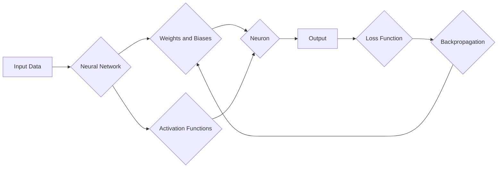

# 神经网络：机器学习工具箱中的新宠

> 关键词：神经网络，机器学习，深度学习，监督学习，非监督学习，卷积神经网络，递归神经网络，强化学习，应用场景

## 1. 背景介绍

### 1.1 问题的由来

自20世纪50年代以来，机器学习领域经历了多次起伏，其中最为显著的转折点是深度学习的兴起。深度学习作为一种机器学习的方法，通过模仿人脑神经网络的工作原理，在图像识别、语音识别、自然语言处理等领域取得了突破性的成果。而神经网络作为深度学习的基础，已经成为机器学习工具箱中的新宠。

### 1.2 研究现状

随着计算能力的提升和大数据的涌现，神经网络的研究和应用得到了快速发展。目前，神经网络已经在多个领域取得了显著的进展，如：

- 图像识别：卷积神经网络（CNN）在图像分类、目标检测、图像分割等领域取得了优异的性能。
- 语音识别：递归神经网络（RNN）及其变体在语音识别任务中表现出色。
- 自然语言处理：序列到序列模型（如Transformer）在机器翻译、文本摘要等领域取得了突破。
- 强化学习：深度强化学习在游戏、机器人、自动驾驶等领域展现出巨大的潜力。

### 1.3 研究意义

神经网络作为机器学习的重要工具，具有以下重要意义：

- 提升机器学习模型的性能：神经网络能够学习复杂的非线性关系，提高模型的准确性和泛化能力。
- 扩展机器学习的应用范围：神经网络可以应用于图像、语音、文本等多种数据类型，拓展机器学习的应用领域。
- 促进人工智能技术的发展：神经网络是构建智能系统的基础，对人工智能技术的进步具有重要意义。

### 1.4 本文结构

本文将系统介绍神经网络的原理、算法、应用场景和未来发展趋势。具体结构如下：

- 第2部分：介绍神经网络的核心理念和基本架构。
- 第3部分：详细阐述神经网络的核心算法原理和具体操作步骤。
- 第4部分：讲解神经网络的数学模型和公式，并通过实例进行说明。
- 第5部分：给出神经网络的代码实例，并进行详细解释和分析。
- 第6部分：探讨神经网络的实际应用场景和未来应用展望。
- 第7部分：推荐神经网络相关的学习资源、开发工具和参考文献。
- 第8部分：总结神经网络的未来发展趋势与挑战。
- 第9部分：附录，提供常见问题与解答。

## 2. 核心概念与联系

### 2.1 核心概念

#### 2.1.1 人工神经网络

人工神经网络（Artificial Neural Network，ANN）是一种模拟人脑神经元结构和功能的计算模型。它由大量的神经元组成，通过神经元之间的连接和权重调整，实现信息的传递和计算。

#### 2.1.2 激活函数

激活函数（Activation Function）是神经网络中的关键组成部分，用于引入非线性特性，使模型能够学习复杂的非线性关系。

#### 2.1.3 权重和偏置

权重（Weight）和偏置（Bias）是神经网络中的参数，用于调整神经元之间的连接强度和偏移量。

#### 2.1.4 前向传播和反向传播

前向传播（Forward Propagation）和反向传播（Backward Propagation）是神经网络训练过程中的两个基本步骤。前向传播用于计算模型输出，反向传播用于计算梯度并更新权重和偏置。

### 2.2 核心概念原理和架构的 Mermaid 流程图



### 2.3 核心概念之间的联系

人工神经网络由神经元组成，每个神经元通过权重和偏置连接其他神经元。激活函数用于引入非线性特性，使模型能够学习复杂的非线性关系。前向传播和反向传播是实现神经网络训练和优化的关键步骤。

## 3. 核心算法原理 & 具体操作步骤

### 3.1 算法原理概述

神经网络的核心算法原理是通过反向传播算法不断优化模型参数，使模型输出与真实标签之间的差异最小化。

### 3.2 算法步骤详解

1. **初始化参数**：随机初始化权重和偏置。
2. **前向传播**：将输入数据传递到网络中，计算每个神经元的输出。
3. **计算损失**：计算模型输出与真实标签之间的差异，得到损失值。
4. **反向传播**：根据损失值计算梯度，并更新权重和偏置。
5. **迭代优化**：重复步骤2-4，直至满足终止条件。

### 3.3 算法优缺点

#### 3.3.1 优点

- 可以学习复杂的非线性关系。
- 具有良好的泛化能力。
- 可以应用于各种数据类型。

#### 3.3.2 缺点

- 训练过程需要大量的计算资源。
- 模型可解释性较差。

### 3.4 算法应用领域

神经网络可以应用于各种领域，如：

- 图像识别
- 语音识别
- 自然语言处理
- 机器翻译
- 机器人

## 4. 数学模型和公式 & 详细讲解 & 举例说明

### 4.1 数学模型构建

神经网络可以表示为以下数学模型：

$$
y = f(W \cdot x + b)
$$

其中，$y$ 是输出，$x$ 是输入，$W$ 是权重矩阵，$b$ 是偏置向量，$f$ 是激活函数。

### 4.2 公式推导过程

以下以多层感知机（MLP）为例，介绍神经网络的公式推导过程。

#### 4.2.1 单层感知机

单层感知机可以表示为：

$$
z = W_1 \cdot x + b_1
$$

其中，$z$ 是输出，$x$ 是输入，$W_1$ 是权重矩阵，$b_1$ 是偏置向量。

#### 4.2.2 多层感知机

多层感知机可以表示为：

$$
y = f(W_n \cdot f(W_{n-1} \cdot ... \cdot f(W_2 \cdot (W_1 \cdot x + b_1) + b_2) + ... + b_n))
$$

其中，$y$ 是输出，$x$ 是输入，$W$ 是权重矩阵，$b$ 是偏置向量，$f$ 是激活函数。

### 4.3 案例分析与讲解

以下以图像识别任务为例，介绍神经网络的案例分析和讲解。

#### 4.3.1 任务描述

给定一张图像，将其分类为猫或狗。

#### 4.3.2 数据预处理

- 将图像转换为灰度图。
- 对图像进行缩放，使图像尺寸一致。

#### 4.3.3 模型设计

- 使用卷积神经网络（CNN）作为模型架构。
- 第一层使用卷积层提取图像特征。
- 第二层使用池化层降低特征维度。
- 第三层使用全连接层进行分类。

#### 4.3.4 训练与评估

- 使用数据集进行训练，优化模型参数。
- 使用验证集评估模型性能。

## 5. 项目实践：代码实例和详细解释说明

### 5.1 开发环境搭建

- 安装 Python 3.8 及以上版本。
- 安装 TensorFlow 或 PyTorch 深度学习框架。
- 安装 NumPy、Pandas、Matplotlib 等常用库。

### 5.2 源代码详细实现

以下是一个简单的图像识别模型的代码示例：

```python
import tensorflow as tf
from tensorflow.keras.models import Sequential
from tensorflow.keras.layers import Conv2D, MaxPooling2D, Flatten, Dense

# 创建模型
model = Sequential([
    Conv2D(32, (3, 3), activation='relu', input_shape=(64, 64, 3)),
    MaxPooling2D((2, 2)),
    Flatten(),
    Dense(128, activation='relu'),
    Dense(2, activation='softmax')
])

# 编译模型
model.compile(optimizer='adam', loss='sparse_categorical_crossentropy', metrics=['accuracy'])

# 训练模型
model.fit(train_images, train_labels, epochs=10, validation_data=(test_images, test_labels))

# 评估模型
test_loss, test_acc = model.evaluate(test_images, test_labels)
print(f"Test accuracy: {test_acc}")
```

### 5.3 代码解读与分析

- `Sequential`：构建一个线性堆叠的模型。
- `Conv2D`：卷积层，用于提取图像特征。
- `MaxPooling2D`：池化层，用于降低特征维度。
- `Flatten`：将多维输入数据展平为一维。
- `Dense`：全连接层，用于分类。

## 6. 实际应用场景

神经网络在各个领域都有广泛的应用，以下列举一些典型的应用场景：

- **图像识别**：通过卷积神经网络（CNN）对图像进行分类、目标检测、图像分割等任务。
- **语音识别**：通过递归神经网络（RNN）或 Transformer 模型对语音信号进行识别和转写。
- **自然语言处理**：通过序列到序列模型（如 Transformer）对文本进行机器翻译、情感分析、文本摘要等任务。
- **游戏**：通过深度强化学习让智能体在游戏中学习策略。
- **自动驾驶**：通过计算机视觉和深度学习技术实现车辆的感知、规划和控制。

### 6.4 未来应用展望

随着深度学习技术的不断进步，神经网络的应用领域将更加广泛，以下是一些可能的未来应用场景：

- **医疗**：通过深度学习技术辅助医生进行疾病诊断、药物研发等。
- **金融**：通过深度学习技术进行风险管理、信用评估、欺诈检测等。
- **教育**：通过智能教育系统实现个性化教学、智能批改等。
- **交通**：通过智能交通系统实现交通流量预测、交通事故预警等。

## 7. 工具和资源推荐

### 7.1 学习资源推荐

- 《深度学习》（Goodfellow, Bengio, Courville著）
- 《Python深度学习》（François Chollet 著）
- 《动手学深度学习》（花书）

### 7.2 开发工具推荐

- TensorFlow
- PyTorch
- Keras

### 7.3 相关论文推荐

- LeCun, Y., Bottou, L., Bengio, Y., & Haffner, P. (1998). Gradient-based learning applied to document recognition. Proceedings of the IEEE, 86(11), 2278-2324.
- Krizhevsky, A., Sutskever, I., & Hinton, G. E. (2012). Imagenet classification with deep convolutional neural networks. In Advances in neural information processing systems (pp. 1097-1105).
- Hochreiter, S., & Schmidhuber, J. (1997). Long short-term memory. Neural computation, 9(8), 1735-1780.

## 8. 总结：未来发展趋势与挑战

### 8.1 研究成果总结

神经网络作为一种强大的机器学习工具，在各个领域都取得了显著的成果。随着深度学习技术的不断发展，神经网络的性能和应用范围将不断拓展。

### 8.2 未来发展趋势

- 模型轻量化：开发更轻量级的神经网络模型，降低计算和存储成本。
- 可解释性：提高神经网络的解释性，使其决策过程更加透明。
- 多模态学习：融合多种模态数据，实现更全面的信息处理。

### 8.3 面临的挑战

- 计算资源：深度学习模型需要大量的计算资源，如何降低计算成本是一个挑战。
- 数据隐私：如何保护用户数据隐私是一个重要问题。
- 模型安全：如何防止恶意攻击和滥用也是一个挑战。

### 8.4 研究展望

神经网络作为机器学习工具箱中的新宠，未来将在各个领域发挥越来越重要的作用。随着技术的不断发展，神经网络将在以下方面取得突破：

- 模型性能：提高神经网络的性能，使其在更多领域达到或超越人类水平。
- 可解释性：提高神经网络的解释性，使其决策过程更加透明。
- 集成学习：将神经网络与其他机器学习技术相结合，实现更强大的功能。

## 9. 附录：常见问题与解答

**Q1：神经网络和机器学习的关系是什么？**

A：神经网络是机器学习的一种方法，通过模拟人脑神经元的工作原理，实现信息的传递和计算。

**Q2：什么是深度学习？**

A：深度学习是机器学习的一个子领域，通过构建多层神经网络，学习复杂的数据特征。

**Q3：神经网络有哪些类型？**

A：神经网络包括卷积神经网络（CNN）、递归神经网络（RNN）、Transformer、生成对抗网络（GAN）等。

**Q4：神经网络在哪些领域应用广泛？**

A：神经网络在图像识别、语音识别、自然语言处理、游戏、自动驾驶等领域都有广泛应用。

**Q5：如何选择合适的神经网络模型？**

A：选择合适的神经网络模型需要根据具体任务和数据特点进行选择。一般来说，对于图像识别任务，可以使用 CNN；对于序列数据处理任务，可以使用 RNN 或 Transformer。

**Q6：神经网络有哪些局限性？**

A：神经网络的局限性包括计算资源需求大、可解释性差、容易过拟合等。

**Q7：如何解决神经网络的过拟合问题？**

A：解决神经网络的过拟合问题可以采用正则化、数据增强、Dropout、早停法等方法。

**Q8：神经网络在人工智能领域有哪些应用前景？**

A：神经网络在人工智能领域有广泛的应用前景，包括图像识别、语音识别、自然语言处理、游戏、自动驾驶、医疗、金融等领域。

作者：禅与计算机程序设计艺术 / Zen and the Art of Computer Programming