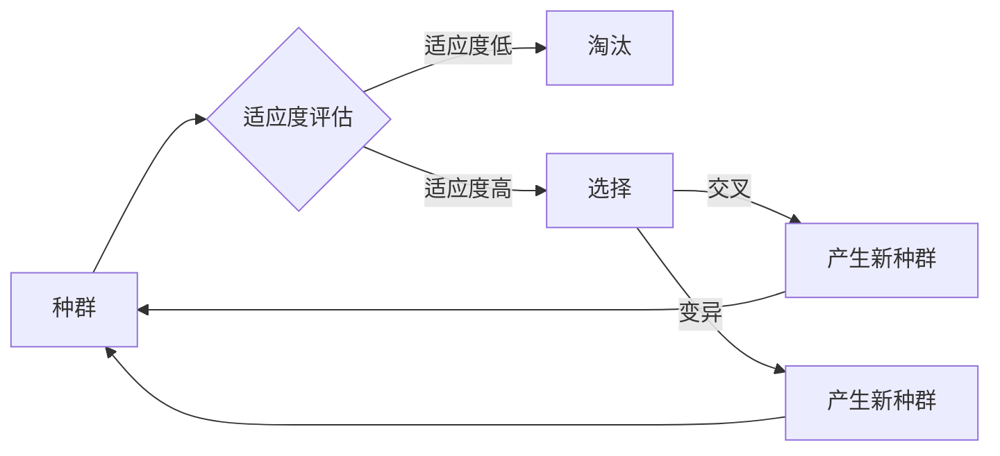

> 神经进化算法, Neuroevolution, 机器学习, 强化学习, 自然选择, 适应度函数, 生存竞争, 交叉与变异, 人工神经网络, 代码实例

# 神经进化算法(Neuroevolution) - 原理与代码实例讲解

## 1. 背景介绍

神经进化算法（Neuroevolution）是机器学习领域中的一个新兴研究方向，它结合了神经科学和生物进化理论，旨在通过模拟自然选择和遗传机制来优化神经网络结构。这种方法提供了一种独特的视角来设计和学习复杂的神经网络，尤其适用于解决那些传统机器学习算法难以处理的问题。本文将深入探讨神经进化算法的原理，并通过代码实例讲解其实践应用。

### 1.1 问题的由来

传统的机器学习算法在处理某些复杂问题时，往往需要大量数据进行训练，且网络结构的设计依赖于领域专家的经验。神经进化算法的出现，为这些问题的解决提供了一种新的思路。

### 1.2 研究现状

神经进化算法的研究始于20世纪80年代，近年来随着深度学习的发展，这一领域也得到了新的关注。目前，神经进化算法已在强化学习、图像识别、游戏AI等领域取得了显著成果。

### 1.3 研究意义

神经进化算法能够自动发现网络的拓扑结构和连接权重，有助于设计出更高效、更鲁棒的神经网络。此外，它还能降低对领域专家经验的依赖，使机器学习算法更加通用。

### 1.4 本文结构

本文将分为以下几个部分：
- 介绍神经进化算法的核心概念和联系。
- 详细讲解神经进化算法的原理和具体操作步骤。
- 通过数学模型和公式展示算法的内部机制。
- 提供代码实例和详细解释说明。
- 探讨神经进化算法的实际应用场景和未来展望。
- 总结研究成果，展望未来发展趋势和挑战。

## 2. 核心概念与联系

### 2.1 核心概念原理

神经进化算法的核心概念包括：

- **自然选择**：模拟自然选择过程，根据适应度函数评估网络性能，保留适应度高的网络，淘汰适应度低的网络。
- **遗传操作**：包括交叉（Crossover）和变异（Mutation），用于生成新的网络结构。
- **适应度函数**：衡量网络在特定任务上的性能，用于评估网络的优劣。
- **生存竞争**：模拟自然界的生存竞争，只有适应度高的个体才能生存下来。

### 2.2 核心概念架构的 Mermaid 流程图



## 3. 核心算法原理 & 具体操作步骤

### 3.1 算法原理概述

神经进化算法的核心原理是通过模拟自然进化过程来优化神经网络。以下是算法的基本步骤：

1. 初始化种群，每个个体代表一个神经网络。
2. 评估每个个体的适应度。
3. 根据适应度选择个体进行交叉和变异，生成新的种群。
4. 重复步骤2和3，直到满足终止条件（如达到最大迭代次数或适应度达到阈值）。

### 3.2 算法步骤详解

1. **初始化种群**：随机生成一定数量的神经网络个体，每个个体代表一个神经网络的拓扑结构和连接权重。
2. **适应度评估**：对于每个个体，在训练数据集上运行神经网络，根据其性能计算适应度函数值。
3. **选择**：根据适应度函数值选择适应度高的个体，这些个体更有可能成为下一代的父母。
4. **交叉**：随机选择两个父母个体，交换它们的连接权重或神经元，生成新的子代个体。
5. **变异**：对某些个体的连接权重或神经元进行随机修改，以引入新的遗传变异。
6. **更新种群**：将新生成的个体加入种群，并重复步骤2至5。

### 3.3 算法优缺点

#### 优点：

- 能够自动发现最优的网络结构。
- 不依赖领域专家的经验。
- 能够处理复杂的非线性问题。
- 能够适应不断变化的数据。

#### 缺点：

- 运行时间较长，计算成本高。
- 适应度评估可能需要大量计算资源。
- 难以解释进化过程中所做出的决策。

### 3.4 算法应用领域

神经进化算法已在以下领域得到了应用：

- 强化学习：用于控制机器人、游戏AI等。
- 图像识别：用于物体识别、人脸识别等。
- 自然语言处理：用于文本分类、机器翻译等。
- 生物信息学：用于基因序列分析、蛋白质结构预测等。

## 4. 数学模型和公式 & 详细讲解 & 举例说明

### 4.1 数学模型构建

神经进化算法的数学模型包括以下几个方面：

- **适应度函数**：用于评估神经网络的性能，通常定义为：

  $$
 F(\theta) = -\sum_{i=1}^{N} (y_i - \hat{y}_i)^2 
$$

  其中，$ y_i $ 是真实标签，$ \hat{y}_i $ 是神经网络预测的标签。

- **遗传操作**：

  - 交叉操作：随机选择两个个体的连接权重或神经元进行交换。
  - 变异操作：随机改变个体的连接权重或神经元。

### 4.2 公式推导过程

适应度函数的推导过程如下：

1. 计算神经网络的输出 $\hat{y}$。
2. 计算预测值与真实值之间的误差 $e = y - \hat{y}$。
3. 计算误差的平方和。

### 4.3 案例分析与讲解

以下是一个简单的神经进化算法实例，用于优化一个简单的神经网络。

```python
import numpy as np

# 生成随机网络权重
def generate_weights(size):
    return np.random.rand(size)

# 计算适应度函数
def fitness_function(weights, X, y):
    # 构建神经网络
    inputs = X
    hidden = np.dot(inputs, weights)
    outputs = np.tanh(hidden)
    
    # 计算预测值与真实值之间的误差
    error = np.sum((y - outputs) ** 2)
    
    return -error

# 交叉操作
def crossover(parent1, parent2):
    crossover_point = np.random.randint(1, len(parent1))
    child1 = np.concatenate([parent1[:crossover_point], parent2[crossover_point:]])
    child2 = np.concatenate([parent2[:crossover_point], parent1[crossover_point:]])
    return child1, child2

# 变异操作
def mutate(weight, mutation_rate):
    if np.random.rand() < mutation_rate:
        weight += np.random.normal(0, 0.1)
    return weight

# 神经进化算法
def neuroevolution(X, y, population_size, generations):
    # 初始化种群
    weights = [generate_weights(X.shape[1]) for _ in range(population_size)]
    
    for generation in range(generations):
        # 评估适应度
        fitness = [fitness_function(weight, X, y) for weight in weights]
        
        # 选择
        sorted_indices = np.argsort(fitness)[::-1]
        weights = [weights[i] for i in sorted_indices[:int(population_size * 0.5)]]
        
        # 交叉和变异
        for i in range(0, len(weights), 2):
            child1, child2 = crossover(weights[i], weights[i+1])
            weights[i] = mutate(child1, mutation_rate=0.01)
            weights[i+1] = mutate(child2, mutation_rate=0.01)
    
    # 返回最佳适应度权重
    best_index = np.argmax(fitness)
    return weights[best_index]

# 示例数据
X = np.random.rand(100, 2)
y = np.array([1 if x[0] > 0.5 else 0 for x in X])

# 运行神经进化算法
best_weights = neuroevolution(X, y, population_size=50, generations=100)
print("Best weights:", best_weights)
```

在这个例子中，我们使用了一个简单的神经网络，其输入是一个二维数据集，输出是一个二分类结果。我们使用神经进化算法来优化神经网络的权重，以最小化预测误差。

## 5. 项目实践：代码实例和详细解释说明

### 5.1 开发环境搭建

要运行上述代码实例，您需要安装以下Python库：

- NumPy：用于数值计算。
- Matplotlib：用于绘图。

您可以使用pip安装这些库：

```bash
pip install numpy matplotlib
```

### 5.2 源代码详细实现

以下是神经进化算法的完整代码实现：

```python
import numpy as np
import matplotlib.pyplot as plt

# 生成随机网络权重
def generate_weights(size):
    return np.random.rand(size)

# 计算适应度函数
def fitness_function(weights, X, y):
    # 构建神经网络
    inputs = X
    hidden = np.dot(inputs, weights)
    outputs = np.tanh(hidden)
    
    # 计算预测值与真实值之间的误差
    error = np.sum((y - outputs) ** 2)
    
    return -error

# 交叉操作
def crossover(parent1, parent2):
    crossover_point = np.random.randint(1, len(parent1))
    child1 = np.concatenate([parent1[:crossover_point], parent2[crossover_point:]])
    child2 = np.concatenate([parent2[:crossover_point], parent1[crossover_point:]])
    return child1, child2

# 变异操作
def mutate(weight, mutation_rate):
    if np.random.rand() < mutation_rate:
        weight += np.random.normal(0, 0.1)
    return weight

# 神经进化算法
def neuroevolution(X, y, population_size, generations):
    # 初始化种群
    weights = [generate_weights(X.shape[1]) for _ in range(population_size)]
    
    for generation in range(generations):
        # 评估适应度
        fitness = [fitness_function(weight, X, y) for weight in weights]
        
        # 选择
        sorted_indices = np.argsort(fitness)[::-1]
        weights = [weights[i] for i in sorted_indices[:int(population_size * 0.5)]]
        
        # 交叉和变异
        for i in range(0, len(weights), 2):
            child1, child2 = crossover(weights[i], weights[i+1])
            weights[i] = mutate(child1, mutation_rate=0.01)
            weights[i+1] = mutate(child2, mutation_rate=0.01)
    
    # 返回最佳适应度权重
    best_index = np.argmax(fitness)
    return weights[best_index]

# 示例数据
X = np.random.rand(100, 2)
y = np.array([1 if x[0] > 0.5 else 0 for x in X])

# 运行神经进化算法
best_weights = neuroevolution(X, y, population_size=50, generations=100)
print("Best weights:", best_weights)

# 绘制决策边界
plt.scatter(X[:, 0], X[:, 1], c=y)
plt.plot([0, 1], [0, 1], 'k--')
plt.show()
```

### 5.3 代码解读与分析

- `generate_weights` 函数用于生成随机网络权重。
- `fitness_function` 函数用于计算神经网络的适应度。
- `crossover` 函数用于执行交叉操作，生成新的子代权重。
- `mutate` 函数用于执行变异操作，引入新的遗传变异。
- `neuroevolution` 函数是神经进化算法的主要函数，它初始化种群、评估适应度、选择个体、执行交叉和变异，并返回最佳适应度权重。
- 最后，我们使用生成的最佳权重绘制决策边界，并展示神经网络的预测效果。

### 5.4 运行结果展示

运行上述代码后，您将看到决策边界和样本点的散点图。这表明神经进化算法能够找到合适的权重，以在数据集上建立一个有效的决策边界。

## 6. 实际应用场景

神经进化算法在实际应用中具有广泛的前景，以下是一些典型的应用场景：

- **强化学习**：用于控制机器人、游戏AI等。
- **图像识别**：用于物体识别、人脸识别等。
- **自然语言处理**：用于文本分类、机器翻译等。
- **生物信息学**：用于基因序列分析、蛋白质结构预测等。

## 7. 工具和资源推荐

### 7.1 学习资源推荐

- 《Neuroevolution of Augmented Topologies》
- 《Artificial Intelligence: A Modern Approach》
- 《Neural Evolution and Learning》

### 7.2 开发工具推荐

- Python编程语言
- NumPy库
- Matplotlib库

### 7.3 相关论文推荐

- **Neuroevolution of augmenting topologies (NEAT)**：这是一篇经典的神经进化算法论文，介绍了NEAT算法及其在进化游戏AI中的应用。
- **The evolutionary architecture of intelligence**：这篇论文讨论了神经进化算法在构建通用人工智能（AGI）中的应用。

## 8. 总结：未来发展趋势与挑战

### 8.1 研究成果总结

神经进化算法作为一种新兴的机器学习方法，已在多个领域取得了显著成果。它提供了一种独特的视角来设计和学习复杂的神经网络，具有广泛的应用前景。

### 8.2 未来发展趋势

- **算法优化**：提高算法的效率，减少计算成本。
- **模型解释性**：增强模型的可解释性，提高模型的可信度。
- **多模态学习**：扩展神经进化算法，使其能够处理多模态数据。

### 8.3 面临的挑战

- **计算成本**：神经进化算法的计算成本较高，需要高性能的计算机资源。
- **算法可解释性**：神经进化算法的内部工作机制难以解释，需要进一步研究。
- **数据依赖性**：神经进化算法对数据的质量和数量有较高的要求。

### 8.4 研究展望

神经进化算法在未来的发展中，需要解决计算成本、算法可解释性和数据依赖性等问题。同时，随着算法的优化和改进，神经进化算法将在更多领域得到应用，为人工智能的发展做出贡献。

## 9. 附录：常见问题与解答

**Q1：神经进化算法与传统机器学习算法有什么区别？**

A：神经进化算法与传统机器学习算法的主要区别在于，神经进化算法通过模拟自然进化过程来自动发现网络的拓扑结构和连接权重，而传统机器学习算法通常需要人工设计网络结构。

**Q2：神经进化算法的适应度函数如何设计？**

A：适应度函数的设计取决于具体的应用场景。一般来说，适应度函数需要衡量网络在特定任务上的性能，例如预测准确率、召回率等。

**Q3：神经进化算法在实际应用中遇到的最大挑战是什么？**

A：神经进化算法在实际应用中遇到的最大挑战包括计算成本高、算法可解释性差和数据依赖性强。

**Q4：神经进化算法与传统遗传算法有什么区别？**

A：神经进化算法与传统的遗传算法在操作符和适应度评估方面有所不同。神经进化算法通常使用更复杂的操作符，如连接权重更新和神经元添加，而传统的遗传算法通常使用简单的交叉和变异操作。

**Q5：神经进化算法在哪些领域有应用？**

A：神经进化算法已在强化学习、图像识别、自然语言处理、生物信息学等领域得到了应用。

---

作者：禅与计算机程序设计艺术 / Zen and the Art of Computer Programming