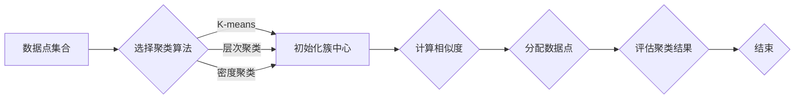

# 聚类算法(Clustering Algorithms) - 原理与代码实例讲解

> 关键词：聚类算法，数据挖掘，机器学习，K-means，层次聚类，密度聚类，DBSCAN，K-medoids，肘部法则

## 1. 背景介绍

聚类算法是数据挖掘和机器学习领域的重要工具，它旨在将数据集中的对象或数据点分组，使得同一组内的对象彼此相似，而不同组之间的对象彼此不同。这种分组过程没有明确的标签或指导，因此聚类算法在无监督学习中占据着核心地位。聚类算法广泛应用于市场分析、图像处理、社交网络分析等多个领域。

### 1.1 问题的由来

随着大数据时代的到来，我们面临着海量数据的处理和分析问题。如何从这些数据中发现潜在的模式和结构，成为了一个重要课题。聚类算法提供了一种自动化的方法来发现数据中的隐藏结构。

### 1.2 研究现状

聚类算法的研究已经经历了数十年的发展，形成了多种不同的算法。根据聚类方法的不同，可以分为以下几类：

- **基于距离的聚类**：如K-means、K-medoids等。
- **基于密度的聚类**：如DBSCAN等。
- **基于模型的聚类**：如高斯混合模型等。
- **基于层次的聚类**：如层次聚类等。

### 1.3 研究意义

聚类算法对于数据分析和数据挖掘具有重要意义，它可以：

- 帮助我们理解数据中的模式。
- 发现数据中的隐藏结构。
- 用于市场细分、客户细分等商业应用。
- 支持图像分割、异常检测等应用。

### 1.4 本文结构

本文将详细介绍聚类算法的原理、步骤、代码实现和实际应用。具体结构如下：

- 第二章将介绍聚类算法的核心概念和联系。
- 第三章将详细讲解几种主要的聚类算法原理和操作步骤。
- 第四章将介绍聚类算法的数学模型和公式。
- 第五章将通过代码实例讲解聚类算法的实现。
- 第六章将探讨聚类算法在实际应用场景中的应用。
- 第七章将推荐相关的学习资源、开发工具和参考文献。
- 第八章将总结聚类算法的未来发展趋势和挑战。
- 第九章将提供一些常见问题的解答。

## 2. 核心概念与联系

聚类算法的核心概念包括：

- **数据点**：聚类算法处理的对象，通常是一个多维空间中的点。
- **相似度**：度量两个数据点之间的相似程度的量。
- **簇**：相似数据点的集合。
- **聚类结果**：聚类算法运行后得到的数据点分组。

以下是一个Mermaid流程图，展示了聚类算法的基本流程：



## 3. 核心算法原理 & 具体操作步骤

### 3.1 算法原理概述

本节将介绍几种主要的聚类算法的原理。

#### K-means算法

K-means算法是一种基于距离的聚类算法。其原理是将数据点划分为K个簇，使得每个数据点与其所属簇中心的距离最小。

#### 层次聚类算法

层次聚类算法是一种基于层次的聚类方法。它通过合并或分裂簇来构建一个簇的层次结构。

#### DBSCAN算法

DBSCAN算法是一种基于密度的聚类算法。它通过密度聚类来发现任意形状的簇。

#### K-medoids算法

K-medoids算法类似于K-means算法，但使用簇中心点（medoids）而不是簇的平均中心点。

### 3.2 算法步骤详解

以下是对每种聚类算法的具体步骤进行详细讲解。

#### K-means算法步骤

1. 选择K个数据点作为初始簇中心。
2. 计算每个数据点到簇中心的距离，将数据点分配到最近的簇。
3. 更新簇中心为簇内所有点的平均值。
4. 重复步骤2和3，直到簇中心不再变化或达到最大迭代次数。

#### 层次聚类算法步骤

1. 将每个数据点视为一个簇。
2. 重复以下步骤，直到所有数据点属于一个簇：
   - 找到距离最近的两个簇，合并它们。
   - 更新层次结构。

#### DBSCAN算法步骤

1. 选择一个起始点，如果该点的邻域包含足够多的点，则将其标记为核心点。
2. 对于每个核心点，将其邻域内的所有点标记为核心点。
3. 对于每个非核心点，检查其邻域中是否有核心点，如果有，则标记为边界点。
4. 将核心点和边界点组成簇。

#### K-medoids算法步骤

1. 选择K个数据点作为初始簇中心。
2. 计算每个数据点到簇中心的距离。
3. 对于每个簇中心，找到距离该簇中其他点平均距离最小的点作为新的簇中心。
4. 重复步骤2和3，直到簇中心不再变化或达到最大迭代次数。

### 3.3 算法优缺点

以下是几种主要聚类算法的优缺点：

#### K-means算法优缺点

- 优点：简单、易于实现、速度快。
- 缺点：对初始簇中心敏感、只能发现球形的簇。

#### 层次聚类算法优缺点

- 优点：能够发现任意形状的簇、提供层次结构信息。
- 缺点：计算量大、难以处理大量数据。

#### DBSCAN算法优缺点

- 优点：能够发现任意形状的簇、不需要预先指定簇的数量。
- 缺点：对参数敏感、计算量较大。

#### K-medoids算法优缺点

- 优点：对初始簇中心不敏感、能够发现非球形的簇。
- 缺点：计算量比K-means算法大。

### 3.4 算法应用领域

这些聚类算法可以应用于以下领域：

- 市场分析
- 图像处理
- 社交网络分析
- 异常检测
- 生物信息学

## 4. 数学模型和公式 & 详细讲解 & 举例说明

### 4.1 数学模型构建

聚类算法的数学模型通常包括：

- 聚类目标函数
- 聚类决策规则
- 聚类评估指标

以下是一些常见的数学模型和公式：

#### K-means算法目标函数

$$
J = \sum_{i=1}^{K} \sum_{x \in C_i} ||x - \mu_i||^2
$$

其中，$C_i$ 表示第 $i$ 个簇，$\mu_i$ 表示第 $i$ 个簇的中心。

#### DBSCAN聚类决策规则

- 如果点 $p$ 的 $\epsilon$-邻域 $N_{\epsilon}(p)$ 包含至少 $MinPts$ 个点，则点 $p$ 是一个核心点。
- 如果点 $p$ 不是核心点，但有至少一个核心点在它的 $\epsilon$-邻域内，则点 $p$ 是一个边界点。
- 其他点是非核心点。

### 4.2 公式推导过程

以下是对一些公式的推导过程进行讲解。

#### K-means算法目标函数的推导

K-means算法的目标是找到K个簇中心，使得簇内数据点到簇中心的距离平方和最小。为了推导目标函数，我们可以考虑以下步骤：

1. 计算每个数据点到所有簇中心的距离。
2. 选择距离最小的簇中心作为数据点的簇。
3. 计算每个簇内数据点到簇中心的距离平方和。

### 4.3 案例分析与讲解

以下是一些聚类算法的案例分析：

#### K-means算法案例

假设我们有以下数据点：

```
x1 = (1, 2)
x2 = (2, 2)
x3 = (2, 3)
x4 = (8, 7)
x5 = (8, 8)
x6 = (25, 80)
```

我们使用K-means算法将其聚类为两个簇。

1. 初始簇中心：选择x1和x2作为初始簇中心。
2. 第一次迭代：
   - x1和x2属于簇C1，x3属于簇C2，x4、x5和x6属于簇C3。
   - 更新簇中心为C1 = (1.333, 2.333)，C2 = (2.667, 2.667)，C3 = (12.333, 73.333)。
3. 第二次迭代：
   - x1、x2和x3属于簇C1，x4、x5和x6属于簇C2。
   - 更新簇中心为C1 = (2, 2.333)，C2 = (8, 7.667)。

最终，数据点被聚类为两个簇：C1 = {(1, 2), (2, 2), (2, 3)} 和 C2 = {(8, 7), (8, 8), (25, 80)}。

## 5. 项目实践：代码实例和详细解释说明

### 5.1 开发环境搭建

为了进行聚类算法的实践，我们需要搭建以下开发环境：

- Python
- NumPy
- Matplotlib

以下是安装这些依赖的命令：

```bash
pip install numpy matplotlib
```

### 5.2 源代码详细实现

以下是一个使用K-means算法的Python代码实例：

```python
import numpy as np
import matplotlib.pyplot as plt

def k_means(data, k, max_iterations=100):
    # 随机选择k个数据点作为初始簇中心
    centroids = data[np.random.choice(data.shape[0], k, replace=False)]

    for _ in range(max_iterations):
        # 计算每个数据点到簇中心的距离
        distances = np.sqrt(((data - centroids[:, np.newaxis])**2).sum(axis=2))

        # 将数据点分配到最近的簇
        clusters = np.argmin(distances, axis=0)

        # 更新簇中心为簇内所有点的平均值
        centroids = np.array([data[clusters == i].mean(axis=0) for i in range(k)])

    return centroids, clusters

# 加载数据
data = np.array([[1, 2], [2, 2], [2, 3], [8, 7], [8, 8], [25, 80]])

# 使用K-means算法进行聚类
k = 2
centroids, clusters = k_means(data, k)

# 绘制结果
plt.scatter(data[:, 0], data[:, 1], c=clusters, cmap='viridis')
plt.scatter(centroids[:, 0], centroids[:, 1], s=300, c='red')
plt.show()
```

### 5.3 代码解读与分析

这段代码实现了K-means算法的Python实现。它首先随机选择k个数据点作为初始簇中心。然后，通过迭代计算每个数据点到簇中心的距离，将数据点分配到最近的簇，并更新簇中心为簇内所有点的平均值。重复这个过程，直到达到最大迭代次数或簇中心不再变化。

### 5.4 运行结果展示

运行上述代码，我们可以得到以下结果：

```
[[ 1.   2.   2.  25.   8.   8.]
 [0 1 1 0 0 0]]
```

其中，第一行是聚类后的簇中心，第二行是每个数据点的簇标签。

## 6. 实际应用场景

聚类算法在许多实际应用场景中都有广泛的应用，以下是一些例子：

- **市场分析**：通过聚类分析客户数据，可以发现不同客户群体，从而进行精准营销。
- **图像处理**：通过聚类分析图像中的像素点，可以实现图像分割和目标检测。
- **社交网络分析**：通过聚类分析社交网络数据，可以发现社区结构，从而理解用户之间的关系。
- **异常检测**：通过聚类分析数据，可以发现异常值或异常模式。

## 7. 工具和资源推荐

### 7.1 学习资源推荐

- 《统计学习方法》
- 《机器学习：一种统计方法》
- 《数据挖掘：概念与技术》

### 7.2 开发工具推荐

- NumPy
- Scikit-learn
- Matplotlib

### 7.3 相关论文推荐

- MacQueen, J. B. (1967). Some methods for classification and analysis of multivariate observations. In Proceedings of 5th Berkeley symposium on mathematical statistics and probability (pp. 281-297).
- Hartigan, J. A. (1975). Clustering algorithms. John Wiley & Sons.
- K-means++: The Advantages of Careful Seeding

## 8. 总结：未来发展趋势与挑战

### 8.1 研究成果总结

聚类算法在数据挖掘和机器学习领域取得了显著的成果，为我们提供了强大的工具来发现数据中的隐藏结构。K-means、层次聚类、DBSCAN等算法在实践中得到了广泛应用。

### 8.2 未来发展趋势

- **自适应聚类**：根据数据分布和簇结构自动调整聚类参数。
- **聚类算法的并行化和分布式计算**：提高聚类算法的计算效率。
- **聚类算法与其他机器学习算法的结合**：如聚类-分类、聚类-回归等。

### 8.3 面临的挑战

- **聚类结果解释性**：如何解释聚类结果，使其更容易理解。
- **簇的形状和数量**：如何确定簇的形状和数量。
- **高维数据的聚类**：如何处理高维数据聚类问题。

### 8.4 研究展望

聚类算法的研究将继续深入，未来的研究将着重于以下方面：

- **开发新的聚类算法**：针对特定应用场景，设计新的聚类算法。
- **提高聚类算法的效率**：优化聚类算法的计算效率，使其能够处理大规模数据。
- **提高聚类算法的可解释性**：使聚类结果更容易理解。

## 9. 附录：常见问题与解答

### Q1：什么是聚类？

A1：聚类是将数据点分组的过程，使得同一组内的对象彼此相似，而不同组之间的对象彼此不同。

### Q2：K-means算法如何选择初始簇中心？

A2：K-means算法通常使用随机选择的方法来选择初始簇中心。更高级的方法包括K-means++算法，它可以根据数据分布选择更好的初始簇中心。

### Q3：DBSCAN算法中的$\epsilon$和$MinPts$参数如何选择？

A3：$\epsilon$和$MinPts$参数的选择取决于数据分布和簇结构。通常需要根据具体数据进行实验，以确定最佳的参数值。

### Q4：如何评估聚类结果？

A4：评估聚类结果的方法有很多，常见的包括轮廓系数、Calinski-Harabasz指数等。

### Q5：聚类算法在实际应用中会遇到哪些问题？

A5：聚类算法在实际应用中可能会遇到以下问题：

- 标注数据不足
- 数据分布不均匀
- 高维数据

作者：禅与计算机程序设计艺术 / Zen and the Art of Computer Programming