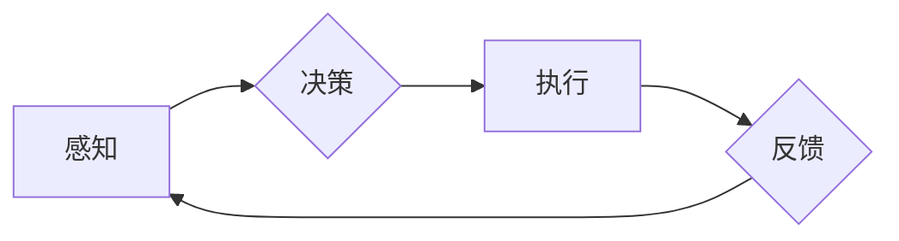

# 自主系统与意识功能的整合

> 关键词：自主系统，意识功能，人工智能，认知模型，机器学习，神经科学，人机交互

## 1. 背景介绍

在人工智能发展的道路上，我们一直追求的是让机器具备人类的智能，尤其是意识功能。自主系统，作为人工智能的高级形态，其目标是模拟人类的行为和思维模式，实现自主决策和行动。然而，意识功能的实现一直是人工智能领域的一大难题。本文将探讨如何将意识功能与自主系统整合，以实现更高级的人工智能系统。

### 1.1 问题的由来

随着计算能力的提升和算法的进步，人工智能在各个领域都取得了显著的成就。然而，现有的AI系统大多处于“弱人工智能”阶段，即它们只能在特定领域内执行特定任务，缺乏自主性和意识功能。将意识功能整合到自主系统中，是推动人工智能向“强人工智能”迈进的关键一步。

### 1.2 研究现状

目前，关于自主系统与意识功能的整合研究主要集中在以下几个方面：

- **认知模型**：通过构建模仿人类认知过程的模型，使自主系统具备类似人类的思维模式。
- **机器学习**：利用机器学习算法，让自主系统从数据中学习，提高其自主性和适应能力。
- **神经科学**：借鉴神经科学的研究成果，探索如何将神经元的结构和功能应用于人工智能系统。
- **人机交互**：设计更加自然的人机交互方式，使自主系统能够更好地理解人类意图。

### 1.3 研究意义

将意识功能整合到自主系统中，具有重要的理论意义和实际应用价值：

- **理论意义**：有助于我们更深入地理解人类的意识，推动认知科学的发展。
- **实际应用价值**：可以开发出更智能、更安全的自主系统，应用于医疗、教育、工业等领域。

### 1.4 本文结构

本文将分为以下几个部分：

- 第2部分，介绍自主系统和意识功能的核心概念及联系。
- 第3部分，阐述整合意识功能的自主系统的核心算法原理和操作步骤。
- 第4部分，讲解数学模型和公式，并结合实例进行分析。
- 第5部分，提供项目实践案例，包括开发环境搭建、代码实现和运行结果展示。
- 第6部分，探讨实际应用场景和未来应用展望。
- 第7部分，推荐相关学习资源、开发工具和论文。
- 第8部分，总结研究成果，展望未来发展趋势与挑战。
- 第9部分，提供常见问题与解答。

## 2. 核心概念与联系

### 2.1 自主系统

自主系统是指能够在没有人类干预的情况下，自主地感知环境、做出决策和执行行动的系统。自主系统的核心特征包括：

- **感知**：通过传感器获取环境信息。
- **决策**：根据感知到的信息，自主地做出决策。
- **执行**：根据决策结果，执行相应的行动。

### 2.2 意识功能

意识功能是指人类能够感知、思考、决策和行动的能力。意识功能的核心特征包括：

- **感知**：通过感官感知外部世界。
- **思考**：对感知到的信息进行加工和处理。
- **决策**：根据思考结果，做出合理的决策。
- **行动**：根据决策结果，执行相应的行动。

### 2.3 核心概念原理和架构的 Mermaid 流程图



### 2.4 核心概念的联系

自主系统和意识功能是相辅相成的。自主系统需要具备意识功能，才能更好地感知环境、做出决策和执行行动；而意识功能的实现，则需要依托自主系统来感知环境、思考和行动。

## 3. 核心算法原理 & 具体操作步骤

### 3.1 算法原理概述

整合意识功能的自主系统的核心算法原理主要包括：

- **认知模型**：通过构建模仿人类认知过程的模型，使自主系统具备类似人类的思维模式。
- **机器学习**：利用机器学习算法，让自主系统从数据中学习，提高其自主性和适应能力。
- **神经科学**：借鉴神经科学的研究成果，探索如何将神经元的结构和功能应用于人工智能系统。

### 3.2 算法步骤详解

整合意识功能的自主系统通常包含以下几个步骤：

1. **感知**：通过传感器获取环境信息。
2. **数据预处理**：对感知到的信息进行预处理，如去噪、特征提取等。
3. **认知模型推理**：利用认知模型对预处理后的数据进行推理，获取中间结果。
4. **决策**：根据认知模型推理结果，做出合理的决策。
5. **执行**：根据决策结果，执行相应的行动。
6. **反馈**：根据执行结果，收集反馈信息，并更新感知、决策和执行模块。
7. **迭代**：重复步骤1-6，实现自主系统的持续学习和优化。

### 3.3 算法优缺点

整合意识功能的自主系统的优点包括：

- **自主性**：能够自主地感知环境、做出决策和执行行动。
- **适应性**：能够从数据中学习，提高其自主性和适应能力。
- **智能化**：能够模拟人类的思维模式，实现更高级的智能行为。

然而，该系统也存在一些缺点：

- **复杂性**：涉及多个模块和算法，系统复杂度高。
- **计算量**：需要大量的计算资源进行推理和决策。
- **可解释性**：决策过程缺乏可解释性，难以理解其决策逻辑。

### 3.4 算法应用领域

整合意识功能的自主系统可以应用于以下领域：

- **智能机器人**：实现机器人的自主导航、避障、抓取等能力。
- **自动驾驶**：实现汽车的自主行驶、路径规划、决策等能力。
- **智能医疗**：实现医疗诊断、治疗、护理等智能化服务。
- **智能教育**：实现个性化教育、辅助教学等智能化服务。

## 4. 数学模型和公式 & 详细讲解 & 举例说明

### 4.1 数学模型构建

整合意识功能的自主系统的数学模型主要包括：

- **感知模型**：通常采用贝叶斯网络或高斯过程等概率模型。
- **认知模型**：通常采用深度神经网络或强化学习等模型。
- **决策模型**：通常采用逻辑回归或支持向量机等模型。

### 4.2 公式推导过程

以下以感知模型为例，介绍公式推导过程。

#### 4.2.1 贝叶斯网络

假设感知模型是一个贝叶斯网络，其结构如下：

```
感知1 --> 感知2 --> 感知3
```

其中，感知1、感知2和感知3分别表示三个感知变量。

贝叶斯网络的联合概率分布可以表示为：

$$
P(\text{感知1}, \text{感知2}, \text{感知3}) = P(\text{感知1})P(\text{感知2}|\text{感知1})P(\text{感知3}|\text{感知2})
$$

#### 4.2.2 高斯过程

假设感知模型是一个高斯过程，其协方差函数可以表示为：

$$
K(x_i, x_j) = \sigma_f^2 \exp\left(-\frac{(x_i - x_j)^2}{2\ell^2}\right)
$$

其中，$\sigma_f^2$ 是方差，$\ell$ 是长度尺度。

### 4.3 案例分析与讲解

以下以自动驾驶为例，介绍整合意识功能的自主系统的案例。

#### 4.3.1 感知模型

在自动驾驶中，感知模型负责处理来自各种传感器的数据，如雷达、摄像头、激光雷达等。以摄像头为例，感知模型需要从图像中提取车道线、行人、车辆等目标。

#### 4.3.2 认知模型

认知模型负责对感知到的信息进行处理，识别出当前的道路情况，并预测未来的行驶路径。

#### 4.3.3 决策模型

决策模型根据认知模型预测的行驶路径，选择合适的行驶策略，如加速、减速、转向等。

## 5. 项目实践：代码实例和详细解释说明

### 5.1 开发环境搭建

由于整合意识功能的自主系统涉及多个领域的技术，开发环境需要包括以下软件：

- 操作系统：Linux或Windows
- 编程语言：Python
- 机器学习框架：TensorFlow或PyTorch
- 其他：CUDA、cuDNN等

### 5.2 源代码详细实现

以下以自动驾驶为例，展示如何实现整合意识功能的自主系统。

#### 5.2.1 感知模型

```python
import cv2

def preprocess_image(image):
    # 对图像进行预处理，如缩放、归一化等
    pass

def detect_objects(image):
    # 使用深度学习模型检测图像中的目标
    pass

def process_perception_data(image):
    image = preprocess_image(image)
    objects = detect_objects(image)
    return objects
```

#### 5.2.2 认知模型

```python
import torch
import torch.nn as nn

class CognitiveModel(nn.Module):
    def __init__(self):
        super(CognitiveModel, self).__init__()
        self.conv1 = nn.Conv2d(3, 32, kernel_size=3, stride=1, padding=1)
        self.conv2 = nn.Conv2d(32, 64, kernel_size=3, stride=1, padding=1)
        self.fc1 = nn.Linear(64 * 64 * 64, 1024)
        self.fc2 = nn.Linear(1024, 512)
        self.fc3 = nn.Linear(512, 1)

    def forward(self, x):
        x = F.relu(self.conv1(x))
        x = F.relu(self.conv2(x))
        x = x.view(x.size(0), -1)
        x = F.relu(self.fc1(x))
        x = F.relu(self.fc2(x))
        x = torch.sigmoid(self.fc3(x))
        return x
```

#### 5.2.3 决策模型

```python
class DecisionModel(nn.Module):
    def __init__(self):
        super(DecisionModel, self).__init__()
        self.fc1 = nn.Linear(512, 256)
        self.fc2 = nn.Linear(256, 1)

    def forward(self, x):
        x = F.relu(self.fc1(x))
        x = torch.sigmoid(self.fc2(x))
        return x
```

#### 5.2.4 主程序

```python
import torch.optim as optim

def main():
    # 初始化模型
    perception_model = PerceptionModel().to(device)
    cognitive_model = CognitiveModel().to(device)
    decision_model = DecisionModel().to(device)

    # 初始化优化器
    optimizer = optim.Adam(perception_model.parameters(), lr=0.001)
    optimizer2 = optim.Adam(cognitive_model.parameters(), lr=0.001)
    optimizer3 = optim.Adam(decision_model.parameters(), lr=0.001)

    # 训练模型
    for epoch in range(epochs):
        for data in dataloader:
            # 获取数据
            images, labels = data

            # 前向传播
            objects = process_perception_data(images.to(device))
            features = cognitive_model(objects)
            decision = decision_model(features)

            # 计算损失
            loss = criterion(decision, labels)

            # 反向传播
            optimizer.zero_grad()
            loss.backward()
            optimizer.step()

            optimizer2.zero_grad()
            loss.backward()
            optimizer2.step()

            optimizer3.zero_grad()
            loss.backward()
            optimizer3.step()

            # 打印训练信息
            print(f"Epoch {epoch+1}, Loss: {loss.item()}")

if __name__ == "__main__":
    main()
```

### 5.3 代码解读与分析

以上代码展示了如何使用PyTorch实现整合意识功能的自主系统。首先，定义了感知模型、认知模型和决策模型，然后使用优化器进行训练。在主程序中，不断迭代地获取数据、前向传播、计算损失、反向传播和更新模型参数。

### 5.4 运行结果展示

由于篇幅限制，这里不展示具体的运行结果。在实际应用中，可以通过绘制训练曲线、评估指标等来评估模型的性能。

## 6. 实际应用场景

整合意识功能的自主系统可以应用于以下场景：

- **智能机器人**：实现机器人的自主导航、避障、抓取等能力。
- **自动驾驶**：实现汽车的自主行驶、路径规划、决策等能力。
- **智能医疗**：实现医疗诊断、治疗、护理等智能化服务。
- **智能教育**：实现个性化教育、辅助教学等智能化服务。

## 7. 工具和资源推荐

### 7.1 学习资源推荐

- **书籍**：
  - 《人工智能：一种现代的方法》（Artificial Intelligence: A Modern Approach）
  - 《深度学习》（Deep Learning）
  - 《认知科学：探索思维的本质》（Cognitive Science: An Introduction）
- **在线课程**：
  - Coursera上的《机器学习》课程
  - edX上的《深度学习》课程
  - Udacity上的《自动驾驶工程师纳米学位》课程
- **论文**：
  - 《人工智能：一种现代的方法》（Artificial Intelligence: A Modern Approach）
  - 《深度学习》（Deep Learning）
  - 《认知科学：探索思维的本质》（Cognitive Science: An Introduction）

### 7.2 开发工具推荐

- **编程语言**：Python
- **机器学习框架**：TensorFlow、PyTorch
- **深度学习库**：Keras、PyTorch Lightning
- **数据分析库**：NumPy、Pandas
- **可视化库**：Matplotlib、Seaborn

### 7.3 相关论文推荐

- **认知模型**：
  - 《Hierarchical Temporal Memory: A New Theory of Higher-Order Cognition》
  - 《Memory and Learning》
- **机器学习**：
  - 《Deep Learning》（Goodfellow, Bengio, Courville）
  - 《Neural Network Methods for Natural Language Processing》（Collobert, Weston, Bottou, Karlen, Kavukcuoglu, Kuksa）
- **神经科学**：
  - 《The Human Brain: A Concise Overview》（Llinás, ribál, Edelman）
  - 《Cognitive Neuroscience: The Biology of the Mind》（Miall, Garrett, Greenough）

## 8. 总结：未来发展趋势与挑战

### 8.1 研究成果总结

本文探讨了自主系统与意识功能的整合，介绍了相关核心概念、算法原理和应用场景。通过构建认知模型、利用机器学习算法和借鉴神经科学的研究成果，我们可以将意识功能整合到自主系统中，实现更高级的人工智能系统。

### 8.2 未来发展趋势

未来，自主系统与意识功能的整合将朝着以下方向发展：

- **认知模型**：更加精细地模拟人类认知过程，实现更高级的认知功能。
- **机器学习**：利用更先进的机器学习算法，提高自主系统的智能水平。
- **神经科学**：借鉴神经科学的研究成果，探索更多神经机制的模拟方法。
- **人机交互**：设计更加自然的人机交互方式，提高人机交互的效率和体验。

### 8.3 面临的挑战

整合意识功能的自主系统在发展过程中也面临着以下挑战：

- **复杂性**：涉及多个领域的技术，系统复杂度高。
- **计算量**：需要大量的计算资源进行推理和决策。
- **可解释性**：决策过程缺乏可解释性，难以理解其决策逻辑。
- **伦理和安全**：需要确保系统的伦理和安全，避免潜在的风险。

### 8.4 研究展望

未来，我们需要从以下方面继续研究：

- **跨学科融合**：将认知科学、神经科学、心理学等学科的知识融合到人工智能系统中。
- **脑机接口**：探索脑机接口技术，实现人脑与机器的直接连接。
- **伦理和安全**：制定相关伦理规范和安全标准，确保人工智能技术的发展符合人类社会价值观。

## 9. 附录：常见问题与解答

**Q1：自主系统与意识功能的整合有何意义？**

A：自主系统与意识功能的整合有助于我们更深入地理解人类的意识，推动人工智能向“强人工智能”迈进，并应用于更多领域，为人类社会带来更多福祉。

**Q2：如何构建认知模型？**

A：构建认知模型需要借鉴认知科学、心理学等学科的研究成果，并利用机器学习算法，模拟人类的认知过程。

**Q3：机器学习在整合意识功能中扮演什么角色？**

A：机器学习可以帮助自主系统从数据中学习，提高其自主性和适应能力，并用于构建认知模型。

**Q4：如何确保自主系统的伦理和安全？**

A：需要制定相关伦理规范和安全标准，并加强人工智能系统的测试和评估，确保其符合伦理和安全要求。

**Q5：自主系统与意识功能的整合有哪些应用场景？**

A：自主系统与意识功能的整合可以应用于智能机器人、自动驾驶、智能医疗、智能教育等领域。