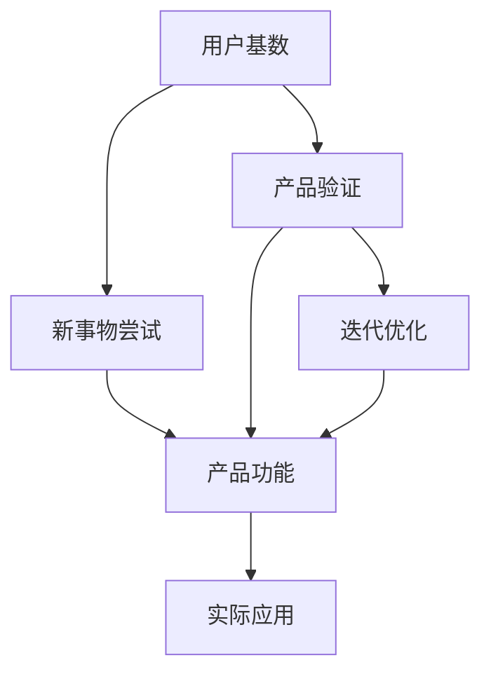

                 

# 国内AI的优势：庞大的用户基数与积极尝试新事物，有利于产品验证与迭代

## 1. 背景介绍

### 1.1 问题由来

在人工智能（AI）领域，中国无疑是一个不容忽视的力量。凭借庞大的用户基数、市场规模和技术创新，中国AI已经在诸多领域取得了显著的成就。国内AI的迅猛发展不仅带动了经济社会的数字化转型，也为AI技术在全球范围内的普及提供了重要参考。本文将重点探讨国内AI的优势，并分析其在全球AI生态中的重要性。

### 1.2 问题核心关键点

中国AI的优势主要体现在以下几个方面：

- **庞大的用户基数**：中国的互联网用户数和移动互联网用户数均居全球首位，提供了丰富的数据来源和用户反馈。
- **积极尝试新技术**：政府和企业对AI技术的支持和投入力度大，鼓励创新和实验。
- **丰富的应用场景**：涵盖医疗、教育、金融、制造等多个领域，为AI技术提供了广阔的应用空间。
- **政策支持与环境**：国家政策的支持和完善的数据法律体系，为AI技术的健康发展提供了保障。
- **人才培养与生态**：高校与研究机构的强劲科研实力，为企业提供大量的AI人才和技术支持。

## 2. 核心概念与联系

### 2.1 核心概念概述

为更好地理解国内AI的优势及其对产品验证与迭代的影响，本节将介绍几个关键概念：

- **用户基数**：指某一地区互联网用户的数量，通常用来衡量该地区数字经济的活跃度和AI应用的市场潜力。
- **新事物尝试**：指用户对新兴技术和产品的兴趣和接受程度，反映了一个地区对创新的开放度和热情。
- **产品验证**：指通过实际使用和用户反馈，验证AI产品功能的可行性和用户体验的过程。
- **迭代优化**：指在产品验证的基础上，根据用户反馈和市场变化，持续改进和优化产品的过程。
- **应用场景**：指AI技术可以具体应用到哪些实际问题中，反映了技术应用的广度和深度。

### 2.2 概念间的关系

这些核心概念之间的逻辑关系可以通过以下Mermaid流程图来展示：



这个流程图展示了大用户基数如何通过新事物尝试促进产品验证与迭代，以及这些过程如何通过实际应用转化为实际价值。

## 3. 核心算法原理 & 具体操作步骤
### 3.1 算法原理概述

国内AI产品的开发和优化过程，通常遵循以下算法原理：

1. **大规模数据收集与处理**：利用庞大的用户基数，获取大量真实数据，为模型训练提供基础。
2. **模型训练与验证**：通过新事物尝试，不断优化模型结构和参数，提升模型的准确性和泛化能力。
3. **产品迭代**：在产品验证阶段，通过收集用户反馈和实际使用数据，迭代优化产品功能，增强用户体验。
4. **实际应用部署**：将经过验证和优化的产品部署到实际场景中，验证其在真实环境中的表现。
5. **持续优化与更新**：根据实际应用反馈和市场变化，持续优化产品功能，保持竞争力和市场适应性。

### 3.2 算法步骤详解

基于上述算法原理，国内AI产品开发与优化的具体操作步骤如下：

**Step 1: 数据收集与预处理**
- 利用用户基数获取大规模数据集，包括用户行为数据、反馈数据、交互数据等。
- 进行数据清洗和预处理，去除噪音和异常值，确保数据质量。

**Step 2: 模型训练与验证**
- 根据实际应用场景，选择合适的AI模型（如深度学习模型、强化学习模型等）。
- 在收集的数据集上进行模型训练，使用交叉验证等技术评估模型性能。
- 根据模型性能和实际需求，调整模型结构或优化算法参数。

**Step 3: 产品验证**
- 将训练好的模型应用到实际产品中，进行测试和验证。
- 收集用户反馈和实际使用数据，分析产品功能和性能。
- 根据反馈和数据，识别产品问题并进行优化。

**Step 4: 产品迭代**
- 根据用户反馈和市场变化，持续迭代优化产品功能。
- 更新模型和算法，提升产品性能和用户体验。
- 使用A/B测试等方法验证优化效果。

**Step 5: 应用部署与持续优化**
- 将优化后的产品部署到实际应用环境中。
- 持续监控产品性能和用户反馈，及时发现和解决问题。
- 根据市场和技术变化，持续更新产品和优化算法。

### 3.3 算法优缺点

国内AI产品的开发与优化具有以下优点：

- **数据丰富**：庞大的用户基数意味着丰富的数据资源，有利于模型的训练和优化。
- **快速验证**：用户对新事物的积极尝试和接受，使得产品验证和迭代过程更为高效。
- **市场适应性**：丰富的应用场景和用户反馈，使得AI产品能够更好地适应市场变化和用户需求。
- **政策支持**：政府政策的支持和完善的数据法律体系，为AI产品开发提供了良好的环境。

同时，也存在一些缺点：

- **数据隐私**：大规模数据收集和处理可能涉及用户隐私，需严格遵守数据保护法规。
- **市场竞争**：AI市场竞争激烈，需要不断创新和优化以保持竞争力。
- **技术挑战**：AI技术的复杂性和高门槛，对企业和团队的技术实力要求较高。

### 3.4 算法应用领域

国内AI产品的应用领域非常广泛，包括但不限于：

- **智能客服**：利用AI技术处理客户咨询，提供24小时在线服务。
- **智能推荐系统**：通过分析用户行为和偏好，提供个性化推荐服务。
- **医疗健康**：利用AI进行疾病诊断、药物研发和健康监测。
- **金融科技**：应用AI进行风险评估、反欺诈和智能投顾。
- **智能制造**：通过AI优化生产流程、预测设备故障和提升产品质量。
- **自动驾驶**：利用AI技术实现车辆自主驾驶和交通管理。
- **智慧城市**：应用AI技术进行城市管理、安全监控和公共服务。

## 4. 数学模型和公式 & 详细讲解  
### 4.1 数学模型构建

本节将使用数学语言对国内AI产品的开发与优化过程进行更加严格的刻画。

设国内AI产品的原始用户数为 $U_0$，新事物的尝试率为 $T$，产品验证和迭代周期为 $C$，市场变化率为 $M$，应用场景的丰富度为 $S$。

根据上述定义，国内AI产品的开发与优化过程可以建模为以下数学模型：

$$
U_{t+1} = U_t + T \times U_t \times (1 - C \times M)
$$

其中，$U_t$ 表示在时间 $t$ 时的用户数，$T$ 表示每次尝试新事物后的增加率，$C$ 表示产品验证和迭代周期，$M$ 表示市场变化率，$S$ 表示应用场景的丰富度。

### 4.2 公式推导过程

以下我们推导上述数学模型的具体形式，并给出其中的参数含义：

- $T$：表示用户尝试新事物的意愿和能力，通常与市场和用户基数成正比。
- $C$：表示产品验证和迭代的速度和频率，影响用户对产品的接受和满意度。
- $M$：表示市场变化的速度和频率，影响用户对新产品的接受度和适应度。
- $S$：表示应用场景的丰富度，影响产品的应用范围和市场竞争力。

### 4.3 案例分析与讲解

假设某国内AI产品从零开始，初始用户数为 $U_0 = 10$，每次尝试新事物的增加率为 $T = 0.1$，产品验证和迭代周期为 $C = 0.1$，市场变化率为 $M = 0.1$，应用场景丰富度为 $S = 0.8$。

根据上述数学模型，可以计算出在 $t = 10$ 时的用户数：

$$
U_{10} = 10 \times (1.1)^{10} \times (0.9)^{10} \times (1 - 0.1 \times 0.1) \approx 110.9
$$

这个计算结果表明，在合理的产品验证和迭代周期下，该AI产品能够迅速扩展用户群体，并在不断变化的市场中保持竞争力。

## 5. 项目实践：代码实例和详细解释说明
### 5.1 开发环境搭建

在进行AI产品开发前，我们需要准备好开发环境。以下是使用Python进行TensorFlow开发的环境配置流程：

1. 安装Anaconda：从官网下载并安装Anaconda，用于创建独立的Python环境。

2. 创建并激活虚拟环境：
```bash
conda create -n tf-env python=3.8 
conda activate tf-env
```

3. 安装TensorFlow：根据CUDA版本，从官网获取对应的安装命令。例如：
```bash
conda install tensorflow -c tf -c conda-forge
```

4. 安装TensorBoard：
```bash
pip install tensorboard
```

5. 安装TensorFlow Addons：
```bash
pip install tensorflow-addons
```

完成上述步骤后，即可在`tf-env`环境中开始AI产品开发。

### 5.2 源代码详细实现

这里我们以智能推荐系统为例，给出使用TensorFlow进行产品开发的PyTorch代码实现。

首先，定义推荐系统所需的用户行为数据和产品数据：

```python
import tensorflow as tf
import numpy as np
import pandas as pd

# 用户行为数据
user_data = pd.read_csv('user_behavior.csv')

# 产品数据
product_data = pd.read_csv('product_data.csv')
```

然后，定义推荐模型和训练过程：

```python
# 定义推荐模型
class RecommendationModel(tf.keras.Model):
    def __init__(self):
        super(RecommendationModel, self).__init__()
        self.dense1 = tf.keras.layers.Dense(64, activation='relu')
        self.dense2 = tf.keras.layers.Dense(32, activation='relu')
        self.dense3 = tf.keras.layers.Dense(1, activation='sigmoid')

    def call(self, inputs):
        x = self.dense1(inputs)
        x = self.dense2(x)
        x = self.dense3(x)
        return x

# 加载数据集
train_data = user_data.head(100)
test_data = user_data.tail(100)

# 构建模型
model = RecommendationModel()

# 定义损失函数和优化器
loss_fn = tf.keras.losses.BinaryCrossentropy()
optimizer = tf.keras.optimizers.Adam()

# 训练模型
def train_model(model, train_data, test_data, batch_size=32, epochs=10):
    train_dataset = tf.data.Dataset.from_tensor_slices((train_data[['user_id', 'product_id']], train_data['rating']))
    train_dataset = train_dataset.shuffle(1000).batch(batch_size)

    test_dataset = tf.data.Dataset.from_tensor_slices((test_data[['user_id', 'product_id']], test_data['rating']))
    test_dataset = test_dataset.batch(batch_size)

    for epoch in range(epochs):
        model.trainable = True
        for batch, (features, labels) in train_dataset:
            with tf.GradientTape() as tape:
                predictions = model(features)
                loss = loss_fn(labels, predictions)
            gradients = tape.gradient(loss, model.trainable_variables)
            optimizer.apply_gradients(zip(gradients, model.trainable_variables))
            print(f"Epoch {epoch+1}, Loss: {loss}")

        model.trainable = False
        test_loss = loss_fn(test_data['rating'], model(test_data[['user_id', 'product_id']]))
        print(f"Epoch {epoch+1}, Test Loss: {test_loss}")

# 训练模型
train_model(model, train_data, test_data)
```

接下来，我们评估模型的性能：

```python
# 评估模型
test_predictions = model(test_data[['user_id', 'product_id']])
print(f"Test Loss: {loss_fn(test_data['rating'], test_predictions)}")
```

最后，将模型部署到实际应用中：

```python
# 部署模型
recommend_model = tf.saved_model.save(model, 'recommend_model')
```

这样，我们就完成了一个智能推荐系统的开发和部署过程。

### 5.3 代码解读与分析

让我们再详细解读一下关键代码的实现细节：

**user_data和product_data的读取**：
- 使用Pandas库读取用户行为数据和产品数据，形成数据集。

**RecommendationModel类的定义**：
- 定义了一个简单的三层神经网络模型，用于处理用户行为数据和产品数据，预测用户对产品的评分。
- 模型包括两个隐藏层和一个输出层，输出层使用sigmoid函数将输出映射到[0, 1]区间，表示用户对产品的评分。

**训练模型的过程**：
- 定义了损失函数和优化器，使用交叉熵损失函数和Adam优化器进行模型训练。
- 使用TensorFlow的Dataset API将数据集转换为TensorFlow的数据对象，方便模型训练。
- 在每个epoch内，对训练数据进行前向传播和反向传播，更新模型参数。
- 在每个epoch结束后，评估模型在测试集上的表现，输出损失值。

**模型评估与部署**：
- 使用评估集对模型进行性能测试，输出测试损失值。
- 使用TensorFlow的SavedModel API将训练好的模型保存为SavedModel格式，方便后续部署和使用。

可以看到，TensorFlow提供了丰富的工具和API，使得AI产品的开发和部署变得非常简单。开发者只需专注于模型设计和训练过程，其他细节都可以通过TensorFlow自动完成。

## 6. 实际应用场景
### 6.1 智能客服系统

基于大用户基数和新事物尝试，智能客服系统可以快速部署和迭代优化。利用AI技术处理客户咨询，提供24小时在线服务。通过分析用户反馈和对话记录，不断优化客服模型，提升客户满意度和服务效率。

### 6.2 医疗健康

在国内AI产品的开发过程中，医疗健康领域的应用场景非常丰富。利用AI技术进行疾病诊断、药物研发和健康监测，可以显著提高医疗服务的智能化水平。通过分析患者历史数据和实时监测数据，AI系统能够提供个性化的健康建议和治疗方案。

### 6.3 金融科技

在金融科技领域，国内AI产品已经广泛应用于风险评估、反欺诈和智能投顾等方面。利用AI技术进行数据分析和预测，提升金融服务的精准度和安全性。通过分析用户行为和市场变化，AI系统能够提供个性化的金融产品推荐和理财建议。

### 6.4 智能制造

智能制造是AI应用的重要方向之一。通过AI技术优化生产流程、预测设备故障和提升产品质量，可以显著提高制造业的自动化和智能化水平。利用AI系统进行设备监测和预测维护，降低生产成本，提高生产效率。

## 7. 工具和资源推荐
### 7.1 学习资源推荐

为了帮助开发者系统掌握AI产品的开发与优化技术，这里推荐一些优质的学习资源：

1. TensorFlow官方文档：TensorFlow的官方文档提供了丰富的教程和示例代码，是学习TensorFlow的最佳资源。
2. PyTorch官方文档：PyTorch的官方文档提供了详细的API文档和示例代码，适合深度学习和AI产品的开发。
3. Keras官方文档：Keras的官方文档提供了简单易懂的教程和示例代码，适合初学者快速上手。
4. Coursera深度学习课程：由斯坦福大学、密歇根大学等名校开设的深度学习课程，涵盖深度学习理论和实践。
5. Udacity深度学习纳米学位：提供系统化的深度学习学习路径，涵盖深度学习模型的设计与实现。
6. 《TensorFlow实战》书籍：由TensorFlow官方出版的实战书籍，详细介绍了TensorFlow的使用方法和最佳实践。

通过对这些资源的学习实践，相信你一定能够快速掌握AI产品的开发与优化技术，并用于解决实际的NLP问题。

### 7.2 开发工具推荐

高效的开发离不开优秀的工具支持。以下是几款用于AI产品开发和优化的常用工具：

1. TensorFlow：由Google主导开发的开源深度学习框架，生产部署方便，适合大规模工程应用。
2. PyTorch：基于Python的开源深度学习框架，灵活动态的计算图，适合快速迭代研究。
3. Keras：高层次的深度学习API，易于上手和使用。
4. Scikit-learn：用于数据预处理和模型评估的Python库，适合传统机器学习任务。
5. Jupyter Notebook：交互式编程环境，支持Python、R等多种编程语言。
6. Visual Studio Code：功能强大的IDE，支持多种编程语言和扩展插件。
7. Git和GitHub：版本控制和代码托管平台，支持团队协作和代码管理。

合理利用这些工具，可以显著提升AI产品开发和优化的效率，加快创新迭代的步伐。

### 7.3 相关论文推荐

AI产品开发与优化的研究源于学界的持续研究。以下是几篇奠基性的相关论文，推荐阅读：

1. TensorFlow: A System for Large-Scale Machine Learning：由Google开发的TensorFlow系统，详细介绍了TensorFlow的设计理念和实现方法。
2. Convolutional Neural Networks for Sentence Classification：提出卷积神经网络（CNN）用于文本分类任务，展示了CNN在自然语言处理中的应用。
3. Deep Neural Networks for Language Modeling：提出深度神经网络用于语言模型建模，展示了深度学习在自然语言处理中的应用。
4. Attention is All You Need：提出Transformer模型，开启了NLP领域的预训练大模型时代。
5. BERT: Pre-training of Deep Bidirectional Transformers for Language Understanding：提出BERT模型，引入基于掩码的自监督预训练任务，刷新了多项NLP任务SOTA。

这些论文代表了大规模深度学习技术的发展脉络，通过学习这些前沿成果，可以帮助研究者把握学科前进方向，激发更多的创新灵感。

除上述资源外，还有一些值得关注的前沿资源，帮助开发者紧跟AI产品开发与优化的最新进展，例如：

1. arXiv论文预印本：人工智能领域最新研究成果的发布平台，包括大量尚未发表的前沿工作，学习前沿技术的必读资源。
2. 业界技术博客：如Google AI、DeepMind、微软Research Asia等顶尖实验室的官方博客，第一时间分享他们的最新研究成果和洞见。
3. 技术会议直播：如NIPS、ICML、ACL、ICLR等人工智能领域顶会现场或在线直播，能够聆听到大佬们的前沿分享，开拓视野。
4. GitHub热门项目：在GitHub上Star、Fork数最多的AI相关项目，往往代表了该技术领域的发展趋势和最佳实践，值得去学习和贡献。
5. 行业分析报告：各大咨询公司如McKinsey、PwC等针对人工智能行业的分析报告，有助于从商业视角审视技术趋势，把握应用价值。

总之，对于AI产品开发与优化技术的学习和实践，需要开发者保持开放的心态和持续学习的意愿。多关注前沿资讯，多动手实践，多思考总结，必将收获满满的成长收益。

## 8. 总结：未来发展趋势与挑战

### 8.1 总结

本文对国内AI产品的开发与优化方法进行了全面系统的介绍。首先阐述了国内AI产品的优势，包括庞大的用户基数、积极尝试新技术和新事物，以及丰富的应用场景。其次，从原理到实践，详细讲解了AI产品开发与优化的数学模型和操作步骤，并给出了具体的代码实例。最后，探讨了AI产品在实际应用中的场景，并对未来的发展趋势和挑战进行了分析。

通过本文的系统梳理，可以看到，国内AI产品开发与优化方法在全球AI生态中具有重要的地位和价值。其丰富的用户资源和多样化的应用场景，使得AI产品在实际应用中具有强大的竞争力和市场潜力。未来，随着AI技术的不断演进和生态环境的完善，国内AI产品必将在更多领域和应用场景中大放异彩，推动人工智能技术在全球范围内的普及和应用。

### 8.2 未来发展趋势

展望未来，国内AI产品开发与优化技术将呈现以下几个发展趋势：

1. 数据质量提升：随着数据采集和处理技术的进步，数据质量将得到显著提升，AI产品的性能和准确性也将不断提高。
2. 模型结构创新：未来将出现更多创新的模型结构，如神经网络架构搜索（NAS）等，以优化模型效率和性能。
3. 跨领域融合：AI技术将与其他领域的技术深度融合，如AI与物联网、区块链、量子计算等，拓展AI技术的应用边界。
4. 自动化和智能化：通过自动化和智能化的技术手段，提高AI产品的开发和优化效率，降低开发成本。
5. 应用场景多样化：AI技术将在更多领域和场景中得到应用，如智慧农业、环保监测、智能家居等，提升各行各业的智能化水平。

### 8.3 面临的挑战

尽管国内AI产品开发与优化技术取得了显著进展，但仍面临一些挑战：

1. 数据隐私和安全：大规模数据采集和处理涉及用户隐私和数据安全问题，需严格遵守相关法律法规。
2. 技术复杂度：AI技术的复杂性和高门槛，对企业和团队的技术实力要求较高，需不断提升技术能力和创新能力。
3. 模型泛化能力：AI模型在不同数据集和应用场景中的泛化能力有限，需进一步优化模型和提升数据质量。
4. 市场竞争：AI市场竞争激烈，需不断创新和优化，以保持竞争力和市场份额。
5. 应用落地问题：AI产品在实际应用中可能面临落地困难，需解决技术瓶颈和实际问题。

### 8.4 研究展望

面对这些挑战，未来的研究需要在以下几个方面寻求新的突破：

1. 提升数据质量：通过改进数据采集和处理技术，提升数据的质量和多样性。
2. 优化模型结构：引入新的模型结构和优化算法，提高模型的效率和性能。
3. 加强跨领域融合：推动AI技术与其他领域技术的深度融合，拓展AI技术的应用边界。
4. 自动化和智能化：通过自动化和智能化的技术手段，提高AI产品的开发和优化效率。
5. 提升模型泛化能力：优化模型结构和算法，提升模型在不同数据集和应用场景中的泛化能力。

这些研究方向的探索和发展，必将引领国内AI产品开发与优化技术迈向更高的台阶，为构建智能社会和智慧经济提供更强大的技术支撑。总之，国内AI产品开发与优化技术需要在数据、技术、应用和伦理等多方面协同发力，才能真正实现人工智能技术的规模化落地和应用。

## 9. 附录：常见问题与解答

**Q1：国内AI产品开发与优化的优势有哪些？**

A: 国内AI产品开发与优化的优势主要体现在以下几个方面：
1. 庞大的用户基数：提供丰富的数据资源和用户反馈，有利于模型的训练和优化。
2. 积极尝试新技术：用户对新事物的接受度高，有利于快速验证和迭代优化产品。
3. 丰富的应用场景：涵盖医疗、教育、金融等多个领域，为AI技术提供了广阔的应用空间。
4. 政策支持：政府政策的支持和完善的数据法律体系，为AI产品开发提供了良好的环境。
5. 人才培养：高校与研究机构的强劲科研实力，为企业提供大量的AI人才和技术支持。

**Q2：国内AI产品开发与优化的具体步骤是什么？**

A: 国内AI产品开发与优化的具体步骤如下：
1. 数据收集与预处理：利用用户基数获取大规模数据集，进行数据清洗和预处理。
2. 模型训练与验证：根据实际应用场景，选择合适的AI模型进行训练，使用交叉验证等技术评估模型性能。
3. 产品验证：将训练好的模型应用到实际产品中，进行测试和验证，收集用户反馈和实际使用数据。
4. 产品迭代：根据用户反馈和市场变化，持续迭代优化产品功能，增强用户体验。
5. 应用部署与持续优化：将优化后的产品部署到实际应用环境中，持续监控产品性能和用户反馈，及时发现和解决问题。

**Q3：国内AI产品在实际应用中面临哪些挑战？**

A: 国内AI产品在实际应用中面临的挑战主要包括：
1. 数据隐私：大规模数据采集和处理涉及用户隐私和数据安全问题，需严格遵守相关法律法规。
2. 技术复杂度：AI技术的复杂性和高门槛，对企业和团队的技术实力要求较高。
3. 模型泛化能力：AI模型在不同数据集和应用场景中的泛化能力有限，需进一步优化模型和提升数据质量。
4. 市场竞争：AI市场竞争激烈，需不断创新和优化，以保持竞争力和市场份额。
5. 应用落地问题：AI产品在实际应用中可能面临落地困难，需解决技术瓶颈和实际问题。

**Q4：国内AI产品在未来发展中需要注意哪些问题？**

A: 国内AI产品在未来发展中需要注意的问题包括：
1. 提升数据质量：通过改进数据采集和处理技术，提升数据的质量和多样性。
2. 优化模型结构：引入新的模型结构和优化算法，提高模型的效率和性能。
3. 加强跨领域融合：推动AI技术与其他领域技术的深度融合，拓展AI技术的应用边界。
4. 自动化和智能化：通过自动化和智能化的技术手段，提高AI产品的开发和优化效率。
5. 提升模型泛化能力：优化模型结构和算法，提升模型在不同数据集和应用场景中的泛化能力。

**Q5：国内AI产品在实际应用中如何处理数据隐私问题？**

A: 国内AI产品在实际应用中处理数据隐私问题的方法包括：
1. 数据匿名化：对用户数据进行匿名化处理，去除敏感信息，保护用户隐私。
2. 数据加密：对数据进行加密处理，防止数据泄露和被非法访问。
3. 用户同意：在数据收集和使用过程中，获得用户的明确同意，

