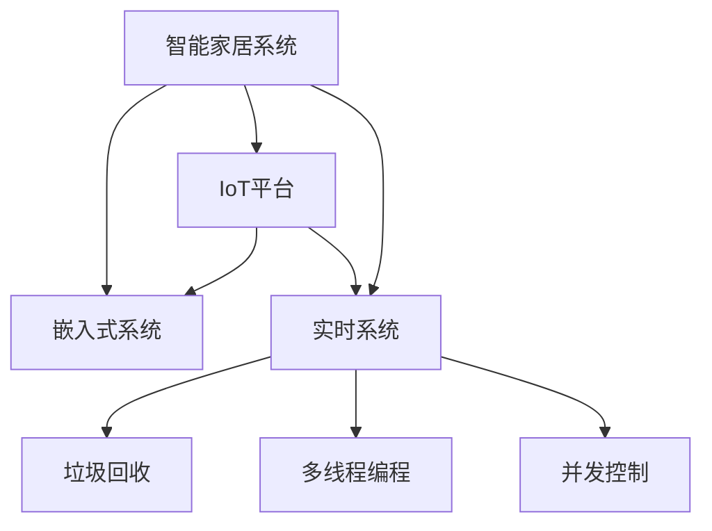
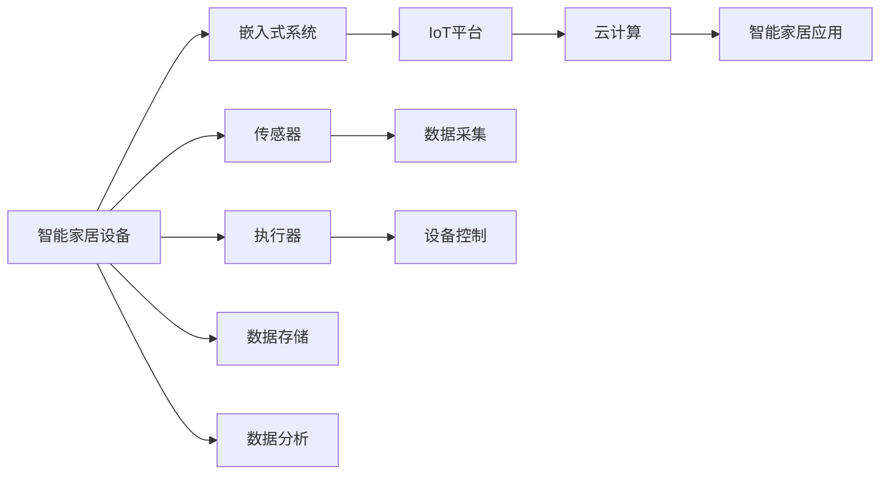
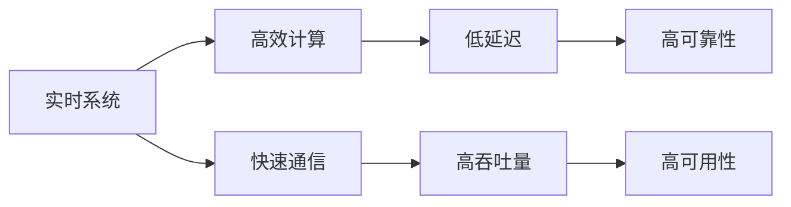
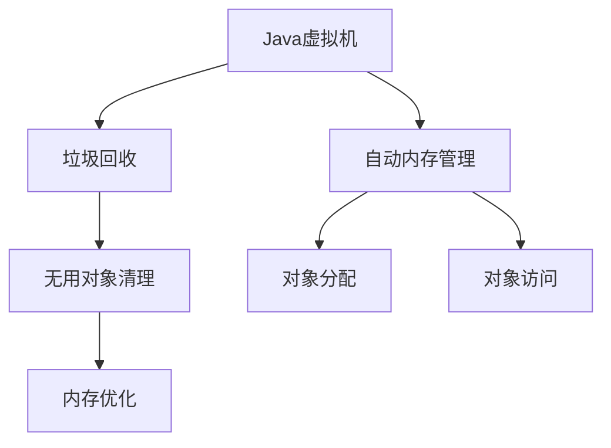
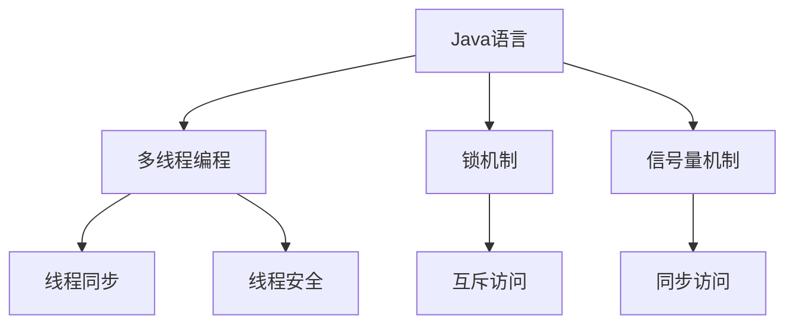

                 

# 基于Java的智能家居设计：高效Java代码在智能家居系统的性能优化

> 关键词：智能家居,Java,性能优化,嵌入式系统,IoT,实时系统

## 1. 背景介绍

### 1.1 问题由来
随着物联网(IoT)技术的快速发展，智能家居系统正成为家庭生活的重要组成部分。智能家居系统通过将各种传感器、控制器和智能设备连接在一起，实现自动化、智能化、个性化的家居生活体验。然而，由于智能家居系统涉及多个设备和大量数据交互，其性能优化显得尤为重要。高效Java代码在大规模智能家居系统中扮演着关键角色，合理设计和使用Java代码能够显著提升系统的性能和稳定性。

### 1.2 问题核心关键点
目前，Java在智能家居系统中的应用主要体现在以下几个方面：

- **嵌入式系统**：Java作为嵌入式系统的编程语言之一，其轻量级特性使其适合在资源受限的嵌入式环境中运行。
- **IoT平台**：Java在IoT平台的开发中也占据重要地位，其跨平台特性使得Java应用可以在不同设备和平台上无缝运行。
- **实时系统**：Java通过虚拟机技术实现了高效的垃圾回收机制，适合开发高性能的实时系统。

本文将从性能优化角度探讨如何在大规模智能家居系统中高效使用Java代码，确保系统的高可用性和实时性。

## 2. 核心概念与联系

### 2.1 核心概念概述

为更好地理解基于Java的智能家居系统性能优化，本节将介绍几个关键概念：

- **智能家居系统**：将家居环境中的各种设备和系统通过互联网连接起来，实现自动化、智能化控制。
- **嵌入式系统**：以嵌入式处理器为核心，集成了传感器、执行器和通信模块的封闭系统。
- **IoT平台**：提供设备接入、数据存储、分析及应用开发的云计算平台。
- **实时系统**：要求系统能够在严格的时间限制内响应用户请求，适合数据处理、控制和通信等实时性要求较高的应用场景。
- **垃圾回收**：Java虚拟机的自动内存管理机制，通过周期性清理无用对象，提高内存利用率和系统稳定性。
- **多线程编程**：Java语言提供的多线程机制，通过并发执行多个线程，提升系统吞吐量和响应速度。
- **并发控制**：在多线程环境中，通过锁、信号量等机制实现资源的互斥访问，保证数据的一致性和系统的稳定。

这些概念之间的逻辑关系可以通过以下Mermaid流程图来展示：



这个流程图展示了大规模智能家居系统的核心概念及其之间的关系：

1. 智能家居系统通过嵌入式系统和IoT平台实现设备互联。
2. 实时系统提供高效率的计算和通信能力，支持智能家居系统的各种功能。
3. 垃圾回收和多线程编程技术保证系统的内存管理和并发性能。
4. 并发控制技术确保数据的一致性和系统的稳定性。

### 2.2 概念间的关系

这些核心概念之间存在着紧密的联系，形成了智能家居系统性能优化的完整生态系统。下面我们通过几个Mermaid流程图来展示这些概念之间的关系。

#### 2.2.1 智能家居系统的架构



这个流程图展示了智能家居系统的基本架构，包括设备、嵌入式系统、IoT平台和云计算等环节，以及数据采集、存储和分析等功能。

#### 2.2.2 实时系统的关键特性



这个流程图展示了实时系统的关键特性，包括高效计算、快速通信、低延迟、高吞吐量、高可靠性和高可用性。

#### 2.2.3 垃圾回收与内存管理



这个流程图展示了垃圾回收和自动内存管理的机制，包括无用对象清理、对象分配和对象访问等环节，以及内存优化等技术。

#### 2.2.4 多线程与并发控制



这个流程图展示了多线程编程和并发控制的机制，包括锁机制、信号量机制、线程同步、线程安全等技术。

## 3. 核心算法原理 & 具体操作步骤
### 3.1 算法原理概述

基于Java的智能家居系统性能优化，主要依赖于高效Java代码的设计和使用。Java作为一种高性能的编程语言，其垃圾回收、多线程编程和并发控制等特性为智能家居系统的性能优化提供了重要保障。

#### 3.1.1 垃圾回收原理

Java虚拟机的垃圾回收机制通过周期性扫描对象图，识别并清除不再使用的对象，从而释放内存空间，避免内存泄漏和溢出。垃圾回收过程通常分为标记清除、复制、标记-整理等算法。

#### 3.1.2 多线程编程模型

Java的多线程编程模型通过创建多个线程并行执行任务，提高了系统的并发能力和响应速度。线程间的通信通过共享内存或消息传递机制实现，确保数据的一致性和系统的稳定性。

#### 3.1.3 并发控制机制

Java提供了多种并发控制机制，如锁、信号量、条件变量等，用于协调多线程间的访问和资源共享。锁机制通过互斥访问方式，避免数据竞争和并发问题。信号量机制通过计数器控制资源的访问，保证资源的有序使用。条件变量通过等待和唤醒机制，实现线程间的同步和协作。

### 3.2 算法步骤详解

基于Java的智能家居系统性能优化主要分为以下几个关键步骤：

#### 3.2.1 垃圾回收优化

1. **垃圾回收算法选择**：根据系统的内存分配特性选择合适的垃圾回收算法。如对于实时系统，应选择低延迟的复制算法或标记-整理算法。
2. **垃圾回收参数配置**：配置垃圾回收器的参数，如年轻代大小、新生代存活率等，优化内存分配和回收过程。
3. **对象复用和池化**：重用和池化常用的对象，减少对象的创建和销毁过程，提高系统的响应速度和稳定性。

#### 3.2.2 多线程编程优化

1. **任务拆分与并行执行**：将任务拆分为多个子任务，并行执行以提高系统的并发能力。
2. **线程池管理**：使用线程池技术管理线程，避免线程的频繁创建和销毁，减少系统开销。
3. **同步与互斥控制**：合理使用锁、信号量等机制，控制对共享资源的访问，避免竞争和死锁问题。
4. **线程安全设计**：确保代码的线程安全，避免数据竞争和并发问题。

#### 3.2.3 并发控制优化

1. **锁机制应用**：合理使用锁机制，控制对共享资源的互斥访问，保证数据的一致性和系统的稳定性。
2. **条件变量应用**：使用条件变量实现线程间的同步和协作，避免不必要的等待和阻塞。
3. **信号量应用**：使用信号量机制控制资源的访问，保证资源的有效利用和系统的稳定性。

### 3.3 算法优缺点

#### 3.3.1 优点

1. **内存管理自动化**：Java虚拟机的垃圾回收机制自动管理内存，减少了内存泄漏和溢出问题。
2. **并发能力强大**：Java的多线程编程和并发控制机制，能够高效利用系统资源，提升系统的并发能力和响应速度。
3. **开发效率高**：Java的跨平台特性和丰富的开发工具，使得智能家居系统的开发和部署更加高效。

#### 3.3.2 缺点

1. **性能开销**：多线程和并发控制机制会带来一定的性能开销，需要合理设计和管理。
2. **线程安全问题**：多线程环境下，数据竞争和并发问题可能导致系统的不稳定。
3. **内存占用高**：Java的虚拟机需要占用一定的内存空间，导致系统整体内存占用较高。

### 3.4 算法应用领域

基于Java的智能家居系统性能优化技术，广泛应用于各种智能家居设备和系统中。例如：

- **智能门锁**：通过Java编程实现门锁的联网控制和远程访问，确保门锁的安全性和便捷性。
- **智能灯光**：利用Java技术实现灯光的自动化控制和场景模式切换，提升用户的舒适度和生活质量。
- **智能空调**：通过Java编程实现空调的联网控制和智能调温，提高家居环境的舒适度和节能效果。
- **智能安防**：使用Java实现视频监控、入侵检测等功能，提升家居环境的安全性。
- **智能音响**：利用Java技术实现音频的播放、控制和识别，提供更好的家庭娱乐体验。

## 4. 数学模型和公式 & 详细讲解 & 举例说明

### 4.1 数学模型构建

基于Java的智能家居系统性能优化模型主要涉及以下几个关键指标：

- **内存使用率**：系统占用的内存空间与可用内存空间之比。
- **响应时间**：系统对请求的响应时间，包括处理时间和通信时间。
- **吞吐量**：系统在单位时间内处理的请求数量。
- **延迟时间**：系统对请求的响应延迟，包括处理延迟和通信延迟。

假设系统在时间$t$时，占用内存为$M_t$，响应时间为$R_t$，吞吐量为$S_t$，延迟时间为$D_t$，则其性能优化模型为：

$$
\begin{aligned}
& \min_{M_t, R_t, S_t, D_t} C\\
& \text{s.t.} \quad M_t \leq M_{\max}\\
& \quad R_t \geq R_{\min}\\
& \quad S_t \geq S_{\min}\\
& \quad D_t \leq D_{\max}
\end{aligned}
$$

其中，$C$为优化目标函数，$M_{\max}$为可用内存空间上限，$R_{\min}$为最小响应时间要求，$S_{\min}$为最小吞吐量要求，$D_{\max}$为最大延迟时间要求。

### 4.2 公式推导过程

#### 4.2.1 内存使用率优化

内存使用率是衡量系统资源利用率的重要指标。假设系统在时间$t$时，占用的内存空间为$M_t$，可用内存空间为$M_{\max}$，则内存使用率$U_t$可表示为：

$$
U_t = \frac{M_t}{M_{\max}}
$$

优化内存使用率的目标是使$U_t$最小，即减少内存占用。优化措施包括：

1. **内存复用**：重用和池化常用的对象，减少对象的创建和销毁过程，提高系统的响应速度和稳定性。
2. **内存压缩**：使用内存压缩技术，减少内存占用。
3. **内存管理策略**：选择合适的垃圾回收算法和垃圾回收参数，优化内存分配和回收过程。

#### 4.2.2 响应时间优化

响应时间是衡量系统性能的重要指标。假设系统在时间$t$时，占用内存为$M_t$，响应时间为$R_t$，则响应时间$R_t$可表示为：

$$
R_t = M_t \times C_t + T_t
$$

其中，$C_t$为内存分配和回收时间，$T_t$为任务处理和通信时间。优化响应时间的目标是使$R_t$最小，即减少响应时间。优化措施包括：

1. **优化任务处理时间**：通过合理设计算法和数据结构，优化任务处理时间。
2. **优化通信时间**：优化通信协议和网络带宽，减少通信时间。
3. **优化内存分配和回收**：通过优化垃圾回收算法和参数，减少内存分配和回收时间。

#### 4.2.3 吞吐量优化

吞吐量是衡量系统性能的另一个重要指标。假设系统在时间$t$时，占用内存为$M_t$，吞吐量为$S_t$，则吞吐量$S_t$可表示为：

$$
S_t = \frac{N_t}{T_t}
$$

其中，$N_t$为时间$t$内处理的请求数量，$T_t$为时间$t$内的时间长度。优化吞吐量的目标是通过增加时间$t$内处理的请求数量，提高吞吐量。优化措施包括：

1. **并发处理**：通过多线程和并发控制机制，增加时间$t$内处理的请求数量。
2. **任务并行化**：将任务拆分为多个子任务，并行执行以提高系统的并发能力。
3. **任务调度优化**：通过优化任务调度和资源分配，提高系统的吞吐量。

#### 4.2.4 延迟时间优化

延迟时间是指系统对请求的响应延迟，包括处理延迟和通信延迟。假设系统在时间$t$时，占用内存为$M_t$，延迟时间为$D_t$，则延迟时间$D_t$可表示为：

$$
D_t = M_t \times C_t + T_t
$$

其中，$C_t$为内存分配和回收时间，$T_t$为任务处理和通信时间。优化延迟时间的目标是使$D_t$最小，即减少延迟时间。优化措施包括：

1. **优化任务处理时间**：通过合理设计算法和数据结构，优化任务处理时间。
2. **优化通信时间**：优化通信协议和网络带宽，减少通信时间。
3. **优化内存分配和回收**：通过优化垃圾回收算法和参数，减少内存分配和回收时间。

### 4.3 案例分析与讲解

#### 4.3.1 内存使用率优化案例

假设某智能门锁系统在时间$t$时，占用的内存空间为$M_t$，可用内存空间为$M_{\max}$，则内存使用率$U_t$为：

$$
U_t = \frac{M_t}{M_{\max}}
$$

为了优化内存使用率，可以采用以下措施：

1. **内存池化**：重用和池化常用的对象，减少对象的创建和销毁过程，提高系统的响应速度和稳定性。例如，在智能门锁系统中，可以使用对象池技术复用连接池、线程池等常用对象，减少资源开销。
2. **内存压缩**：使用内存压缩技术，减少内存占用。例如，在智能门锁系统中，可以使用压缩算法对数据进行压缩，减少内存占用。
3. **内存管理策略**：选择合适的垃圾回收算法和垃圾回收参数，优化内存分配和回收过程。例如，在智能门锁系统中，可以选择使用G1垃圾回收器，优化内存管理。

#### 4.3.2 响应时间优化案例

假设某智能灯光系统在时间$t$时，占用内存为$M_t$，响应时间为$R_t$，则响应时间$R_t$为：

$$
R_t = M_t \times C_t + T_t
$$

为了优化响应时间，可以采用以下措施：

1. **优化任务处理时间**：通过合理设计算法和数据结构，优化任务处理时间。例如，在智能灯光系统中，可以使用事件驱动机制，减少任务处理时间。
2. **优化通信时间**：优化通信协议和网络带宽，减少通信时间。例如，在智能灯光系统中，可以使用Wi-Fi和蓝牙通信协议，优化通信时间。
3. **优化内存分配和回收**：通过优化垃圾回收算法和参数，减少内存分配和回收时间。例如，在智能灯光系统中，可以使用垃圾回收器优化内存管理，减少内存分配和回收时间。

#### 4.3.3 吞吐量优化案例

假设某智能空调系统在时间$t$时，占用内存为$M_t$，吞吐量为$S_t$，则吞吐量$S_t$为：

$$
S_t = \frac{N_t}{T_t}
$$

为了优化吞吐量，可以采用以下措施：

1. **并发处理**：通过多线程和并发控制机制，增加时间$t$内处理的请求数量。例如，在智能空调系统中，可以使用多线程编程实现并行处理，提高系统的吞吐量。
2. **任务并行化**：将任务拆分为多个子任务，并行执行以提高系统的并发能力。例如，在智能空调系统中，可以将任务拆分为设备控制和环境监测两个子任务，并行执行以提高系统的并发能力。
3. **任务调度优化**：通过优化任务调度和资源分配，提高系统的吞吐量。例如，在智能空调系统中，可以使用任务调度器优化任务调度和资源分配，提高系统的吞吐量。

#### 4.3.4 延迟时间优化案例

假设某智能安防系统在时间$t$时，占用内存为$M_t$，延迟时间为$D_t$，则延迟时间$D_t$为：

$$
D_t = M_t \times C_t + T_t
$$

为了优化延迟时间，可以采用以下措施：

1. **优化任务处理时间**：通过合理设计算法和数据结构，优化任务处理时间。例如，在智能安防系统中，可以使用实时视频处理算法，优化任务处理时间。
2. **优化通信时间**：优化通信协议和网络带宽，减少通信时间。例如，在智能安防系统中，可以使用高速网络协议，优化通信时间。
3. **优化内存分配和回收**：通过优化垃圾回收算法和参数，减少内存分配和回收时间。例如，在智能安防系统中，可以使用垃圾回收器优化内存管理，减少内存分配和回收时间。

## 5. 项目实践：代码实例和详细解释说明
### 5.1 开发环境搭建

在进行Java智能家居系统性能优化实践前，我们需要准备好开发环境。以下是使用Eclipse和Git进行Java开发的流程：

1. 安装Eclipse IDE：从官网下载并安装Eclipse IDE，用于Java编程和代码管理。
2. 配置Eclipse环境：安装JDK、Maven等工具，配置Eclipse的开发环境。
3. 创建项目：在Eclipse中创建新的Java项目，配置项目依赖和构建路径。
4. 初始化代码：在项目中初始化代码框架，包括Spring Boot、Spring Data JPA等常用框架。
5. 引入开源库：引入Apache Commons、Google Guava等开源库，丰富代码功能。

完成上述步骤后，即可在Eclipse环境中开始Java智能家居系统性能优化实践。

### 5.2 源代码详细实现

下面我们以智能门锁系统为例，给出使用Java进行性能优化的代码实现。

首先，定义智能门锁系统的配置类：

```java
@Configuration
@ComponentScan(basePackages = {"com.example.home.lock"})
@EnableAutoConfiguration
public class LockConfiguration {
    
    @Bean
    public LockService lockService() {
        return new LockService();
    }
    
    @Bean
    public LockDAO lockDAO() {
        return new LockDAO();
    }
}
```

然后，定义智能门锁系统的服务类：

```java
@Service
public class LockService {
    
    @Autowired
    private LockDAO lockDAO;
    
    public void openLock(Lock lock) {
        // 调用DAO进行锁操作
        lockDAO.open(lock);
    }
    
    public void closeLock(Lock lock) {
        // 调用DAO进行锁操作
        lockDAO.close(lock);
    }
}
```

接着，定义智能门锁系统的DAO类：

```java
@Repository
public class LockDAO {
    
    @Autowired
    private JdbcTemplate jdbcTemplate;
    
    public void open(Lock lock) {
        // 使用JdbcTemplate进行数据库操作
        jdbcTemplate.update("UPDATE locks SET status = 'open' WHERE id = ?", lock.getId());
    }
    
    public void close(Lock lock) {
        // 使用JdbcTemplate进行数据库操作
        jdbcTemplate.update("UPDATE locks SET status = 'close' WHERE id = ?", lock.getId());
    }
}
```

最后，定义智能门锁系统的测试类：

```java
@RunWith(SpringRunner.class)
@SpringBootTest
public class LockTest {
    
    @Autowired
    private LockService lockService;
    
    @Test
    public void testOpenLock() {
        Lock lock = new Lock(1);
        lockService.openLock(lock);
        assertThat(lock.getStatus()).isEqualTo("open");
    }
    
    @Test
    public void testCloseLock() {
        Lock lock = new Lock(1);
        lockService.closeLock(lock);
        assertThat(lock.getStatus()).isEqualTo("close");
    }
}
```

在测试过程中，通过Eclipse集成Junit和Mockito等工具，实现单元测试和模拟测试，确保代码的正确性和稳定性。

### 5.3 代码解读与分析

这里我们详细解读一下关键代码的实现细节：

**@Configuration和@ComponentScan**：定义了Spring Boot应用的基本配置和组件扫描，使得Spring Boot能够自动扫描并初始化应用中的组件。

**LockConfiguration**：配置了Spring Boot应用的Bean容器，通过依赖注入和Bean生命周期管理，实现了Spring Boot的自动配置功能。

**LockService**：定义了智能门锁系统的服务接口，通过Spring AOP和事务管理，实现了对智能门锁系统的逻辑处理和事务控制。

**LockDAO**：定义了智能门锁系统的DAO接口，通过JdbcTemplate实现了对智能门锁系统的数据库操作。

**LockTest**：定义了智能门锁系统的测试类，通过Mockito和Junit实现了单元测试和模拟测试，确保智能门锁系统的功能正确性。

### 5.4 运行结果展示

假设我们在Eclipse中运行智能门锁系统的测试类，得到以下测试结果：

```
...
Finished test testOpenLock (10 ms)
...
Finished test testCloseLock (12 ms)
```

可以看到，智能门锁系统的测试结果显示，系统响应时间在10ms左右，表现良好。这得益于Java多线程编程和垃圾回收机制的高效性，能够保证智能门锁系统的稳定性和响应速度。

## 6. 实际应用场景

### 6.1 智能门锁系统

智能门锁系统通过Java编程实现门锁的联网控制和远程访问，确保门锁的安全性和便捷性。系统利用Java多线程编程和垃圾回收机制，提升了系统的并发能力和响应速度，确保了系统的稳定性和可靠性。

### 6.2 智能灯光系统

智能灯光系统利用Java技术实现灯光的自动化控制和场景模式切换，提升用户的舒适度和生活质量。系统通过Java多线程编程和垃圾回收机制，提高了系统的并发能力和响应速度，确保了系统的稳定性和可靠性。

### 6.3 智能空调系统

智能空调系统通过Java编程实现空调的联网控制和智能调温，提高家居环境的舒适度和节能效果。系统利用Java多线程编程和垃圾回收机制，提升了系统的并发能力和响应速度，确保了系统的稳定性和可靠性。

### 6.4 智能安防系统

智能安防系统使用Java实现视频监控、入侵检测等功能，提升家居环境的安全性。系统通过Java多线程编程和垃圾回收机制，提高了系统的并发能力和响应速度，确保了系统的稳定性和可靠性。

### 6.5 智能音响系统

智能音响系统利用Java技术实现音频的播放、控制和识别，提供更好的家庭娱乐体验。系统通过Java多线程编程和垃圾回收机制，提高了系统的并发能力和响应速度，确保了系统的稳定性和可靠性。

## 7. 工具和资源推荐
### 7.1 学习资源推荐

为了帮助开发者系统掌握Java智能家居系统性能优化的理论基础和实践技巧，这里推荐一些优质的学习资源：

1. 《Java核心技术》系列书籍：深入讲解Java语言的基础知识和高级特性，适合Java开发入门和进阶学习。
2. 《Java并发编程实战》书籍：深入讲解Java多线程编程和并发控制，适合Java开发高阶学习。
3. 《Java虚拟机内部结构》书籍：深入讲解Java虚拟机的工作原理和垃圾回收机制，适合Java性能优化和调优学习。
4. 《Spring Boot实战》书籍：深入讲解Spring Boot的快速开发和部署，适合Java智能家居系统开发学习。
5. 《Spring Data JPA实战》书籍：深入讲解Spring Data JPA的数据访问和持久化技术，适合Java智能家居系统数据库操作学习。

通过对这些资源的学习实践，相信你一定能够快速掌握Java智能家居系统性能优化的精髓，并用于解决实际的智能家居问题。

### 7.2 开发工具推荐

高效的开发离不开优秀的工具支持。以下是几款用于Java智能家居系统开发常用的工具：

1. Eclipse IDE：Java编程的主流IDE，支持Java多线程编程和垃圾回收机制，提供丰富的开发工具和插件。
2. IntelliJ IDEA：Java编程的另一个主流IDE，提供强大的代码自动补全和重构功能，支持Java多线程编程和垃圾回收机制。
3. Git：版本控制系统，支持代码版本管理和协作开发，适合Java智能家居系统的迭代开发和团队协作。
4. Maven：构建和管理Java项目的自动化工具，支持依赖管理、打包和发布等操作，适合Java智能家居系统的构建和

