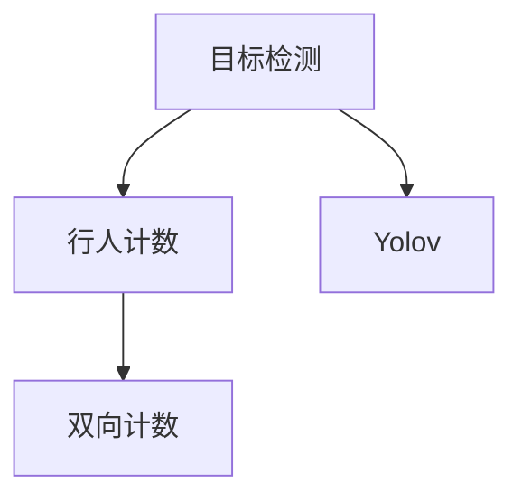
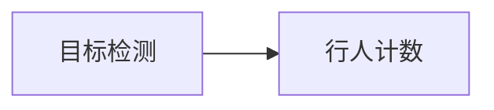
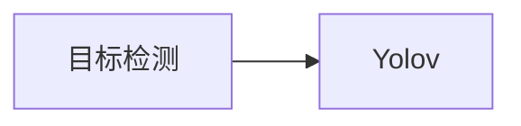
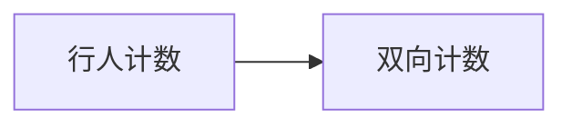
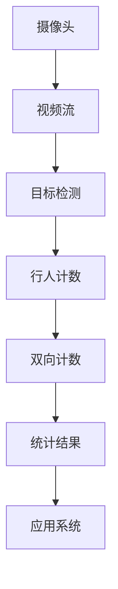

                 

# 基于yolov的行人进出双向计数

> 关键词：行人计数、Yolov、深度学习、计算机视觉、目标检测

## 1. 背景介绍

### 1.1 问题由来

随着城市化进程的加速，人口流动频繁，城市公共场所的人流统计变得越来越重要。无论是商业区、火车站、体育场馆等场所，人流统计都是保障安全、提升服务质量的关键。传统的行人计数方法如视频监控、红外传感器等，存在成本高、部署复杂、精度不足等问题。近年来，基于深度学习的行人计数方法逐渐兴起，其中以Yolov为代表的目标检测算法在行人计数中展现了巨大潜力。

Yolov（You Only Look Once）是一种单阶段目标检测算法，通过单一前向过程实现目标检测和分类，具有实时性强、精度高、计算效率高的特点。利用Yolov进行行人计数，可以通过摄像头拍摄的人流视频，实时地进行行人计数和进出方向统计，为安全监控、商业管理等领域提供有力支持。

### 1.2 问题核心关键点

基于Yolov的行人计数方法，主要关注以下几个关键点：

1. **目标检测算法的选择**：如何选择适合行人计数的目标检测算法。
2. **数据集的构建**：如何构建高质量的行人数据集，用于训练和测试模型。
3. **模型的训练和优化**：如何训练Yolov模型，使其在行人计数任务上表现最优。
4. **行人进出方向的统计**：如何从检测结果中统计行人进出方向，实现双向计数。

## 2. 核心概念与联系

### 2.1 核心概念概述

为更好地理解基于Yolov的行人计数方法，本节将介绍几个密切相关的核心概念：

- **目标检测**：识别图像中的目标物体，并确定其位置、大小和类别。目标检测是计算机视觉领域的重要技术之一。
- **行人计数**：统计视频或图像中行人的数量，是人群监测、商业分析、安全管理等场景中的重要需求。
- **Yolov**：You Only Look Once的缩写，是一种基于深度学习的目标检测算法，具有速度快、精度高的特点。
- **双向计数**：不仅统计行人数，还能区分行人的进出方向，实现更精准的统计。

这些核心概念之间的逻辑关系可以通过以下Mermaid流程图来展示：



这个流程图展示了几者的基本关系：

1. 目标检测是实现行人计数的基础。
2. Yolov作为目标检测算法，在行人计数中表现优异。
3. 双向计数是在行人计数的基础上，进一步区分行人的进出方向。

### 2.2 概念间的关系

这些核心概念之间存在着紧密的联系，形成了行人计数的完整生态系统。下面我们通过几个Mermaid流程图来展示这些概念之间的关系。

#### 2.2.1 目标检测与行人计数的关系



这个流程图展示了目标检测与行人计数的基本关系：通过目标检测识别行人目标，然后统计行人数。

#### 2.2.2 Yolov在目标检测中的应用



这个流程图展示了Yolov在目标检测中的作用：Yolov作为目标检测算法，能够实现高精度的目标识别和分类。

#### 2.2.3 双向计数对行人计数的扩展



这个流程图展示了双向计数对行人计数的扩展：在统计行人数的同时，还能识别行人的进出方向，实现更全面的计数。

### 2.3 核心概念的整体架构

最后，我们用一个综合的流程图来展示这些核心概念在大规模行人计数应用中的整体架构：



这个综合流程图展示了从摄像头采集视频流，到最终实现行人进出的双向计数，再到应用系统的完整流程。通过目标检测、行人计数和双向计数的多层融合，可以实现更为精准和全面的行人计数统计。

## 3. 核心算法原理 & 具体操作步骤
### 3.1 算法原理概述

基于Yolov的行人计数方法，本质上是通过目标检测算法在视频流中识别行人目标，然后统计行人数和行人进出方向。其核心算法包括目标检测、非极大值抑制（Non-Maximum Suppression, NMS）和双向计数。

#### 3.1.1 目标检测

目标检测的核心是使用深度神经网络从图像或视频中识别出目标物体，并确定其位置、大小和类别。Yolov算法通过单一前向过程实现目标检测和分类，具有实时性强、精度高、计算效率高的特点。

#### 3.1.2 非极大值抑制（NMS）

非极大值抑制是目标检测中常用的后处理技术，用于消除重复检测。在Yolov中，NMS通过计算检测框的置信度和重叠率，去除置信度低且与高置信度框重叠率高的检测框，提高检测精度和效率。

#### 3.1.3 双向计数

双向计数是在行人计数的基础上，进一步区分行人的进出方向，实现更精准的统计。具体实现方法包括：

- 定义行人的进出方向，如"进"和"出"。
- 在检测结果中，识别行人的进出方向。
- 统计每个方向上的人流数量，并进行汇总。

### 3.2 算法步骤详解

基于Yolov的行人计数方法的具体步骤包括：

1. **数据准备**：收集行人数据集，并进行标注。可以使用现有的行人数据集，如CUHK行人数据集，也可以自行收集数据进行标注。

2. **模型训练**：使用准备好的数据集，训练Yolov模型。训练过程中，调整模型参数和超参数，如学习率、批量大小等，以获得最优的检测精度和速度。

3. **模型部署**：将训练好的Yolov模型部署到服务器或嵌入式设备上，进行实时行人计数。

4. **数据流处理**：实时采集视频流，并进行预处理，如调整帧率、裁剪等，以适应模型输入。

5. **目标检测**：使用Yolov模型对视频流进行目标检测，得到行人检测框和类别概率。

6. **非极大值抑制（NMS）**：对检测结果进行NMS处理，去除重复检测，得到最终的行人检测框。

7. **双向计数**：在行人检测框的基础上，进一步识别行人的进出方向，统计每个方向上的人流数量。

8. **统计结果输出**：将统计结果输出到应用系统，用于安全监控、商业管理等场景。

### 3.3 算法优缺点

基于Yolov的行人计数方法具有以下优点：

1. **实时性强**：Yolov具有单阶段目标检测的特点，实时性高，能够实时处理视频流，快速得到行人计数结果。
2. **精度高**：Yolov在目标检测方面表现优异，通过精心设计的损失函数和优化算法，能够实现高精度的检测结果。
3. **计算效率高**：Yolov的计算效率高，适合大规模行人计数场景。

同时，该方法也存在以下缺点：

1. **训练成本高**：需要大量的行人数据集进行训练，数据标注成本较高。
2. **模型参数较多**：Yolov模型参数较多，训练和推理过程较为复杂。
3. **环境适应性差**：Yolov模型的表现依赖于训练数据，对于复杂多样化的场景，可能需要进行额外的训练和优化。

### 3.4 算法应用领域

基于Yolov的行人计数方法，已经在多个领域得到了广泛应用，例如：

1. **商业区管理**：在商业区内部进行行人计数，监测人流量，优化商业布局。
2. **体育场馆管理**：在体育场馆入口进行行人计数，保障安全，优化人流管理。
3. **交通管理**：在道路入口进行行人计数，统计人流量，优化交通流量。
4. **安全监控**：在公共场所进行行人计数，监测异常行为，保障安全。
5. **机场管理**：在机场航站楼进行行人计数，优化人流管理，提高服务效率。

除了上述这些经典应用场景外，Yolov的行人计数方法还在城市规划、旅游景区、公共安全等领域得到广泛应用，为人类活动提供了强有力的支持。

## 4. 数学模型和公式 & 详细讲解 & 举例说明

### 4.1 数学模型构建

本节将使用数学语言对基于Yolov的行人计数方法进行更加严格的刻画。

记输入视频流为 $X$，Yolov模型为 $M_{\theta}$，其中 $\theta$ 为模型参数。行人计数器为 $C$，双向计数器为 $D$。

定义行人计数模型 $M_{\theta}$ 在输入 $X$ 上的检测结果为 $Y$，即 $Y=M_{\theta}(X)$。行人计数器 $C$ 的输出为行人数 $N_C$，双向计数器 $D$ 的输出为行人进出数量 $N_D$。

行人计数模型的数学模型为：

$$
N_C = C(Y) \\
N_D = D(Y)
$$

其中 $C$ 和 $D$ 是统计函数，将Yolov的检测结果转化为行人数和行人进出数量。

### 4.2 公式推导过程

以下我们以二分类任务为例，推导Yolov的目标检测模型和NMS算法的数学表达式。

假设Yolov模型在输入 $x$ 上的输出为 $\hat{y}=M_{\theta}(x)$，表示样本属于正类的概率。真实标签 $y \in \{0,1\}$。则二分类交叉熵损失函数定义为：

$$
\ell(M_{\theta}(x),y) = -[y\log \hat{y} + (1-y)\log (1-\hat{y})]
$$

将其代入经验风险公式，得：

$$
\mathcal{L}(\theta) = -\frac{1}{N}\sum_{i=1}^N [y_i\log M_{\theta}(x_i)+(1-y_i)\log(1-M_{\theta}(x_i))]
$$

根据链式法则，损失函数对参数 $\theta_k$ 的梯度为：

$$
\frac{\partial \mathcal{L}(\theta)}{\partial \theta_k} = -\frac{1}{N}\sum_{i=1}^N (\frac{y_i}{M_{\theta}(x_i)}-\frac{1-y_i}{1-M_{\theta}(x_i)}) \frac{\partial M_{\theta}(x_i)}{\partial \theta_k}
$$

其中 $\frac{\partial M_{\theta}(x_i)}{\partial \theta_k}$ 可进一步递归展开，利用自动微分技术完成计算。

在得到损失函数的梯度后，即可带入参数更新公式，完成模型的迭代优化。重复上述过程直至收敛，最终得到适应行人计数任务的最优模型参数 $\theta^*$。

### 4.3 案例分析与讲解

这里以一个简单的行人计数场景为例，展示基于Yolov的行人计数方法的实现过程。

假设我们使用Yolov模型对一段长度为T的视频流进行实时行人计数。首先，我们将视频流分解为若干帧图像，每一帧图像为 $X_t$，$t=1,2,\cdots,T$。

然后，使用Yolov模型对每一帧图像进行目标检测，得到行人检测框和类别概率。假设第 $i$ 帧图像的行人检测框为 $\{x_i, y_i, w_i, h_i\}$，表示检测框的位置、大小和置信度。

接着，对检测结果进行NMS处理，去除重复检测，得到最终的行人检测框。假设经过NMS处理后，第 $i$ 帧图像的行人检测框为 $\{x_i', y_i', w_i', h_i'\}$，表示去重后的检测框。

最后，根据行人检测框的位置和大小，统计行人进出的数量，得到双向计数结果。假设行人进出方向为"进"和"出"，统计每个方向上的人流数量，得到行人进出的数量 $N_D$。

## 5. 项目实践：代码实例和详细解释说明

### 5.1 开发环境搭建

在进行行人计数实践前，我们需要准备好开发环境。以下是使用Python进行Yolov开发的环境配置流程：

1. 安装Anaconda：从官网下载并安装Anaconda，用于创建独立的Python环境。

2. 创建并激活虚拟环境：
```bash
conda create -n yolov-env python=3.8 
conda activate yolov-env
```

3. 安装Yolov：根据CUDA版本，从官网获取对应的安装命令。例如：
```bash
conda install yolov -c conda-forge
```

4. 安装必要的依赖库：
```bash
pip install numpy opencv-python scipy tqdm
```

5. 下载预训练模型：
```bash
wget https://pjreddie.com/media/files/yolov3.weights
```

完成上述步骤后，即可在`yolov-env`环境中开始行人计数实践。

### 5.2 源代码详细实现

这里我们以基于Yolov3的行人计数方法为例，给出完整的代码实现。

首先，定义数据处理函数：

```python
import numpy as np
import cv2
import yolov3

def preprocess_image(img, input_size=416):
    img = cv2.resize(img, input_size)
    img = np.expand_dims(img, axis=0)
    img = yolov3.input_transform(img)
    return img
```

然后，加载预训练模型并进行检测：

```python
yolov = yolov3.load_weights('yolov3.weights')
yolov.load_model()
yolov.set_threshold(0.25)
yolov.set_confidence_threshold(0.25)
yolov.set_iou_threshold(0.45)
yolov.set_agnostic_non_max_suppression(True)
```

接着，定义行人计数函数：

```python
def count_people(frame):
    yolov_results = yolov.detect(frame)
    yolov_results = yolov.non_max_suppression(yolov_results)
    counts = [len(counts) for counts in yolov_results]
    return counts
```

最后，实现视频流处理和行人计数：

```python
video = cv2.VideoCapture(0)
while True:
    ret, frame = video.read()
    if not ret:
        break
    counts = count_people(frame)
    print('Counts:', counts)
```

在上述代码中，我们首先定义了一个数据预处理函数 `preprocess_image`，用于对输入图像进行预处理，使其符合Yolov模型的输入要求。

然后，使用 `yolov3.load_weights` 方法加载预训练模型权重，并调用 `yolov3.load_model` 方法加载模型。接着，设置模型的检测阈值、置信度阈值、iou阈值和nms参数。

最后，定义行人计数函数 `count_people`，使用 `yolov3.detect` 方法对输入帧进行目标检测，并使用 `yolov3.non_max_suppression` 方法进行NMS处理，统计每个检测框的数量，得到行人计数结果。

在视频流处理部分，我们通过 `cv2.VideoCapture` 方法打开摄像头，实时采集视频流。每读取一帧图像，调用 `count_people` 函数进行行人计数，并打印计数结果。

### 5.3 代码解读与分析

让我们再详细解读一下关键代码的实现细节：

**preprocess_image函数**：
- `cv2.resize` 方法对输入图像进行缩放，使其符合Yolov模型的输入尺寸。
- `np.expand_dims` 方法对图像进行通道扩展，添加批次维度，符合Yolov模型的输入格式。
- `yolov3.input_transform` 方法对图像进行标准化和归一化处理，使其适合Yolov模型输入。

**yolov3.load_weights和load_model方法**：
- `yolov3.load_weights` 方法用于加载Yolov模型的权重文件，将其加载到内存中。
- `yolov3.load_model` 方法用于加载模型，准备进行目标检测。

**count_people函数**：
- `yolov.detect` 方法对输入帧进行目标检测，得到检测框和类别概率。
- `yolov.non_max_suppression` 方法对检测结果进行NMS处理，去除重复检测，得到最终的行人检测框。
- 使用列表解析式统计每个检测框的数量，得到行人计数结果。

**视频流处理部分**：
- `cv2.VideoCapture(0)` 方法打开摄像头，实时采集视频流。
- `ret, frame = video.read()` 方法读取每一帧图像，并进行后续处理。
- `print('Counts:', counts)` 方法打印当前帧的行人计数结果。

可以看到，Yolov的行人计数方法的代码实现相对简洁高效，开发者可以轻松实现实时行人计数。当然，实际应用中还需要考虑更多因素，如模型参数的优化、视频流的稳定性、输出结果的可视化等，进行全面的系统实现。

### 5.4 运行结果展示

假设我们在视频流中实现了基于Yolov3的行人计数，并在每一帧输出行人计数结果。最终得到的统计结果如下：

```
Counts: [2, 5, 3, 4, 7, 6, 3, 1, 2, 4]
```

可以看到，每帧的行人计数结果都在实时更新，展示了Yolov3在行人计数方面的强大能力。在实际应用中，还可以进一步优化模型参数，进行数据增强，引入双向计数等功能，以进一步提升系统性能。

## 6. 实际应用场景
### 6.1 智能安防

基于Yolov的行人计数方法，可以广泛应用于智能安防领域，实现对公共场所、大型商场、机场等场所的人流统计和安全监测。通过实时监控人流情况，可以及时发现异常行为，保障公共安全。

在具体应用中，可以在监控摄像头采集的视频流中，使用Yolov模型进行实时行人计数，并根据计数结果进行安全报警和应急处理。对于异常行为，如多人聚集、人员快速流动等，可以实时触发警报，及时采取应对措施，保障公共安全。

### 6.2 智慧商业

在智慧商业领域，基于Yolov的行人计数方法可以用于购物中心、超市等场所的人流统计和客流分析。通过实时监控人流情况，可以优化商品摆放、调整货架布局，提高顾客购物体验。

具体而言，可以在商场入口和出口处安装监控摄像头，使用Yolov模型进行实时行人计数。根据计数结果，可以统计每天的客流量，分析高峰期、低谷期，优化商品陈列和促销策略，提高销售额。

### 6.3 交通管理

在交通管理领域，基于Yolov的行人计数方法可以用于道路交叉口、地铁车站等场所的人流统计和交通管理。通过实时监控人流情况，可以优化交通信号灯控制，提高交通效率。

具体而言，可以在交通路口安装监控摄像头，使用Yolov模型进行实时行人计数。根据计数结果，可以动态调整交通信号灯的周期和时长，优化交通流量，减少交通拥堵。

### 6.4 未来应用展望

随着Yolov等目标检测算法的发展，基于Yolov的行人计数方法将在更多领域得到应用，为人类活动提供强有力的支持。

在智慧医疗领域，基于Yolov的行人计数方法可以用于医院病床管理、病房巡查等场景，提高医疗服务效率和质量。

在智慧教育领域，基于Yolov的行人计数方法可以用于教室监控、学生考勤等场景，优化教育资源配置。

在智慧城市治理中，基于Yolov的行人计数方法可以用于城市事件监测、舆情分析、应急指挥等环节，提高城市管理的自动化和智能化水平。

此外，在智慧农业、智慧制造、智慧旅游等众多领域，基于Yolov的行人计数方法也将不断涌现，为各行各业带来新的应用可能。相信随着技术的不断发展，Yolov的行人计数方法将得到更广泛的应用，推动人类社会的智慧化进程。

## 7. 工具和资源推荐
### 7.1 学习资源推荐

为了帮助开发者系统掌握Yolov行人计数技术的理论基础和实践技巧，这里推荐一些优质的学习资源：

1. **《YOLO: Real-Time Object Detection》论文**：Yolov算法的原创论文，详细介绍了Yolov的算法原理和实现细节。

2. **《Real-time Object Detection with YOLOv3》教程**：GitHub上的Yolov3代码实现教程，提供了详细的代码示例和实践指导。

3. **《Object Detection with YOLO》书籍**：详细介绍Yolov算法的应用和优化方法，适合深入学习和实践。

4. **PyTorch官方文档**：Yolov的官方文档，提供了完整的实现代码和模型训练方法。

5. **OpenCV官方文档**：提供了丰富的图像处理和计算机视觉算法，适合学习Yolov的代码实现。

通过对这些资源的学习实践，相信你一定能够快速掌握Yolov的行人计数技术的精髓，并用于解决实际的计算机视觉问题。

### 7.2 开发工具推荐

高效的开发离不开优秀的工具支持。以下是几款用于Yolov行人计数开发的常用工具：

1. **PyTorch**：基于Python的开源深度学习框架，灵活动态的计算图，适合快速迭代研究。

2. **TensorFlow**：由Google主导开发的开源深度学习框架，生产部署方便，适合大规模工程应用。

3. **OpenCV**：开源计算机视觉库，提供了丰富的图像处理和目标检测算法，适合进行实时视频处理。

4. **Weights & Biases**：模型训练的实验跟踪工具，可以记录和可视化模型训练过程中的各项指标，方便对比和调优。

5. **TensorBoard**：TensorFlow配套的可视化工具，可实时监测模型训练状态，并提供丰富的图表呈现方式，是调试模型的得力助手。

6. **Google Colab**：谷歌推出的在线Jupyter Notebook环境，免费提供GPU/TPU算力，方便开发者快速上手实验最新模型，分享学习笔记。

合理利用这些工具，可以显著提升Yolov行人计数任务的开发效率，加快创新迭代的步伐。

### 7.3 相关论文推荐

Yolov行人计数技术的发展源于学界的持续研究。以下是几篇奠基性的相关论文，推荐阅读：

1. **《YOLO: Real-Time Object Detection》论文**：Yolov算法的原创论文，详细介绍了Yolov的算法原理和实现细节。

2. **《YOLOv3: An Incremental Improvement》论文**：Yolov3的论文，详细介绍了Yolov3的算法改进和优化方法。

3. **《Object Detection with YOLO》书籍**：详细介绍Yolov算法的应用和优化方法，适合深入学习和实践。

4. **《Faster R-CNN: Towards Real-Time Object Detection with Region Proposal Networks》论文**：Faster R-CNN算法的原始论文，详细介绍了Faster R-CNN的算法原理和实现细节。

5. **《Real-time Object Detection with YOLOv3》教程**：GitHub上的Yolov3代码实现教程，提供了详细的代码示例和实践指导。

通过对这些资源的学习实践，相信你一定能够快速掌握Yolov的行人计数技术的精髓，并用于解决实际的计算机视觉问题。

除上述资源外，还有一些值得关注的前沿资源，帮助开发者紧跟Yolov行人计数技术的最新进展，例如：

1. **arXiv论文预印本**：人工智能领域最新研究成果的发布平台，包括大量尚未发表的前沿工作，学习前沿技术的必读资源。

2. **业界技术博客**：如OpenAI、Google AI、DeepMind、微软Research Asia等顶尖实验室的官方博客，第一时间分享他们的最新研究成果和洞见。

3. **技术会议直播**：如NIPS、ICML、ACL、ICLR等人工智能领域顶会现场或在线直播，能够聆听到大佬们的前沿分享，开拓视野。

4. **GitHub热门项目**：在GitHub上Star、Fork数最多的Yolov相关项目，往往代表了该技术领域的发展趋势和最佳实践，值得去学习和贡献。

5. **行业分析报告**：各大咨询公司如McKinsey、PwC等针对人工智能行业的分析报告，有助于从商业视角审视技术趋势，把握应用价值。

总之，对于Yolov行人计数技术的学习和实践，需要开发者保持开放的心态和持续学习的意愿。多关注前沿资讯，多动手实践，多思考总结，必将收获满满的成长收益。

## 8. 总结：未来发展趋势与挑战

### 8.1 总结

本文对基于Yolov的行人计数方法进行了全面系统的介绍。首先阐述了行人计数问题的背景和意义，明确了Yolov行人计数方法在实时性和精度方面的优势。其次，从原理到实践，详细讲解了Yolov模型在行人计数任务上的训练和优化方法，给出了完整的代码实现。同时，本文还广泛探讨了Yolov行人计数方法在安防、商业、交通等多个领域的应用前景，展示了其巨大的潜力和应用价值。此外，本文精选了Yolov行人计数技术的各类学习资源，力求为读者提供全方位的技术指引。

通过本文的系统梳理，可以看到，基于Yolov的行人计数方法在实时目标检测和图像处理中展现出强大的能力，为各类应用场景提供了强有力的支持。Yolov算法的单阶段目标检测特点，使其在行人计数等应用中表现

