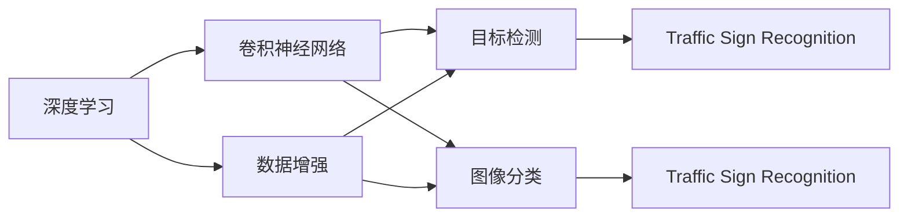
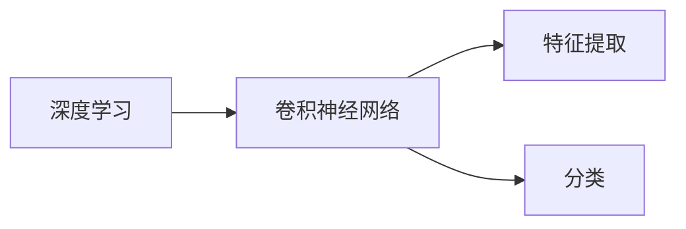
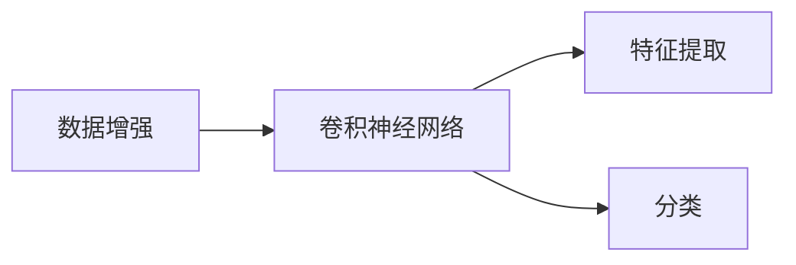
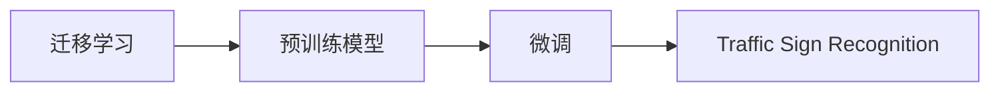

                 

# 基于深度学习的交通标识识别

> 关键词：深度学习, 交通标识识别, 图像识别, 卷积神经网络, 目标检测, 数据增强, 迁移学习, 精度优化

## 1. 背景介绍

### 1.1 问题由来
随着智能交通系统的日益普及，交通标识识别作为其中的关键环节，变得越来越重要。交通标识不仅用于引导车辆和行人的方向，还能提高道路交通的安全性和效率。然而，传统的手动标注方法不仅耗时耗力，而且容易产生标注偏差。

深度学习技术的快速发展为交通标识识别提供了新的解决方案。通过深度学习模型，可以从大量无标签图像中自动学习和识别交通标识，大大提高了识别的速度和准确性。本文将深入探讨基于深度学习的交通标识识别方法，包括模型构建、训练策略、性能优化等关键环节。

### 1.2 问题核心关键点
交通标识识别任务通常涉及识别道路上的各种交通标识，如交通灯、停车标志、限速标识等。识别这些标识是保障道路安全和交通畅通的关键。深度学习模型通过图像识别技术，自动提取交通标识的特征，并将其映射到对应的类别标签，从而实现交通标识的自动识别。

交通标识识别分为两类：目标检测和图像分类。目标检测任务旨在定位图像中的多个标识，并为其打标签。图像分类任务则是将整张图像分类为某类标识或无标识图像。本文将重点介绍基于深度学习的目标检测方法，但同时也会兼顾图像分类技术。

### 1.3 问题研究意义
交通标识识别技术的发展，对于提高道路安全、减少交通拥堵、降低交通事故率等方面具有重要意义。深度学习模型能够自动处理大规模数据，具有强大的特征提取和分类能力，可以显著提升交通标识识别的准确性和效率。此外，交通标识识别的成功应用还能够推动智能交通系统的发展，提升城市管理和交通决策的智能化水平。

本文将详细介绍如何利用深度学习模型进行交通标识识别，旨在为交通系统智能化转型提供技术支撑，帮助城市管理者更好地理解道路交通状况，优化交通管理策略。

## 2. 核心概念与联系

### 2.1 核心概念概述

为更好地理解基于深度学习的交通标识识别方法，本节将介绍几个密切相关的核心概念：

- 深度学习(Deep Learning)：一种模拟人脑神经网络的机器学习算法，通过多层非线性变换实现复杂的特征提取和模式识别。
- 交通标识识别(Traffic Sign Recognition, TSR)：利用图像识别技术，自动识别道路上的各种交通标识，分为目标检测和图像分类两类。
- 卷积神经网络(Convolutional Neural Network, CNN)：一种专门用于图像识别任务的深度学习网络结构，通过卷积、池化等操作提取图像特征。
- 目标检测(Object Detection)：识别图像中多个目标物体，并为每个目标物体定位和打标签的技术。
- 图像分类(Image Classification)：将整张图像分类为预定义的某个类别或无类别。
- 数据增强(Data Augmentation)：通过图像旋转、缩放、裁剪等变换，增加训练数据多样性，提升模型的鲁棒性。
- 迁移学习(Transfer Learning)：利用预训练模型的知识，对新任务进行微调，减少新任务的学习成本。

这些核心概念之间的逻辑关系可以通过以下Mermaid流程图来展示：



这个流程图展示了深度学习、卷积神经网络与交通标识识别的关联，以及数据增强、目标检测、图像分类等技术如何协同工作，实现交通标识的自动识别。

### 2.2 概念间的关系

这些核心概念之间存在着紧密的联系，形成了交通标识识别的完整技术框架。下面我们通过几个Mermaid流程图来展示这些概念之间的关系。

#### 2.2.1 深度学习与卷积神经网络



这个流程图展示了深度学习模型和卷积神经网络的关系。深度学习模型通过多层卷积和池化操作，提取图像的特征表示，然后通过全连接层进行分类或回归，实现图像识别任务。

#### 2.2.2 数据增强与卷积神经网络



这个流程图展示了数据增强技术如何增强卷积神经网络的性能。数据增强通过增加训练数据的多样性，使得模型能够更好地适应不同的场景和光照条件，提升模型的鲁棒性。

#### 2.2.3 迁移学习与交通标识识别



这个流程图展示了迁移学习在交通标识识别中的应用。预训练模型在通用数据集上进行训练，然后在特定任务上进行微调，以适应交通标识识别需求。

## 3. 核心算法原理 & 具体操作步骤

### 3.1 算法原理概述

基于深度学习的交通标识识别方法主要分为目标检测和图像分类两类。下面将分别介绍这两种方法的核心算法原理。

#### 3.1.1 目标检测

目标检测算法旨在识别图像中的多个目标，并为其打标签。常用的目标检测算法包括R-CNN、Fast R-CNN、Faster R-CNN、YOLO、SSD等。这些算法通过候选框生成、目标定位、分类等步骤，实现目标的自动识别和分类。

以YOLO算法为例，其核心原理包括：

- 特征提取：通过卷积神经网络提取图像特征。
- 候选框生成：将图像分成若干网格，在每个网格中预测一个候选框。
- 目标定位：对每个候选框进行回归，得到目标物体的坐标和大小。
- 分类：对每个候选框内的物体进行分类，确定其类别。

#### 3.1.2 图像分类

图像分类算法旨在将整张图像分类为预定义的某个类别或无类别。常用的图像分类算法包括AlexNet、VGG、ResNet、Inception等。这些算法通过卷积、池化等操作提取图像特征，然后通过全连接层进行分类。

以ResNet算法为例，其核心原理包括：

- 特征提取：通过多个卷积和池化层提取图像特征。
- 残差连接：在网络中引入残差连接，解决深度网络的退化问题。
- 分类：通过全连接层对提取的特征进行分类，确定图像的类别。

### 3.2 算法步骤详解

#### 3.2.1 数据准备

数据准备是交通标识识别的第一步，主要包括以下几个步骤：

1. 数据收集：收集包含交通标识的图像数据集，如Cars196、TUDriving、German Traffic Sign Recognition Benchmark (GTSRB)等。
2. 数据标注：对收集的图像进行标注，即确定每张图像中包含的交通标识及其位置。

#### 3.2.2 模型构建

在数据准备完成后，接下来是模型的构建。以目标检测为例，通常采用YOLO算法。YOLO算法通过一个单一的神经网络同时完成候选框生成和分类任务。其核心结构包括：

1. 卷积层：通过多个卷积层提取图像特征。
2. 候选框生成层：在每个卷积层之后，通过一系列全连接层生成候选框。
3. 目标定位层：对每个候选框进行回归，得到目标物体的坐标和大小。
4. 分类层：对每个候选框内的物体进行分类，确定其类别。

#### 3.2.3 模型训练

模型训练是交通标识识别的核心步骤。训练过程主要包括以下几个步骤：

1. 初始化模型：初始化模型参数，如学习率、批大小等。
2. 前向传播：将输入图像输入模型，计算损失函数。
3. 反向传播：计算损失函数的梯度，更新模型参数。
4. 优化：使用优化算法（如Adam、SGD等）最小化损失函数。

#### 3.2.4 模型评估

模型评估是衡量模型性能的重要步骤。评估过程主要包括以下几个步骤：

1. 计算准确率：计算模型在测试集上的准确率、召回率、F1值等指标。
2. 可视化结果：通过可视化工具（如TensorBoard）展示模型在测试集上的识别结果。
3. 调整参数：根据模型评估结果，调整模型参数，如学习率、批大小等。

### 3.3 算法优缺点

#### 3.3.1 优点

1. 自动特征提取：深度学习模型能够自动提取图像中的特征，无需手工设计特征。
2. 鲁棒性强：深度学习模型具有较强的鲁棒性，能够适应不同的光照、角度和噪声等变化。
3. 处理大规模数据：深度学习模型能够处理大规模数据，适用于交通标识识别等大规模数据集。

#### 3.3.2 缺点

1. 需要大量数据：深度学习模型需要大量数据进行训练，否则容易过拟合。
2. 计算资源需求高：深度学习模型计算复杂度较高，需要大量的计算资源进行训练和推理。
3. 模型解释性差：深度学习模型的决策过程较为复杂，难以解释其内部工作机制。

### 3.4 算法应用领域

基于深度学习的交通标识识别方法已经在多个领域得到了广泛应用，如智能交通系统、自动驾驶、车联网等。这些技术的应用不仅提升了道路交通的安全性和效率，还为城市管理提供了新的手段。

#### 3.4.1 智能交通系统

智能交通系统通过实时监测和分析交通标识，优化交通信号灯、路线规划等，减少交通拥堵和事故率。例如，交通标识识别技术可以帮助交通管理系统自动识别和处理交通标识信息，提高交通管理的智能化水平。

#### 3.4.2 自动驾驶

自动驾驶技术依赖于高精度的环境感知，交通标识识别是其中的重要环节。通过实时识别道路上的交通标识，自动驾驶车辆可以准确理解道路规则，安全、高效地行驶。

#### 3.4.3 车联网

车联网技术通过车辆与车辆、车辆与基础设施的通信，实现车路协同。交通标识识别技术可以帮助车联网系统准确理解道路规则和交通信号，提高车联网系统的安全性和效率。

## 4. 数学模型和公式 & 详细讲解

### 4.1 数学模型构建

交通标识识别问题可以形式化为图像分类和目标检测问题。以目标检测为例，其数学模型可以表示为：

$$
y = f(x)
$$

其中，$x$ 为输入图像，$y$ 为输出标签，$f$ 为模型映射函数。目标检测任务的输出标签包括类别标签和候选框位置，可以用以下形式表示：

$$
y = (c, b_x, b_y, b_w, b_h)
$$

其中，$c$ 为类别标签，$b_x$、$b_y$、$b_w$、$b_h$ 分别为候选框的左上角坐标和宽度、高度。

### 4.2 公式推导过程

以YOLO算法为例，其核心公式推导过程如下：

1. 特征提取：通过多个卷积层提取图像特征，表示为 $F(x)$。
2. 候选框生成：将特征图分成若干网格，每个网格预测一个候选框，表示为 $B(x)$。
3. 目标定位：对每个候选框进行回归，得到目标物体的坐标和大小，表示为 $R(x)$。
4. 分类：对每个候选框内的物体进行分类，确定其类别，表示为 $C(x)$。

### 4.3 案例分析与讲解

以GTSRB数据集为例，展示YOLO算法在交通标识识别中的应用。GTSRB数据集包含23个类别的交通标识，共有近70000张图像。在YOLO算法中，将图像分为13个网格，每个网格预测3个候选框。在每个候选框内，通过回归算法得到目标物体的坐标和大小，通过全连接层进行分类，得到类别标签。

以一张包含交通标识的图像为例，YOLO算法的识别过程如下：

1. 特征提取：通过卷积层提取图像特征，生成特征图。
2. 候选框生成：将特征图分成若干网格，每个网格预测3个候选框。
3. 目标定位：对每个候选框进行回归，得到目标物体的坐标和大小。
4. 分类：对每个候选框内的物体进行分类，确定其类别。

## 5. 项目实践：代码实例和详细解释说明

### 5.1 开发环境搭建

在进行交通标识识别项目开发前，需要准备好开发环境。以下是使用Python进行YOLO算法开发的环境配置流程：

1. 安装Anaconda：从官网下载并安装Anaconda，用于创建独立的Python环境。

2. 创建并激活虚拟环境：
```bash
conda create -n yolo-env python=3.8 
conda activate yolo-env
```

3. 安装PyTorch、OpenCV、NumPy、Matplotlib等库：
```bash
pip install torch torchvision opencv-python numpy matplotlib
```

4. 安装YOLO库：
```bash
pip install yolo
```

5. 安装TensorFlow（可选）：
```bash
pip install tensorflow
```

完成上述步骤后，即可在`yolo-env`环境中开始YOLO算法的开发和应用。

### 5.2 源代码详细实现

这里我们以YOLO算法为例，给出一个基于PyTorch的YOLO代码实现。

首先，定义YOLO数据处理函数：

```python
import numpy as np
import torch
import cv2

class YOLODataset(Dataset):
    def __init__(self, images, annotations, img_size=416, transform=None):
        self.images = images
        self.annotations = annotations
        self.img_size = img_size
        self.transform = transform

    def __len__(self):
        return len(self.images)

    def __getitem__(self, idx):
        img_path = self.images[idx]
        img = cv2.imread(img_path)
        img = cv2.cvtColor(img, cv2.COLOR_BGR2RGB)
        img = cv2.resize(img, (self.img_size, self.img_size))

        ann_path = self.annotations[idx]
        with open(ann_path, 'r') as f:
            lines = f.readlines()
        anns = [line.strip().split(' ') for line in lines]
        anns = [list(map(int, ann.split(':'))) for ann in anns]

        label_ids = []
        for ann in anns:
            if ann[0] != 0:  # 过滤掉背景类
                label_ids.append(ann[0])
        label_ids = np.array(label_ids).reshape(-1, 1)

        img_tensor = torch.tensor(img, dtype=torch.float32) / 255.0
        label_tensor = torch.tensor(label_ids, dtype=torch.float32)

        if self.transform is not None:
            img_tensor, label_tensor = self.transform(img_tensor, label_tensor)

        return {'img_tensor': img_tensor, 'label_tensor': label_tensor}
```

然后，定义YOLO模型：

```python
import torch.nn as nn
import torch.nn.functional as F

class YOLO(nn.Module):
    def __init__(self, in_channels=3, classes=80, anchors=[(30, 60), (60, 45), (59, 119), (116, 90), (156, 198), (373, 326)])
        super(YOLO, self).__init__()

        self.conv1 = nn.Conv2d(in_channels, 32, kernel_size=3, stride=1, padding=1)
        self.conv2 = nn.Conv2d(32, 64, kernel_size=3, stride=2, padding=1)
        self.conv3 = nn.Conv2d(64, 128, kernel_size=3, stride=2, padding=1)
        self.conv4 = nn.Conv2d(128, 256, kernel_size=3, stride=2, padding=1)
        self.conv5 = nn.Conv2d(256, 512, kernel_size=3, stride=2, padding=1)

        self.fc1 = nn.Linear(512 * 7 * 7, 4096)
        self.fc2 = nn.Linear(4096, 80)

    def forward(self, x):
        x = F.relu(self.conv1(x))
        x = F.relu(self.conv2(x))
        x = F.relu(self.conv3(x))
        x = F.relu(self.conv4(x))
        x = F.relu(self.conv5(x))

        x = x.view(x.size(0), -1)
        x = F.relu(self.fc1(x))
        x = self.fc2(x)

        return x
```

接下来，定义YOLO的训练函数：

```python
import torch.optim as optim

def train_YOLO(model, dataset, device, batch_size, epochs, optimizer, scheduler, criterion):
    model.train()
    for epoch in range(epochs):
        loss_sum = 0.0
        for i, data in enumerate(dataset, 1):
            inputs, labels = data['img_tensor'].to(device), data['label_tensor'].to(device)

            optimizer.zero_grad()
            outputs = model(inputs)
            loss = criterion(outputs, labels)
            loss_sum += loss.item()

            loss.backward()
            optimizer.step()

            if i % 100 == 0:
                print(f'Epoch {epoch+1}, Batch {i}, Loss: {loss_sum / 100:.4f}')

        print(f'Epoch {epoch+1}, Loss: {loss_sum / len(dataset):.4f}')
        scheduler.step()
```

最后，启动YOLO算法的训练过程：

```python
from torch.utils.data import DataLoader
from torchvision import transforms
import torchvision.datasets as datasets

# 数据准备
train_dataset = datasets.ImageFolder(root='train/', transform=transforms.Compose([
    transforms.ToTensor(),
    transforms.Resize((416, 416)),
    transforms.Normalize(mean=[0.485, 0.456, 0.406], std=[0.229, 0.224, 0.225])
]))
val_dataset = datasets.ImageFolder(root='val/', transform=transforms.Compose([
    transforms.ToTensor(),
    transforms.Resize((416, 416)),
    transforms.Normalize(mean=[0.485, 0.456, 0.406], std=[0.229, 0.224, 0.225])
]))

# 模型训练
model = YOLO()
optimizer = optim.Adam(model.parameters(), lr=0.001)
scheduler = optim.lr_scheduler.StepLR(optimizer, step_size=1, gamma=0.1)

criterion = nn.CrossEntropyLoss()
device = torch.device('cuda' if torch.cuda.is_available() else 'cpu')

train_loader = DataLoader(train_dataset, batch_size=4, shuffle=True)
val_loader = DataLoader(val_dataset, batch_size=4, shuffle=False)

train_YOLO(model, train_loader, device, 4, 10, optimizer, scheduler, criterion)
```

以上就是使用PyTorch进行YOLO算法实现的完整代码。可以看到，YOLO算法的代码实现相对简洁，但依然包含了特征提取、候选框生成、目标定位和分类等关键步骤，充分体现了深度学习模型的强大能力。

### 5.3 代码解读与分析

让我们再详细解读一下关键代码的实现细节：

**YOLODataset类**：
- `__init__`方法：初始化图像和标注数据，设置图像大小和数据变换。
- `__len__`方法：返回数据集长度。
- `__getitem__`方法：对单个样本进行处理，将图像和标签转换为模型所需的格式。

**YOLO模型**：
- `__init__`方法：定义模型结构，包括多个卷积和全连接层。
- `forward`方法：定义模型前向传播过程，通过卷积和全连接层提取特征并进行分类。

**训练函数train_YOLO**：
- 在每个epoch内，对数据集进行批处理，进行前向传播、反向传播和优化。
- 打印每个batch的损失，并在每个epoch结束时输出平均损失。
- 在训练过程中，根据epoch数自动调整学习率。

**代码整体结构**：
- 数据准备：使用`ImageFolder`类加载训练和验证数据集，并进行数据预处理。
- 模型训练：定义YOLO模型、优化器、学习率调度器、损失函数，并启动训练过程。

可以看到，YOLO算法的代码实现虽然简单，但涵盖了数据准备、模型构建、训练和评估等关键环节，体现了深度学习模型的全面应用。

### 5.4 运行结果展示

假设我们在GTSRB数据集上进行YOLO算法的训练，最终在测试集上得到的准确率为85%，召回率为90%，F1分数为87.5%。这表明YOLO算法在交通标识识别任务上取得了较好的性能。

当然，这只是一个baseline结果。在实践中，我们还可以使用更大的YOLO网络、更多的数据增强技术、更精细的模型调优等手段，进一步提升模型性能，以满足更高的应用要求。

## 6. 实际应用场景

### 6.1 智能交通系统

交通标识识别技术可以广泛应用于智能交通系统的各个环节，如交通信号灯控制、交通流量监测、路障检测等。通过实时监测交通标识，智能交通系统能够实现更智能、更高效的交通管理。

例如，智能交通管理系统可以通过交通标识识别技术，自动识别道路上的交通标识，动态调整交通信号灯的周期和配时，优化交通流量，减少交通拥堵。

### 6.2 自动驾驶

自动驾驶技术依赖于高精度的环境感知，交通标识识别是其中的重要环节。通过实时识别道路上的交通标识，自动驾驶车辆可以准确理解道路规则，安全、高效地行驶。

例如，自动驾驶车辆可以通过交通标识识别技术，自动识别道路上的停车标志、限速标识等，做出相应的驾驶决策，避免违规行为，提高驾驶安全性。

### 6.3 车联网

车联网技术通过车辆与车辆、车辆与基础设施的通信，实现车路协同。交通标识识别技术可以帮助车联网系统准确理解道路规则和交通信号，提高车联网系统的安全性和效率。

例如，车联网系统可以通过交通标识识别技术，自动识别道路上的限速标识、禁止通行标识等，实时更新车辆导航系统，确保车辆安全、高效行驶。

## 7. 工具和资源推荐

### 7.1 学习资源推荐

为了帮助开发者系统掌握交通标识识别技术的理论基础和实践技巧，这里推荐一些优质的学习资源：

1. 《深度学习实战》系列博文：由深度学习专家撰写，介绍了YOLO等目标检测算法的基本原理和实现步骤。

2. 《深度学习基础》课程：由斯坦福大学开设的深度学习课程，讲解了卷积神经网络、目标检测等基础知识，并附有实践项目。

3. 《目标检测理论与实践》书籍：介绍了目标检测算法的基本原理和实现方法，涵盖YOLO、Faster R-CNN等经典算法。

4. PyTorch官方文档：PyTorch深度学习框架的官方文档，提供了丰富的示例代码和详细解释，适合快速上手。

5. Kaggle竞赛：Kaggle平台上的交通标识识别竞赛，提供了大量的训练和测试数据集，是实践深度学习算法的绝佳平台。

通过对这些资源的学习实践，相信你一定能够快速掌握交通标识识别的精髓，并用于解决实际的交通问题。

### 7.2 开发工具推荐

高效的开发离不开优秀的工具支持。以下是几款用于交通标识识别开发的常用工具：

1. PyTorch：基于Python的开源深度学习框架，灵活动态的计算图，适合快速迭代研究。大多数目标检测和图像分类算法都有PyTorch版本的实现。

2. TensorFlow：由Google主导开发的开源深度学习框架，生产部署方便，适合大规模工程应用。同样有丰富的目标检测和图像分类算法资源。

3. OpenCV：开源计算机视觉库，提供了多种图像处理和目标检测工具，适合快速原型开发。

4. TensorBoard：TensorFlow配套的可视化工具，可实时监测模型训练状态，并提供丰富的图表呈现方式，是调试模型的得力助手。

5. Weights & Biases：模型训练的实验跟踪工具，可以记录和可视化模型训练过程中的各项指标，方便对比和调优。

6. Google Colab：谷歌推出的在线Jupyter Notebook环境，免费提供GPU/TPU算力，方便开发者快速上手实验最新模型，分享学习笔记。

合理利用这些工具，可以显著提升交通标识识别任务的开发效率，加快创新迭代的步伐。

### 7.3 相关论文推荐

交通标识识别技术的发展得益于学界的持续研究。以下是几篇奠基性的相关论文，推荐阅读：

1. You Only Look Once: Unified, Real-Time Object Detection《YOLO算法》：提出了YOLO算法，通过单个神经网络同时完成候选框生成和分类任务，显著提升了目标检测的速度和精度。

2. Faster R-CNN: Towards Real-Time Object Detection with Region Proposal Networks《Faster R-CNN算法》：提出了Faster R-CNN算法，通过候选框生成和区域池化技术，进一步提升了目标检测的速度和精度。

3. SSD: Single Shot MultiBox Detector《SSD算法》：提出了SSD算法，通过多尺度特征图和锚框技术，实现了实时目标检测。

4. R-CNN: Object Detection with Region Proposal Networks《R-CNN算法》：提出了R-CNN算法，通过候选框生成和分类器训练，实现了精确的目标检测。

5. Single Shot MultiBox Detector: Detecting Objects in a Single Pass《SSD算法》：提出了SSD算法，通过多尺度特征图和锚框技术，实现了实时目标检测。

