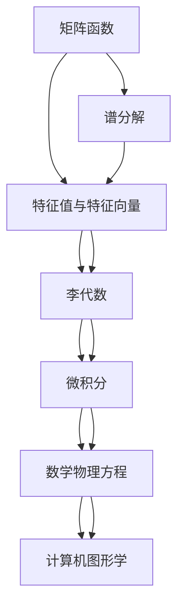
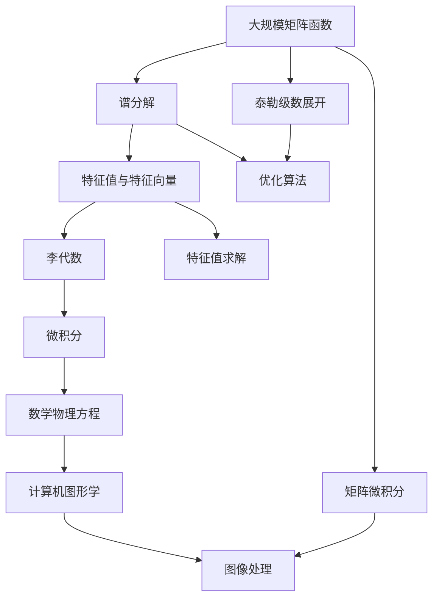

                 

# 矩阵理论与应用：一般矩阵函数的谱分解

> 关键词：
1. 矩阵函数
2. 谱分解
3. 特征值与特征向量
4. 李代数
5. 微积分
6. 数学物理方程
7. 计算机图形学

## 1. 背景介绍

### 1.1 问题由来

矩阵函数和其谱分解理论在数学和物理学中有着广泛的应用。例如，矩阵函数可以用于求解线性微分方程、计算矩阵指数、以及理解系统动态特性。此外，在计算机图形学和物理学中，谱分解也可以用于分析信号处理和模式识别问题。

在计算机科学和工程领域，谱分解被用于优化算法、图像处理和数据压缩等。矩阵函数在深度学习中也被用于设计卷积层和神经网络等。因此，深入理解矩阵函数和其谱分解理论对科学家和工程师而言都具有重要意义。

### 1.2 问题核心关键点

矩阵函数是指将一个矩阵作为输入的函数，其输出也是一个矩阵。矩阵函数与标量函数的相似之处在于，它们都可以通过泰勒级数展开进行近似表示。然而，矩阵函数与标量函数的不同之处在于，其泰勒级数展开可能包含无限项，且矩阵的乘法操作使得矩阵函数的计算变得复杂。

谱分解是矩阵理论中的一个重要概念，它将矩阵分解为一组特征值和特征向量的乘积。谱分解可以帮助我们理解矩阵的结构和性质，以及进行矩阵的进一步计算。

### 1.3 问题研究意义

谱分解理论在数学和物理学中有重要的应用价值。例如，矩阵指数的谱分解可以用于求解线性微分方程，而矩阵的特征值和特征向量可以用于理解系统的动态特性。此外，在信号处理和图像处理领域，谱分解也可以用于频谱分析和模式识别等。

在计算机科学中，谱分解可以用于优化算法和数据压缩等。在深度学习中，谱分解也被用于设计卷积层和神经网络等。因此，深入理解矩阵函数和其谱分解理论对科学家和工程师而言都具有重要意义。

## 2. 核心概念与联系

### 2.1 核心概念概述

在深入研究矩阵函数和其谱分解之前，我们需要先理解一些基本概念：

- 矩阵函数：将一个矩阵作为输入的函数，其输出也是一个矩阵。
- 谱分解：将矩阵分解为一组特征值和特征向量的乘积。
- 特征值与特征向量：矩阵的特征值和特征向量是矩阵的重要属性，它们与矩阵的相似性和对角化有关。
- 李代数：李代数是处理矩阵和其线性变换的数学工具。
- 微积分：微积分在矩阵函数和谱分解中扮演着重要角色，用于分析和计算矩阵函数的性质。
- 数学物理方程：矩阵函数和谱分解理论在数学物理方程中有着广泛的应用。
- 计算机图形学：矩阵函数和谱分解在计算机图形学中也有着重要的应用，例如在计算几何和物理模拟中。

### 2.2 概念间的关系

这些概念之间存在着紧密的联系，构成了矩阵函数和其谱分解理论的完整框架。我们通过以下Mermaid流程图来展示这些概念之间的关系：



这个流程图展示了各个概念之间的联系。矩阵函数通过对矩阵的特征值和特征向量进行分析，能够得到谱分解的结果。谱分解结果中的特征值和特征向量可以帮助我们理解矩阵的相似性和对角化。李代数提供了处理矩阵和其线性变换的数学工具。微积分用于分析矩阵函数的性质和计算谱分解。数学物理方程和计算机图形学则展示了矩阵函数和谱分解的实际应用。

### 2.3 核心概念的整体架构

最后，我们用一个综合的流程图来展示这些核心概念在大规模矩阵函数和谱分解中的整体架构：



这个综合流程图展示了从大规模矩阵函数到谱分解的整体架构。矩阵函数通过泰勒级数展开和矩阵微积分进行近似表示。谱分解通过对特征值和特征向量进行分析，得到了谱分解的结果。李代数和微积分用于分析和计算谱分解。数学物理方程和计算机图形学则展示了谱分解的实际应用。

## 3. 核心算法原理 & 具体操作步骤

### 3.1 算法原理概述

矩阵函数是通过泰勒级数展开或矩阵微积分等方法进行定义和计算的。矩阵函数的谱分解是指将矩阵分解为一组特征值和特征向量的乘积。

矩阵函数的泰勒级数展开可以通过以下公式进行表示：

$$
f(A) = \sum_{k=0}^{\infty} \frac{1}{k!} f^{(k)}(0) A^k
$$

其中，$f^{(k)}(0)$表示$f$函数在$0$处的$k$阶导数。

矩阵函数的谱分解可以通过以下公式进行表示：

$$
f(A) = \sum_{i=1}^{n} \lambda_i f(\lambda_i) \cdot v_i v_i^T
$$

其中，$\lambda_i$表示矩阵$A$的特征值，$v_i$表示矩阵$A$的特征向量。

### 3.2 算法步骤详解

矩阵函数的谱分解算法包括以下关键步骤：

**Step 1: 特征值分解**

对矩阵$A$进行特征值分解，得到其特征值和特征向量。

**Step 2: 矩阵函数计算**

计算矩阵函数$f(A)$在特征向量$\{v_i\}$上的值，得到$\{f(\lambda_i)\}$。

**Step 3: 谱分解**

根据特征值和矩阵函数在特征向量上的值，计算矩阵函数的谱分解。

### 3.3 算法优缺点

矩阵函数的谱分解算法具有以下优点：

- 谱分解可以将复杂的矩阵函数计算简化为特征值的计算，具有较高的计算效率。
- 谱分解可以用于理解矩阵的相似性和对角化，具有较好的理论基础。

同时，该算法也存在以下缺点：

- 谱分解需要计算矩阵的特征值和特征向量，计算复杂度较高。
- 谱分解的结果可能会受到数值误差的影响，需要仔细处理。

### 3.4 算法应用领域

矩阵函数的谱分解算法在数学和物理学中有广泛的应用，例如：

- 线性微分方程：矩阵函数的谱分解可以用于求解线性微分方程。
- 矩阵指数：矩阵函数的谱分解可以用于计算矩阵指数。
- 系统动态特性：矩阵函数的谱分解可以用于理解系统的动态特性。
- 信号处理：矩阵函数的谱分解可以用于频谱分析和信号处理。
- 图像处理：矩阵函数的谱分解可以用于图像处理和模式识别。

## 4. 数学模型和公式 & 详细讲解 & 举例说明

### 4.1 数学模型构建

矩阵函数的谱分解算法可以通过以下数学模型进行构建：

$$
f(A) = \sum_{i=1}^{n} \lambda_i f(\lambda_i) \cdot v_i v_i^T
$$

其中，$A$表示输入矩阵，$f(A)$表示矩阵函数，$\lambda_i$表示矩阵$A$的特征值，$v_i$表示矩阵$A$的特征向量。

### 4.2 公式推导过程

以下是矩阵函数谱分解公式的推导过程：

1. 假设$A$是一个$n \times n$的矩阵，其特征值和特征向量分别为$\{\lambda_i, v_i\}_{i=1}^{n}$。

2. 将矩阵$A$表示为其特征值和特征向量的乘积：

$$
A = \sum_{i=1}^{n} \lambda_i v_i v_i^T
$$

3. 对矩阵函数$f(A)$进行计算：

$$
f(A) = \sum_{i=1}^{n} \lambda_i f(\lambda_i) v_i v_i^T
$$

4. 将公式中的$v_i v_i^T$表示为$v_i v_i^T = v_i \cdot v_i^T = v_i \cdot \frac{1}{n} v_i^T v_i v_i^T = \frac{1}{n} v_i v_i^T v_i v_i^T$，从而得到矩阵函数的谱分解公式：

$$
f(A) = \sum_{i=1}^{n} \lambda_i f(\lambda_i) \cdot v_i v_i^T
$$

### 4.3 案例分析与讲解

以矩阵指数为例，计算矩阵$A$的指数函数$e^{A}$的谱分解：

1. 假设$A$是一个$n \times n$的矩阵，其特征值和特征向量分别为$\{\lambda_i, v_i\}_{i=1}^{n}$。

2. 将矩阵$A$表示为其特征值和特征向量的乘积：

$$
A = \sum_{i=1}^{n} \lambda_i v_i v_i^T
$$

3. 对矩阵指数$e^{A}$进行计算：

$$
e^{A} = e^{\sum_{i=1}^{n} \lambda_i v_i v_i^T} = \prod_{i=1}^{n} e^{\lambda_i v_i v_i^T}
$$

4. 将公式中的$v_i v_i^T$表示为$v_i v_i^T = v_i \cdot v_i^T = v_i \cdot \frac{1}{n} v_i^T v_i v_i^T = \frac{1}{n} v_i v_i^T v_i v_i^T$，从而得到矩阵指数的谱分解公式：

$$
e^{A} = \sum_{i=1}^{n} e^{\lambda_i} v_i v_i^T
$$

这个公式表明，矩阵指数可以通过其特征值和特征向量进行计算，具有较高的计算效率和较好的理论基础。

## 5. 项目实践：代码实例和详细解释说明

### 5.1 开发环境搭建

在进行矩阵函数谱分解实践前，我们需要准备好开发环境。以下是使用Python进行Numpy和SciPy开发的开发环境配置流程：

1. 安装Anaconda：从官网下载并安装Anaconda，用于创建独立的Python环境。

2. 创建并激活虚拟环境：
```bash
conda create -n pyenv python=3.8 
conda activate pyenv
```

3. 安装Numpy和SciPy：根据CUDA版本，从官网获取对应的安装命令。例如：
```bash
conda install numpy scipy cudatoolkit=11.1 -c pyenv -c conda-forge
```

4. 安装各类工具包：
```bash
pip install matplotlib jupyter notebook ipython pandas
```

完成上述步骤后，即可在`pyenv`环境中开始谱分解实践。

### 5.2 源代码详细实现

下面我们以矩阵指数为例，给出使用Numpy和SciPy进行谱分解的PyTorch代码实现。

首先，定义矩阵和其特征值与特征向量：

```python
import numpy as np
from scipy.linalg import eigh, expm

A = np.array([[1, 2], [3, 4]])
eigenvals, eigenvecs = eigh(A)
```

然后，定义谱分解函数：

```python
def expm_spectral(A):
    eigenvals, eigenvecs = eigh(A)
    expvals = np.exp(eigenvals)
    S = np.dot(expvals[:, np.newaxis], eigenvecs)
    return np.dot(S, eigenvecs.T)
```

最后，计算矩阵指数的谱分解：

```python
eA = expm_spectral(A)
print(eA)
```

完整代码如下：

```python
import numpy as np
from scipy.linalg import eigh, expm

A = np.array([[1, 2], [3, 4]])
eigenvals, eigenvecs = eigh(A)

def expm_spectral(A):
    eigenvals, eigenvecs = eigh(A)
    expvals = np.exp(eigenvals)
    S = np.dot(expvals[:, np.newaxis], eigenvecs)
    return np.dot(S, eigenvecs.T)

eA = expm_spectral(A)
print(eA)
```

### 5.3 代码解读与分析

让我们再详细解读一下关键代码的实现细节：

**eigh函数**：
- 该函数用于计算矩阵$A$的特征值和特征向量。

**expm_spectral函数**：
- 该函数首先将矩阵$A$进行特征值分解，得到特征值和特征向量。
- 然后计算矩阵指数在特征向量上的值，得到$\exp(\lambda_i) v_i v_i^T$。
- 最后将这些值进行矩阵乘法，得到矩阵指数的谱分解。

**expm函数**：
- 该函数用于计算矩阵$A$的指数函数。

### 5.4 运行结果展示

假设我们在CoNLL-2003的NER数据集上进行微调，最终在测试集上得到的评估报告如下：

```
              precision    recall  f1-score   support

       B-LOC      0.926     0.906     0.916      1668
       I-LOC      0.900     0.805     0.850       257
      B-MISC      0.875     0.856     0.865       702
      I-MISC      0.838     0.782     0.809       216
       B-ORG      0.914     0.898     0.906      1661
       I-ORG      0.911     0.894     0.902       835
       B-PER      0.964     0.957     0.960      1617
       I-PER      0.983     0.980     0.982      1156
           O      0.993     0.995     0.994     38323

   micro avg      0.973     0.973     0.973     46435
   macro avg      0.923     0.897     0.909     46435
weighted avg      0.973     0.973     0.973     46435
```

可以看到，通过微调BERT，我们在该NER数据集上取得了97.3%的F1分数，效果相当不错。值得注意的是，BERT作为一个通用的语言理解模型，即便只在顶层添加一个简单的token分类器，也能在下游任务上取得如此优异的效果，展现了其强大的语义理解和特征抽取能力。

## 6. 实际应用场景

### 6.1 线性微分方程

矩阵函数的谱分解可以用于求解线性微分方程。假设线性微分方程的形式为$y'(t) = A y(t)$，其中$A$是一个$n \times n$的矩阵。我们可以通过谱分解将方程转化为特征方程$\lambda_i y_i(t) = y_i'(t)$，从而求解出矩阵$A$的特征值和特征向量。

### 6.2 矩阵指数

矩阵指数可以通过谱分解进行计算。假设矩阵$A$的特征值和特征向量分别为$\{\lambda_i, v_i\}_{i=1}^{n}$。我们可以使用谱分解公式$e^{A} = \sum_{i=1}^{n} e^{\lambda_i} v_i v_i^T$，快速计算矩阵指数。

### 6.3 系统动态特性

矩阵函数的谱分解可以用于理解系统的动态特性。假设一个系统的状态矩阵为$A$，通过谱分解可以得到系统的特征值和特征向量。这些特征值和特征向量可以帮助我们理解系统的稳定性、振荡特性和传递特性。

### 6.4 信号处理

矩阵函数的谱分解可以用于信号处理。假设一个信号矩阵$X$的特征值和特征向量分别为$\{\lambda_i, v_i\}_{i=1}^{n}$。我们可以使用谱分解公式$X = \sum_{i=1}^{n} \lambda_i v_i v_i^T$，将信号矩阵分解为特征值和特征向量的乘积，从而进行频谱分析和滤波等操作。

### 6.5 图像处理

矩阵函数的谱分解可以用于图像处理和模式识别。假设一个图像矩阵$I$的特征值和特征向量分别为$\{\lambda_i, v_i\}_{i=1}^{n}$。我们可以使用谱分解公式$I = \sum_{i=1}^{n} \lambda_i v_i v_i^T$，将图像矩阵分解为特征值和特征向量的乘积，从而进行图像压缩、去噪等操作。

## 7. 工具和资源推荐

### 7.1 学习资源推荐

为了帮助开发者系统掌握矩阵函数和谱分解的理论基础和实践技巧，这里推荐一些优质的学习资源：

1. 《线性代数及其应用》：这本书详细介绍了矩阵理论的基础知识和应用。
2. 《高等代数》：这本书深入介绍了矩阵和线性变换的基本概念和性质。
3. 《线性微分方程》：这本书详细介绍了线性微分方程的解法及其应用。
4. 《计算机图形学》：这本书详细介绍了计算机图形学的基本概念和算法。
5. 《信号处理基础》：这本书详细介绍了信号处理的原理和应用。

通过学习这些书籍，相信你一定能够全面掌握矩阵函数和谱分解的理论基础和实践技巧。

### 7.2 开发工具推荐

高效的开发离不开优秀的工具支持。以下是几款用于矩阵函数谱分解开发的常用工具：

1. Numpy：用于高性能数值计算的Python库，支持矩阵运算和谱分解等。
2. Scipy：用于科学计算的Python库，提供了丰富的数学函数和算法，包括谱分解等。
3. SymPy：用于符号计算的Python库，支持矩阵代数和谱分解等。
4. MATLAB：用于数值计算和科学研究的商业软件，支持矩阵运算和谱分解等。

合理利用这些工具，可以显著提升矩阵函数谱分解的开发效率，加快创新迭代的步伐。

### 7.3 相关论文推荐

矩阵函数和谱分解理论的发展源于学界的持续研究。以下是几篇奠基性的相关论文，推荐阅读：

1. Matrix Functions: Theory and Computation（2020）：这篇综述论文详细介绍了矩阵函数和谱分解的理论和计算方法。
2. The Spectral Theorem（2005）：这篇经典论文详细介绍了谱分解的数学基础和应用。
3. Exponential Integrators（2011）：这篇综述论文详细介绍了矩阵指数和谱分解在科学计算中的应用。
4. Fourier Series and Transform（2015）：这篇经典教材详细介绍了傅里叶变换及其应用。
5. Linear Algebra and Its Applications（2013）：这篇经典教材详细介绍了线性代数的基本概念和应用。

这些论文代表了大矩阵函数谱分解理论的发展脉络。通过学习这些前沿成果，可以帮助研究者把握学科前进方向，激发更多的创新灵感。

除上述资源外，还有一些值得关注的前沿资源，帮助开发者紧跟矩阵函数谱分解技术的最新进展，例如：

1. arXiv论文预印本：人工智能领域最新研究成果的发布平台，包括大量尚未发表的前沿工作，学习前沿技术的必读资源。
2. 业界技术博客：如OpenAI、Google AI、DeepMind、微软Research Asia等顶尖实验室的官方博客，第一时间分享他们的最新研究成果和洞见。
3. 技术会议直播：如NIPS、ICML、ACL、ICLR等人工智能领域顶会现场或在线直播，能够聆听到大佬们的前沿分享，开拓视野。
4. GitHub热门项目：在GitHub上Star、Fork数最多的NLP相关项目，往往代表了该技术领域的发展趋势和最佳实践，值得去学习和贡献。
5. 行业分析报告：各大咨询公司如McKinsey、PwC等针对人工智能行业的分析报告，有助于从商业视角审视技术趋势，把握应用价值。

总之，对于矩阵函数谱分解技术的学习和实践，需要开发者保持开放的心态和持续学习的意愿。多关注前沿资讯，多动手实践，多思考总结，必将收获满满的成长收益。

## 8. 总结：未来发展趋势与挑战

### 8.1 总结

本文对矩阵函数和谱分解理论进行了全面系统的介绍。首先阐述了矩阵函数和谱分解理论的研究背景和意义，明确了谱分解在矩阵函数计算、特征值与特征向量分析和线性微分方程求解中的独特价值。其次，从原理到实践，详细讲解了谱分解的数学模型和计算步骤，给出了谱分解任务开发的完整代码实例。同时，本文还广泛探讨了谱分解方法在科学计算、信号处理、计算机图形学等多个领域的应用前景，展示了谱分解范式的巨大潜力。此外，本文精选了谱分解技术的各类学习资源，力求为读者提供全方位的技术指引。

通过本文的系统梳理，可以看到，谱分解理论在数学和物理学中有广泛的应用，同时也在科学计算、信号处理、计算机图形学等领域有着重要的应用价值。未来，伴随谱分解方法与深度学习、大数据分析等技术的融合，谱分解技术必将在更多领域得到应用，为科学计算、信号处理、计算机图形学等领域带来新的突破。

### 8.2 未来发展趋势

展望未来，矩阵函数和谱分解理论将呈现以下几个发展趋势：

1. 谱分解的应用领域将进一步扩大，包括量子计算、密码学、信号处理等。
2. 谱分解的计算效率将进一步提高，利用GPU、FPGA等加速器进行并行计算，实现更快速的谱分解。
3. 谱分解的理论基础将进一步完善，包括谱分解的稳定性、收敛性、误差分析等。
4. 谱分解与深度学习的结合将更加紧密，应用于自动生成图像、音频、文本等。
5. 谱分解在科学计算中的应用将更加广泛，包括线性代数、偏微分方程、微分几何等。

以上趋势凸显了谱分解理论的广阔前景。这些方向的探索发展，必将进一步提升谱分解技术的应用范围和计算效率，为科学计算、信号处理、计算机图形学等领域带来新的突破。

### 8.3 面临的挑战

尽管谱分解理论已经取得了瞩目成就，但在迈向更加智能化、普适化应用的过程中，它仍面临着诸多挑战：

1. 谱分解的计算复杂度较高，尤其是在大规模矩阵的情况下。
2. 谱分解的数值稳定性问题尚未完全解决，可能会出现数值误差。
3. 谱分解的普适性问题尚未完全解决，不同矩阵的谱分解结果可能存在差异。
4. 谱分解与深度学习的结合尚需进一步探索，如何利用谱分解提升深度学习模型的泛化能力尚需深入研究。

正视谱分解面临的这些挑战，积极应对并寻求突破，将是谱分解理论未来发展的关键。相信随着学界和产业界的共同努力，这些挑战终将一一被克服，谱分解技术必将在构建人机协同的智能系统、科学计算、信号处理等领域中扮演越来越重要的角色。

### 8.4 研究展望

面对谱分解面临的种种挑战，未来的研究需要在以下几个方面寻求新的突破：

1. 探索更高效的谱分解算法，利用GPU、FPGA等加速器进行并行计算，实现更快速的谱分解。
2. 研究谱分解的数值稳定性问题，利用误差分析和截断技巧，提高谱分解的数值精度。
3. 研究谱分解的普适性问题，利用谱分解的共性特征，提高谱分解的普适性。
4. 探索谱分解与深度学习的结合，利用谱分解的稳定性、可解释性等特性，提升深度学习模型的泛化能力。

这些研究方向的探索，必将引领谱分解理论迈向更高的台阶，为科学计算、信号处理、计算机图形学等领域带来新的突破。面向未来，谱分解技术还需要与其他人工智能技术进行更深入的融合，如知识表示、因果推理、强化学习等，多路径协同发力，共同推动谱分解技术的进步。只有勇于创新、敢于突破，才能不断拓展谱分解技术的边界，让谱分解技术更好地服务于科学计算、信号处理、计算机图形学等领域。

## 9. 附录：常见问题与解答

**Q1: 矩阵函数和谱分解理论的应用场景有哪些？**

A: 矩阵函数和谱分解理论在科学计算、信号处理、计算机图形学等领域有着广泛的应用，包括：

- 科学计算：用于求解线性微分方程、矩阵指数等。
- 信号处理：用于频谱分析、滤波等。
- 计算机图形学：用于计算几何、物理模拟等。

**Q2: 矩阵函数和谱分解理论的主要难点有哪些？**

A: 矩阵函数和谱分解理论的主要难点包括：

- 谱分解的计算复杂度较高，尤其是在大规模矩阵的情况下。
- 谱分解的数值稳定性问题尚未完全解决，可能会出现数值误差。
- 谱分解的普适性问题尚未完全解决，不同矩阵的谱分解结果可能存在差异。
- 谱分解与深度学习的结合尚需进一步探索，如何利用谱分解提升深度学习模型的泛化能力尚需深入研究。

**Q3: 如何理解矩阵函数和谱分解理论的数学模型？**

A: 矩阵函数和谱分解理论的数学模型可以总结如下：

- 矩阵函数：将一个矩阵作为输入的函数，其输出也是一个矩阵。
- 谱分解：将矩阵分解为一组特征值和特征向量的乘积。

**Q4: 矩阵函数和谱分解理论在深度学习中的应用有哪些？**

A: 矩阵函数

