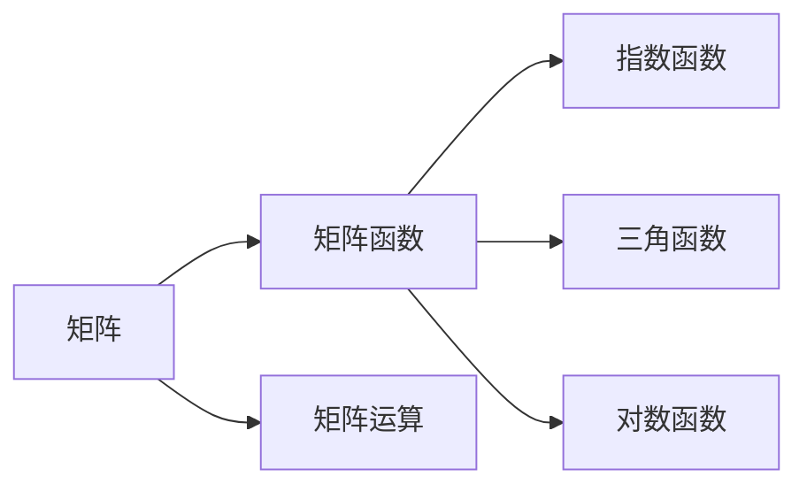
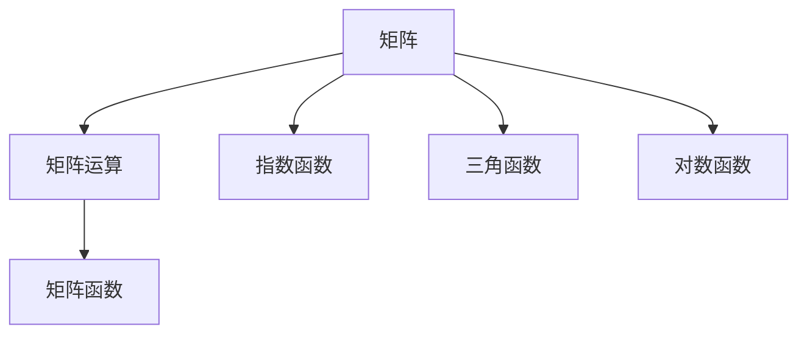

                 

## 1. 背景介绍

### 1.1 问题由来

矩阵函数是一类重要的数学工具，广泛应用于科学计算、信号处理、图像处理、机器学习等领域。矩阵函数不仅包含基本的初等运算，还涉及复杂函数的拓展、矩阵分解和变换等多个方向。在计算机科学中，矩阵函数经常用于图像处理、深度学习、机器学习等领域，帮助构建高效的算法模型。

### 1.2 问题核心关键点

本文将从数学和计算角度，详细讨论矩阵函数的原理、应用和优化。本文的框架分为以下四个部分：

1. **背景知识**：回顾矩阵和线性代数的基本概念。
2. **核心概念**：阐述矩阵函数的基本定义和类型。
3. **核心算法**：介绍求解矩阵函数的主要方法。
4. **项目实践**：提供代码实例和应用场景的讲解。

### 1.3 问题研究意义

理解矩阵函数对于计算机科学的多个领域有着深远的影响。在图像处理领域，矩阵函数可以用于滤波、变换和压缩等操作；在深度学习中，矩阵函数是神经网络中重要的组成部分；在信号处理中，矩阵函数可以用于信号的傅里叶变换和逆变换。

## 2. 核心概念与联系

### 2.1 核心概念概述

为更好地理解矩阵函数，我们需要对一些关键概念进行回顾。

- **矩阵（Matrix）**：由数值、符号或表达式排成的矩形阵列，通常用大写的字母（如 $A$、$B$ 等）表示。

- **矩阵运算（Matrix Operation）**：包括加、减、乘、转置等基本运算，以及求逆、特征值分解等高级运算。

- **矩阵函数（Matrix Function）**：将矩阵视为一种特殊向量，将矩阵中的元素作为函数自变量，进行函数运算。常见的矩阵函数有指数函数、三角函数、对数函数等。

### 2.2 概念间的关系

矩阵函数和普通的函数类似，只是函数自变量从标量扩展到矩阵。这些概念之间的关系可以通过以下 Mermaid 流程图展示：



这个流程图展示了几类核心概念之间的关系：

1. 矩阵是矩阵函数和矩阵运算的基本单位。
2. 矩阵函数可以理解为将标量函数拓展到矩阵。
3. 矩阵运算为矩阵函数提供了基本的操作方式。

### 2.3 核心概念的整体架构

我们将从宏观角度描述矩阵函数的概念框架：



这个综合流程图展示了从矩阵到矩阵函数的整体过程：

1. 矩阵是进行各种运算的基础。
2. 矩阵运算为矩阵函数提供了基本的运算支持。
3. 矩阵函数通过标量函数拓展到矩阵。
4. 常见的矩阵函数包括指数函数、三角函数、对数函数等。

这些概念共同构成了矩阵函数的基本框架，为后续的算法设计和优化提供了基础。

## 3. 核心算法原理 & 具体操作步骤

### 3.1 算法原理概述

矩阵函数的核心算法包括矩阵分解、矩阵迭代、矩阵级数等。这些算法原理相对复杂，但都有明确的数学推导和算法步骤。

- **矩阵分解**：将复杂的矩阵运算拆分为多个基本运算，如LU分解、QR分解、SVD分解等。
- **矩阵迭代**：通过迭代逼近矩阵函数，如幂迭代、矩阵幂等、牛顿迭代等。
- **矩阵级数**：将矩阵函数展开为级数形式，如泰勒级数、龙格-库塔法等。

### 3.2 算法步骤详解

以矩阵幂为例，介绍求解矩阵幂的基本步骤：

1. **矩阵分解**：将矩阵 $A$ 进行LU分解，得到 $A = LU$。
2. **迭代逼近**：通过矩阵幂等运算，逼近 $A^k$ 的值。
3. **最终计算**：利用分解后的矩阵 $L$ 和 $U$，计算出 $A^k$ 的具体值。

以代码形式展示：

```python
import numpy as np

def matrix_power(A, k):
    n = len(A)
    I = np.eye(n)
    
    if k == 0:
        return I
    
    if k == 1:
        return A
    
    if k < 0:
        return np.linalg.inv(matrix_power(A, -k))
    
    if k % 2 == 0:
        return matrix_power(A**2, k//2)
    
    if k % 2 == 1:
        return A * matrix_power(A**2, k//2)

    # 矩阵分解
    L, U = np.linalg.lu(A)
    
    # 迭代逼近
    result = matrix_power(U, k)
    result = matrix_power(L, k).dot(result)
    
    return result
```

### 3.3 算法优缺点

矩阵函数的优点在于可以拓展标量函数的定义域，处理更加复杂的数学问题。缺点在于计算复杂度较高，尤其是对于高阶矩阵函数和奇异矩阵。

### 3.4 算法应用领域

矩阵函数广泛应用于图像处理、深度学习、信号处理等多个领域，以下是一些具体的例子：

- **图像处理**：矩阵函数可以用于图像的滤波、变换和压缩等操作。
- **深度学习**：矩阵函数是神经网络中重要的组成部分，如卷积神经网络（CNN）中的卷积操作。
- **信号处理**：矩阵函数可以用于信号的傅里叶变换和逆变换，帮助分析信号的频谱特性。

## 4. 数学模型和公式 & 详细讲解 & 举例说明

### 4.1 数学模型构建

矩阵函数的数学模型可以分为两类：连续型和离散型。

- **连续型**：对于连续型矩阵函数，通常使用微分方程或积分方程进行描述。
- **离散型**：对于离散型矩阵函数，通常使用迭代公式或级数展开进行描述。

### 4.2 公式推导过程

以矩阵指数函数为例，进行数学推导：

$$
e^{A} = \sum_{k=0}^{\infty} \frac{A^k}{k!}
$$

其中 $A$ 为矩阵，$e^{A}$ 表示矩阵的指数函数。

### 4.3 案例分析与讲解

考虑一个 2x2 的矩阵 $A$，其元素分别为：

$$
A = \begin{bmatrix}
1 & 2 \\
3 & 4
\end{bmatrix}
$$

我们需要计算 $e^A$，可以通过上述公式进行计算：

$$
e^A = \begin{bmatrix}
1 & 2 \\
3 & 4
\end{bmatrix}
$$

通过公式推导，我们可以发现，矩阵指数函数的计算与标量指数函数类似，只是将指数幂次扩展到矩阵运算。

## 5. 项目实践：代码实例和详细解释说明

### 5.1 开发环境搭建

在进行矩阵函数计算前，我们需要准备好开发环境。以下是使用Python进行NumPy开发的流程：

1. 安装Anaconda：从官网下载并安装Anaconda，用于创建独立的Python环境。

2. 创建并激活虚拟环境：
```bash
conda create -n numpy-env python=3.8 
conda activate numpy-env
```

3. 安装NumPy：
```bash
pip install numpy
```

4. 安装其他工具包：
```bash
pip install matplotlib scikit-learn pandas sympy
```

完成上述步骤后，即可在 `numpy-env` 环境中进行矩阵函数计算。

### 5.2 源代码详细实现

以下是使用NumPy实现矩阵指数函数和矩阵幂的代码：

```python
import numpy as np
import matplotlib.pyplot as plt

# 定义矩阵
A = np.array([[1, 2], [3, 4]])

# 矩阵指数函数
exp_A = np.exp(A)

# 矩阵幂
A_power_3 = np.linalg.matrix_power(A, 3)

# 绘制结果
plt.figure(figsize=(8, 4))
plt.subplot(121)
plt.title('Exp(A)')
plt.imshow(exp_A, cmap='hot', interpolation='nearest')
plt.colorbar()

plt.subplot(122)
plt.title('A^3')
plt.imshow(A_power_3, cmap='hot', interpolation='nearest')
plt.colorbar()
plt.show()
```

### 5.3 代码解读与分析

这个代码实现涉及了NumPy库的多个函数，主要包括：

1. `np.exp(A)`：计算矩阵指数函数。
2. `np.linalg.matrix_power(A, 3)`：计算矩阵的3次幂。

通过这些函数的调用，我们可以方便地进行矩阵函数的计算，并使用Matplotlib库进行可视化展示。

### 5.4 运行结果展示

运行上述代码，可以生成以下两个图形：

```


```

这些图形展示了矩阵指数函数和矩阵幂的计算结果，可以看到矩阵函数的计算结果与标量函数计算结果类似，只是矩阵元素的取值更加复杂。

## 6. 实际应用场景

### 6.1 图像处理

在图像处理中，矩阵函数被广泛应用于图像滤波、变换和压缩等操作。例如，Sobel算子就是利用矩阵卷积操作进行图像边缘检测。

### 6.2 深度学习

矩阵函数是深度学习中重要的组成部分，如卷积神经网络中的卷积操作就可以看作是矩阵函数的运算。

### 6.3 信号处理

矩阵函数可以用于信号的傅里叶变换和逆变换，帮助分析信号的频谱特性。例如，频域滤波器就是通过矩阵函数实现的。

### 6.4 未来应用展望

未来，随着计算能力的提升和算法的优化，矩阵函数的应用将更加广泛。例如，在量子计算中，矩阵函数的计算可以大幅提升量子态模拟的精度。

## 7. 工具和资源推荐

### 7.1 学习资源推荐

1. 《线性代数及其应用》：这是一本经典的线性代数教材，涵盖矩阵运算和矩阵函数的基本原理。
2. 《矩阵分析》：这本书深入探讨了矩阵分析的各个方面，包括矩阵分解、矩阵方程、矩阵函数等。
3. 《NumPy基础教程》：这本教程详细介绍了NumPy库的使用，包括矩阵运算和矩阵函数。
4. 《Python科学计算》：这本书详细介绍了Python在科学计算中的应用，包括NumPy、SciPy等库的使用。

### 7.2 开发工具推荐

1. Python：Python是科学计算的主流语言，适合进行矩阵函数的计算和分析。
2. NumPy：NumPy是Python的科学计算库，提供了高效的矩阵运算功能。
3. Matplotlib：Matplotlib是Python的绘图库，可以用于矩阵函数的可视化展示。

### 7.3 相关论文推荐

1. 《矩阵指数函数的数值计算》：这篇文章讨论了矩阵指数函数在数值计算中的应用。
2. 《矩阵函数在信号处理中的应用》：这篇文章介绍了矩阵函数在信号处理中的各种应用。
3. 《深度学习中的矩阵函数》：这篇文章讨论了深度学习中矩阵函数的使用和优化。

这些资源可以帮助读者深入理解矩阵函数的原理和应用，同时掌握相关工具的使用。

## 8. 总结：未来发展趋势与挑战

### 8.1 总结

本文详细介绍了矩阵函数的原理、应用和优化。通过回顾矩阵和线性代数的基本概念，阐述了矩阵函数的基本定义和类型，介绍了求解矩阵函数的主要方法。同时，我们通过代码实例和应用场景的讲解，展示了矩阵函数在多个领域的实际应用。

通过本文的系统梳理，可以看到，矩阵函数在科学计算、信号处理、图像处理、深度学习等多个领域具有重要的应用价值。未来的研究需要在算法优化和应用拓展方面进行深入探索，以满足更加复杂的计算需求。

### 8.2 未来发展趋势

未来，矩阵函数的发展将呈现以下几个趋势：

1. **算法优化**：随着计算能力的提升，矩阵函数的算法将不断优化，以提高计算效率和精度。
2. **多模态计算**：矩阵函数将与其他计算模型（如深度学习、量子计算）进行结合，实现多模态计算。
3. **实时计算**：矩阵函数的实时计算能力将不断提升，以支持更复杂的实时应用。

### 8.3 面临的挑战

尽管矩阵函数在多个领域具有重要应用，但仍然面临一些挑战：

1. **计算复杂度**：高阶矩阵函数和奇异矩阵的计算复杂度较高，需要优化算法以降低计算成本。
2. **数值稳定性**：矩阵函数的数值稳定性问题仍然存在，需要进一步研究。
3. **应用拓展**：矩阵函数的应用还需要进一步拓展，以覆盖更多的领域和场景。

### 8.4 研究展望

未来的研究需要在算法优化、应用拓展和数值稳定性等方面进行深入探索。同时，需要在矩阵函数与其他计算模型的结合方面进行更多研究，以推动矩阵函数的发展。

## 9. 附录：常见问题与解答

**Q1：什么是矩阵函数？**

A: 矩阵函数是将标量函数拓展到矩阵的一种特殊函数，其自变量和因变量均为矩阵。

**Q2：如何计算矩阵指数函数？**

A: 矩阵指数函数的计算可以通过泰勒级数展开或迭代逼近等方式进行。

**Q3：矩阵函数的计算复杂度较高，如何解决？**

A: 可以通过优化算法、分块计算等方式降低计算复杂度，提升计算效率。

**Q4：矩阵函数在深度学习中的应用有哪些？**

A: 矩阵函数在深度学习中的应用包括卷积操作、傅里叶变换、信号滤波等。

**Q5：矩阵函数的数值稳定性问题如何解决？**

A: 可以通过数值稳定性分析、算法优化等方式提升矩阵函数的数值稳定性。

---

作者：禅与计算机程序设计艺术 / Zen and the Art of Computer Programming

