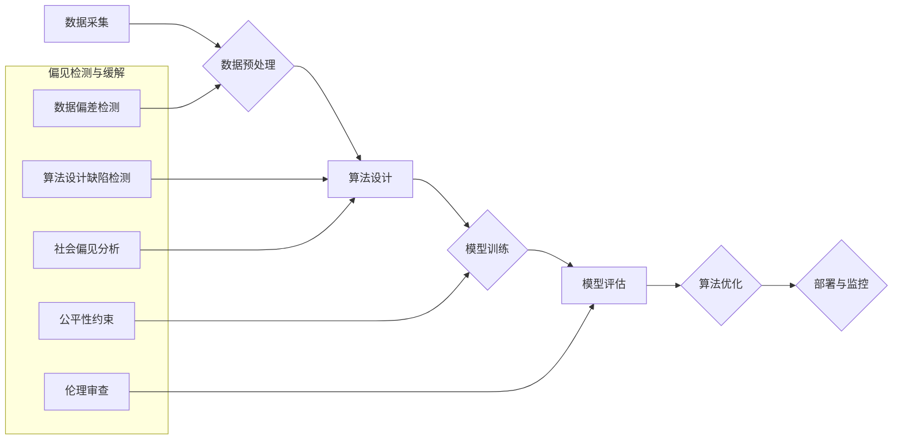

## AI人工智能核心算法原理与代码实例讲解：算法偏见

> 关键词：人工智能、算法偏见、机器学习、深度学习、数据偏差、公平性、伦理

## 1. 背景介绍

人工智能（AI）技术近年来发展迅速，在各个领域取得了令人瞩目的成就。从自动驾驶到医疗诊断，从个性化推荐到金融风险评估，AI算法正在深刻地改变着我们的生活。然而，随着AI技术的广泛应用，一个不容忽视的问题逐渐浮出水面：算法偏见。

算法偏见是指AI算法在训练过程中由于数据偏差而导致的歧视性结果。简单来说，如果训练数据本身就存在偏见，那么训练出来的AI模型也会继承这些偏见，并将其反映在决策和预测中。这种偏见可能导致不公平、不公正甚至有害的结果，损害个人的权利和社会公平正义。

例如，在招聘领域，如果训练数据中男性占据主导地位，那么AI招聘系统可能会倾向于选择男性候选人，从而加剧性别歧视。在刑事司法领域，如果训练数据中犯罪嫌疑人的人种比例与实际情况不符，那么AI风险评估系统可能会对特定种族的人群进行过度惩罚，导致种族歧视。

## 2. 核心概念与联系

**2.1 算法偏见产生的原因**

算法偏见主要源于以下几个方面：

* **数据偏差:** 训练数据本身可能存在偏见，例如种族、性别、年龄、地域等方面的代表性不足或不均衡。
* **算法设计缺陷:** 算法的设计本身可能存在缺陷，导致其对某些特征过度敏感或忽略了重要的特征。
* **社会偏见:** 社会文化中的偏见和歧视也会影响到数据的采集、处理和算法的设计，从而导致算法偏见。

**2.2 算法偏见的影响**

算法偏见可能导致以下一系列负面影响：

* **不公平的结果:** 算法决策可能导致某些群体受到不公平的对待，例如被拒绝贷款、被判处更重的刑罚等。
* **社会分化:** 算法偏见可能会加剧社会分化，导致不同群体之间的矛盾和冲突。
* **损害个人权利:** 算法偏见可能会侵犯个人的隐私权、言论自由权等基本权利。

**2.3 算法偏见检测与缓解**

为了应对算法偏见带来的挑战，研究人员提出了多种检测和缓解方法，例如：

* **数据预处理:** 通过数据清洗、平衡和增强等方法来减少数据偏差。
* **算法设计改进:** 设计更加公平、透明和可解释的算法模型。
* **公平性约束:** 在算法训练过程中引入公平性约束，例如限制算法对某些特征的依赖程度。
* **伦理审查:** 对AI算法进行伦理审查，确保其不会造成不公平或有害的结果。

**Mermaid 流程图**



## 3. 核心算法原理 & 具体操作步骤

### 3.1  算法原理概述

算法偏见检测和缓解是一个复杂而多方面的挑战，需要结合多种算法和技术手段。常见的算法包括：

* **统计方法:** 利用统计学原理来检测数据和算法中的偏见，例如卡方检验、偏度系数等。
* **机器学习方法:** 利用机器学习算法来识别和预测算法偏见，例如分类算法、回归算法等。
* **深度学习方法:** 利用深度神经网络来学习数据中的复杂模式，并识别潜在的偏见。

### 3.2  算法步骤详解

**3.2.1 数据预处理:**

* **数据清洗:** 去除数据中的缺失值、错误值和重复值。
* **数据平衡:** 通过过采样、欠采样或合成数据等方法来平衡不同类别的样本数量。
* **特征工程:** 选择和转换特征，以减少数据中的噪声和冗余信息，并增强算法的性能。

**3.2.2 算法训练:**

* 选择合适的算法模型，例如逻辑回归、支持向量机、决策树等。
* 使用训练数据来训练算法模型，并调整模型参数以获得最佳性能。

**3.2.3 偏见检测:**

* 使用统计方法或机器学习方法来检测算法模型中的偏见。
* 分析算法模型的决策边界，识别可能导致偏见的结果。

**3.2.4 偏见缓解:**

* 使用公平性约束来限制算法模型对某些特征的依赖程度。
* 使用对抗训练来增强算法模型对偏见样本的鲁棒性。
* 使用可解释性方法来分析算法模型的决策过程，并识别潜在的偏见来源。

### 3.3  算法优缺点

**优点:**

* 可以有效地检测和缓解算法偏见。
* 可以提高算法的公平性和可解释性。

**缺点:**

* 需要大量的训练数据和计算资源。
* 算法设计和参数调整需要专业知识和经验。
* 无法完全消除算法偏见，因为数据和社会本身可能存在偏见。

### 3.4  算法应用领域

* **招聘:** 避免基于性别、种族等特征的歧视性招聘决策。
* **金融:** 确保贷款审批和风险评估等决策公平公正。
* **医疗:** 避免基于种族、性别等特征的医疗歧视。
* **司法:** 确保刑事风险评估和判刑决策公平公正。

## 4. 数学模型和公式 & 详细讲解 & 举例说明

### 4.1  数学模型构建

**4.1.1 偏见度量指标:**

可以使用多种指标来度量算法偏见，例如：

* **均值差异:** 计算不同群体在算法预测结果上的平均差异。
* **标准差差异:** 计算不同群体在算法预测结果上的标准差差异。
* **公平性指标:** 使用公平性指标，例如Equalized Odds、Demographic Parity等，来评估算法的公平性。

**4.1.2 偏见缓解方法:**

可以使用多种数学方法来缓解算法偏见，例如：

* **加权损失函数:** 在算法训练过程中，为不同群体赋予不同的权重，以减少对某些群体的过度惩罚。
* **正则化项:** 在算法模型中添加正则化项，以限制模型对某些特征的依赖程度。
* **对抗训练:** 使用对抗样本来训练算法模型，使其能够更好地应对偏见样本。

### 4.2  公式推导过程

**4.2.1 均值差异公式:**

$$
\text{Mean Difference} = \frac{1}{n_1} \sum_{i=1}^{n_1} y_{i1} - \frac{1}{n_2} \sum_{j=1}^{n_2} y_{j2}
$$

其中：

* $n_1$ 和 $n_2$ 分别是两个群体的样本数量。
* $y_{i1}$ 和 $y_{j2}$ 分别是两个群体中第 $i$ 个和第 $j$ 个样本的预测结果。

**4.2.2 加权损失函数公式:**

$$
\text{Loss} = \sum_{i=1}^{n} w_i \cdot L(y_i, \hat{y}_i)
$$

其中：

* $w_i$ 是第 $i$ 个样本的权重。
* $L(y_i, \hat{y}_i)$ 是预测结果 $y_i$ 和真实值 $\hat{y}_i$ 之间的损失函数。

### 4.3  案例分析与讲解

**4.3.1 案例:** 假设我们有一个用于预测贷款风险的算法模型。我们发现，该模型对女性申请人的风险评估偏高。

**4.3.2 分析:** 我们可以使用均值差异和标准差差异等指标来量化这种偏见。我们可以分析训练数据，发现女性申请人的样本数量较少，并且这些样本可能来自风险较高的群体。

**4.3.3 缓解:** 我们可以使用加权损失函数来缓解这种偏见。我们可以为女性申请人的样本赋予更高的权重，从而降低模型对女性申请人的风险评估偏高。

## 5. 项目实践：代码实例和详细解释说明

### 5.1  开发环境搭建

* Python 3.x
* scikit-learn
* TensorFlow 或 PyTorch

### 5.2  源代码详细实现

```python
# 导入必要的库
from sklearn.model_selection import train_test_split
from sklearn.linear_model import LogisticRegression
from sklearn.metrics import accuracy_score, classification_report

# 加载数据
#...

# 将数据分割为训练集和测试集
X_train, X_test, y_train, y_test = train_test_split(X, y, test_size=0.2, random_state=42)

# 创建LogisticRegression模型
model = LogisticRegression()

# 训练模型
model.fit(X_train, y_train)

# 对测试集进行预测
y_pred = model.predict(X_test)

# 计算模型的准确率
accuracy = accuracy_score(y_test, y_pred)
print(f"模型准确率: {accuracy}")

# 生成分类报告
print(classification_report(y_test, y_pred))
```

### 5.3  代码解读与分析

* 该代码示例展示了如何使用LogisticRegression模型进行分类任务。
* 数据加载、分割、训练和评估等步骤都包含在代码中。
* 我们可以通过修改模型参数、使用不同的算法或进行数据预处理等方式来优化模型性能。

### 5.4  运行结果展示

* 运行结果将显示模型的准确率和分类报告，包括精确率、召回率、F1-score等指标。
* 我们可以根据这些指标来评估模型的性能，并进行进一步的优化。

## 6. 实际应用场景

### 6.1  医疗领域

* **疾病诊断:** 利用AI算法分析患者的医疗影像、病史和基因信息，辅助医生进行疾病诊断。
* **个性化治疗:** 根据患者的个体特征，推荐最合适的治疗方案。
* **药物研发:** 利用AI算法加速药物研发过程，例如预测药物的有效性和安全性。

### 6.2  金融领域

* **风险评估:** 利用AI算法评估贷款申请人的风险，帮助银行做出贷款决策。
* **欺诈检测:** 利用AI算法识别金融交易中的欺诈行为。
* **投资决策:** 利用AI算法分析市场数据，辅助投资者做出投资决策。

### 6.3  教育领域

* **个性化学习:** 根据学生的学习进度和能力，提供个性化的学习内容和辅导。
* **自动批改:** 利用AI算法自动批改学生的作业和考试卷。
* **智能教学助手:** 为教师提供智能化的教学辅助工具，例如生成学习资源、分析学生学习情况等。

### 6.4  未来应用展望

随着AI技术的不断发展，其应用场景将更加广泛，例如：

* **自动驾驶:** 利用AI算法实现自动驾驶汽车。
* **机器人:** 利用AI算法开发更加智能的机器人，例如服务机器人、工业机器人等。
* **虚拟现实:** 利用AI算法增强虚拟现实体验，例如创建更加逼真的虚拟环境。

## 7. 工具和资源推荐

### 7.1  学习资源推荐

* **在线课程:** Coursera、edX、Udacity等平台提供丰富的AI课程。
* **书籍:** 《深度学习》、《机器学习实战》等书籍是学习AI的基础教材。
* **博客和论坛