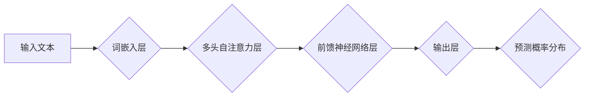

## AI人工智能核心算法原理与代码实例讲解：语言模型

> 关键词：语言模型、自然语言处理、深度学习、Transformer、BERT、GPT、代码实例、算法原理

## 1. 背景介绍

语言模型是人工智能领域中一个重要的研究方向，它旨在通过学习语言的统计规律，能够生成流畅、自然的文本。近年来，随着深度学习技术的快速发展，语言模型取得了显著的进步，在机器翻译、文本摘要、对话系统等领域展现出强大的应用潜力。

传统的统计语言模型主要基于n-gram模型，它通过统计词语之间的出现频率来预测下一个词语。然而，n-gram模型存在着严重的平滑问题和词汇稀疏问题，难以捕捉长距离依赖关系。深度学习的出现为语言模型带来了新的突破。

深度学习语言模型利用神经网络的强大能力，能够学习到更复杂的语言表示，并更好地捕捉长距离依赖关系。其中，Transformer模型是近年来发展起来的一种非常重要的深度学习语言模型架构，它通过自注意力机制有效地解决了传统RNN模型在处理长文本时遇到的梯度消失问题，并取得了在各种自然语言处理任务上的优异性能。

## 2. 核心概念与联系

**2.1 核心概念**

* **自然语言处理 (NLP):** 自然语言处理是人工智能的一个分支，旨在使计算机能够理解、处理和生成人类语言。
* **语言模型:** 语言模型是一种统计模型，它能够根据给定的文本序列预测下一个词语的概率分布。
* **深度学习:** 深度学习是一种机器学习方法，它利用多层神经网络来学习数据的复杂特征。
* **Transformer:** Transformer是一种基于注意力机制的深度学习模型架构，它能够有效地处理长文本序列。
* **自注意力机制:** 自注意力机制是一种能够捕捉文本序列中词语之间的依赖关系的机制。

**2.2 架构流程图**



**2.3 核心概念联系**

语言模型是自然语言处理的核心技术之一。深度学习技术为语言模型的发展带来了新的突破，Transformer模型是深度学习语言模型中的一种重要架构，它通过自注意力机制有效地捕捉文本序列中的长距离依赖关系，从而提高了语言模型的性能。

## 3. 核心算法原理 & 具体操作步骤

### 3.1 算法原理概述

Transformer模型的核心思想是利用自注意力机制来捕捉文本序列中词语之间的依赖关系。传统的RNN模型在处理长文本时会遇到梯度消失问题，而Transformer模型通过自注意力机制可以有效地解决这个问题。

自注意力机制可以计算每个词语与其他所有词语之间的注意力权重，从而学习到每个词语在句子中的重要性。Transformer模型将多个自注意力层和前馈神经网络层堆叠在一起，形成一个多层网络结构，从而能够学习到更复杂的语言表示。

### 3.2 算法步骤详解

1. **词嵌入:** 将输入文本中的每个词语映射到一个低维向量空间中，每个词语都对应一个唯一的向量表示。
2. **多头自注意力:** 对每个词语的向量表示进行多头自注意力计算，得到每个词语与其他所有词语之间的注意力权重。
3. **前馈神经网络:** 对每个词语的注意力加权向量进行前馈神经网络计算，得到一个新的向量表示。
4. **重复步骤2和3:** 将多头自注意力层和前馈神经网络层堆叠在一起，重复步骤2和3，从而学习到更复杂的语言表示。
5. **输出层:** 将最终的词语向量表示输入到输出层，预测下一个词语的概率分布。

### 3.3 算法优缺点

**优点:**

* 能够有效地捕捉长距离依赖关系。
* 并行计算能力强，训练速度快。
* 在各种自然语言处理任务上取得了优异的性能。

**缺点:**

* 参数量大，训练成本高。
* 对训练数据要求较高。

### 3.4 算法应用领域

* 机器翻译
* 文本摘要
* 问答系统
* 对话系统
* 代码生成
* 文本分类

## 4. 数学模型和公式 & 详细讲解 & 举例说明

### 4.1 数学模型构建

Transformer模型的数学模型主要包括以下几个部分:

* **词嵌入层:** 将每个词语映射到一个低维向量空间中。
* **多头自注意力层:** 计算每个词语与其他所有词语之间的注意力权重。
* **前馈神经网络层:** 对每个词语的注意力加权向量进行非线性变换。

### 4.2 公式推导过程

**4.2.1 词嵌入层**

词嵌入层使用一个词典来映射每个词语到一个唯一的向量表示。假设词典的大小为V，每个词语的向量表示维度为d，则词嵌入层的输出可以表示为：

$$
\mathbf{x}_i = \mathbf{W}_e \mathbf{v}_i
$$

其中，$\mathbf{x}_i$ 是词语 $i$ 的向量表示，$\mathbf{v}_i$ 是词语 $i$ 的词典索引，$\mathbf{W}_e$ 是词嵌入矩阵。

**4.2.2 多头自注意力层**

多头自注意力层的计算过程可以分为以下几个步骤:

1. **计算查询 (Query)、键 (Key) 和值 (Value) 向量:**

$$
\mathbf{Q} = \mathbf{X} \mathbf{W}_Q
$$

$$
\mathbf{K} = \mathbf{X} \mathbf{W}_K
$$

$$
\mathbf{V} = \mathbf{X} \mathbf{W}_V
$$

其中，$\mathbf{X}$ 是输入的词语向量矩阵，$\mathbf{W}_Q$, $\mathbf{W}_K$, $\mathbf{W}_V$ 是查询、键和值权重矩阵。

2. **计算注意力权重:**

$$
\mathbf{A} = \text{softmax}(\frac{\mathbf{Q} \mathbf{K}^T}{\sqrt{d_k}})
$$

其中，$d_k$ 是键向量的维度。

3. **计算注意力加权值:**

$$
\mathbf{O} = \mathbf{A} \mathbf{V}
$$

4. **将注意力加权值拼接并线性变换:**

$$
\mathbf{O'} = \text{Concat}(\mathbf{O}_1, \mathbf{O}_2,..., \mathbf{O}_h) \mathbf{W}_O
$$

其中，$h$ 是多头数量，$\mathbf{O}_i$ 是第 $i$ 个头的注意力加权值，$\mathbf{W}_O$ 是线性变换矩阵。

**4.2.3 前馈神经网络层**

前馈神经网络层对每个词语的注意力加权向量进行非线性变换。

$$
\mathbf{O''} = \text{ReLU}(\mathbf{W}_1 \mathbf{O'} + \mathbf{b}_1) \mathbf{W}_2 + \mathbf{b}_2
$$

其中，$\text{ReLU}$ 是ReLU激活函数，$\mathbf{W}_1$, $\mathbf{W}_2$ 是权重矩阵，$\mathbf{b}_1$, $\mathbf{b}_2$ 是偏置向量。

### 4.3 案例分析与讲解

假设我们有一个句子 "The cat sat on the mat"，我们使用Transformer模型对其进行编码。

1. 首先，我们将每个词语映射到一个低维向量空间中，得到词语向量矩阵 $\mathbf{X}$。
2. 然后，我们将 $\mathbf{X}$ 输入到多头自注意力层，计算每个词语与其他所有词语之间的注意力权重。
3. 通过注意力加权，我们可以得到每个词语在句子中的重要性表示。
4. 将注意力加权值输入到前馈神经网络层，进行非线性变换，得到最终的词语表示。

通过这种方式，Transformer模型能够学习到句子中词语之间的复杂关系，从而生成更流畅、更自然的文本。

## 5. 项目实践：代码实例和详细解释说明

### 5.1 开发环境搭建

* Python 3.6+
* TensorFlow 或 PyTorch 深度学习框架
* CUDA 和 cuDNN (可选，用于GPU加速)

### 5.2 源代码详细实现

```python
import tensorflow as tf

# 定义词嵌入层
embedding_layer = tf.keras.layers.Embedding(input_dim=vocab_size, output_dim=embedding_dim)

# 定义多头自注意力层
attention_layer = tf.keras.layers.MultiHeadAttention(num_heads=num_heads, key_dim=key_dim)

# 定义前馈神经网络层
ffn_layer = tf.keras.layers.Dense(units=ffn_units, activation="relu")

# 定义Transformer模型
class Transformer(tf.keras.Model):
    def __init__(self, vocab_size, embedding_dim, num_heads, key_dim, ffn_units):
        super(Transformer, self).__init__()
        self.embedding_layer = embedding_layer
        self.attention_layer = attention_layer
        self.ffn_layer = ffn_layer

    def call(self, inputs):
        # 词嵌入
        embedded_inputs = self.embedding_layer(inputs)
        # 多头自注意力
        attention_output = self.attention_layer(embedded_inputs, embedded_inputs, embedded_inputs)
        # 前馈神经网络
        ffn_output = self.ffn_layer(attention_output)
        return ffn_output

# 实例化Transformer模型
model = Transformer(vocab_size=10000, embedding_dim=128, num_heads=8, key_dim=64, ffn_units=512)
```

### 5.3 代码解读与分析

* **词嵌入层:** 将每个词语映射到一个低维向量空间中。
* **多头自注意力层:** 计算每个词语与其他所有词语之间的注意力权重。
* **前馈神经网络层:** 对每个词语的注意力加权向量进行非线性变换。
* **Transformer模型:** 将词嵌入层、多头自注意力层和前馈神经网络层堆叠在一起，形成一个多层网络结构。

### 5.4 运行结果展示

运行模型后，可以得到每个词语的最终表示，这些表示可以用于各种自然语言处理任务，例如机器翻译、文本摘要、问答系统等。

## 6. 实际应用场景

### 6.1 机器翻译

Transformer模型在机器翻译领域取得了显著的成果，例如Google Translate使用Transformer模型进行翻译，显著提高了翻译质量。

### 6.2 文本摘要

Transformer模型可以用于自动生成文本摘要，例如BERT模型可以用于提取文本的关键信息，生成简洁的摘要。

### 6.3 问答系统

Transformer模型可以用于构建问答系统，例如GPT模型可以理解自然语言问题，并生成准确的答案。

### 6.4 对话系统

Transformer模型可以用于构建对话系统，例如LaMDA模型可以进行自然流畅的对话。

### 6.5 代码生成

Transformer模型也可以用于代码生成，例如CodeBERT模型可以根据自然语言描述生成代码。

### 6.6 未来应用展望

Transformer模型在未来将有更广泛的应用，例如：

* **个性化教育:** 根据学生的学习情况生成个性化的学习内容。
* **医疗诊断:** 分析患者的病历和症状，辅助医生进行诊断。
* **法律文本分析:** 分析法律文本，提取关键信息，辅助法律工作。

## 7. 工具和资源推荐

### 7.1 学习资源推荐

* **书籍:**
    * 《深度学习》 by Ian Goodfellow, Yoshua Bengio, and Aaron Courville
    * 《自然语言处理》 by Dan Jurafsky and James H. Martin
*