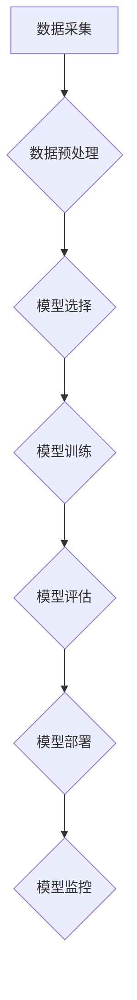

## AI人工智能深度学习算法：面向未来的深度学习代理与工作流研究方向

> 关键词：深度学习、代理、工作流、强化学习、自然语言处理、计算机视觉、自动机器学习

## 1. 背景介绍

深度学习作为人工智能领域最具突破性的技术之一，在图像识别、自然语言处理、语音识别等领域取得了令人瞩目的成就。然而，深度学习模型的训练和部署仍然面临着诸多挑战，例如数据依赖性、计算资源消耗、可解释性差等。为了解决这些问题，深度学习代理和工作流研究方向应运而生。

深度学习代理是指能够自主学习、决策和执行任务的智能体，它可以将深度学习模型嵌入到更复杂的系统中，并通过与环境交互学习和优化。深度学习工作流则是指将深度学习模型和数据处理步骤自动化组合成一个可重复执行的流程，可以提高深度学习应用的效率和可维护性。

## 2. 核心概念与联系

### 2.1 深度学习代理

深度学习代理的核心概念是将深度学习模型作为智能体的核心组件，赋予其自主学习、决策和执行任务的能力。代理可以感知环境信息，根据环境反馈进行决策，并执行相应的动作。

**代理的组成部分:**

* **感知模块:** 用于获取环境信息，例如传感器数据、文本数据、图像数据等。
* **决策模块:** 基于感知模块获取的信息，利用深度学习模型进行决策，选择最优的动作。
* **执行模块:** 将决策转化为实际动作，与环境交互。

**代理的类型:**

* **基于规则的代理:** 基于预先定义的规则进行决策。
* **基于模型的代理:** 利用深度学习模型学习环境规律，进行决策。

**代理的应用场景:**

* **机器人控制:** 使机器人能够自主导航、避障、抓取物体等。
* **游戏 AI:** 使游戏中的 AI 能够做出更智能的决策。
* **个性化推荐:** 根据用户的行为和偏好，推荐个性化的商品或服务。

### 2.2 深度学习工作流

深度学习工作流是指将深度学习模型和数据处理步骤自动化组合成一个可重复执行的流程。工作流可以包含数据预处理、模型训练、模型评估、模型部署等多个步骤。

**工作流的优势:**

* **提高效率:** 自动化流程可以节省人工时间和成本。
* **提高可维护性:** 工作流可以被版本控制和管理，方便维护和更新。
* **提高可重复性:** 工作流可以被重复执行，保证实验结果的可重复性。

**工作流的应用场景:**

* **机器学习平台:** 提供深度学习工作流构建和管理工具。
* **数据科学:** 自动化数据分析和机器学习模型训练流程。
* **企业应用:** 自动化深度学习模型的部署和监控。

**Mermaid 流程图:**



## 3. 核心算法原理 & 具体操作步骤

### 3.1 算法原理概述

深度学习代理和工作流研究方向涉及多种核心算法，例如强化学习、自动机器学习、自然语言处理等。

**强化学习:**

强化学习是一种机器学习方法，通过奖励机制训练智能体在环境中学习最优策略。代理通过与环境交互，获得奖励或惩罚，并根据奖励信号调整策略，最终学习到能够最大化奖励的策略。

**自动机器学习 (AutoML):**

自动机器学习是指自动化机器学习模型的构建、训练和评估过程。AutoML 可以帮助用户自动选择合适的模型架构、超参数和训练策略，提高机器学习模型的性能和效率。

**自然语言处理 (NLP):**

自然语言处理是指计算机理解和处理人类语言的技术。深度学习在 NLP 领域取得了巨大进展，例如机器翻译、文本摘要、情感分析等。

### 3.2 算法步骤详解

**强化学习算法步骤:**

1. **环境建模:** 建立一个模拟真实世界的环境模型。
2. **代理设计:** 设计一个能够感知环境信息、做出决策的代理。
3. **奖励函数设计:** 设计一个奖励函数，用于评估代理的行为是否符合预期。
4. **策略学习:** 利用强化学习算法，例如 Q 学习、深度 Q 网络等，训练代理学习最优策略。
5. **策略评估:** 在测试环境中评估代理的性能。

**自动机器学习算法步骤:**

1. **数据预处理:** 对训练数据进行清洗、转换和特征工程。
2. **模型搜索:** 利用搜索算法，例如遗传算法、粒子群算法等，搜索最优模型架构。
3. **超参数优化:** 利用优化算法，例如梯度下降、随机梯度下降等，优化模型超参数。
4. **模型训练:** 利用训练数据训练模型。
5. **模型评估:** 在测试数据上评估模型性能。

### 3.3 算法优缺点

**强化学习算法:**

* **优点:** 可以学习复杂的行为策略，适应动态变化的环境。
* **缺点:** 训练过程可能很慢，需要大量的训练数据和计算资源。

**自动机器学习算法:**

* **优点:** 可以自动化机器学习模型的构建和训练过程，提高效率和性能。
* **缺点:** 仍然依赖于人类对算法和数据预处理的理解和设计。

### 3.4 算法应用领域

**强化学习算法:**

* **机器人控制:** 使机器人能够自主导航、避障、抓取物体等。
* **游戏 AI:** 使游戏中的 AI 能够做出更智能的决策。
* **金融交易:** 自动化股票交易策略。

**自动机器学习算法:**

* **图像识别:** 自动构建图像分类模型。
* **自然语言处理:** 自动构建文本分类、情感分析模型。
* **医疗诊断:** 自动构建疾病诊断模型。

## 4. 数学模型和公式 & 详细讲解 & 举例说明

### 4.1 数学模型构建

强化学习的数学模型主要包括状态空间、动作空间、奖励函数和价值函数。

* **状态空间:** 环境可能存在的各种状态的集合。
* **动作空间:** 代理可以采取的各种动作的集合。
* **奖励函数:** 用于评估代理在特定状态采取特定动作后的奖励。
* **价值函数:** 用于评估代理在特定状态下采取特定策略的长期奖励。

### 4.2 公式推导过程

**Q 学习算法:**

Q 学习算法是一种基于价值函数的强化学习算法，其目标是学习一个 Q 表，其中 Q(s, a) 表示在状态 s 下采取动作 a 的期望奖励。

**Q 值更新公式:**

$$Q(s, a) = Q(s, a) + \alpha [r + \gamma \max_{a'} Q(s', a') - Q(s, a)]$$

其中:

* $\alpha$ 是学习率，控制着 Q 值更新的步长。
* $r$ 是在状态 s 下采取动作 a 后获得的奖励。
* $\gamma$ 是折扣因子，控制着未来奖励的权重。
* $s'$ 是采取动作 a 后进入的状态。
* $a'$ 是在状态 $s'$ 下采取的动作。

**举例说明:**

假设一个代理在玩一个简单的游戏，状态空间包括 "开始"、"中"、"结束" 三个状态，动作空间包括 "前进"、"后退" 两个动作。奖励函数如下:

* 在 "开始" 状态下，采取 "前进" 动作获得奖励 1，采取 "后退" 动作获得奖励 0。
* 在 "中" 状态下，采取 "前进" 动作获得奖励 0，采取 "后退" 动作获得奖励 -1。
* 在 "结束" 状态下，奖励为 0。

使用 Q 学习算法，代理可以学习到在不同状态下采取不同动作的最佳策略。

### 4.3 案例分析与讲解

**AlphaGo:**

AlphaGo 是 DeepMind 公司开发的围棋 AI，它利用深度强化学习算法，在 2016 年战胜了世界冠军李世石。AlphaGo 的核心算法是基于深度神经网络的 Monte Carlo 树搜索算法，它可以模拟大量的游戏局面，并选择最优的策略。

**AlphaFold:**

AlphaFold 是 DeepMind 公司开发的蛋白质结构预测 AI，它利用深度学习算法，在 2020 年取得了突破性的进展，能够预测蛋白质的三维结构。AlphaFold 的核心算法是基于 Transformer 网络的结构预测模型，它可以学习蛋白质序列和结构之间的关系。

## 5. 项目实践：代码实例和详细解释说明

### 5.1 开发环境搭建

* **操作系统:** Linux 或 macOS
* **编程语言:** Python
* **深度学习框架:** TensorFlow 或 PyTorch
* **其他工具:** Git、Jupyter Notebook

### 5.2 源代码详细实现

以下是一个简单的强化学习代理的代码示例，使用 TensorFlow 框架实现 Q 学习算法:

```python
import tensorflow as tf

# 定义状态空间和动作空间
state_size = 4
action_size = 2

# 定义 Q 网络
model = tf.keras.Sequential([
    tf.keras.layers.Dense(16, activation='relu', input_shape=(state_size,)),
    tf.keras.layers.Dense(action_size)
])

# 定义损失函数和优化器
optimizer = tf.keras.optimizers.Adam(learning_rate=0.01)
loss_fn = tf.keras.losses.MeanSquaredError()

# Q 学习算法
def train_q_network(state, action, reward, next_state, done):
    with tf.GradientTape() as tape:
        q_values = model(state)
        target_q_value = reward + gamma * tf.reduce_max(model(next_state), axis=1) if not done else reward
        loss = loss_fn(target_q_value, q_values[0, action])
    gradients = tape.gradient(loss, model.trainable_variables)
    optimizer.apply_gradients(zip(gradients, model.trainable_variables))

# 训练代理
for episode in range(num_episodes):
    state = env.reset()
    done = False
    while not done:
        action = tf.argmax(model(state)).numpy()
        next_state, reward, done, _ = env.step(action)
        train_q_network(state, action, reward, next_state, done)
        state = next_state

```

### 5.3 代码解读与分析

* **定义状态空间和动作空间:** 首先需要定义代理可以感知到的状态和可以采取的动作。
* **定义 Q 网络:** Q 网络是一个深度神经网络，用于预测在特定状态下采取特定动作的期望奖励。
* **定义损失函数和优化器:** 使用 Mean Squared Error 作为损失函数，Adam 作为优化器，训练 Q 网络。
* **Q 学习算法:** 训练代理的核心是 Q 学习算法，它通过更新 Q 值来学习最优策略。
* **训练代理:** 使用训练数据训练代理，并评估代理在测试环境中的性能。

### 5.4 运行结果展示

训练完成后，可以将代理部署到测试环境中，观察代理的行为和性能。

## 6. 实际应用场景

### 6.1 机器人控制

深度学习代理可以用于控制机器人，使其能够自主导航、避障、抓取物体等。例如，在物流仓库中，深度学习代理可以控制机器人自动搬运货物，提高效率和准确性。

### 6.2 游戏 AI

深度学习代理可以用于开发更智能的游戏 AI，使其能够做出更逼真的决策。例如，在策略游戏如围棋、象棋中，深度学习代理可以与人类玩家进行对抗，并学习到更高级的策略。

### 6.3 个性化推荐

深度学习代理可以根据用户的行为和偏好，推荐个性化的商品或服务。例如，在电商平台上，深度学习代理可以推荐用户可能感兴趣的商品