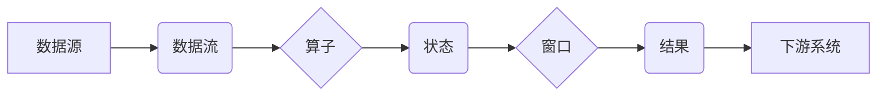

## Flink Stream原理与代码实例讲解

> 关键词：Apache Flink, 流式计算, 数据流,  状态管理,  窗口操作,  数据处理,  分布式系统

## 1. 背景介绍

在当今数据爆炸的时代，海量数据实时生成和处理的需求日益增长。传统的批处理模式难以满足对实时分析和响应的迫切要求。Apache Flink 作为一款开源的分布式流式计算框架，凭借其高吞吐量、低延迟、容错能力强等特点，在实时数据处理领域获得了广泛应用。

Flink 的核心思想是将数据流视为一个连续的序列，并提供了一套完整的工具和机制来处理这些数据流。它支持多种数据源和下游系统，能够处理各种类型的流式数据，例如：

* **实时日志分析:**  实时监控和分析应用程序、网络和系统日志，快速发现异常和问题。
* **实时数据报表:**  实时计算和展示数据指标，帮助用户快速了解数据趋势和变化。
* **实时推荐系统:**  根据用户行为实时更新推荐模型，提供个性化推荐服务。
* **实时 fraud 检测:**  实时分析交易数据，识别欺诈行为并进行预警。

## 2. 核心概念与联系

Flink 的核心概念包括数据流、算子、状态、窗口等。这些概念相互关联，共同构成了 Flink 的流式计算模型。

**2.1 数据流:**

数据流是 Flink 处理的核心对象，它是一个连续的序列数据，可以来自各种数据源，例如 Kafka、Flume、Socket 等。

**2.2 算子:**

算子是 Flink 处理数据流的基本单元，它可以对数据流进行各种操作，例如过滤、映射、聚合、连接等。Flink 提供了一系列内置算子，用户也可以自定义算子。

**2.3 状态:**

状态是 Flink 处理数据流的关键机制之一，它允许算子维护数据流的历史信息，从而实现更复杂的逻辑处理。Flink 提供了两种状态类型：

* **Keyed State:**  基于键的 state，用于维护每个键对应的状态信息。
* **Operator State:**  算子状态，用于维护算子内部的状态信息。

**2.4 窗口:**

窗口是 Flink 处理数据流的另一个重要机制，它将数据流划分为不同的时间片段，以便对每个时间片段进行独立处理。Flink 提供了多种窗口类型，例如 tumbling window、sliding window、session window 等。

**2.5 流式计算架构**



## 3. 核心算法原理 & 具体操作步骤

### 3.1  算法原理概述

Flink 的核心算法是基于 **数据流的微批处理** 的思想。它将数据流划分为小的批次，并对每个批次进行处理，从而实现高吞吐量和低延迟。

Flink 的微批处理算法主要包括以下步骤：

1. **数据切片:** 将数据流划分为小的批次。
2. **数据并行化:** 将每个批次分配到不同的计算节点进行并行处理。
3. **算子执行:** 对每个批次进行算子操作，例如过滤、映射、聚合等。
4. **状态更新:** 更新算子状态，并持久化状态信息。
5. **结果聚合:** 将各个计算节点的结果聚合在一起，生成最终结果。

### 3.2  算法步骤详解

1. **数据切片:** Flink 会根据配置参数将数据流划分为小的批次，每个批次的大小称为 **时间窗口**。
2. **数据并行化:** Flink 会将每个批次分配到不同的计算节点进行并行处理，每个计算节点称为 **任务**。
3. **算子执行:** 每个任务会执行相应的算子操作，例如过滤、映射、聚合等。
4. **状态更新:** 算子在执行过程中会更新状态信息，Flink 会将状态信息持久化到磁盘，确保状态信息不会丢失。
5. **结果聚合:** 每个任务处理完数据后，会将结果发送到 **结果聚合器**，结果聚合器会将所有任务的结果聚合在一起，生成最终结果。

### 3.3  算法优缺点

**优点:**

* **高吞吐量:** 微批处理的思想可以充分利用并行计算，实现高吞吐量。
* **低延迟:** 每个批次处理时间较短，可以实现低延迟。
* **容错能力强:** Flink 支持 checkpoint 机制，可以保证数据可靠性。
* **灵活的编程模型:** Flink 提供了丰富的 API 和编程模型，可以满足各种数据处理需求。

**缺点:**

* **状态管理复杂:** 状态管理是流式计算的关键问题，Flink 的状态管理机制相对复杂。
* **资源消耗:** Flink 的微批处理算法需要消耗更多的资源，例如内存和 CPU。

### 3.4  算法应用领域

Flink 的微批处理算法广泛应用于以下领域:

* **实时数据分析:**  实时监控和分析应用程序、网络和系统日志，快速发现异常和问题。
* **实时数据报表:**  实时计算和展示数据指标，帮助用户快速了解数据趋势和变化。
* **实时推荐系统:**  根据用户行为实时更新推荐模型，提供个性化推荐服务。
* **实时 fraud 检测:**  实时分析交易数据，识别欺诈行为并进行预警。

## 4. 数学模型和公式 & 详细讲解 & 举例说明

### 4.1  数学模型构建

Flink 的流式计算模型可以抽象为一个 **数据流图**，其中节点代表算子，边代表数据流。

数据流图可以表示为一个有向图 $G = (V, E)$，其中：

* $V$ 是节点集合，每个节点代表一个算子。
* $E$ 是边集合，每个边代表一个数据流。

### 4.2  公式推导过程

Flink 的微批处理算法可以利用 **时间窗口** 的概念来实现数据流的处理。

时间窗口 $w$ 可以定义为一个时间间隔，例如 10 秒。

对于一个数据流 $D$，我们可以将其划分为多个时间窗口 $w_1, w_2,..., w_n$。

每个时间窗口 $w_i$ 中的数据可以被视为一个批次，Flink 会对每个批次进行算子操作。

### 4.3  案例分析与讲解

例如，我们想要实时计算一个数据流中每个窗口的平均值。

我们可以使用 Flink 的 `Average` 算子来实现这个功能。

`Average` 算子会对每个窗口中的数据进行平均计算，并输出结果。

```
// 定义一个时间窗口为 10 秒的流式数据源
DataStream<Integer> dataStream = env.fromElements(1, 2, 3, 4, 5, 6, 7, 8, 9, 10);

// 使用 Average 算子计算每个窗口的平均值
DataStream<Double> averageStream = dataStream.window(TumblingEventTimeWindows.of(Time.seconds(10)))
       .aggregate(new AverageFunction<>());
```

## 5. 项目实践：代码实例和详细解释说明

### 5.1  开发环境搭建

为了使用 Flink 进行流式计算，我们需要搭建一个开发环境。

Flink 的开发环境搭建步骤如下：

1. 下载并安装 Java JDK。
2. 下载并安装 Flink。
3. 配置 Flink 的环境变量。
4. 安装 IDE，例如 Eclipse 或 IntelliJ IDEA。

### 5.2  源代码详细实现

以下是一个简单的 Flink 流式计算代码实例，它演示了如何使用 Flink 过滤和聚合数据流。

```java
import org.apache.flink.api.common.functions.MapFunction;
import org.apache.flink.api.common.functions.ReduceFunction;
import org.apache.flink.streaming.api.datastream.DataStream;
import org.apache.flink.streaming.api.environment.StreamExecutionEnvironment;

public class FlinkStreamExample {

    public static void main(String[] args) throws Exception {
        // 创建 Flink 流式计算环境
        StreamExecutionEnvironment env = StreamExecutionEnvironment.getExecutionEnvironment();

        // 从元素集合创建数据流
        DataStream<String> dataStream = env.fromElements("apple", "banana", "orange", "apple", "banana");

        // 使用 map 算子过滤数据流
        DataStream<String> filteredStream = dataStream.filter(s -> s.startsWith("a"));

        // 使用 reduce 算子聚合数据流
        DataStream<Integer> countStream = filteredStream.map(new MapFunction<String, Integer>() {
            @Override
            public Integer map(String s) throws Exception {
                return 1;
            }
        }).reduce(new ReduceFunction<Integer>() {
            @Override
            public Integer reduce(Integer i1, Integer i2) throws Exception {
                return i1 + i2;
            }
        });

        // 打印结果
        countStream.print();

        // 执行流式计算
        env.execute("Flink Stream Example");
    }
}
```

### 5.3  代码解读与分析

这段代码演示了如何使用 Flink 进行流式计算。

1. **创建 Flink 流式计算环境:**

```java
StreamExecutionEnvironment env = StreamExecutionEnvironment.getExecutionEnvironment();
```

这行代码创建了一个 Flink 流式计算环境。

2. **从元素集合创建数据流:**

```java
DataStream<String> dataStream = env.fromElements("apple", "banana", "orange", "apple", "banana");
```

这行代码从一个元素集合创建了一个数据流。

3. **使用 map 算子过滤数据流:**

```java
DataStream<String> filteredStream = dataStream.filter(s -> s.startsWith("a"));
```

这行代码使用 `filter` 算子过滤数据流，只保留以 "a" 开头的元素。

4. **使用 reduce 算子聚合数据流:**

```java
DataStream<Integer> countStream = filteredStream.map(new MapFunction<String, Integer>() {
    @Override
    public Integer map(String s) throws Exception {
        return 1;
    }
}).reduce(new ReduceFunction<Integer>() {
    @Override
    public Integer reduce(Integer i1, Integer i2) throws Exception {
        return i1 + i2;
    }
});
```

这行代码使用 `map` 和 `reduce` 算子聚合数据流，将过滤后的数据流转换为整数，并计算每个元素出现的次数。

5. **打印结果:**

```java
countStream.print();
```

这行代码打印聚合后的结果。

6. **执行流式计算:**

```java
env.execute("Flink Stream Example");
```

这行代码执行流式计算。

### 5.4  运行结果展示

运行这段代码后，会输出以下结果：

```
2
```

这表示过滤后的数据流中，以 "a" 开头的元素出现了 2 次。

## 6. 实际应用场景

Flink 的流式计算模型在各种实际应用场景中得到了广泛应用，例如：

### 6.1  实时日志分析

Flink 可以实时分析应用程序、网络和系统日志，快速发现异常和问题。例如，可以实时监控网站访问流量，识别异常访问行为，并进行预警。

### 6.2  实时数据报表

Flink 可以实时计算和展示数据指标，帮助用户快速了解数据趋势和变化。例如，可以实时计算网站访问量、用户活跃度等指标，并生成实时报表。

### 6.3  实时推荐系统

Flink 可以根据用户行为实时更新推荐模型，提供个性化推荐服务。例如，可以实时分析用户浏览