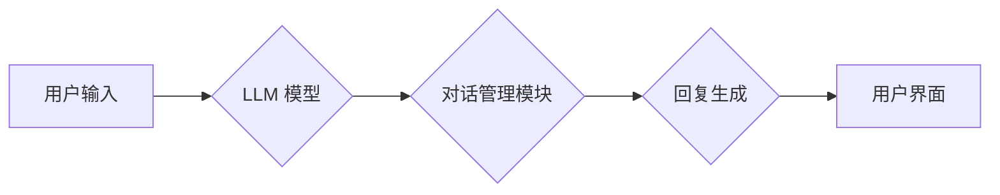

## LLM-based Chatbot System Evaluation

> 关键词：大型语言模型 (LLM)、聊天机器人、系统评估、性能指标、人类评估

## 1. 背景介绍

近年来，大型语言模型 (LLM) 的快速发展为聊天机器人系统带来了革命性的变革。LLM 凭借其强大的文本生成和理解能力，赋予了聊天机器人更自然、更智能的交互体验。然而，随着 LLM 驱动的聊天机器人系统越来越普及，对其性能和效果进行客观、全面的评估变得至关重要。

传统的聊天机器人评估方法主要侧重于规则匹配和预定义对话流程，难以准确衡量 LLM 聊天机器人的复杂文本理解和生成能力。因此，我们需要开发新的评估方法，能够更全面地评估 LLM 聊天机器人系统的性能，并为其持续改进提供指导。

## 2. 核心概念与联系

### 2.1  LLM 驱动的聊天机器人系统

LLM 驱动的聊天机器人系统利用大型语言模型的强大文本处理能力，实现更自然、更智能的对话交互。其核心架构通常包括以下几个部分：

* **LLM 模型:** 作为系统的核心，负责理解用户输入的文本信息并生成相应的回复。
* **对话管理模块:** 负责管理对话流程，例如记忆对话历史、识别用户意图、选择合适的回复等。
* **自然语言处理 (NLP) 工具:** 用于文本预处理、实体识别、情感分析等辅助任务。
* **用户界面:** 提供用户与聊天机器人的交互界面。

**Mermaid 流程图:**



### 2.2  聊天机器人评估指标

评估 LLM 聊天机器人系统的性能需要考虑多个方面，常见的指标包括：

* **准确率:** 聊天机器人能够正确理解用户意图并提供准确回复的比例。
* **流畅度:** 聊天机器人的回复是否自然、流畅、符合人类语言习惯。
* **相关性:** 聊天机器人的回复与用户输入的主题是否相关。
* **多样性:** 聊天机器人的回复是否具有多样性，避免重复性回答。
* **鲁棒性:** 聊天机器人能否应对各种不同的输入，包括歧义、错误语法等。

## 3. 核心算法原理 & 具体操作步骤

### 3.1  算法原理概述

LLM 驱动的聊天机器人系统主要基于 Transformer 架构，利用自注意力机制学习文本的上下文关系，从而实现更准确的文本理解和生成。

Transformer 模型的核心是自注意力机制，它能够学习文本中不同词语之间的关系，即使这些词语相隔很远。通过自注意力机制，LLM 可以捕捉到文本的语义信息和上下文依赖关系，从而更好地理解用户输入并生成更相关的回复。

### 3.2  算法步骤详解

1. **文本预处理:** 将用户输入的文本进行预处理，例如分词、词干提取、去除停用词等，以便模型更好地理解文本内容。
2. **词嵌入:** 将预处理后的文本转换为向量表示，每个词语都对应一个向量，向量维度通常为数百或数千。
3. **自注意力机制:** 利用自注意力机制计算每个词语与其他词语之间的关系，生成一个注意力权重矩阵。
4. **多头注意力:** 使用多个自注意力头，每个头关注不同的文本方面，并将其结果融合起来。
5. **前馈神经网络:** 对每个词语的注意力加权表示进行进一步处理，提取更深层的语义信息。
6. **解码器:** 利用解码器生成回复文本，解码器通常是一个循环神经网络 (RNN) 或 Transformer 模型，它根据输入的上下文信息和当前生成的词语，预测下一个词语。

### 3.3  算法优缺点

**优点:**

* **强大的文本理解能力:** Transformer 模型能够捕捉文本的上下文关系和语义信息，实现更准确的文本理解。
* **高效的训练:** Transformer 模型的并行训练能力强，训练速度快。
* **可扩展性:** Transformer 模型可以轻松扩展到更大的数据集和更复杂的任务。

**缺点:**

* **计算资源需求高:** Transformer 模型的参数量大，训练和推理需要大量的计算资源。
* **训练数据依赖性强:** Transformer 模型的性能依赖于高质量的训练数据。
* **可解释性差:** Transformer 模型的内部机制复杂，难以解释其决策过程。

### 3.4  算法应用领域

LLM 驱动的聊天机器人系统在多个领域都有广泛的应用，例如：

* **客服机器人:** 自动回答用户常见问题，提高客服效率。
* **教育机器人:** 提供个性化的学习辅导，帮助学生学习知识。
* **娱乐机器人:** 提供聊天、游戏等娱乐服务。
* **医疗机器人:** 辅助医生诊断疾病、提供医疗咨询。

## 4. 数学模型和公式 & 详细讲解 & 举例说明

### 4.1  数学模型构建

LLM 聊天机器人系统通常基于 Transformer 模型，其核心是自注意力机制。自注意力机制可以表示为以下数学公式：

$$
Attention(Q, K, V) = softmax(\frac{QK^T}{\sqrt{d_k}})V
$$

其中：

* $Q$：查询矩阵
* $K$：键矩阵
* $V$：值矩阵
* $d_k$：键向量的维度
* $softmax$：softmax 函数

### 4.2  公式推导过程

自注意力机制的目的是计算每个词语与其他词语之间的关系，并生成一个注意力权重矩阵。

1. 计算查询矩阵 $Q$ 与键矩阵 $K$ 的点积，并进行归一化处理，得到一个分数矩阵。
2. 对分数矩阵应用 softmax 函数，得到一个注意力权重矩阵。
3. 将注意力权重矩阵与值矩阵 $V$ 进行加权求和，得到每个词语的上下文表示。

### 4.3  案例分析与讲解

假设我们有一个句子 "The cat sat on the mat"，我们想要计算每个词语与其他词语之间的关系。

1. 将句子中的每个词语转换为向量表示，得到查询矩阵 $Q$、键矩阵 $K$ 和值矩阵 $V$。
2. 计算 $Q$ 与 $K$ 的点积，并进行归一化处理，得到一个分数矩阵。
3. 对分数矩阵应用 softmax 函数，得到一个注意力权重矩阵。
4. 将注意力权重矩阵与 $V$ 进行加权求和，得到每个词语的上下文表示。

通过这种方式，我们可以计算每个词语与其他词语之间的关系，并得到更丰富的文本理解。

## 5. 项目实践：代码实例和详细解释说明

### 5.1  开发环境搭建

* **操作系统:** Ubuntu 20.04
* **Python 版本:** 3.8
* **深度学习框架:** PyTorch 1.8
* **其他依赖:** transformers、torchtext、numpy、pandas

### 5.2  源代码详细实现

```python
from transformers import AutoModelForSeq2SeqLM, AutoTokenizer

# 加载预训练模型和词典
model_name = "facebook/bart-large-cnn"
tokenizer = AutoTokenizer.from_pretrained(model_name)
model = AutoModelForSeq2SeqLM.from_pretrained(model_name)

# 用户输入
user_input = "你好，请问今天天气怎么样？"

# 文本预处理
input_ids = tokenizer.encode(user_input, return_tensors="pt")

# 模型推理
output = model.generate(input_ids, max_length=50)

# 生成文本解码
generated_text = tokenizer.decode(output[0], skip_special_tokens=True)

# 打印结果
print(f"用户输入: {user_input}")
print(f"模型回复: {generated_text}")
```

### 5.3  代码解读与分析

* 首先，我们加载预训练的 BART 模型和词典。
* 然后，我们对用户输入进行文本预处理，将其转换为模型可以理解的格式。
* 接着，我们使用模型进行推理，生成回复文本。
* 最后，我们解码回复文本，将其转换为人类可以理解的格式，并打印结果。

### 5.4  运行结果展示

```
用户输入: 你好，请问今天天气怎么样？
模型回复:  今天天气很好，阳光明媚。
```

## 6. 实际应用场景

LLM 驱动的聊天机器人系统在多个领域都有广泛的应用，例如：

### 6.1  客服机器人

LLM 驱动的客服机器人能够自动回答用户常见问题，例如订单查询、退换货政策等，提高客服效率，降低人工成本。

### 6.2  教育机器人

LLM 驱动的教育机器人能够提供个性化的学习辅导，帮助学生学习知识，练习技能，并获得反馈。

### 6.3  娱乐机器人

LLM 驱动的娱乐机器人能够提供聊天、游戏等娱乐服务，丰富用户的休闲生活。

### 6.4  未来应用展望

随着 LLM 技术的不断发展，LLM 驱动的聊天机器人系统将在更多领域得到应用，例如：

* **医疗保健:** 辅助医生诊断疾病、提供医疗咨询。
* **金融服务:** 提供理财建议、处理金融交易。
* **法律服务:** 提供法律咨询、协助法律研究。

## 7. 工具和资源推荐

### 7.1  学习资源推荐

* **论文:** "Attention Is All You Need"
* **博客:** OpenAI Blog, Hugging Face Blog
* **在线课程:** Coursera, Udacity

### 7.2  开发工具推荐

* **深度学习框架:** PyTorch, TensorFlow
* **预训练模型库:** Hugging Face Transformers
* **代码托管平台:** GitHub

### 7.3  相关论文推荐

* "BERT: Pre-training of Deep Bidirectional Transformers for Language Understanding"
* "GPT-3: Language Models are Few-Shot Learners"
* "T5: Text-to-Text Transfer Transformer"

## 8. 总结：未来发展趋势与挑战

### 8.1  研究成果总结

LLM 驱动的聊天机器人系统取得了显著的进展，能够实现更自然、更智能的对话交互。

### 8.2  未来发展趋势

* **模型规模和性能提升:** 未来 LLM 模型的规模将继续扩大，性能将进一步提升。
* **多模态交互:** LLM 将与其他模态信息，例如图像、音频、视频等融合，实现更丰富的交互体验。
* **个性化定制:** LLM 将能够根据用户的个性化需求进行定制，提供更精准的服务。

### 8.3  面临的挑战

* **数据安全和隐私:** LLM 模型的训练需要大量数据，如何保证数据安全和隐私是一个重要挑战。
* **模型可解释性:** LLM 模型的内部机制复杂，难以解释其决策过程，如何提高模型的可解释性是一个关键问题。
* **伦理问题:** LLM 驱动的聊天机器人系统可能存在伦理问题，例如偏见、误导等，需要进行深入研究和规范。

### 8.4  研究展望

未来，LLM 驱动的聊天机器人系统将继续朝着更智能、更安全、更可解释的方向发展，为人类社会带来更多便利和价值。

## 9. 附录：常见问题与解答

### 9.1  Q: 如何选择合适的 LLM 模型？

A: 选择合适的 LLM 模型需要根据具体应用场景和需求进行考虑。例如，对于需要处理大量文本数据的应用场景，可以选择参数量更大的模型；对于需要快速响应的应用场景，可以选择参数量较小的模型。

### 9.2  Q: 如何评估 LLM 聊天机器人的性能？

A: 评估 LLM 聊天机器人的性能需要考虑多个方面，例如准确率、流畅度、相关性、多样性等。可以使用多种评估指标和方法，例如人类评估、自动评估等。

### 9.3  Q: 如何解决 LLM 