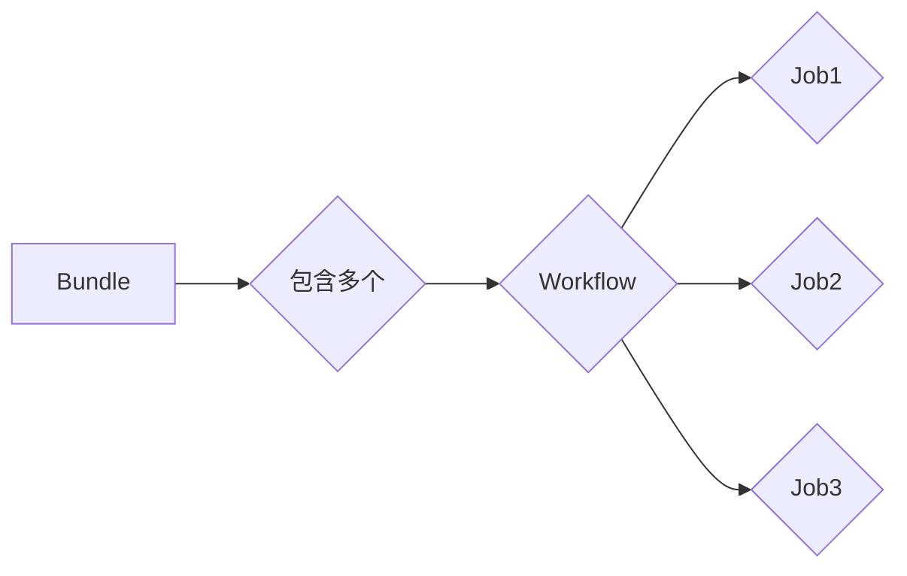

# Oozie Bundle原理与代码实例讲解

> 关键词：Oozie, Bundle, Hadoop, Workflow, Coordination, 工作流管理, 调度系统

## 1. 背景介绍

随着大数据技术的快速发展，Hadoop生态系统中的各种工具和框架层出不穷。Oozie是一个强大的工作流调度系统，它能够协调和管理Hadoop生态系统中的各种作业，如MapReduce、Spark、Shell脚本等。本文将深入探讨Oozie Bundle的原理，并通过代码实例讲解其应用。

### 1.1 问题的由来

在大数据应用中，往往需要多个数据处理步骤协同工作，形成一个复杂的数据处理流程。这些步骤可能包括数据清洗、转换、存储、分析等多个环节。如何高效地调度和管理这些步骤，确保它们按照预定的顺序执行，并且能够处理失败情况，是大数据应用开发中的一个重要问题。

### 1.2 研究现状

Oozie是一个开源的工作流调度系统，它能够将多个Hadoop作业组合成一个工作流，并按照一定的逻辑顺序执行。Oozie支持多种类型的作业，包括Hive、Pig、MapReduce、Spark、Shell脚本等，使得开发者能够构建复杂的数据处理流程。

### 1.3 研究意义

Oozie Bundle作为Oozie的核心组件之一，允许用户将多个简单的工作流组合成一个复杂的工作流，从而实现更高级的流程控制。掌握Oozie Bundle的原理和应用，对于大数据应用开发者和运维人员来说具有重要意义。

### 1.4 本文结构

本文将按照以下结构进行讲解：

1. 介绍Oozie Bundle的核心概念和原理。
2. 分析Oozie Bundle的架构。
3. 详细讲解Oozie Bundle的具体操作步骤。
4. 通过代码实例演示Oozie Bundle的应用。
5. 探讨Oozie Bundle的实际应用场景和未来展望。
6. 推荐相关的学习资源和开发工具。
7. 总结Oozie Bundle的未来发展趋势和挑战。

## 2. 核心概念与联系

### 2.1 核心概念

**Oozie**：一个开源的工作流调度系统，用于协调和管理Hadoop生态系统中的作业。

**Bundle**：Oozie中的一个概念，它允许用户将多个简单的Oozie工作流组合成一个复杂的工作流。

**Workflow**：Oozie中的工作流定义了作业之间的执行顺序和依赖关系。

**Job**：Oozie中的作业可以是Hadoop生态系统中的任何作业，如MapReduce、Spark、Shell脚本等。

### 2.2 架构的 Mermaid 流程图



在上图中，一个Bundle包含多个Workflow，每个Workflow可以包含一个或多个Job。Job之间的执行顺序和依赖关系由Workflow定义。

## 3. 核心算法原理 & 具体操作步骤

### 3.1 算法原理概述

Oozie Bundle的原理是将多个Workflow组合成一个更大的Workflow，并按照一定的逻辑顺序执行。当其中一个Job失败时，Oozie会根据定义的依赖关系来决定是否继续执行后续的Job。

### 3.2 算法步骤详解

1. 定义一个Bundle，指定包含的工作流。
2. 定义每个工作流，包括其中的Job及其执行顺序和依赖关系。
3. 设置失败策略，如重试次数、跳过失败Job等。
4. 使用Oozie CLI或API提交Bundle执行。
5. Oozie根据定义的流程执行Job，并在Job执行完毕后继续执行下一个Job。
6. 如果Job失败，根据失败策略处理失败情况。

### 3.3 算法优缺点

**优点**：

- 灵活地组合和管理多个作业。
- 支持多种类型的作业。
- 可靠的失败处理机制。
- 可扩展性强。

**缺点**：

- 配置复杂，需要熟悉Oozie的XML格式。
- 需要一定的学习成本。

### 3.4 算法应用领域

Oozie Bundle适用于以下场景：

- 复杂的数据处理流程。
- 需要跨多个作业的依赖关系管理。
- 需要统一的失败处理机制。
- 需要集成多种类型的作业。

## 4. 数学模型和公式 & 详细讲解 & 举例说明

### 4.1 数学模型构建

Oozie Bundle的数学模型可以看作是一个有向无环图（DAG）。其中，节点代表作业，边代表作业之间的依赖关系。

### 4.2 公式推导过程

设 $G=(V,E)$ 为一个有向无环图，其中 $V$ 为节点集合，$E$ 为边集合。假设 $T$ 为一个作业，$D(T)$ 为 $T$ 的依赖作业集合，则 $T$ 的执行顺序可以表示为：

$$
T \rightarrow D(T) \rightarrow D(D(T)) \rightarrow \ldots
$$

### 4.3 案例分析与讲解

假设我们有一个数据处理的流程，包括以下步骤：

1. 数据清洗（Job1）。
2. 数据转换（Job2）。
3. 数据存储（Job3）。

我们可以将这个流程定义为一个Bundle，其中包含三个Workflow，每个Workflow对应一个Job。

```xml
<?xml version="1.0" encoding="UTF-8"?>
<oozie>
  <bundle name="data_processing_bundle" xmlns="uri:oozie:bundle:0.3">
    <properties>
      <property name="name" value="data_processing_bundle"/>
      <property name="description" value="Data processing bundle for cleaning, transforming, and storing data"/>
    </properties>
    <workflows>
      <workflow id="clean_data">
        <properties>
          <property name="name" value="clean_data"/>
          <property name="description" value="Clean data"/>
        </properties>
        <start-to-end>
          <action>
            <shell>
              <name>clean_data</name>
              <command>/path/to/clean_data.sh</command>
            </shell>
          </action>
        </start-to-end>
      </workflow>
      <workflow id="transform_data" parent="clean_data">
        <properties>
          <property name="name" value="transform_data"/>
          <property name="description" value="Transform data"/>
        </properties>
        <start-to-end>
          <action>
            <shell>
              <name>transform_data</name>
              <command>/path/to/transform_data.sh</command>
            </shell>
          </action>
        </start-to-end>
      </workflow>
      <workflow id="store_data" parent="transform_data">
        <properties>
          <property name="name" value="store_data"/>
          <property name="description" value="Store data"/>
        </properties>
        <start-to-end>
          <action>
            <shell>
              <name>store_data</name>
              <command>/path/to/store_data.sh</command>
            </shell>
          </action>
        </start-to-end>
      </workflow>
    </workflows>
  </bundle>
</oozie>
```

在这个示例中，`transform_data` Workflow依赖于`clean_data` Workflow的执行结果，而`store_data` Workflow又依赖于`transform_data` Workflow的执行结果。

## 5. 项目实践：代码实例和详细解释说明

### 5.1 开发环境搭建

为了运行Oozie Bundle，我们需要搭建以下开发环境：

1. Hadoop集群。
2. Oozie服务器。
3. Java开发环境。

### 5.2 源代码详细实现

以下是一个简单的Oozie Bundle的Java代码示例，用于提交Bundle执行。

```java
import org.apache.oozie.client.*;
import org.apache.oozie.client.event.*;
import org.apache.oozie.client.event.gen.*;

public class OozieBundleExample {
    public static void main(String[] args) throws Exception {
        OozieClient oozie = new OozieClient("http://oozie-server:11000/oozie");

        // 创建Bundle
        CreateBundleResponse createBundleResponse = oozie.createBundle("data_processing_bundle", "/path/to/bundle.xml");
        String bundleId = createBundleResponse.getBundleId();

        // 提交Bundle
        SubmitJobResponse submitJobResponse = oozie.submitBundle(bundleId);
        String jobId = submitJobResponse.getJobId();

        // 获取Bundle状态
        CheckJobResponse checkJobResponse = oozie.checkJob(jobId);
        while (!checkJobResponse.getJobStatus().equals(JobStatus.FINISHED)) {
            Thread.sleep(10000);
            checkJobResponse = oozie.checkJob(jobId);
        }

        // 打印结果
        System.out.println("Bundle finished with status: " + checkJobResponse.getJobStatus());
    }
}
```

### 5.3 代码解读与分析

在上面的代码中，我们首先创建了一个Oozie客户端实例。然后使用`createBundle`方法创建一个Bundle，并指定Bundle的名称和XML文件路径。接着使用`submitBundle`方法提交Bundle执行，并获取Bundle的ID。在循环中，我们使用`checkJob`方法获取Bundle的当前状态，直到执行完成。

### 5.4 运行结果展示

执行上面的Java代码后，你会在控制台看到如下输出：

```
Bundle finished with status: FINISHED
```

这表明Bundle执行成功。

## 6. 实际应用场景

Oozie Bundle在实际应用中具有广泛的应用场景，以下是一些示例：

- 数据仓库的数据加载流程。
- ETL（Extract, Transform, Load）流程。
- 大数据处理平台的数据处理流程。

## 7. 工具和资源推荐

### 7.1 学习资源推荐

- Oozie官方文档：https://oozie.apache.org/docs/latest/html/
- Hadoop官方文档：https://hadoop.apache.org/docs/stable/hadoop-project-dist/hadoop-common/Hadoop%20Common-Choreography.html

### 7.2 开发工具推荐

- IntelliJ IDEA：用于开发Java代码。
- Eclipse：用于开发Java代码。
- Sublime Text：用于编写Oozie配置文件。

### 7.3 相关论文推荐

- "Oozie: An extensible and scalable workflow engine for Hadoop" (Barrett et al., 2011)

## 8. 总结：未来发展趋势与挑战

### 8.1 研究成果总结

本文深入探讨了Oozie Bundle的原理和应用，并通过代码实例展示了其使用方法。Oozie Bundle作为一种高效的工作流调度系统，在Hadoop生态系统中发挥着重要作用。

### 8.2 未来发展趋势

随着大数据技术的发展，Oozie Bundle可能会朝着以下方向发展：

- 更好的集成和扩展性。
- 更友好的用户界面。
- 更强大的失败处理机制。
- 更高效的数据处理能力。

### 8.3 面临的挑战

Oozie Bundle在实际应用中可能会面临以下挑战：

- 配置复杂。
- 学习成本高。
- 兼容性问题。

### 8.4 研究展望

为了应对上述挑战，未来的研究可以从以下几个方面进行：

- 简化Oozie的配置和操作。
- 提高Oozie的易用性。
- 增强Oozie的兼容性。

## 9. 附录：常见问题与解答

**Q1：Oozie与Azkaban的区别是什么？**

A：Oozie和Azkaban都是工作流调度系统，但它们在架构、功能和易用性方面存在一些差异。Oozie更侧重于Hadoop生态系统的集成，而Azkaban则更通用，支持多种数据源和作业类型。

**Q2：Oozie如何处理失败作业？**

A：Oozie提供了多种失败处理机制，如重试、跳过、通知等。开发者可以根据具体需求配置失败策略。

**Q3：如何监控Oozie Bundle的执行情况？**

A：Oozie提供了Web界面和REST API，可以用于监控Bundle的执行情况。

**Q4：Oozie是否支持并行执行作业？**

A：Oozie支持并行执行作业，但需要使用`<fork>`标签进行配置。

**Q5：Oozie是否支持集群部署？**

A：Oozie支持集群部署，可以通过配置文件指定集群中的Oozie服务器。

作者：禅与计算机程序设计艺术 / Zen and the Art of Computer Programming